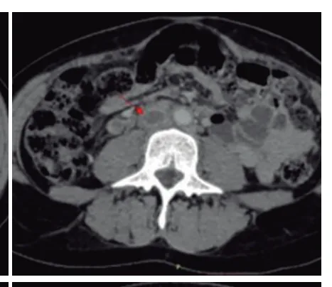
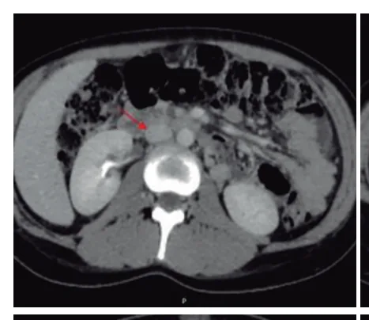

# Puerpério

<!-- page:1 -->

> ⚠️ Seção reconstruída a partir de OCR (PDF original em colunas, texto intercalado) — confira contra a fonte original.

## Puerpério Patológico

**Resumo**:
- **Morbidade febril puerperal**: temperatura de 38ºC ou mais, por 2 dias, durante os primeiros 10 dias de pós-parto, excetuando-se as primeiras 24 horas.
- **Tríade de Bumm** para diagnóstico de endometrite: útero doloroso + útero amolecido + útero hipoinvoluído.
- **Mastite**: processo infeccioso que acomete a mama, comumente causado por *S. aureus*.

## Morbidade Febril Puerperal

### Definição

- Temperatura de **38ºC ou mais, por 2 dias**, durante os primeiros 10 dias de pós-parto, excetuando-se as primeiras 24 horas;
- Infecção **polimicrobiana**.

**Causas**:
- Endometrite;
- Endoparametrite.

## Endometrite

- Infecção da decídua (endométrio gestacional), que pode progredir para órgãos vizinhos.

### Fatores de Risco

- **Cesariana** é o principal;
- Vaginose bacteriana;
- Rotura prematura de membranas ovulares (RPMO);
- Trabalho de parto prolongado;
- Manipulação vaginal excessiva;
- Corioamnionite;
- Cerclagem;
- Extração placentária manual;
- Anemia;
- Traumatismo de canal de parto;
- Perda sanguínea acentuada.

### Agentes Etiológicos

- É uma infecção tipicamente **polimicrobiana**;
- Verificar Tabela 1.

> ⚠️ Tabela reconstruída a partir de OCR — confira contra a fonte original.

**Tabela 1: Bactérias associadas à endometrite puerperal**

| Categoria | Bactérias |
|---|---|
| Gram-positivas aeróbicas | Estreptococos (Grupos A, B e D); Enterococcus (*faecium*, *faecalis*); *Staphylococcus aureus* |
| Gram-negativas | *Escherichia coli*; *Enterobacter* spp.; *Klebsiella pneumoniae*; *Proteus mirabilis*; *Morganella morganii*; *Gardnerella vaginalis* |
| Anaeróbicas | *Peptostreptococcus* spp.; *Pectococcus* spp.; *Clostridium* spp.; *Bacteroides bivius*; *Bacteroides melaninogenicus*; *Bacteroides disiens*; *Bacteroides fragilis*; *Fusobacterium* sp. |
| Outras | *Mycoplasma hominis*; *Chlamydia trachomatis*; *Ureaplasma urealyticum* |

### Quadro Clínico

- Febre (pode estar ausente);
- Dor pélvica;
- Sensibilidade uterina;
- Drenagem uterina anormal (maior volume, pus etc.);
- Colo aberto;
- Subinvolução uterina.

**Tríade de Bumm**: útero doloroso + útero amolecido + útero hipoinvoluído.

### Tratamento

- **Clindamicina** 900 mg, EV, de 8/8h + **Gentamicina** 240 mg (até 70 kg) ou 320 mg (>70 kg), EV, 24/24h (preferencial);
- **Alternativas**: Ampicilina-sulbactam 3 g, EV, de 6/6h; ou Metronidazol 500 mg, EV, de 12/12h (se não estiver amamentando) + Gentamicina 240 mg (até 70 kg) ou 320 mg (>70 kg), EV, 24/24h;
- Tratamento deve ser mantido por **24-48 horas** após o último episódio febril (exceto nos casos mais graves, como aqueles com choque séptico associado).

---

<!-- page:2 -->

## Tromboflebite Pélvica Séptica

### Quadro Clínico

- Semelhante à endometrite;
- Febre persistente mesmo em uso de antibioticoterapia, geralmente 3 a 5 dias pós-cesárea.

### Exame Complementar

- Tomografia computadorizada com contraste ou ressonância nuclear magnética de pelve;
- Observação de trombos sépticos, principalmente na veia ovariana;
- Verificar Figura 1.

### Tratamento

- **Anticoagulação plena + antibioticoterapia**;
- Refratariedade à antibioticoterapia:
  - Curetagem de restos placentários;
  - Debridamento de material necrótico;
  - Drenagem de abscessos;
  - Histerectomia: nas formas disseminadas, localizadas ou propagadas.

### Diagnóstico Diferencial

- Infecção do trato urinário (ITU);
- Pneumonia;
- Infecção de pele e partes moles;
- Infecção de episiotomia ou em laceração perineal;
- Diagnóstico de exclusão.

Figura 1: Tomografia computadorizada evidenciando trombos sépticos em veia cava inferior, nas veias ilíacas comuns externas e internas, nas veias femorais comuns, bilaterais, na veia ovariana direita, associada a edema nos planos adiposos da região pélvica.

---

<!-- page:3 -->

## Mastite

- Condição inflamatória da mama, que pode ou não ser acompanhada de infecção;
- Quando ocorre durante o aleitamento, chama-se **mastite puerperal**;
- O principal agente etiológico é o *S. aureus*;
- Verificar Tabela 2 a seguir.

> ⚠️ Tabela reconstruída a partir de OCR — confira contra a fonte original.

**Tabela 2: Condições predisponentes para o surgimento de mastite puerperal**

| Condições maternas | Condições do lactente |
|---|---|
| Alterações da pele | Fenda labial |
| Antecedente de mastite | Freio lingual curto |
| Estresse/fadiga | Palato alto (em ogiva) |
| Alterações do mamilo (mamilos planos ou invertidos e fissuras) | Prematuridade |
| Infecções (respiratórias, paroníquias, candidíase local) | Doença grave |
| Uso de pomadas, porta-seios e protetores mamilares | |
| Antibióticos inadequados | |
| Cirurgia mamária prévia | |
| Anemia/desnutrição | |

### Quadro Clínico

- Febre: aferição por via oral (evitar axilar);
- Dor, calor e rubor;
- Turgência mamária;
- Área endurecida, bom ponto de flutuação (se abscesso).

### Tratamento

- **Antibioticoterapia**:
  - Cefalexina 500 mg VO 6/6h por 7 a 14 dias; ou
  - Clindamicina 600 mg VO 6/6h por 7 a 14 dias; ou
  - Amoxicilina 800 mg VO 8/8h por 10 a 14 dias;
- Amamentação **não é contraindicada**, exceto se houver eliminação de pus pelo mamilo ou dor intensa não controlada.

**Complicação**:
- **Abscesso mamário**: neste caso a antibioticoterapia deve ser instituída e, se necessário, drenagem cirúrgica pode ser realizada.

## Blues Puerperal

- Alteração transitória, autolimitada, caracterizada por alteração de humor, frequentemente rápida, que envolve tristeza, irritabilidade, ansiedade, insônia e choro fácil;
- Ocorre, geralmente, no **3º dia** pós-parto e desaparece por volta de **3 semanas** após.

## Depressão Pós-parto

- Episódio depressivo maior, com sintomas como ansiedade, irritabilidade, anedonia, desânimo persistente, ideação suicida, temor de machucar o filho;
- Alteração do humor deprimido ou perda de interesse/prazer e/ou outros sintomas que se apresentem na maior parte do dia, por quase todos os dias, por, no mínimo, **2 semanas**;
- O início dos sintomas é na 3ª ou 4ª semana do puerpério, alcançando intensidade máxima nos primeiros 6 meses.

**Fatores de risco**:
- Antecedente de depressão ou demais psicopatias;
- Gestação não planejada/desejada;
- Violência doméstica;
- Antecedente de hiperêmese gravídica ou desordens psiquiátricas na gestação atual.

## Referências

Figura 1: Tomografia computadorizada evidenciando trombos sépticos em veia cava inferior [...]. ARMSTRONG, Bruna Benigna Sales; BARILI, Isabela Ceccato; MONTEIRO, Claudia Ariel Tienne; MENESSES, Fábio Arcoverde Coutinho de; COSTA, Nayana de Oliveira; SANTOS-JÚNIOR, José Arimatea dos. Tromboflebite pélvica séptica extensa em puérpera: relato de caso. International Seven Journal of Health Research, São José dos Pinhais, v. 2, n. 2, p. 134–140, mar./abr. 2023.
