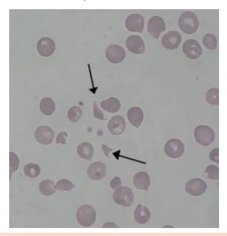
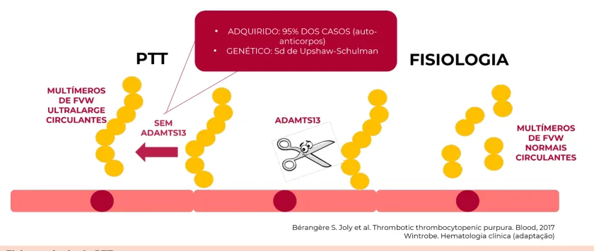

# Púrpura Trombocitopênica Trombótica (PTT)

<!-- page:1 -->

## Púrpura Trombocitopênica Trombótica (PTT)

### Púrpura Trombocitopênica Trombótica (PTT) — Clínica Médica

> ⚠️ Trecho reconstruído a partir de OCR (texto de duas colunas intercalado) — confira contra a fonte original.

**Microangiopatia Trombótica (MAT)**

- Anemia hemolítica (com esquizócitos);
- Disfunção orgânica;
- Plaquetopenia.

**PTT — resumo**

- Deficiência de ADAMTS13;
- MAT (esquizócitos);
- Pêntade clássica: MAT + IRA + plaquetopenia + febre + sintomas neurológicos.

### Microangiopatias Trombóticas (MATs)

- É representada pela presença de disfunção orgânica associada a: plaquetopenia; formação de trombos na microcirculação; anemia hemolítica (microangiopática);
- Definida pela presença dos esquizócitos na hematoscopia.

Figura 1: Esquizócitos representados nas setas.

Tabela 1: Principais microangiopatias.

> ⚠️ Tabela reconstruída a partir de OCR — confira contra a fonte original.

- Púrpura Trombocitopênica Trombótica (PTT);
- Síndrome hemolítico-urêmica atípica (SHUa) ou SHU (típica);
- Microangiopatia induzida por drogas;
- Associada ao transplante;
- Associada ao câncer;
- Coagulação Intravascular Disseminada (CIVD);
- Hipertensão severa (maligna);
- Pré-eclâmpsia grave, eclâmpsia e síndrome HELLP.

### Diagnóstico (resumo)

- **Confirmação**: dosagem da atividade de ADAMTS13 (< 10%);
- **Suspeita**: PLASMIC score (se dosagem da enzima indisponível).

### Tratamento (resumo)

- Plasmaférese (**fundamental**);
- Corticoide +/- rituximabe.

### Características Gerais

- Anemia hemolítica microangiopática (esquizócitos);
- Coombs direto negativo;
- É uma doença rara e grave. A mortalidade pode alcançar níveis próximos a 90%, se não for instituído o tratamento adequado de forma rápida;
- De modo geral, cursa com trombose nos capilares e nas arteríolas terminais; sendo assim, há uma alta ocorrência de lesão renal e de microvasos;
- O cerne da doença se concentra na deficiência da metaloprotease **ADAMTS13**, que tem o papel de clivar o Fator de Von Willebrand (FvW) de alto peso molecular em diversos multímeros. Neste sentido, a permanência dos multímeros de alto peso, agora não clivados, causa o quadro típico da doença, já que são altamente pró-trombóticos;
- É uma doença adquirida em até 95% dos casos.

### Fisiopatologia

- **O processo normal**: a enzima ADAMTS13 se conecta ao FvW de alto peso molecular, e o cliva em vários multímeros, que ficam livres na circulação;
- **O processo patológico**: na PTT, existem autoanticorpos que impedem a clivagem do FvW pela enzima ADAMTS13; sendo assim, há a formação de agregados plaquetários e microtromboses na circulação;
- Perceba que a enzima ADAMTS13 apresenta um papel fundamental em todo o processo patológico. Logo, o diagnóstico é direcionado para 2 pontos: dosagem dos anticorpos anti-ADAMTS13; atividade da enzima ADAMTS13 < 10%.

---

<!-- page:2 -->

Figura 2: Fisiopatologia da PTT.

## Quadro Clínico

> ⚠️ Trecho reconstruído a partir de OCR (texto de duas colunas intercalado) — confira contra a fonte original.

- Pêntade clássica: presente em < 5% dos casos;
- O quadro neurológico geralmente é a pista maior para o diagnóstico (nas provas);
- Injúria renal geralmente é discreta.

Figura 3: Pêntade clássica da PTT — anemia hemolítica microangiopática; plaquetopenia; injúria renal; sintomas neurológicos; febre.

## Diagnóstico

- **Atividade da enzima ADAMTS13**: confirmação quando < 10%. Exame não é universalmente disponível; o resultado pode demorar até 7–10 dias;
- **Dosagem dos anticorpos anti-ADAMTS13**;
- Devido à necessidade de início do tratamento imediato a partir da suspeita, foi criado o **PLASMIC Score**, que estima o risco de ocorrência da doença. O escore somente pode ser utilizado se: plaquetas < 150 mil; esquizócitos presentes no sangue periférico.

**Resultados**

- 0–4 pontos: baixo risco;
- 5 pontos: risco intermediário;
- 6–7 pontos: alto risco.

Apresenta um alto valor preditivo negativo (VPN).

### Tabela 2: PLASMIC Score

> ⚠️ Tabela reconstruída a partir de OCR — confira contra a fonte original.

| Letra | Critério | Parâmetro |
|---|---|---|
| P | Platelet count | Plaquetas < 30 mil |
| L | hemoLysis | Reticulócitos > 2,5%; haptoglobina indetectável; ou bilirrubina indireta > 2 mg/dL |
| A | Absence of Active cancer | Ausência de câncer ativo |
| S | Stem-cell or Solid-organ transplant | Ausência de transplante de medula óssea ou de órgão sólido |
| M | MCV | VCM < 90 |
| I | INR | INR < 1,5 |
| C | Creatinine | Creatinina < 2 mg/dL |

## Tratamento

É baseado em 2 pilares principais: plasmaférese e imunossupressão.

**Plasmaférese**

- É capaz de remover o anticorpo anti-ADAMTS13;
- Além disso, fornece ADAMTS13 de reposição;
- É fundamental no tratamento dos pacientes, devendo ser iniciada do modo mais precoce possível.

**Imunossupressão**

- Reduz a produção de novos anticorpos;
- Glicocorticoide: pulsoterapia com metilprednisolona 1g/dia por 3 dias; seguido de corticoterapia VO com prednisona (1 mg/kg);
- Pode ser associado ou não um anti-CD20: rituximabe.

## Referências

Figura 1: Esquizócitos representados nas setas. Schizocyte. **Wikipédia**, 22 mai. 2022. Disponível em: https://fr.wikipedia.org/wiki/Schizocyte. Acesso em: 13 jun. 2025.

