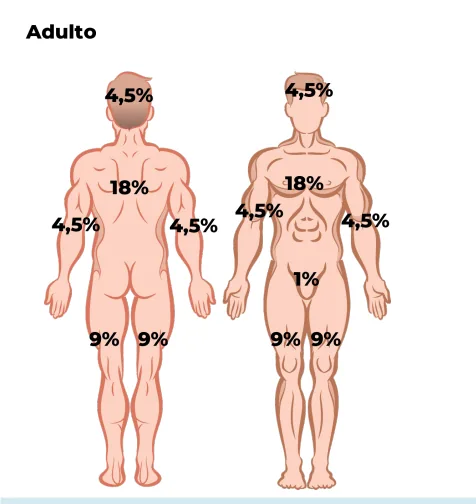
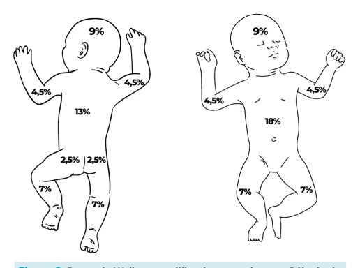
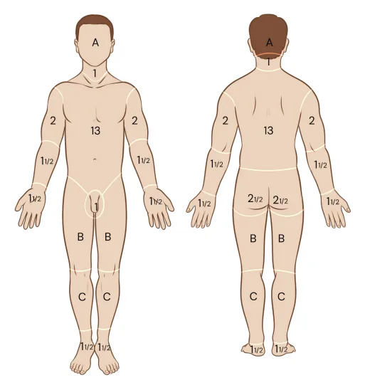
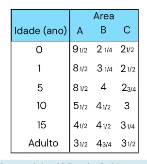

# Queimaduras

<!-- page:1 -->

> ⚠️ Este material teve páginas de duas colunas com texto intercalado; o conteúdo abaixo foi reorganizado por assunto usando o contexto clínico. Confira contra a fonte original em caso de dúvida.

## Cirurgia Plástica: Queimados — Atendimento Inicial

### Intubação Imediata

- Eritema ou inchaço da orofaringe;
- Rouquidão, tosse áspera;
- Estridor, taquipneia ou dispneia;
- Partículas carbonáceas na face;
- Queimaduras faciais extensas e profundas;
- **40-50%** de superfície corporal queimada (SCQ).

### Reposição Volêmica

- Queimaduras térmicas;
- Descontar volume ofertado no pré-hospitalar;
- Regra de Wallace ("dos 9");
- 2º e 3º grau.

## Introdução

- **Principais agentes**: chama; sol; sólidos; líquidos aquecidos (escaldadura); vapor.
- **Fatores de risco**: crianças < 5 anos; adultos: alcoolismo, senilidade, epilepsia, doenças psiquiátricas.
- **Gravidade (3 graus)** depende de: agente causador; área corporal de contato; temperatura do agente; tempo de contato; características individuais.

## Profundidade das Lesões

### Primeiro Grau

- Epiderme;
- **Características**: dor; eritema;
- **Tratamento**: analgesia, hidratação; melhora em 48-72 horas, regeneração em 7 dias.

### Segundo Grau

- Epiderme e derme: **superficial** — derme papilar; **profunda** — derme reticular;
- **Características**: dor, eritema, bolhas, leito rosado ou rosa pálido;
- **Tratamento**: analgesia, hidratação, curativo. Não-cirúrgico: 2º superficial; cirúrgico: 2º profundo;
- **Desbridamento das flictenas**: ATLS: não desbridar! Centro de queimados: desbridar!

### Terceiro Grau

- Espessura total — pele, músculo, osso;
- **Características**: indolor, branco nacarado/carbonizado, firme, coriáceo;
- **Tratamento**: cirúrgico.

**Lesões, por grau:**
- 1º: hiperemia, epiderme;
- 2º superficial: bolhas, derme papilar, discromias;
- 2º profundo: bolhas, derme reticular, excisão e enxerto;
- 3º: espessura total, carbonizado, desbridamento e enxerto.

**Zonas de Jackson**
- Coagulação (necrose): destruição celular total;
- Estase (isquemia): "a queimadura aprofunda";
- Hiperemia (inflamação).

## Grande Queimado

- Crianças: **> 15%** SCQ de 2º ou 3º grau;
- Adultos: **> 20%** SCQ de 2º ou 3º grau;
- **Conduta**: fórmula de Parkland: **4 x SCQ x peso / 16h**; resultado infundir por hora; regular por diurese e metas.

## Resposta Sistêmica — SIRS

> ⚠️ Trecho reconstruído a partir de OCR (fluxograma) — confira contra a fonte original.

**Fase hipodinâmica** (primeiras 24-72h, > 20% SCQ)
- Depressão cardíaca → choque hipovolêmico;
- Resistência vascular pulmonar aumentada; resistência vascular sistêmica aumentada;
- Vasoconstrição esplâncnica.

**Fase hiperdinâmica** (após 24-72h)
- Tempestade inflamatória;
- Frequência cardíaca aumentada; débito cardíaco aumentado; permeabilidade vascular aumentada;
- Perfusão periférica reduzida; resistência vascular sistêmica reduzida;
- Hipermetabolismo; hipercoagulabilidade; edema intersticial.

Figura 1: Fluxograma da evolução do grande queimado.

## Lesão de Vias Aéreas

- Aumento da mortalidade;
- **Quadro clínico**: tosse, rouquidão, odinofagia; queimadura intraoral, vibrissas e cílios;

---

<!-- page:2 -->

- Impregnação carbonácea na face e no escarro;
- **Manifestações clínicas**: edema facial, estridor; confusão mental; depressão respiratória;
- Apresentação aguda e subaguda;
- **Diagnóstico**: clínico!

### Tratamento

- **Casos leves**: O2 inalatório 100% em máscara;
- **Casos moderados a graves**: via aérea definitiva se: franca insuficiência respiratória; piora progressiva do padrão respiratório; queimaduras extensas e profundas em face; rebaixamento do nível de consciência; queimaduras > 40-50% SCQ.

**Avaliação endoscópica** (padrão-ouro)
- Eritema, edema;
- Apagamento dos anéis traqueais;
- Descamação da mucosa;
- Exsudato fibrinoso;
- Partículas carbonáceas;
- Pneumonia.

- **Tratamento**: sem consenso na literatura; corticoterapia; irrigação brônquica ± heparina; N-acetilcisteína endotraqueal.

## Cálculo da Superfície Corporal Queimada (SCQ)

- Para queimaduras de 2º ou 3º grau;
- **Adultos**: Regra dos 9 (Wallace);
- **Crianças**: Wallace modificado — cabeça proporcionalmente maior;
- Pequenas áreas: palma;
- **Padrão-ouro**: diagrama de Lund & Browder.

Figura 2: Regra dos 9 (Wallace). Cálculo da superfície corporal queimada em adultos.

Figura 3: Regra de Wallace modificado para crianças. Cálculo da superfície corporal queimada em crianças.

## Intoxicação por CO (Monóxido de Carbono)

- Em geral, a intoxicação ocorre em ambientes fechados;
- **Diagnóstico**: gasometria arterial; HbCO > 10%; PaO2 baixa, acidose metabólica. Oxímetro de HbCO;
- **Tratamento**: FiO2 100%; câmara hiperbárica; reduz a meia-vida da carboxi-hemoglobina.

**Tabela 1: Sintomas presentes na intoxicação por carboxi-hemoglobina**

> ⚠️ Tabela reconstruída a partir de OCR — confira contra a fonte original.

| Níveis de Carboxi-hemoglobina | Sintomas |
|---|---|
| 0-10% | Mínimos (nível normal em fumantes pesados) |
| 10-20% | Náuseas, dor de cabeça |
| 20-30% | Sonolência, letargia |
| 30-40% | Confusão, agitação |
| 40-50% | Coma, depressão respiratória |
| > 50% | Morte |

## Intoxicação por Cianeto

- Alta suspeição e mortalidade;
- Lembrar de pacientes em ambientes fechados que pegaram fogo;
- Acidose metabólica e hiperlactatemia;
- **Tratamento**: oxigênio 100%; hidroxicobalamina (vit. B12).

---

<!-- page:3 -->

## Reposição Volêmica

Queimaduras de 2º e 3º grau.

Figura 4: Diagrama de Lund & Browder. Padrão-ouro para cálculo da superfície corporal queimada.

## Critérios para Internação

- Queimaduras de 2º e 3º graus: **> 20%** da SCQ; **> 10%** da SCQ em **< 10** ou **> 50 anos**; face, períneo, mão, pé, articulações;
- Queimaduras de 3º grau;
- Suspeita de lesão inalatória;
- Queimaduras circunferenciais;
- Queimaduras elétricas, químicas, associadas a politraumatismo;
- Queimaduras em pacientes com doenças crônicas, com questões sociais.

**Reposição volêmica — queimaduras de 2º e 3º grau**
- **> 20% SCQ** em adultos; **> 15% SCQ** em crianças;
- Cristaloide aquecido: SF 0,9% ou Ringer lactato;
- **Fórmula de Brooke modificada**: **2ml x peso x SCQ (%) / 16h** — resultado infundir por hora. Regular por diurese e metas.

Figura 5: Fluxograma sobre a reposição volêmica inicial no grande queimado.

- Fórmula = estimativa do volume a ser administrado;
- Acompanhar reposição com parâmetros:
  - **Diurese** — principal parâmetro: **0,5 mL/kg/h** no adulto; **1 mL/kg/h** na criança;
  - Frequência cardíaca;
  - PA;
  - Lactato.
- **Coloide**: aumento de mortalidade; alto preço; reservado em situações específicas.
- **Crianças**: **3 mL RL x peso x SCQ**; < 30 Kg — acrescentar glicose.

## Tratamento

- Escarotomia;
- Desbridamento e assepsia;
- **Curativos estéreis**:
  - **Sulfadiazina de prata 1%** — penetração intermediária; risco de leucopenia;
  - **Acetato de mafenide** — alta penetração; pode causar acidose metabólica; aplicação precoce;
  - **Nitrato de cério** — imunomodulador (inibidor LPC);
  - **Placas com prata** — trocas mais espaçadas (até 7 dias); ótimo em crianças; custo elevado.

