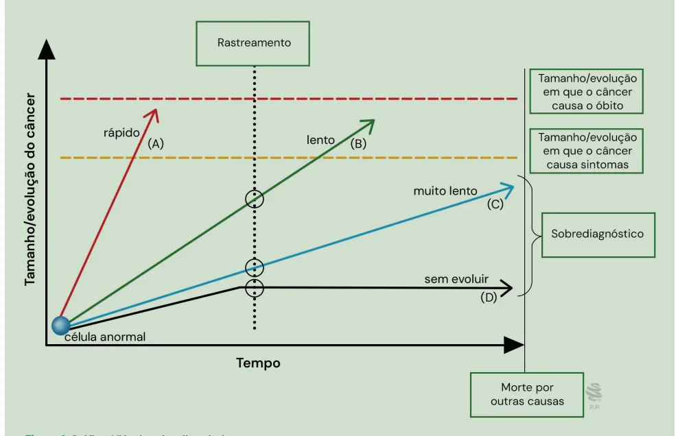
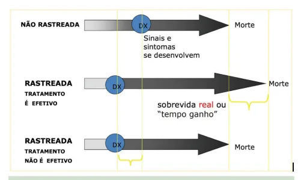

# Rastreamentos

<!-- page:1 -->

## Rastreamento

**Tópicos**: programas de rastreamento; processo saúde-doença; níveis de prevenção e promoção de saúde.

## Rastreamento x Diagnóstico Clínico

- **Rastreamento (screening)**: realizado em assintomáticos, com o objetivo de detectar precocemente doenças com impacto em saúde pública;
- **Diagnóstico**: confirmação diagnóstica em sintomáticos.

## Critérios Clássicos para Justificar o Rastreamento

**Características da doença:**

- Alta relevância em saúde pública;
- Fase assintomática detectável;
- Tratamento durante a fase assintomática melhora desfechos.

**Características do teste:**

- Alta sensibilidade (visa detectar todos os doentes);
- Alta especificidade (evita falsos positivos).

**Características da população:**

- Prevalência da doença justifica a intervenção;
- Acesso garantido a diagnóstico e tratamento;
- Pessoas dispostas a seguir investigação e conduta.

## Tipos de Rastreamento

- **Oportunístico**: realizado quando o paciente procura o serviço por outro motivo;
- **Organizado**: população-alvo definida, chamada ativa, fluxo estruturado para confirmação diagnóstica e tratamento. É o modelo ideal.

## Viés - Rastreamento

Figura 1: Gráfico do viés do sobrediagnóstico.

**Riscos e Limitações:**

- **Sobrediagnóstico**: detecção de doenças indolentes ou autolimitadas, levando a sobretratamento;
- **Viés de seleção**: amostra não representa a população;
- **Iatrogenias**: intervenções médicas que produzem mais malefícios do que benefícios;
- **Viés de tempo de antecipação**: aumenta o tempo de convívio com a doença e não os anos de vida. Diagnóstico precoce ≠ maior sobrevida real;
- **Viés de tempo de duração**: maior probabilidade de detectar casos com fase pré-clínica longa (doenças de evolução lenta) do que aqueles com fase pré-clínica curta (doenças agressivas). Tende a superestimar a sobrevida e o benefício do diagnóstico precoce.

---

<!-- page:2 -->

## Rastreamento (Screening)

### Conceito

- Rastreamento (ou screening) é uma estratégia de prevenção secundária, voltada para identificar precocemente doenças em fase assintomática, permitindo intervenção antes da manifestação clínica e com potencial de reduzir morbimortalidade.

- **Diagnóstico precoce ≠ rastreamento**:
  - Diagnóstico precoce: identifica doença a partir de sinais/sintomas;
  - Rastreamento: aplica-se a indivíduos assintomáticos.

**Rastreamento oportunístico vs. rastreamento organizado:**

- **Oportunístico**: ocorre durante consultas por outros motivos, sem planejamento sistematizado;
- **Organizado**: é programado, com convocação ativa da população-alvo e controle das etapas de rastreamento.

## Critérios para Rastreamento Populacional

- Doença relevante em termos de saúde pública;
- História natural conhecida;
- Fase assintomática identificável;
- Tratamento eficaz que melhore o desfecho;
- Teste adequado, seguro, sensível e específico;
- Teste capaz de detectar a doença na fase assintomática;
- População de risco bem definida;
- Alta prevalência da doença no grupo rastreado;
- Acesso a cuidado médico e adesão às etapas diagnósticas e terapêuticas;
- Benefício deve superar os riscos (princípio da não maleficência).

Figura 2: Viés de Antecipação (Lead Time Bias).

## Vieses de Rastreamento

### Definição Geral

- Vieses do rastreamento são distorções sistemáticas que afetam a interpretação da efetividade de programas de rastreio, sobretudo ao se comparar grupos rastreados e não rastreados. Podem superestimar benefícios, especialmente em relação à sobrevida, e mascarar os riscos do sobrediagnóstico e de tratamentos desnecessários.

### Viés de Antecipação (Lead Time Bias)

- Diagnóstico precoce antecipa o momento do diagnóstico, mas não altera o tempo até o desfecho final (ex.: morte);
- A sobrevida parece aumentar, mas apenas porque o relógio começou a contar antes;
- Não indica aumento real na expectativa de vida;
- Importante: considerar esse viés ao comparar a mortalidade entre grupos rastreados e não rastreados;
- Consequência: a diferença de mortalidade pode refletir diferenças no perfil da população, e não efeito do rastreamento em si.

### Viés de Duração (Length Time Bias)

- Doenças de evolução lenta têm maior chance de serem detectadas em programas de rastreamento periódicos;
- Casos agressivos podem surgir e evoluir rapidamente entre os intervalos de rastreio, escapando da detecção;
- Consequência: o rastreamento favorece a detecção de doenças menos agressivas, com melhor prognóstico, dando falsa impressão de maior efetividade do programa.

### Viés do Sobrediagnóstico

- Diagnóstico de doenças que não causariam sintomas ou morte durante a vida da pessoa;
- Pode levar a intervenções desnecessárias, com iatrogenias e sofrimento evitável;
- É uma consequência do rastreio sem critérios ou evidências claras de benefício clínico.

### Viés de Autosseleção (Self-selection Bias)

- Ocorre quando os indivíduos que aderem ao rastreamento não representam a população geral;
- Pessoas que aderem ao rastreamento são diferentes daquelas que não aderem;
- Frequentemente têm melhor acesso, maior escolaridade ou preocupação com a saúde;
- Pode ocorrer nos dois sentidos: pessoas assintomáticas ou mais saudáveis aderem mais; pessoas em maior risco (ex.: histórico familiar de câncer) também aderem mais.

## Características dos Testes Diagnósticos

- **Prevalência**: quanto maior, maior o VPP;
- **Sensibilidade**: detecta quem está doente;
- **Especificidade**: exclui quem não está doente;
- **Valor preditivo positivo (VPP)**: chance de ter a doença se o teste for positivo;
- **Valor preditivo negativo (VPN)**: confiabilidade do resultado negativo.

---

<!-- page:3 -->

## Tabela de Rastreamentos

Tabela 1: Indicações de rastreamento de neoplasias segundo o Ministério da Saúde e a USPSTF.

> ⚠️ Tabela reconstruída a partir de OCR — confira contra a fonte original.

| Agravo | MS/INCA | USPSTF |
|---|---|---|
| Colo do útero | Atualização 2025: 25-64a, DNA-HPV; repetir em 5 anos, se negativo | 21-65a, citologia (A) |
| Mama | 50-74a, mamografia bienal; 40-49a sob demanda | Atualização 2025: 40-74a, mamografia (B) |
| Colorretal | 50-75a, sangue oculto | 50-75a (A); 45-49a (B) |
| Pulmão | — | 50-80a (B), ≥ 20 maços/ano e que fumam atualmente ou pararam de fumar nos últimos 15 anos |
| Próstata | — | 55-69a, decisão individual (C) |

## Exemplos de Rastreamento Não Recomendado

- PSA em homens assintomáticos;
- Ecocardiograma ou cintilografia sem sintomas;
- Tomografia de tórax em tabagistas sem indicação específica.

- Verificar Tabela 1.

- Os conteúdos relacionados à prevenção quaternária estão detalhados na ficha-resumo específica sobre o tema.

## Referências

Figura 1: Adaptado de: National Cancer Institute, 2018.

Figura 2: PATZ, Edward F. Jr. et al. Screening for lung cancer. The New England Journal of Medicine, v. 343, n. 22, p. 1627–1633, 30 nov. 2000.

Tabela 1: Indicações de rastreamentos de neoplasias segundo Ministério da Saúde e USPSTF. BRASIL. Ministério da Saúde. Secretaria de Atenção à Saúde. Departamento de Atenção Básica. Rastreamento. Brasília: Ministério da Saúde (Cadernos de Atenção Primária, n. 29); e UNITED STATES. U.S. Preventive Services Task Force – USPSTF. Recommendation Topics: A and B Recommendations.
