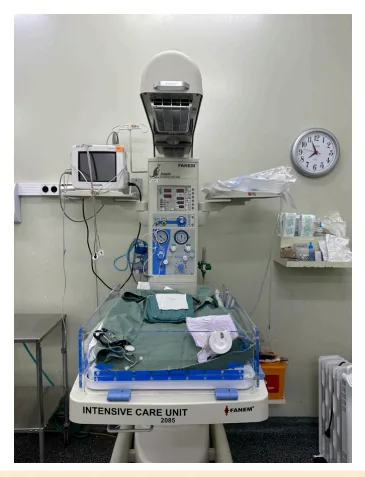
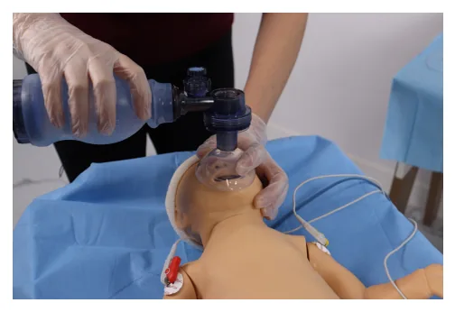
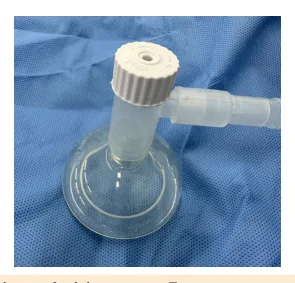
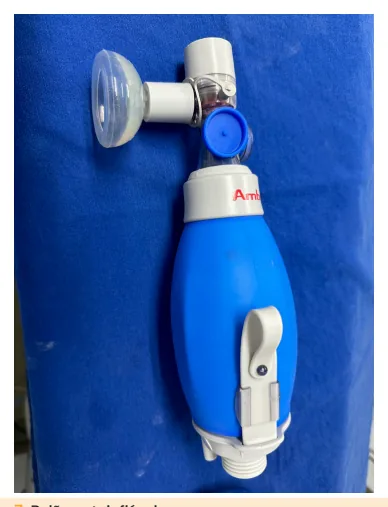
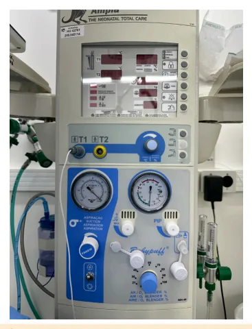

# Reanimação Neonatal

<!-- page:1 -->

Reanimação Neonatal (PED) Clampeamento de cordão: respirando/chorando E

- Procedimento mais importante e efetivo da tônus em flexão? reanimação neonatal!

- Sim: tardio (≥34 sem: 60s/ <34 sem: 30s). Se ≥34

- VPP via cânula traqueal: se falha da VPP sem – pele a pele. por máscara

- Não: estímulo tátil 2x e imediato. Massagem cardíaca: se FC < 60 bpm apesar de VPP

≥34 semanas: por cânula Passos Iniciais: ESPA (esquentar, secar,

- Massagem + Ventilação por Cânula: 3:1, posicionar, aspirar) 60s, FiO2 100%

- Esquentar: sala de parto 23º- 25ºC, RN 36,5º - Adrenalina e expansão: se FC < 60 bpm apesar de

37,5ºC, fonte de calor radiante, campos aquecidos massagem e ventilação

- Secar: estímulo tátil! Touca. <34 semanas:

- Posicionar via aérea: leve extensão

- Sempre passos iniciais (EPA, sem secar, com saco

- Aspirar: se necessário (excesso de secreções). plástico e touca dupla), se VPP: FiO2 inicial 30%.

Líquido meconial? Seguir fluxograma CPAP: Avaliação inicial: auscultar frequência cardíaca (FC)

- Se FC ≥ 100 bpm e respiração regular, mas com

(por 6s e multiplica por 10) + observar respiração desconforto respiratório e/ou SatO2 fora do alvo.

- FC - principal determinante para indicar reanimação e indicador mais sensível da eficácia da reanimação

- Ventilação com pressão positiva (VPP): se FC < 100 bpm e/ou apneia/respiração irregular

- VPP por máscara facial

- Ciclo de 30s, FiO2 21%, “aperta-solta-solta”

(40-60/min)

## CONCEITOS

## EPIDEMIOLOGIA

- Dois em cada 10 recém-nascidos (RN) não choram ou não respiram ao nascer.

- Um em cada 10 RN vai precisar de VPP.

- Um a dois em cada 100 RN vão precisar de intubação orotraqueal (IOT).

- Um a três em cada 1000 RN vão precisar de reanimação avançada – ventilação + compressão e medicações.

- A necessidade de reanimação é maior quanto menor a idade gestacional (IG) e o peso.

## PREPARO DA EQUIPE

- Anamnese materna, preparo do ambiente e do material e divisão da equipe – com definição de um líder. Com material necessário separado e testado.

- Parto sem fator de risco: 1 profissional. Figura 1: Fonte de Calor Radiante (Berço Aquecido) e Monitor.

- Parto com fator de risco: 2-3 profissionais.

- Alguns fatores de risco: trabalho de parto prematuro

- Campo cirúrgico e compressas de algodão.

(TPP), fórceps, doenças maternas, gemelaridade.

- Saco plástico e colchão térmico se RN < 34 semanas.

- Touca de lã ou algodão.

## PREPARO DO MATERIAL

- Estetoscópio.

- Fonte de oxigênio e ar comprimido, blender.

- Oxímetro de pulso e monitor cardíaco (3 eletrodos).

- Aspirador a vácuo e sondas.

- Reanimador manual (balão autoinflável).

- Fonte de calor radiante.

- Ventilador mecânico manual com peça T.

- Máscaras faciais e máscara laríngea nº1.

- Laringoscópio com lâmina reta 00, 0 e 1.

---

<!-- page:2 -->

## PASSOS INICIAIS

- Os passos iniciais devem ser realizados idealmente em 30 segundos, seguidos pela avaliação da FC e da respiração

- E

- Figura 2: Laringoscópio com lâmina reta 1, 0 e 00.

- Cânula traqueal sem cuff (2,5 – 3,0 – 3,5 – 4,0).

- Fixação da cânula e fio-guia.

- Adrenalina diluída - 1 mL para 9 mL.

- Soro fisiológico (2 seringas de 20 mL). S

- Material para cateterização umbilical.

## CLAMPEAMENTO DO CORDÃO

- UMBILICAL

COMO DECIDIR O TEMPO DO P CLAMPEAMENTO?

- Se RN respirando ou chorando E apresenta tônus em flexão → clampeamento tardio ≥ 34 semanas: ≥ 60 segundos A < 34 semanas: ≥ 30 segundos

- Se RN não estiver respirando ou chorando ou com tônus em flexão → estímulo tátil em dorso duas vezes O estímulo não deve atrasar o clampeamento e o início da reanimação

→ clampeamento imediato Não realizar ordenha de cordão umbilical! OS BENEFÍCIOS DO CLAMPEAMENTO TARDIO SÃO:

- Facilita a transição cardiorrespiratória, melhora Hb nas primeiras 24h (cuidado com policitemia e icterícia) e aumenta a ferritina nos primeiros 3-6 meses (o que reduz a incidência de anemia ferropriva).

## PELE A PELE

- Após o clampeamento tardio, se RN ≥ 34 semanas com boa vitalidade → encaminhar para o pele a pele A

- Pele a pele ideal: contato imediato, por pelo menos 1 C hora, mantendo normoterapia, com vias aéreas pérvias e reavaliações periódicas quanto à vitalidade

- GOLDEN HOUR: primeira hora de vida do RN, na qual deve ser iniciado o aleitamento materno. da respiração

- Esses passos atuam como um estímulo sensorial para o início da respiração

- ESPA: Esquentar, Secar, Posicionar e Aspirar se necessário

## ESQUENTAR

- A temperatura corporal à admissão da UTI neonatal é preditor de morbidade e mortalidade (indicador da qualidade do atendimento).

- O objetivo é manter a normotermia, mantendo a sala de parto entre 23°- 25°C e o RN entre 36,5° - 37,5°C.

- Manter sala com portas fechadas, receber RN em campos aquecidos, ligar fonte de calor radiante (berço aquecido) e retirar campos úmidos.

## SECAR

- Secar o corpo e a cabeça com compressas aquecidas

- Colocar touca.

- Lembrar que o ato de secar é um estímulo tátil para o início da respiração.

## POSICIONAR

- Realizar leve extensão do pescoço e colocar o coxim sob os ombros.

## ASPIRAR SE NECESSÁRIO

- Somente se houver excesso de secreções nas vias aéreas.

- Aspirar primeiro a boca e, depois, as narinas.

- E se líquido meconial? Não indica aspiração nem reanimação. Seguir o fluxograma de reanimação. Se boa vitalidade - contato pele-a-pele e clampeamento tardio de cordão Se má vitalidade – passos iniciais, aspirar apenas se suspeita de obstrução de vias aéreas por excesso de secreção Raramente o RN não vigoroso que nasceu com líquido meconial necessita aspiração traqueal ao dispositivo para aspiração de mecônio e ao aspirador a vácuo, aplicando a VPP imediatamente após).

(uma única vez via cânula traqueal conectada

## AVALIAÇÃO INICIAL

APÓS OS PASSOS INICIAIS, VAMOS PROCEDER COM A AVALIAÇÃO DA FC:

- Devemos realizar essa primeira avaliação por ausculta, em região de precórdio, com esteto por 6 segundos – multiplicar o resultado por 10. Em todas as avaliações posteriores, durante a reanimação, a FC deve ser checada pelo monitor cardíaco. A palpação do cordão e ausculta subestimam a FC. Principal determinante para indicar reanimação

---

<!-- page:3 -->

| Melhora da FC: indicador mais sensível da eficácia Tabela 1. da reanimação Problema Correção AO MESMO TEMPO, DEVEMOS OBSERVAR OS Ajuste inadequado da face 1. Readaptar a máscara à à máscara face delicadamente

## MOVIMENTOS RESPIRATÓRIOS

- Considerar respiração inadequada se: apneia, movimentos respiratórios irregulares ou gasping.

VENTILAÇÃO COM PRESSÃO POSITIVA:

- Procedimento mais importante e efetivo na reanimação.

- Indicação: FC < 100 bpm e/ou apneia e/ou respiração irregular

- Deve ser iniciado idealmente nos primeiros 60 segundos (minuto de ouro)

- O recém-nascido que é submetido à VPP deve ser monitorizado com oximetria de pulso (membro superior direito - MSD) e monitor cardíaco

(3 eletrodos).

## VPP POR MÁSCARA FACIAL

- Máscara facial que cubra o queixo, boca e nariz.

- A técnica utilizada para a vedação vai ser a do C (indicador e polegar) e E (3 dedos sustentando a mandíbula).

- Exceção para o início da VPP por máscara facial: RN com hérnia diafragmática congênita - iniciar por cânula traqueal.

- Ciclo de 30 segundos

- FiO2: FiO2 21% se ≥ 34 semanas FiO2 30% se < 34 semanas Se falha do primeiro ciclo, aumentar de 20 em 20

(21/30% → 40% → 60% → 80% → 100%)

- Frequência deve ser de 40-60 por minuto (aperta – solta – solta) pressão positiva por máscara facial.

Figura 3: Técnica do C e do E para realização de ventilação com Após 1 ciclo (30 segundos): reavaliar FC e respiração

- Se FC<100bpm e/ou sem respiração regular REVER TÉCNICA à máscara face delicadamente

2. Reposicionar a cabeça

(pescoço em leve extensão)

3. Aspirar as secreções da

Obstrução de vias aéreas boca e nariz

4. Ventilar com a boca

levemente aberta

5. Aumentar a pressão em

Pressão insuficiente cerca de 5cmH2O, até um máximo de 40 cmH2O Possíveis ações para correção da técnica e adequação da VPP

- Se após correção da técnica - mantém FC<100bpm e/ou sem respiração regular, consideramos falha da

VPP por máscara

- Opção - VPP por Máscara laríngea: considerar nos RN de intubar.

≥34 semanas e ≥2000g. Possível realizar 1 ciclo antes VPP POR CÂNULA TRAQUEAL Indicações:

- Falha de VPP por máscara

- VPP por máscara prolongada (não retoma respiração espontânea)

- Indicação de massagem cardíaca se necessário.

FiO2: a mesma de antes, aumentar 20% a cada ciclo

- Se massagem cardíaca: 100%.

BALÃO AUTOINFLÁVEL X VENTILADOR MECÂNICO MANUAL Balão autoinflável (ambu):

- Não controla pressão, não faz CPAP, não titula FiO2

(21% ou 100%) Ventilador mecânico manual (VMM) com peça T:

- Controlado a fluxo e limitado a pressão

- Ventilador mecânico manual (VMM) com peça T:

controlado a fluxo e limitado à pressão; Controla pressão inspiratória (Pinsp) e expiratória (Peep), controla FiO2 através do blender; faz CPAP.

Qual utilizar?

- RN ≥34 semanas: balão autoinflável ou VMM com peça T

- < 34 semanas: VMM com peça T

Figura 4: Máscara facial com peça T.

---

<!-- page:4 -->

## MASSAGEM CARDÍACA

Indicação: FC <60bpm apesar de VPP por cânula traqueal com técnica adequada Técnica: Terço inferior do esterno (logo abaixo da linha intermamilar), profundidade 1/3, permitir retorno total do tórax

- 2 polegares (sobrepostos): mais eficiente (maior pico de pressão sistólica e perfusão coronariana), menos cansativa

- 2 dedos: menos eficiente e mais cansativa neonatal.

Figura 5: Ventilador mecânico manual com peça T e blender. Figura 8: Técnica dos dois polegares para compressão cardíaca Figura 6: Ventilador acoplado ao berço aquecido.

Figura 9: Técnica dos dois dedos para compressão cardíaca neonatal.

- Frequência: Relação 3:1 → 3 compressões para 1 ventilação = 90 compressões e 30 ventilações por minuto, com FiO2 a 100%.

- “1 e 2 e 3 - ventila”

- Ciclo de 60 segundos.

- Falha: após 60 segundos de VPP por cânula traqueal e

FiO2 a 100% associada a massagem cardíaca, mantém FC <60 bpm

## MEDICAÇÕES

## ADRENALINA

- Indicação: FC<60 bpm apesar de massagem + VPP por cânula traqueal

- Endotraqueal: 1 dose

Figura 7: Balão autoinflável. | 0,05-0,1 mg/kg (1ml/kg da diluída = 0,1mg/kg)

---

<!-- page:5 -->

## APGAR

- Veia umbilical: cateterismo umbilical de emergência 0,01-0,03 mg/kg (0,2 ml/kg = 0,02 mg/kg)

- Diluir 1 mg/ml (ampola) em 9 ml de SF (fica 1mg/10mL)

- Forma de avaliar vitalidade

- Repetir a cada 3-5 minutos

- Realizar no primeiro e no quinto minuto de vida

- Se no 5º minuto é <7 → fazer a cada 5 minutos até o

## EXPANSOR DE VOLUME

- Se hipovolemia (palidez, má perfusão, pulsos débeis) ou se hemorragia materna/fetal - descolamento de placenta

- Soro fisiológico 10 ml/kg em 5-10 minutos (pode ser feito até 2 vezes)

## CPAP EM SALA DE PARTO

- Pressão contínua de vias aéreas (não invasivo)

- Mantém distensão nos espaços aéreos e capacidade residual funcional - PEEP

- Por máscara facial e VMM em T respiratório e/ou SatO2 baixa

Indicação: FC ≥100 bpm e respiração espontânea, mas desconforto

- <34 semanas: deve ser realizado (considerando risco

Síndrome do Desconforto Respiratório)

- ≥34 semanas: pode ser considerado, risco de pneumotórax

## SATURAÇÃO DE O2: OXIMETRIA DE PULSO EM

## MEMBRO SUPERIOR DIREITO (PRÉ-DUCTAL)

- Até 5 minutos: 70%-80%

- 5-10 minutos: 80%-90%

- >10 minutos: 85%-95%

## PARTICULARIDADES NOS <34

## SEMANAS

- 3 profissionais em sala de parto

- Clampeamento tardio de cordão: > 30 segundos

- Sempre levar ao berço aquecido e realizar passos iniciais

PASSOS INICIAIS (EPA) E: esquentar - maior risco de hipotermia

- Saco plástico (exceto cabeça) e touca dupla (plástico

+ lã/algodão)

- Não secar!

Colchão térmico se <1000g P: posicionar vias áereas, coxim sob os ombros A: aspirar se necessário Simultâneo: oxímetro + monitor cardíaco

## VPP

- Iniciar com máscara facial

- FiO2: 30%

- Se necessário aumentar:

- 30%-40%-60%-80%-100%

- Com ventilador mecânico manual com peça T

- Se falha de máscara, proceder com VPP por cânula traqueal - Se no 5º minuto é <7 → fazer a cada 5 minutos até o

20º minuto de vida.

- Não indica procedimentos de reanimação.

- Avalia a resposta às manobras de reanimação e sua eficácia.

Tabela 2: Escala de APGAR. 0 1 2 FC Ausente < 100 > 100 Regular/ RESPIRAÇÃO Ausente Irregular choro forte Movimentos TÔNUS Flacidez Alguma flexão ativos Choro ou IRRITABILIDADE Sem Caretas movimento REFLEXA resposta de retirada Cianose Corpo róseo, Corpo e central COR extremidades extremidades ou cianóticas róseas palidez

## ASPECTOS ÉTICOS

- Falha em atingir o retorno da circulação espontânea após 10-20 minutos de reanimação avançada: elevado risco de óbito e de sequelas moderadas ou graves do desenvolvimento neurológico.

- Discussão entre a equipe e a família em torno de 20 minutos de reanimação sobre a hora de cessar a reanimação.

LIMITE DE VIABILIDADE:

- Depende de fatores tecnológicos e socioeconômicos de cada país

- <22 semanas: não investir, apenas medidas de conforto

- 22-24 semanas: zona cinzenta. Sobrevivência e prognóstico são incertos e há dúvida sobre qual a melhor conduta a ser adotada e sobre o grau de investimento e intervenção a ser feito. Decisão em conjunto

- A partir de 25 semanas: investir

- A decisão quanto a iniciar a reanimação em prematuros extremos deve ser individualizada e sempre que possível compartilhada com os pais.

---

<!-- page:6 -->

## FLUXOGRAMAS

Estímulo tátil Respirando e/ou chorando Clampeamento tardio em dorso 2x Tônus em flexão? (>60seg), Pele-a-pele: Manter em dorso 2x Tônus em flexão?

NÃO Clampeamento imediato e passos in Esquentar 60 segundos Secar Minutos de Ouro Posicionar Aspirar se necessário Avaliação Inicial (FC e respiração FC<100bpm, apneia, respiração irregular VPP por máscara (FiO2 21%)

Oximetria e monitor cardíaco FC<100bpm, apneia, respiração irregular Rever técnica Considerar máscara laríngea ou cânula t FC <60bpm 60 segundos VPP por cânula traqueal (Fi 100%)

Massagem cardíaca (3:1) FC <60bpm VPP por cânula + Massagem cardíaca Adrenalina e expansor de volume Figura 10: Reanimação para os maiores ou iguais a 34 semanas.

Estímulo tátil Respirando e/ou chorando SIM em dorso 2x Tônus em flexão? NÃO Clampeamento imediato Es 60 segundos Minuto de Ouro FC<100bpm respiração VPP por másc FC<100bpm, apneia, respiração irregular Rever técnica Considerar cânula tra FC <60bpm VPP por cânula traqueal 60 segundos Massagem cardíac FC <60bpm VPP por cânula + Massagem ca Adrenalina e expansor de v Figura 11: Reanimação para os menores que 34 semanas.

## REFERÊNCIAS

Figura 1: Fonte de Calor Radiante (Berço Aquecido) e Monitor. Acervo pessoal Dra. Amira Saleh A Figura 2: Laringoscópio com lâmina reta 1, 0 e 00.

Acervo pessoal Dra. Amira Saleh A Figura 3: Técnica do C e do E para realização de ventilação com pressão positiva por máscara facial.

Acervo pessoal Dra. Amira Saleh A Figura 4: Máscara facial com peça T. Acervo pessoal Dra. Amira Saleh A (>60seg), Pele-a-pele: Manter SIM normotermia, VA pérvias Avaliar vitalidade niciais NÃO FC≥100bpm, respiração regular Desconforto respiratório ou SatO2 < alvo o)

SIM Considerar CPAP 30 segundos SatO2 alvo: <5 min: 70% - 80% 5-10min: 80% - 90% >10min: 85% - 95% traqueal ) e a (3:1)

e M Clampeamento tardio (>30 seg) Passos iniciais squentar (saco plástico, touca dupla) Posicionar Aspirar se necessário Oxímetro e monitor Avaliação inicial (FC e respiração)

m, apneia, FC≥ 100bpm, o irregular respiração regular cara (FiO2 30%) Considerar CPAP se desconforto respiratório ou SatO2 fora do alvo SatO2 alvo:

aqueal <5 min: 70% - 80% 5-10min: 80% - 90% >10min: 85% - 95% l (Fi 100%) e ca (3:1) ardíaca (3:1) volume Figura 5: Ventilador mecânico manual com peça T e blender.

Acervo pessoal Dra. Amira Saleh Figura 6: Ventilador acoplado ao berço aquecido. Acervo pessoal Dra. Amira Saleh Figura 7: Balão autoinflável.

Acervo pessoal Dra. Amira Saleh Figura 8: Técnica dos dois polegares para compressão cardíaca neonatal.

Acervo pessoal Dra. Amira Saleh Figura 9: Técnica dos dois dedos para compressão cardíaca neonatal Acervo pessoal Dra. Amira Saleh
