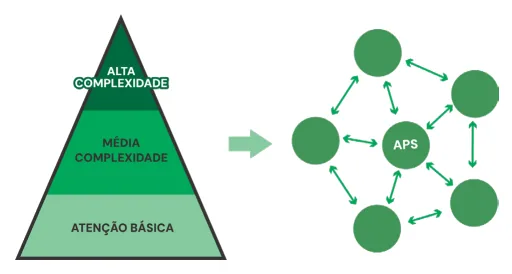

# Redes de Atenção à Saúde e Níveis de Atenção

<!-- page:1 -->

## REDES DE ATENÇÃO À SAÚDE E

## NÍVEIS DE ATENÇÃO

Saúde Pública SUS Redes de Atenção à Saúde (RAS) e Regiões de Saúde

## REDES DE ATENÇÃO À SAÚDE (RAS) da RAS (PNAB, 2017)

- Arranjos organizativos de serviços de diferentes

- Secundária: Média densidade tecnológica densidades tecnológicas, integrados por sistemas (consultas especializadas, CAPS, reabilitação, UPA).

de apoio técnico, logístico e de gestão, com a

- Terciária: Alta densidade (UTI, integralidade, coordenação e continuidade. Estrutura Operacional da RAS

APS sendo ordenadora do cuidado, garantindo transplantes, oncologia). Fundamentos:

- Centro de Comunicação: APS – porta de entrada

- Economia de escala: Concentração de serviços de preferencial, coordenadora do cuidado.

alta tecnologia (UTI, transplantes) vs. dispersão da

- Pontos de Atenção à Saúde (PAS): Serviços de

APS para maior acessibilidade. todos os níveis de atenção da RAS.

- Qualidade: Maior volume de procedimentos =

- Sistemas de Apoio: Diagnóstico, terapêutico, melhores resultados e menor mortalidade (ex.: assistência farmacêutica, informação em saúde.

cirurgias cardíacas).

- Sistemas Logísticos: Cartão do usuário, prontuário

- Acesso: Disponibilidade geográfica, acolhimento, eletrônico, regulação do acesso e transporte.

custo e tempo adequado de atendimento.

- Sistema de Governança: Gestão integrada,

Integrações: planejamento, avaliação e participação social.

- Horizontal: Entre serviços do mesmo nível (fusão Elementos da RAS:

de hospitais, UBS complementares).

- População adscrita e estratificação de risco.

- Vertical: Entre níveis (primária, secundária

- Estrutura operacional: APS (centro de e terciária), garantindo fluxos e comunicação), pontos de atenção secundários contrafluxos coordenados. e terciários, sistemas de apoio (diagnóstico,

Processos de Substituição: farmacêutico, informação), sistemas logísticos

- Locacional (hospital → domicílio), tecnológica, (regulação, transporte, prontuário) e governança.

clínica (autocuidado apoiado) e por competências

- Modelos de atenção: Integração entre condições

(delegação a equipes multiprofissionais). agudas (urgências/emergências) e condições Território Sanitário: crônicas (gestão clínica, prevenção

- Base geográfica e populacional que organiza e de complicações).

define a responsabilidade sanitária da rede.

- Primária: Base territorial, equipe multiprofissional, foco em prevenção, cuidado integral e coordenação

## REDES DE ATENÇÃO À SAÚDE

As Redes de Atenção à Saúde (RAS) são arranjos organizativos de serviços e ações de saúde, de diferentes densidades tecnológicas, integrados por meio de sistemas de apoio técnico, logístico e de gestão, com a Atenção Primária à Saúde (APS) como ordenadora do cuidado e coordenadora da rede, garantindo a integralidade e a continuidade da atenção.

- Redes são formas de organização baseadas em cooperação, autonomia e compartilhamento de objetivos. Figura 1: Rede de Atenção à Saúde

- Caracterizam-se por interdependência, confiança mútua, troca contínua de recursos e ausência de

- Pontos essenciais:

hierarquia rígida. | São organizações poliárquicas (sem hierarquia entre

- No contexto da saúde, substituem o modelo os pontos) burocrático e piramidal por arranjos flexíveis, | Coordenada pela Atenção Primária à Saúde: centro centrados em resultados e participação social. de comunicação da rede e a principal porta de entrada do SUS;

---

<!-- page:2 -->

| Atualização: Embora inicialmente chamada como

- Locacional: Alteração do local de cuidado (ex.: do a APS possui “baixa densidade tecnológica”, mas

“baixa complexidade”, atualmente entendemos que hospital para o domicílio).

- Tecnológica: Troca de tecnologias mais caras pode possuir alta complexidade! Portaria n° 4.279, de dezembro de 2010: estabelece diretrizes para a organização da Rede de Atenção à

Saúde no âmbito do Sistema Único de Saúde (SUS).

## FUNDAMENTOS DAS RAS

## ECONOMIA DE ESCALA, QUALIDADE E ACESSO

- Economia de escala: Redução do custo médio quando se aumenta o volume de serviços, diluindo custos fixos. Dispersão: serviços básicos (APS), baixa tecnologia e necessidade de proximidade. Concentração: serviços especializados (cirurgias cardíacas, UTI), alta tecnologia e recursos escassos.

- Qualidade: Atender padrões ótimos, com segurança, humanização, equidade e bons resultados. Maior volume de procedimentos → mais experiência e melhores resultados (ex.: cirurgias cardíacas e diagnóstico por imagem).

- Acesso: Capacidade do sistema de responder às necessidades da população. Não basta ter serviços de qualidade; é preciso que as pessoas consigam usá-los no tempo certo. Disponibilidade: serviços ofertados. Geográfica: distância e transporte. Acolhimento e custo: relação profissional-usuário e capacidade de pagar.

## INTEGRAÇÃO HORIZONTAL E VERTICAL

- Integração Horizontal: Conexão entre unidades do mesmo nível de produção (hospitais com hospitais, Objetivo: ganhos de escala, redução de custos e aumento da eficiência. Modos principais: Fusão: duas unidades tornam-se uma só, unificando gestão e serviços de apoio (ex.: Aliança estratégica: mantém unidades independentes, mas coordena os serviços para evitar duplicidades e competição, tornando-os complementares.

UBS com UBS). cozinha, lavanderia).

- Integração Vertical: Conexão entre diferentes níveis de atenção (primária, secundária e terciária) e sistemas de apoio/logísticos. Objetivo: agregar valor ao cuidado, garantindo coordenação, continuidade e integralidade.

A situação ótima nas redes de atenção à saúde é dada pela concomitância de economias de escala e serviços de saúde de qualidade acessíveis prontamente aos cidadãos.

## PROCESSO DE SUBSTITUIÇÃO

Reagrupamento contínuo de recursos entre e dentro dos serviços de saúde para oferecer a atenção certa, no lugar certo, com o custo certo e no tempo certo, garantindo melhores resultados sanitários e econômicos. por outras de igual ou maior efetividade (ex.:

medicamentos para úlcera em vez de cirurgia).

- Competências clínicas: Redistribuição de funções entre profissionais

- Clínica: Transição do cuidado profissional para o autocuidado apoiado (ex: atenção domiciliar, do uso de equipamentos comunitários)

## TERRITÓRIOS SANITÁRIOS

Delimitações geográficas e populacionais que servem como base de planejamento, organização e gestão das Redes de Atenção à Saúde (RAS). Eles são úteis para:

- Garantir a adscrição de população para equipes de saúde e serviços.

- Facilitar o planejamento local, a vigilância em saúde e a organização da rede assistencial.

- Servir como referência para a governança das RAS, a articulando serviços e recursos dentro do território.

## NÍVEIS DE ATENÇÃO À SAÚDE

Os Níveis de Atenção são formas de organização dos serviços de saúde segundo a densidade tecnológica, distribuindo as ações e serviços em três níveis:

- Atenção Primária Base territorial, responsabilidade sanitária e equipe multiprofissional. Foco em prevenção, promoção da saúde, cuidado integral, longitudinalidade e coordenação da RAS. É a porta de entrada preferencial do SUS

e | Menor densidade tecnológica e maior resolutividade (85% dos problemas de saúde).

- Atenção Secundária Densidade intermediária, com serviços especializados e de apoio diagnóstico e terapêutico. Abrange a densidade intermediária (ex.: consultas especializadas, cirurgias ambulatoriais, serviços de reabilitação, CAPS, UPA). Suporte técnico à APS, com integração e referência/contrarreferência.

- Atenção Terciária Maior densidade tecnológica e alta complexidade. Inclui hospitais de grande porte, UTI, transplantes, cirurgias de alta especialidade, oncologia e serviços com tecnologia avançada. Verificar Tabela 1 na próxima página

## ELEMENTOS CONSTITUTIVOS

DA RAS: e .

- População: razão de ser da rede, com responsabilidade sanitária e econômica.

- Estrutura operacional: conjunto de pontos de atenção, sistemas logísticos e de apoio.

- Modelo de atenção à saúde: diretriz organizadora das ações e serviços, centrada na integralidade do cuidado.

---

<!-- page:3 -->

## POPULAÇÃO

- Pontos de Atenção à Saúde (PAS): Serviços

- População adscrita: Cada RAS é responsável por de atenção secundária e terciária, com um grupo populacional definido, que pode estar especialização tecnológica.

organizado em territórios sanitários

- Territorialização: Processo de identificação e delimitação do território de saúde, incluindo mapeamento da população.

- Cadastramento e segmentação: Registro das famílias e estratificação em subpopulações com base em fatores de risco sociais, ambientais e de saúde.

- Estratificação por risco: Identificação de grupos vulneráveis por condições de saúde ou determinantes sociais. Classificação em graus de risco (baixo, intermediário, alto) para orientar as ações da APS e da rede.

## ESTRUTURA OPERACIONAL DA RAS

- Centro de comunicação: APS (Atenção Primária à do sistema.

Saúde), coordenadora do cuidado e porta de entrada Tabela 1: Atenção especializada. Adaptado de Campo vs. APS vs. Aten Campo APS Foco na pesso Foco na saúde AMBIENTE DO CUIDADO Foco em problemas pouco vistos no início Ambiente pouco med Exames mais sensíveis que Aceitam falsos negativos qu minimizados pela repetiçã FORMAS DE ATUAÇÃO DOS Provas em séri PROFISSIONAIS Cuidado disperso em vário mas com concentração r pequeno número de pr CONTINUIDADE DO CUIDADO Continuidade suste RESULTADOS Menores custos e iatr RT 1 RT 2 RT 3 Pontos de Pontos de Pontos d atenção à atenção à atenção à saúde saúde saúde secundários secundários secundár e terciários e terciários e terciári Atenção Primária à Saúde

Figura 2: Sistema de governança - Sistemas de Apoio: | Apoio diagnóstico e terapêutico. | Assistência farmacêutica.

| Sistema de informação em saúde.

- Sistemas Logísticos: Cartão de identificação do usuário. Prontuário clínico. Regulação do acesso. Transporte em saúde. Sistema de Governança: Gestão integrada, transversal a todas as redes. Verificar Figura 2

## ATENÇÃO: NÃO CONFUNDA OS COMPONENTES DOS

SISTEMAS LOGÍSTICOS COM OS COMPONENTES DOS SISTEMAS DE APOIO nção especializada Atenção Especializada oa Foco no órgão ou sistema e Foco em doenças o estruturados Foco em problemas bem definidos o vistos mais tarde dicalizado Ambiente muito medicalizado e específicos Exames mais específicos que sensíveis ue podem ser Aceitam sobrediagnóstico, mas não ão de exames falsos negativos ie Provas em paralelo os problemas, Concentração do cuidado num único relativa num problema ou num número mínimo de roblemas problemas entada Continuidade relativa rogenias Maiores custos e iatrogenias RT 4 de Pontos de Sistema de acesso regulado à atenção à saúde rios secundários Registro eletrônico em saúde ios e terciários Sistemas de transporte em saúde Sistemas de apoio diagnóstico e terapêutico Sistemas de assonância farmacêutica Teleassistência Sistemas de informação em saúde e

---

<!-- page:4 -->

Nível 5: Subpopulação com condição crônica Gestão de muito complexa caso Determinantes sociais individuais Nív Subpopulação com condição crônica Gestão d complexa de s Subpopulação com condição Nív crônica simples e/ou com fator Gestão da de risco biopsicológico sa Subpopulação com fatores de Nív risco ligados a Intervenções d comportamentos e estilo de condiçõe vida Ní Populçaõ total Intervenções de p Modelo da pirâmide de Modelo de a riscos Figura 3: Fluxograma de níveis de intervenção

## MODELOS DE ATENÇÃO À SAÚDE

Os modelos de atenção às condições agudas e crônicas são complementares e precisam atuar de forma integrada nas RASs. Enquanto o modelo agudo organiza a resposta rápida e eficiente às urgências, o modelo crônico reduz a incidência de complicações, mantendo a população acompanhada, informada e empoderada.

- Condições Agudas: Necessitam de redes de urgência e emergência, com adequada distribuição de usuários por risco (ex.: classificação de Manchester).

- Condições Crônicas: Demandam acompanhamento contínuo, estratificação de risco e gestão da clínica para reduzir complicações e hospitalizações.

- A Atenção Primária à Saúde (APS) é chave na organização das RAS, pois: Atende urgências menores (classificação verde e azul). Libera os hospitais terciários para casos graves. Garante cuidado longitudinal e prevenção de agravamentos. Exige a implantação do modelo de atenção às condições crônicas, organizando tempo e recursos para demandas espontâneas e programadas.

Condições Agudas Tabela 2: Classificação de Níveis de Gravidade. Tempo-alvo Número Nome Cor (em minutos)

1 Emergente Vermelho 0 Muito 2 Laranja 10 urgente 3 Urgente Amarelo 60 Pouco 4 Verde 120 urgente 5 Não urgente Azul 240 sociais individuais vel 4: com condição de da condição saúde e/ou fator de saúde risco biopsicológico estabelecido vel 3:

condição de aúde Relação autocuidado/atenção vel 2: profissional de prevenção das Determinantes sociais da es de saúde saúde intermediários ível 1: Determinantes promoção da saúde sociais da saúde intermediários atenção crônica Modelo da determinação social da saúde Modelo de atenção às condições crônicas:

- Verificar Figura 3

- Estrutura-se em 5 níveis e 3 componentes integrados;

- 03 componentes integrados e seus 03 modelos de influência; População estratificada em subpopulações por riscos (influência do modelo da pirâmide de riscos); Níveis de intervenções em saúde (influência do modelo de atenção crônica); Diferentes níveis de determinantes sociais de saúde

(influência do modelo de determinação social de Dahlgren e Whitehead).

- 05 níveis de intervenção:

1. Intervenções de promoção da saúde (foco nos

DSS intermediários);

2. Intervenções de prevenção das condições de saúde

(foco nos DSS proximais - estilo de vida e redes sociais e comunitárias);

3. Gestão da condição de saúde (condição

crônica simples);

4. Gestão da condição de saúde (condição crônica

complexa - requer maior cuidado especializado);

5. Gestão de caso.

- Nos níveis 3, 4 e 5: vinculados aos indivíduos com suas características de idade, sexo, fatores hereditários e de risco biopsicológicos. Foco das intervenções é predominantemente clínico.

## REFERÊNCIAS

Figuras e Tabelas: MENDES, Eugênio Vilaça. As redes de atenção à saúde. Ciência & saúde coletiva, v. 15, p. 2297-2305, 2010.
