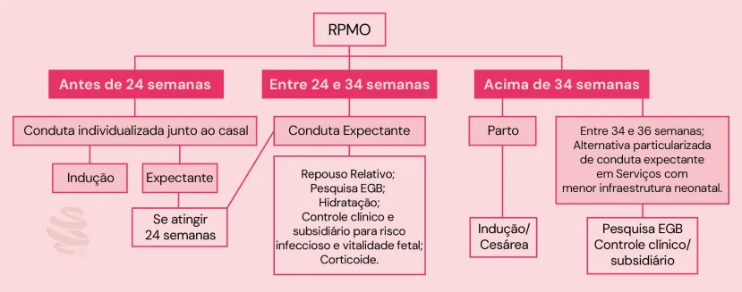
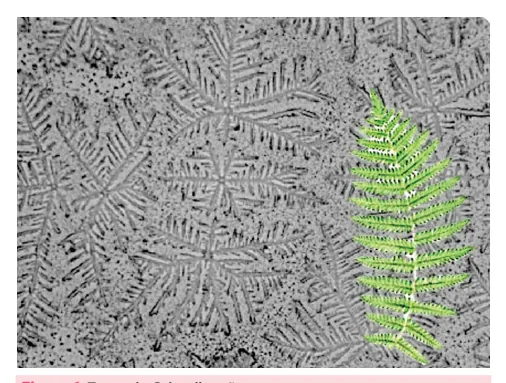
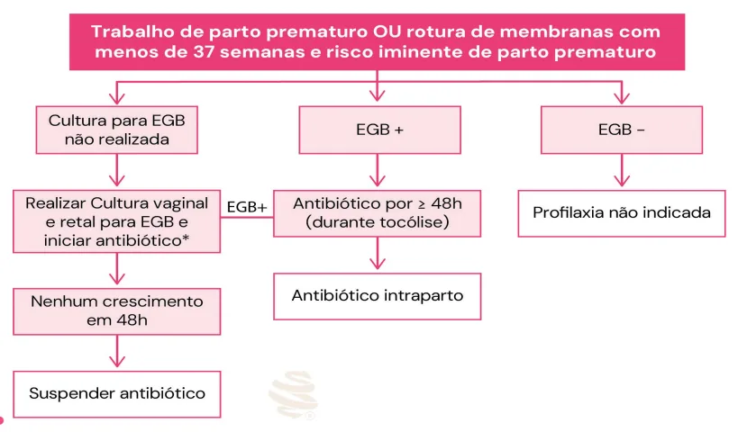
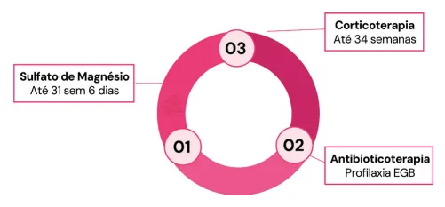
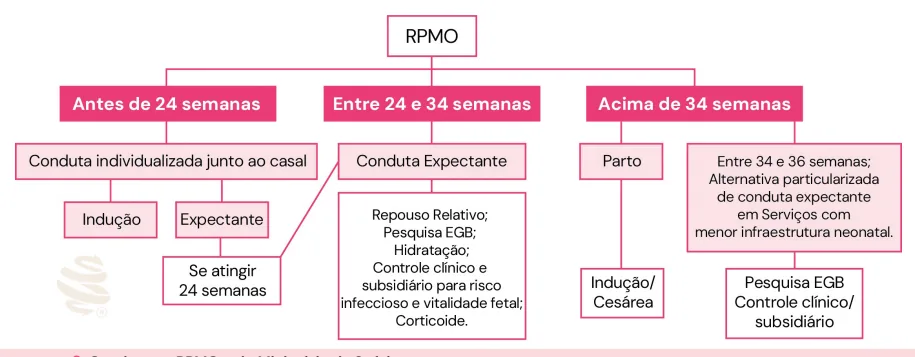

# Rotura Prematura de Membranas Ovulares

<!-- page:1 -->

## ROTURA PREMATURA DE

## MEMBRANAS OVULARES

MEMBRANAS OVU RPMO Definição: rotura prematura das membranas ovulares após 20-22 semanas e antes do início do trabalho de parto.

## Diagnóstico

- Exame especular evidenciando saída de líquido pelo orifício externo do colo do útero → padrão ouro;

## MEMBRANAS OVULARES (RPMO)

## DEFINIÇÃO

- Saída espontânea de líquido amniótico, após perda da integridade das membranas ovulares, na ausência de sinais de trabalho de parto, em gestações acima de

20 a 22 semanas.

## FATORES DE RISCO

- Sobredistensão uterina: polidrâmnio, gemelaridade, macrossomia etc;

- Incompetência istmocervical;

- Inflamação / infecção local *;

- Tabagismo;

- Placenta inserção baixa;

- Infecção do Trato Urinário.

*Infecção vaginal ascendente → Enfraquecimento das membranas → Rotura das membranas ovulares Ex.: Vaginose Bacteriana, infecção por estreptococo do grupo B (EGB) e Gonococo

- Padrão-ouro é o exame físico: exame especular evidenciando saída de líquido pelo orifício externo do colo (precipitado ou não pela manobra de Valsalva).

## EXAMES COMPLEMENTARES

- Cristalização do muco cervical: aspecto de folha de samambaia;

## ULARES

- Exames adicionais: Cristalização do muco cervical quantidade de líquido amniótico em relação a outro o exame recente e Testes imunocromáticos.

(aspecto folha de samambaia); pH por fita (acima de 6,5 / fenol vermelho); Ultrassonografia – redução de

- pH por fita ( acima de 6,5 / fenol vermelho);

- Ultrassonografia → Líquido em quantidade reduzida;

- Testes imunocromáticos → Detectam proteínas do líquido amniótico.

Figura 1: Teste da Cristalização

## CONDUTA

Para todas

- Internação clínica;

- Evitar toque vaginal;

- Avaliação clínica de sinais infecciosos: frequência cardíaca, temperatura, tônus uterino e fisometria;

- Avaliação laboratorial: urina 1, urocultura, hemograma

(HMG) e PCR;

- Pesquisa de EGB.

---

<!-- page:2 -->

- Fluxograma 1: Quando realizar profilaxia para o Estreptococo do Grup

Idade gestacional < 24 semanas A

- Prognóstico desfavorável, pode-se oferecer:

- Interrupção da gravidez devido ao alto risco infeccioso e prognóstico reservado para o feto;

- Manutenção da gravidez: casal deverá assinar termo de consentimento em prontuário;

- Interrupção por risco de vida materno: assinatura do casal e dois profissionais especialistas do serviço.

Idade gestacional entre 24 e 34 semanas

- Internação; N

- Repouso relativo;

- Hidratação oral abundante;

- USG obstétrico com doppler + Perfil biofísico fetal Q

2x/semana;

- Cardiotocografia diária;

- Controle infeccioso: HMG e PCR a cada 2 a 3 dias.

- I

- - C

Figura 2: Tripé de condutas para RPMO entre 24 e 34 semanas

- Corticoterapia → 1 ciclo

- Betametasona 12mg IM 24/24h (2 doses) ou

- Dexametasona 6mg IM 12/12h (4 doses)

Antibioticoterapia (parte 1)

- Profilaxia EGB → Ampicilina 2g ataque + 1g 6/6h por 48hrs;

po B. Antibioticoterapia (parte 2)

- Aumentar o período de latência: Amoxicilina 500mg o antibiótico por, pelo menos, 72 horas até a inibição do trabalho de parto ou até o parto (tempo suficiente para erradicação do EGB no trato genital).

8/8h por 5 dias + azitromicina 1g dose única. *Quando não for possível realizar a cultura, mantém-se Neuroproteção fetal -Sulfato de magnésio endovenoso

- Até 31 semanas e 6 dias, se risco de parto iminente

(dilatação a partir de 4 cm). Quando fazer o parto antes de 34 semanas?

- Infecção materna e/ou fetal;

- Alteração de vitalidade fetal;

- Trabalho de Parto.

Idade gestacional após 34 semanas

- Resolução da gestação;

- Postura ativa.

Algumas referências indicam conduta particularizada e expectante por mais tempo (até 36 semanas).

- Verificar Fluxograma 2

## COMPLICAÇÕES

- Infecção → corioamnionite;

- Descolamento prematuro de placenta;

- Prolapso de cordão;

- Oligoâmnio grave e precoce → compromete desenvolvimento fetal, hipoplasia pulmonar, deformidades extremidades (sequência Potter);

- Compressão funicular;

- Sofrimento fetal.

---

<!-- page:3 -->

Fluxograma 2. Conduta na RPMO pelo Ministério da Saúde Sequência de Potter | Leucocitose (> 15.000 leucócitos/mL ou aumento

- Malformação fetal secundária ao oligoâmnio grave e de 20% em relação ao basal);

precoce, marcado por: | Aumento do PCR em 20% em relação ao basal;

1. Pé torto congênito; | Ausência de movimentos respiratórios fetais e

2. Hipoplasia pulmonar; diminuição abrupta do líquido amniótico.

3. Anomalias cranianas associadas ao oligoidrâmnio.

- Indica-se a resolução da gestação + antibioticoterapia

- Orelhas de implantação baixa; | Esquema 1: Clindamicina 900 mg IV de 8 em

- Nariz achatado; 8 horas (ou 600 mg IV de 6 em 6 horas) +

- Pele enrugada; Gentamicina 1,5 mg/kg IV de 8 em 8 horas (ou 3,5z Micrognatia. 5,0 mg/kg em dose única diária).

Corioamnionite | Esquema 2: Ampicilina 2g IV de 6 em 6 horas ou

- Pelo Ministério da Saúde: penicilina G cristalina: 5 milhões de ataque + 2,5 Febre materna; milhões UI IV de 4 em 4 horas; Gentamicina 1,5 Taquicardia materna (>100 bpm); mg/kg IV de 8 em 8 horas (ou 3,5-5,0 mg/kg em Taquicardia fetal (>160 bpm); dose única diária); Metronidazol 500 mg IV de 8 Leucócitos > 20.000mm³ ou desvio à esquerda em 8 horas.

ou aumento 20%;

- Prefere-se via de parto vaginal. Movimento respiratório ausente PBF.

- Se cesárea → proteção das goteiras parietocólicas

- Pela FEBRASGO: com compressas úmidas e lavagem peritoneal, Taquicardia materna ou fetal; se necessário. Febre (≥37,8oC);

## REFERÊNCIAS

| Contrações uterinas irregulares (útero irritável); | Saída de secreção purulenta e/ou com odor pelo orifício externo do colo; Figura 1: Teste da Cristalização KIECHLE, Frederick; GAUSS, Isabel; ROBINSON-DUNN, Barbara. ProviderPerformed Microscopy: A Review. Point of Care, v. 2, p. 20-32, 2003.

