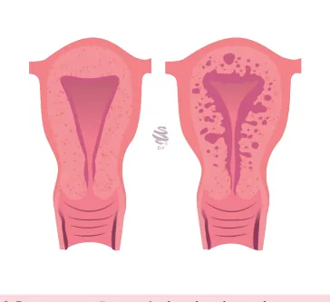
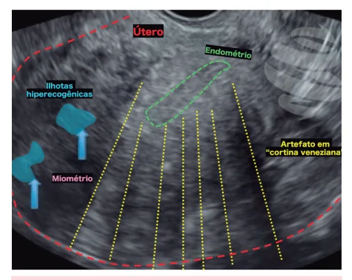
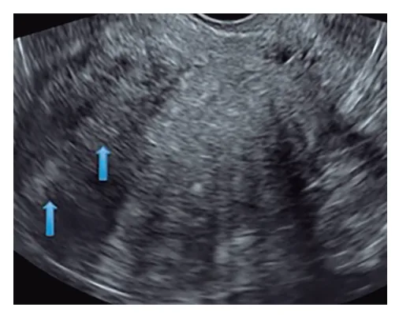
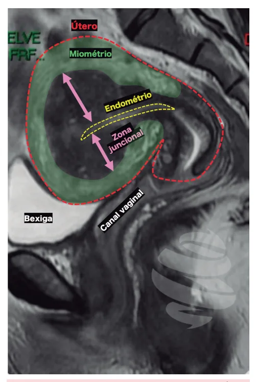
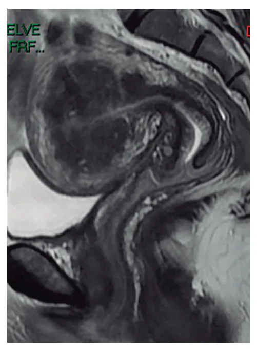
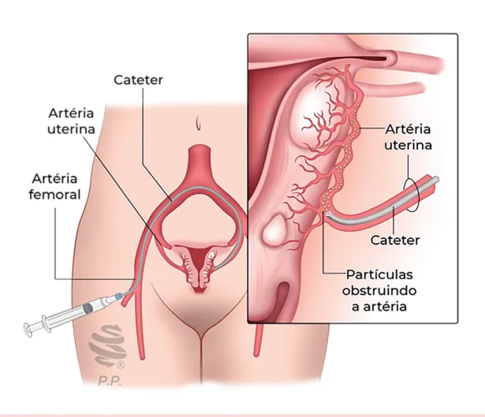

# Sangramento Uterino Anormal - Adenomiose

<!-- page:1 -->

## Sangramento Uterino Anormal (SUA) — Adenomiose

### Definição

- **Adenomiose** é uma alteração benigna do útero caracterizada pela invasão benigna do endométrio no miométrio, com presença de glândulas e estroma endometriais.

### Fatores de Risco

- Idade entre 40 e 50 anos;
- Menarca precoce (menos de 10 anos de idade);
- Ciclos menstruais curtos (menos de 24 dias de intervalo);
- Uso prévio de contraceptivos hormonais e tamoxifeno;
- Índice de massa corporal elevado;
- Multiparidade (mais de duas gestações);
- História de abortamento;
- Manipulações uterinas prévias (curetagens, miomectomia, entre outras).

### Quadro Clínico

- Assintomática em cerca de 35% dos casos;
- Sangramento menstrual abundante e prolongado;
- Presença de dismenorreia secundária que antecede até uma semana após o fluxo menstrual frequentemente leva à suspeita de adenomiose;
- A frequência e gravidade do quadro clínico estão relacionadas com a sua extensão.

## Definição

- É uma alteração benigna do útero que histologicamente se caracteriza pela invasão benigna do endométrio no miométrio, além de 2,5 mm de profundidade ou, no mínimo, um campo microscópico de grande aumento distante da camada basal do endométrio;
- Presença de glândulas e estroma endometriais circundados por hiperplasia e hipertrofia das células miometriais.

Figura 1: Representação anatômica da adenomiose.

### Diagnóstico

- Deve-se suspeitar de adenomiose por meio da anamnese e do exame físico;
- Os exames de imagem úteis são:
  - **Ultrassonografia transvaginal (USGTV)**: mostra aumento heterogêneo do volume uterino sem nódulos miomatosos, assimetria entre paredes uterinas, heterogeneidade difusa ou focal, cistos anecoicos no miométrio e estrias radiadas partindo do endométrio;
  - **Ressonância Nuclear Magnética (RNM)**: mostra espessamento focal ou difuso da zona juncional, focos de alta intensidade na zona juncional (cistos com sangue). Espessura da zona juncional superior a 12 mm é considerada indicativa do diagnóstico de adenomiose.

### Tratamento

- **Clínico**: pílulas hormonais (ACO ou somente progesterona); SIU-LNG - não pode ser colocado se houver deformidade da cavidade; análogos do GnRH - por períodos curtos;
- **Cirúrgico**: histerectomia se prole constituída (tratamento definitivo).

## Teorias da Patogênese

- Uma das teorias mais aceitas é a da invaginação do endométrio basal para dentro do miométrio, que sugere que a adenomiose resulta de um processo de lesão e reparo tecidual, onde o endométrio basal se invagina no miométrio;
- Outra teoria propõe que a adenomiose pode resultar de metaplasia de remanescentes embrionários de células müllerianas ou da diferenciação de células-tronco adultas;
- Estudos recentes destacam a importância de mutações somáticas, especialmente no gene **KRAS**, que são comuns em células epiteliais endometriais e adenomiomatosas, sugerindo que essas mutações podem conferir capacidades de sobrevivência e crescimento às células, contribuindo para a patogênese da adenomiose;
- Acredita-se que a exposição estrogênica contribui para o desenvolvimento da adenomiose e os principais fatores de risco seriam: idade entre 40 e 50 anos; menarca precoce (menos de 10 anos de idade); ciclos menstruais curtos (menos de 24 dias de intervalo);

---

<!-- page:2 -->

- Uso prévio de contraceptivos hormonais e tamoxifeno; índice de massa corporal elevado; multiparidade (mais de duas gestações);
- História de abortamento; manipulações uterinas prévias (curetagens, miomectomia, entre outras).

## Quadro Clínico

- Assintomática em cerca de 35% dos casos;
- Quando sintomática, cursa com sangramento menstrual abundante e prolongado;
- Presença de dismenorreia secundária que antecede até uma semana após o fluxo menstrual frequentemente leva à suspeita de adenomiose;
- A frequência e gravidade do quadro clínico estão relacionadas com a sua extensão.

## Diagnóstico

### Ultrassonografia Transvaginal (USG TV)

- É considerado o exame de primeira linha;
- Os sinais ultrassonográficos de adenomiose incluem:
  - Aumento heterogêneo do volume uterino sem nódulos miomatosos;
  - Assimetria entre paredes uterinas, heterogeneidade difusa ou focal;
  - Cistos anecoicos no miométrio e estrias radiadas partindo do endométrio;
  - Focos hiperecogênicos na zona juncional.

Figura 2: Ultrassonografia por via transvaginal - cisto periendometrial e heterogeneidade do miométrio, achados sugestivos de adenomiose.

Figura 3: Ultrassonografia transvaginal demonstrando sinais de adenomiose uterina caracterizados por ilhotas hiperecogênicas (em azul), estrias hipoecoicas miometriais (linhas amarelas) (artefato em "cortina veneziana") e interface endométrio-miométrio indistinta.

### Ressonância Magnética de Pelve (RM de Pelve)

- Método de imagem mais sensível para diagnóstico;
- Os achados incluem: espessamento focal ou difuso da zona juncional. A presença de focos de alta intensidade na zona juncional (cistos com sangue) tem alta especificidade para o diagnóstico de adenomiose;
- Espessura da zona juncional superior a 12 mm é considerada diagnóstico de adenomiose;
- Verificar Figuras 4 e 5 na próxima página.

### Histeroscopia

- Embora a histeroscopia não seja o método de primeira linha para o diagnóstico de adenomiose, ela pode ser uma opção viável em casos selecionados de formas focais ou difusas "superficiais" da doença;
- Ablação endometrial pode ser realizada durante a histeroscopia para tratar adenomiomas superficiais;
- Verificar Figura 6 na próxima página.

---

<!-- page:3 -->

Figura 4: Ressonância Magnética de pelve - corte sagital. Útero com sinais de adenomiose caracterizados por assimetria de paredes uterinas, espessamento da zona juncional (setas rosas), com formações císticas de permeio à zona juncional.

Figura 5: Ressonância Magnética de pelve - corte sagital. Útero com sinais de adenomiose caracterizados por acentuada assimetria de paredes uterinas à custa de espessamento da zona juncional na parede posterior (setas rosas), com múltiplas formações císticas de permeio à zona juncional (setas azuis).

Figura 6: Adenomiose vista pela histeroscopia.

---

<!-- page:4 -->

Figura 7: Embolização das artérias uterinas.

## Tratamento

### Clínico

- Objetivo principal: controle dos sintomas, principalmente dor pélvica e sangramento.

#### Anticoncepcionais Orais Combinados

- A terapia hormonal combinada contínua é uma excelente escolha para controle de sangramentos volumosos em pacientes com adenomiose, pois ajuda a estabilizar o endométrio, reduzindo o fluxo menstrual e as cólicas.

#### Progestagênios

- Progesterona de segunda fase: o uso cíclico de progesterona na fase lútea pode ajudar em casos de sangramento uterino disfuncional em algumas pacientes, em razão dos efeitos adversos;
- Progesteronas como anticoncepcional contínuo.

#### Sistema Intrauterino de Levonorgestrel

- O sistema intrauterino de levonorgestrel (SIU-LNG) aparentemente é um tratamento eficaz para adenomiose em mulheres que desejam preservar a fertilidade.

#### Análogos do GnRH

- Apesar de eficaz no controle dos sintomas associados à adenomiose, o análogo de GnRH deve ser usado por período curto, em razão dos efeitos adversos.

### Cirúrgico

#### Histerectomia

- É considerada o tratamento definitivo da adenomiose;
- É bem indicada a mulheres com prole concluída, geralmente após os 40 anos de idade, com sintomas intensos de sangramento uterino anormal e dismenorreia, que não responderam à terapêutica medicamentosa, seja hormonal, sejam intervenções menos invasivas.

#### Histeroscopia

- Pode auxiliar no tratamento, quando a doença for focal e superficial, ou permitir a realização de ablação endomiometrial;
- Não há técnica padronizada definida nem consenso estabelecido.

#### Alternativa

- **Embolização de artérias uterinas**: trabalhos são escassos no que se refere a esse tratamento; possível melhora dos sintomas e possível dano à fertilidade; recomenda-se individualização dos casos, considerando aqueles com falha de tratamentos anteriores;
- Verificar Figura 7.

## Referências

Figura 2: Ultrassonografia por via transvaginal. DRPIXEL. Aspectos ultrassonográficos da adenomiose. Disponível em: https://drpixel.fcm.unicamp.br/conteudo/aspectos-ultrassonograficos-da-adenomiose.

Figura 3: Ultrassonografia transvaginal demonstrando sinais de adenomiose uterina. DRPIXEL. Aspectos ultrassonográficos da adenomiose. Disponível em: https://drpixel.fcm.unicamp.br/conteudo/aspectos-ultrassonograficos-da-adenomiose.

Figura 4: Ressonância Magnética de pelve. RADIOPAEDIA. Adenomyosis. Disponível em: https://radiopaedia.org/articles/adenomyosis.

Figura 5: Ressonância Magnética de pelve. RADIOPAEDIA. Adenomyosis. Disponível em: https://radiopaedia.org/articles/adenomyosis.

Figura 6: Adenomiose vista pela histeroscopia. Acervo próprio da autoria.

