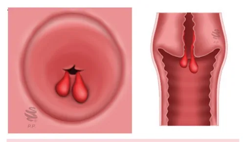
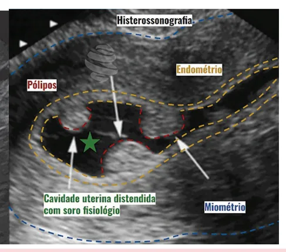
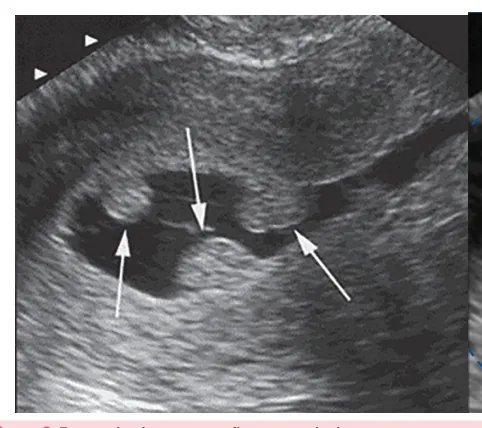
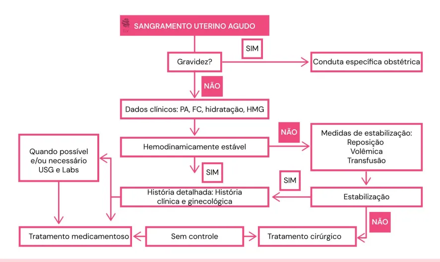

# Sangramento Uterino Anormal Fundamentos

<!-- page:1 -->

## Sangramento Uterino Anormal: Fundamentos

### Sangramento Uterino Anormal (SUA)

- Definição: perda menstrual excessiva.

### Principais Causas (PALM-COEIN)

- **Causas estruturais**: **P** - Pólipo; **A** - Adenomiose; **L** - Leiomioma; **M** - Malignidade.
- **Causas não estruturais**: **C** - Coagulopatia; **O** - Disfunção ovulatória; **E** - Endometrial; **I** - Iatrogênica; **N** - Causas não classificadas.

## Definição

- Perda menstrual excessiva que causa prejuízo da qualidade de vida;
- Alteração em um ou mais dos parâmetros abaixo:
  - **Volume**: pode ser classificado em leve, normal ou intenso. É, de forma geral, bastante subjetivo, sendo necessário identificar se o volume de sangramento é o mesmo desde a menarca, ou se houve mudanças no padrão, se causa anemia. Termos como metrorragia e menorragia estão em desuso;
  - **Duração**: o padrão normal é uma duração de 8 dias ou menos, sendo considerada prolongada quando ultrapassa 8 dias;
  - **Frequência**: pode estar ausente (amenorreia); infrequente, quando o intervalo é maior que 38 dias; normal, quando entre 24 e 38 dias; e frequente quando intervalo menor que 24 dias.
- Denominado crônico quando dura 6 meses ou mais;
- É a causa mais comum de anemia ferropriva em mulheres em idade fértil.

## Etiologia

- Há diversas etiologias, divididas em estruturais e não estruturais;
- As causas podem ser listadas didaticamente com o mnemônico **PALM-COEIN**, com o PALM representando causas estruturais, e o COEIN as causas não estruturais;
- Verificar Figura 2 na próxima página.

## Causas Estruturais (PALM)

- Pólipo;
- Adenomiose;
- Leiomioma;
- Malignidade.

### Pólipos

- **Endocervicais**: podem ser avaliados pelo exame físico, pois se exteriorizam pelo colo do útero. Podem ser retirados em nível ambulatorial;
- **Endometriais**: achados em USG, mais comuns na peri e na pós-menopausa. Normalmente são isoecogênicos ou hiperecogênicos à ultrassonografia. Podem ser vistos muito bem na histeroscopia e histerossonografia (distende cavidade com soro fisiológico para diferenciar melhor a localização do pólipo).

Figura 1: Representação do aspecto de pólipos endocervicais ao exame especular (à esquerda) e num corte coronal (à direita).

### Adenomiose

- Invasão de tecido endometrial no miométrio;
- Os sintomas variam de acordo com a profundidade do miométrio atingida;
- Quadro clínico caracterizado por dor pélvica e fluxo menstrual aumentado;
- **Diagnóstico**: ultrassonografia transvaginal (USG TV) e ressonância magnética (RM) de pelve;
- Achados ao USG TV: há interrupção da zona juncional, espessamento endometrial assimétrico e cistos miometriais.

## Causas Não Estruturais (COEIN)

- Coagulopatia;
- Disfunção ovariana;
- Endometrial;
- Iatrogênica;
- Não classificadas.

---

<!-- page:2 -->

Figura 2: Exame de ultrassonografia transvaginal com setas apontando para pólipos endometriais. Realizado o exame de histerossalpingografia com a injeção de soro fisiológico pelo colo uterino, provocando a distensão da cavidade e permitindo a avaliação detalhada de suas paredes. Neste caso, evidenciou-se pelo menos 3 formações polipoides.

### Leiomiomas

Figura 3: Classificação de Leiomiomas segundo a FIGO.

## Malignidade - Câncer de Endométrio

- Se manifesta como hiperplasias atípicas ou neoplasias;
- Manifestação mais típica é o sangramento pós-menopausa. A causa mais comum é a atrofia endometrial, mas devemos sempre descartar a malignidade;
- Há maior risco em mulheres obesas, hipertensas, diabéticas, nulíparas, com menopausa tardia ou com anovulação crônica;
- Avaliar a espessura endometrial com o USGTV: para mulheres pós-menopausa, atentar que o endométrio é atrófico, com 4-5 mm, então valores maiores que este requerem investigação. Não há valor de referência para mulheres em período fértil;
- Lembrar também de câncer de colo uterino.

## Coagulopatias

- Quando há aumento do volume menstrual desde a menarca, consideramos como causa primária;
- Podem haver coagulopatias secundárias;
- Há outros sintomas associados como epistaxe, gengivorragia, sangramento excessivo em traumas ou cirurgias;
- **Doença de von Willebrand** é a principal causa. Decorre da deficiência da proteína sanguínea fator de von Willebrand, que afeta o funcionamento das plaquetas;
- Outras causas importantes são: hemofilia, disfunções plaquetárias, púrpura trombocitopênica, hepatopatia.

## Ovulação - Disfunção Ovulatória

- Pode acontecer por imaturidade do eixo hipotálamo-hipofisário, sobretudo nos dois primeiros anos de menacme, e também durante a transição menopausal, quando há ciclos anovulatórios;
- Também pode ser causada pela Síndrome dos Ovários Policísticos (SOP) e pela anovulação secundária à obesidade;
- Nesses casos não há segunda fase do ciclo menstrual, o que altera os níveis de progesterona, que é a responsável pela estabilidade endometrial;
- Amenorreia hipotalâmica (estresse, transtornos alimentares).

## Endometriais

- Alterações da hemostasia endometrial local por: deficiência de agentes vasoconstritores, por lise acelerada do trombo endometrial, ou por endometrite (como na doença inflamatória pélvica - DIP);
- Na endometrite há outros comemorativos, como febre, dispareunia, conteúdo vaginal purulento, entre outros.

## Iatrogênicas

- São causas muito comuns de sangramento uterino anormal, dentre elas o uso de: dispositivo intrauterino (DIU); agentes farmacológicos hormonais; anticoagulantes orais; uso de tamoxifeno;
- Os anticoncepcionais orais podem causar o spotting ou sangramentos não programados, principalmente por esquecimento.

---

<!-- page:3 -->

## Não Classificadas

- Malformações arteriovenosas (MAV);
- Hipertrofia miometrial;
- Istmocele: enfraquecimento do miométrio no local da cicatriz da cesárea;
- Alterações mullerianas.

Figura 4: Miomas uterinos vistos após procedimento de miomectomia.

- Tumores benignos das células musculares;
- São classificados pela FIGO de acordo com a localização.

Tabela 1: Classificação dos Leiomiomas de acordo com a FIGO.

> ⚠️ Tabela reconstruída a partir de OCR — confira contra a fonte original.

| Tipo | Descrição |
|---|---|
| 0 | Intracavitário, pediculado |
| 1 | Submucoso, < 50% intramural |
| 2 | Submucoso, ≥ 50% intramural |
| 3 | Intramural, tangenciando o endométrio |
| 4 | Intramural |
| 5 | Subseroso, ≥ 50% intramural |
| 6 | Subseroso, < 50% intramural |
| 7 | Subseroso, pediculado |
| 8 | Outros (ex: cervical, parasita) |

Figura 5: Fluxograma de diagnóstico e tratamento do sangramento uterino anormal.

## Diagnóstico

- O primeiro passo é realizar uma anamnese e exame físico de qualidade, buscando identificar sinais e sintomas que apontem a origem do sangramento;
- Caracterizar a quantidade do sangramento, mudança de perfil, duração e periodicidade. Com isso é importante:
  - Excluir gestação → dosar BHCG;
  - Avaliar sinais de anemia → solicitar hemograma e coagulograma;
  - Avaliar sintomas climatéricos → possível transição menopausal;
  - Pesquisar irregularidade menstrual → pensar em causas de anovulação, e solicitar TSH, prolactina, FSH, E2, entre outros hormônios.
- A segunda etapa, se necessário, é solicitar a ultrassonografia transvaginal, que pode identificar pólipos, miomas, adenomiose, istmocele, espessamento endometrial;
- Se ainda não identificada a causa, faz-se uma histeroscopia, para pacientes com fatores de risco para câncer endometrial, ou pacientes menopausadas. É uma das formas de conseguir amostra para biópsia, mas não a única, podendo-se utilizar biópsia aspirativa ambulatorial, ou curetagem ambulatorial;
- Em casos de suspeita de adenomiose, faz-se a ressonância magnética de pelve. Válida para outras causas também, porém, devido a custo, reservada a casos de USG TV inconclusivo;
- Verificar Figura 5.

---

<!-- page:4 -->

## Tratamento

- Na Doença de von Willebrand, faz-se desmopressina, mas há tendência a bloquear a menstruação;
- Diante de um atendimento a nível de pronto-socorro, deve-se inicialmente:
  - Checar os sinais vitais;
  - Estabilizar hemodinamicamente a paciente;
  - Descartar a possibilidade de gravidez.
- A expansão volêmica, quando necessária, deve ser feita com cristaloide a 20 mL/kg, e deve-se avaliar a necessidade de transfusão sanguínea;
- Pode-se utilizar antifibrinolíticos, como o ácido tranexâmico (1 g, EV), ou ácido aminocapróico, e ainda anti-inflamatórios não esteroidais (AINEs);
- Se suspeita de hiperplasia endometrial ou miomatose uterina, é indicado o uso de anticoncepcional oral combinado ou progestagênio isolado em altas doses;
- Quando houver laceração pós-coito ou tumores de colo, pode-se fazer uso do tampão vaginal até o tratamento definitivo.

## Tratamento Clínico

- **Sem contraindicação a estrogênio**: estrogênio + progestagênio - preferência oral sem pausa;
- **Com contraindicação a estrogênio**:
  - Progestagênio isolado: desogestrel, acetato de medroxiprogesterona; quando disfunções ovulatórias, usa-se progestagênio isolado cíclico por 10 a 14 dias, na segunda fase do ciclo;
  - Dispositivo intrauterino de levonorgestrel (DIU-LNG);
  - Ácido tranexâmico + AINEs no período da menstruação, se não puder fazer uso dos anteriores, ou estiver tentando engravidar.

## Tratamento Cirúrgico

- Indicado quando houver:
  - Infertilidade com distorção de cavidade;
  - Sangramento uterino anormal refratário ao tratamento clínico;
  - Sintomas compressivos;
  - Suspeita de malignidade (por exemplo, sarcoma).
- Principais cirurgias:
  - **Miomectomia**: miomas submucosos (FIGO 0, 1, 2) = miomectomia histeroscópica; miomas intramurais (FIGO 2*, 3-8) = miomectomia laparoscópica ou laparotômica;
  - Polipectomia;
  - Histerectomia.
- Alternativas para miomas muito volumosos: análogos de GnRH; embolização de artérias uterinas.

## Referências

Figura 2: Exame de ultrassonografia transvaginal com setas apontando para pólipos endometriais. BRUNS, Rafael. Como se trata um pólipo endometrial? Fetalmed Ultrassonografia. 27 jul. 2019. Disponível em: https://www.fetalmed.net/como-se-trata-um-polipo-endometrial/.

Figura 4: Miomas uterinos vistos após procedimento de miomectomia. AZEVEDO, Gabriel. Miomas uterinos e a classificação FIGO/MUSA. Educa Cetrus. 2 jun. 2020. Disponível em: https://educa.cetrus.com.br/miomas-uterinos-e-a-classificacao-figo-musa/.
