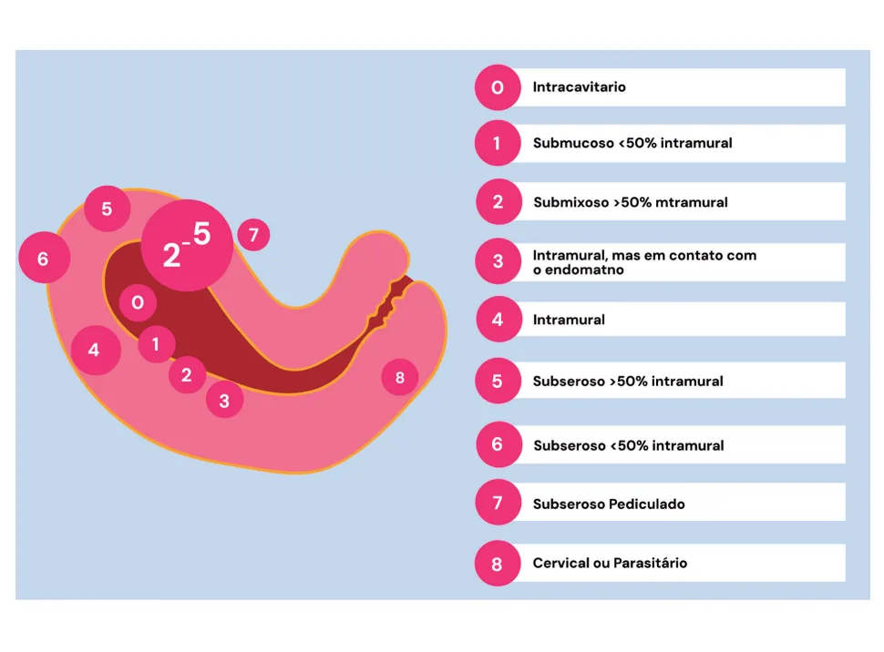
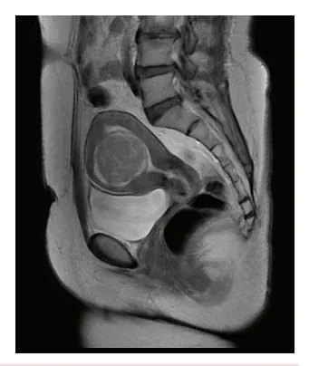
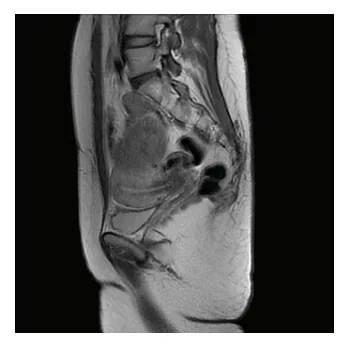
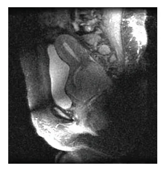
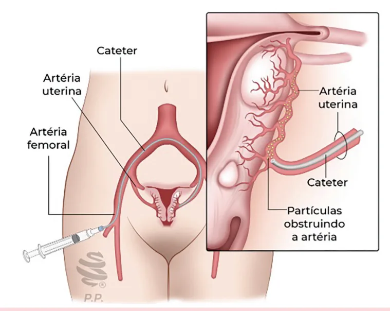

# Sangramento Uterino Anormal - Leiomioma

<!-- page:1 -->

## Sangramento Uterino Anormal - Leiomioma

### Sangramento Uterino Anormal (SUA) - Leiomioma

- **Definição**: leiomiomas são tumores benignos de células musculares;
- **Classificação**: podem ser classificados pela FIGO de 0 a 8 conforme sua localização;
- **Diagnóstico**: anamnese e exame físico; exames de imagem: ultrassonografia transvaginal ou ressonância magnética de pelve;
- **Tratamento clínico**: pílulas hormonais (anticoncepcional combinado oral ou somente progesterona); dispositivo intrauterino de levonorgestrel (DIU-LNG), não pode ser colocado se deformidade da cavidade; ácido tranexâmico + anti-inflamatório não esteroidal (AINE); análogos do GnRH - para períodos curtos ou pré-operatório;
- **Tratamento cirúrgico**: histerectomia se prole constituída ou múltiplos miomas; miomectomia se desejo reprodutivo; embolização das artérias uterinas.

## Definição

- Tumores benignos de células musculares;
- Podem ser classificados pela FIGO de 0 a 8 conforme sua localização;
- São sensíveis à ação do estrogênio e da progesterona.

### Fatores de Risco

- Idade (durante o menacme) a incidência aumenta com o avançar da idade;
- Mais comum em mulheres afro-americanas em comparação com brancas, asiáticas ou hispânicas;
- Mulheres com 50 anos: quase 70% nas mulheres brancas; mais de 80% nas afro-americanas;
- Há associação entre gravidez e taxas mais baixas de leiomiomas: nas que dão à luz precocemente; nas de alta paridade; e nas com gravidez recente há menor formação de leiomioma;
- Há possibilidade de transmissão hereditária na susceptibilidade para mutação.

## Quadro Clínico

- **Sangramento uterino anormal (SUA)**: o sintoma mais comum é o aumento do fluxo menstrual e do período menstrual, especialmente associado a miomas submucosos. Isso pode resultar em anemia devido à perda crônica de sangue. Miomas intramurais também podem causar SUA;
- **Infertilidade**: novamente, principalmente miomas submucosos, podem interferir na fertilidade;
- **Abortos repetidos**: miomas submucosos estão mais associados a abortos recorrentes, devido à distorção da cavidade uterina;
- **Dor pélvica e abdominal**: miomas maiores intramurais/subserosos podem causar sensação de pressão ou peso na pelve, que pode ser constante ou intermitente;
- **Dor aguda abdominal ou pélvica**: miomas grandes, sobretudo quando intramurais/subserosos, podem ocorrer em casos de torção ou degeneração do mioma;
- **Sintomas intestinais e urinários**: miomas grandes subserosos ou transmurais podem pressionar o reto ou a bexiga, causando constipação, sensação de evacuação incompleta, aumento da frequência urinária ou dificuldade para esvaziar a bexiga completamente, a depender da sua localização;
- **Aumento do volume abdominal**: miomas grandes subserosos ou intramurais podem causar aumento visível do abdome, sendo às vezes confundidos com ganho de peso ou gestação;
- **Dor durante as relações sexuais**: miomas cervicais, localizados na parte inferior do útero, podem causar dor durante a penetração profunda.

## Classificação da FIGO

- 0 = intracavitário;
- 1 = submucoso < 50% intramural;
- 2 = submucoso > 50% intramural;
- 3 = intramural, mas em contato com o endométrio;
- 4 = intramural;
- 5 = subseroso > 50% intramural;
- 6 = subseroso < 50% intramural;
- 7 = subseroso pediculado;
- 8 = cervical ou parasitário.

Verificar Figura 1 na próxima página.

---

<!-- page:2 -->

Figura 1: Classificação de acordo com a FIGO conforme a localização dos tumores.

## Diagnóstico

- O primeiro passo é realizar uma anamnese e exame físico de qualidade, buscando identificar sinais e sintomas que apontem a origem do sangramento uterino anormal, caracterizando: quantidade do sangramento; mudança de padrão; duração; periodicidade, etc.;
- A segunda etapa, se necessário, é a ultrassonografia (USG) transvaginal, que pode identificar os miomas;
- Para melhor avaliação dos miomas pode ser complementado com o exame de ressonância magnética (RNM), para melhor planejamento cirúrgico;
- **Histerossonografia**: auxilia na avaliação da profundidade da invasão miometrial. É particularmente útil para o planejamento de cirurgias;
- A histeroscopia também pode auxiliar no diagnóstico.

Figura 2: Miomas FIGO 0, 1 e 2 vistos pela ressonância magnética.

---

<!-- page:3 -->

Figura 3: Miomas FIGO 3, 4 e 5 vistos pela ressonância magnética.

Figura 4: Miomas FIGO 6, 7 e 8 vistos pela ressonância magnética.

## Tratamento

- O alívio dos sintomas (SUA, dor, pressão) é o principal objetivo;
- Devemos levar em consideração: tipo e severidade dos sintomas; tamanho dos miomas; localização; idade da paciente; história obstétrica.

## Tratamento Clínico

### Antifibrinolíticos (Ácido Tranexâmico)

- Usados no SUA para reduzir o sangramento;
- Aprovado pelo FDA no tratamento do SUA;
- No estudo, 35% das mulheres tinham mioma como causa;
- Sem estudos quanto à relação entre SUA e miomas.

### Anti-inflamatórios (AINEs)

- Parece não ter efeito na perda sanguínea.

### Hormonal

- Objetivo de promover atrofia endometrial;
- A preferência é o uso de pílulas, como a de progestagênio isolado (desogestrel ou acetato de medroxiprogesterona);
- Dispositivo intrauterino de levonorgestrel (DIU-LNG): melhora a menorragia, desde que não tenha distorção da cavidade endometrial. Maiores taxas de expulsão;
- Seguimento de perto para avaliar a evolução do tamanho.

### Análogos do GnRH (Leuprolida e Goserrelina)

- Bloqueio no eixo, sendo assim, diminuem a quantidade de estrogênio e progesterona;
- **Efeito flare-up**: aumento transitório de hormônios sexuais nos primeiros dias do tratamento. Pode agravar temporariamente os sintomas relacionados ao excesso de estradiol - dura cerca de 1 semana;
- **Downregulation**: supressão prolongada da função gonadal devido à dessensibilização dos receptores de GnRH. Resulta em hipogonadismo funcional e controle dos sintomas dependentes de hormônios sexuais; se inicia de 7-10 dias.
- **Vantagens**: redução acentuada do volume uterino (40 a 50%) nos primeiros meses; procedimento cirúrgico menos extenso e/ou menos complicado; diminuição da perda sanguínea e alívio da dor; usar na fase pré-operatória (3 a 6 meses).
- **Desvantagens**: sintomas vasomotores; alterações da libido e ressecamento vaginal; perda óssea trabecular. Ex.: acetato de leuprolida 11,25 mg trimestral IM.

---

<!-- page:4 -->

## Tratamento Cirúrgico

- **Miomectomia**: desejo reprodutivo; via laparoscópica ou laparotômica;
- **Histeroscopia cirúrgica**: para pólipos e miomas intracavitários e submucosos (FIGO 0-1, 2*, a depender do tamanho);
- **Histerectomia**: quando prole constituída. Tratamento cirúrgico definitivo e o mais realizado, com altas taxas de satisfação. Via vaginal, abdominal ou laparoscópica;
- **Quando tratar cirurgicamente?** Infertilidade com distorção de cavidade; SUA refratário ao tratamento clínico; sintomas compressivos; suspeita de malignidade (sarcoma).

### Miomas Intramurais

- A decisão de realizar cirurgia para miomas intramurais depende de vários fatores, como: tamanho do mioma; presença de sintomas; impacto na fertilidade;
- Não há um tamanho específico universalmente aceito que determine a necessidade de cirurgia, mas a literatura médica fornece algumas orientações;
- Estudos indicam que miomas intramurais maiores que 4 cm podem impactar negativamente as taxas de gravidez em pacientes submetidas a fertilização in vitro (FIV), sugerindo que a remoção pode ser considerada em casos de infertilidade;
- Além disso, miomas muito grandes, como aqueles com diâmetro igual ou superior a 9 cm, são frequentemente tratados cirurgicamente devido a sintomas significativos ou complicações potenciais.

### Embolização das Artérias Uterinas

- Opção minimamente invasiva para o manejo dos sintomas;
- **Benefícios**: internação hospitalar mais breve; menor dor; retorno às atividades cotidianas precocemente;
- **Desvantagens**: mais complicações não programadas e readmissões hospitalares; maior recorrência dos miomas com necessidade de outra terapia; eliminação do tecido é comum; amenorreia transitória; não indicado para mulheres com desejo reprodutivo;
- Verificar Figura 5.

Figura 5: Embolização de artérias uterinas.

## Referências

Figura 2: Miomas FIGO 0, 1 e 2 vistos pela ressonância magnética. Adaptado de AMMAR HAOUIMI. Submucosal uterine leiomyoma. Radiopaedia.org, 14 fev. 2021.

Figura 3: Miomas FIGO 3, 4 e 5 vistos pela ressonância magnética. Adaptado de MOSTAFA EL-FEKY; SALAM, H. Uterine leiomyomas. Radiopaedia.org, 6 dez. 2010.

Figura 4: Miomas FIGO 6, 7 e 8 vistos pela ressonância magnética. Adaptado de MOSTAFA EL-FEKY; SALAM, H. Uterine leiomyomas. Radiopaedia.org, 6 dez. 2010.

