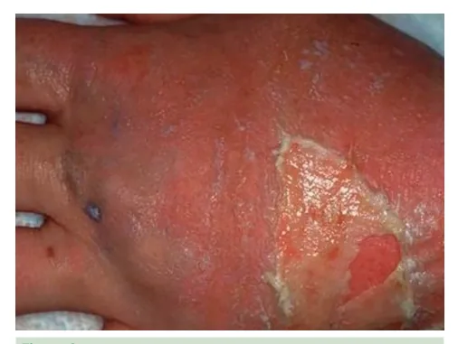
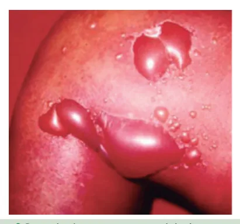
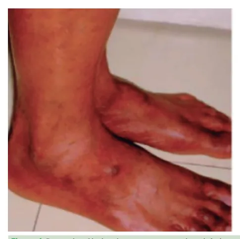
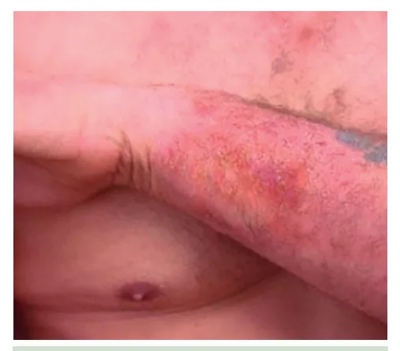
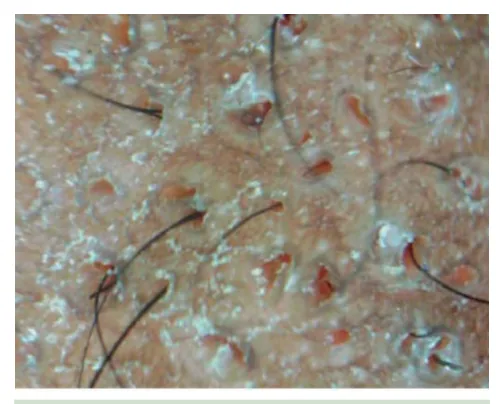
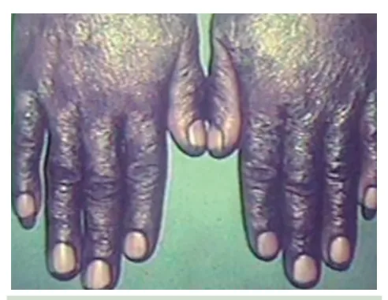
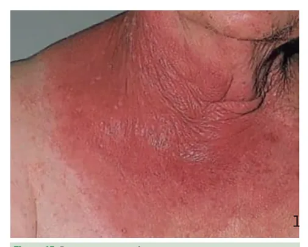
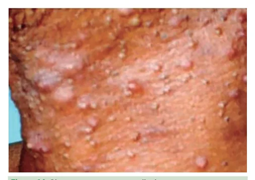
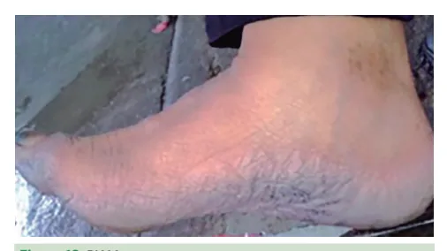

# Saúde do Trabalhador Dermatoses

<!-- page:1 -->

## SAÚDE DO TRABALHADOR

## DERMATOSES

Outros agravos relacionados ao trabalho;

- Dermatite Alérgica de Contato: Reação condicionadas ou agravadas direta ou indiretamente Linfócitos T contra a substância que passa a ser pelas atividades de trabalho. um antígeno. Desenvolve-se em 3 fases: indução,

Doenças da pele, mucosas e anexos causadas, imunológica do tipo IV, com formação de

- Causas Diretas: exposição a agentes presentes no elicitação e resolução.

ambiente de trabalho.

- Erupções Acneiformes: Causadas por contato com

- Químicos: ácidos, bases (álcalis), detergentes, agentes químicos, principalmente óleos e graxas, ou solventes, cimento. decorrentes de intoxicação por dioxina (Cloracne).

- Físicos: calor, frio, radiação, umidade.

- Elaioconiose: Acomete trabalhadores expostos a

- Biológicos: vírus, fungos, bactérias. óleos minerais. Observa-se a obstrução dos óstios

- Mecânicos: atrito, pressão, microtraumas. foliculares por substâncias oleosas e partículas

- Causas Indiretas (Fatores Predisponentes): metálicas, com produção secundária de acne,

- Dermatoses preexistentes: psoríase, comedões e infecção do folículo.

dermatite atópica.

- Cloracne: Dermatose acneiforme decorrente

- Idade: jovens mais suscetíveis por inexperiência e da exposição ambiental com hidrocarbonetos ausência de hardening. aromáticos halogenados, como a dioxina.

- Sexo: mulheres com maior acometimento das Diagnóstico e prevenção mãos, porém quadros menos graves.

- Diagnóstico: Anamnese detalhada, exame clínico

- Etnia: pele negra/amarela com maior proteção e testes específicos (ex: teste epicutâneo para contra UV e menor penetração de químicos, mas dermatite alérgica de contato).

maior risco de queloides.

- Prevenção:

- Clima: calor, umidade, exposição solar, contato com | Equipamento de Proteção Individual (EPIs):

insetos/vegetais. luvas, máscaras, roupas adequadas, etc.

- Condições de trabalho: má ventilação, ausência de | Medidas de controle no Ambiente de Trabalho:

sanitários/chuveiros, uso inadequado ou ausência ventilação adequada, controle de substâncias de EPIs, pressão por produtividade, falta de pausas químicas, higiene do local de trabalho.

e alta frequência de exposição. | Educação dos trabalhadores: treinamento Tipos de Dermatoses Ocupacionais sobre os riscos ocupacionais, uso correto dos

- Dermatite de Contato: Reação inflamatória cutânea EPIs e hábitos de higiene.

causada pelo contato com agentes externos. | Afastamento do agente causador é essencial

- Dermatite de Contato por Irritação: Principal forma para o tratamento de qualquer de dermatite de contato, representando cerca dermatite ocupacional.

de 80% dos casos. É mais comum com a lavagem excessiva das mãos e contato repetitivo da pele com água, alimentos e outros irritantes.

## DERMATOSES OCUPACIONAIS

Causas Indiretas (Fatores Predisponentes)

- Dermatoses preexistentes (psoríase,

- São doenças da pele, mucosas e anexos causadas, dermatite atópica).

condicionadas ou agravadas direta ou indiretamente

- Idade: jovens têm maior risco por inexperiência e pelas atividades de trabalho. ausência de adaptação da pele (hardening).

- Sexo: mulheres apresentam maior acometimento das

CAUSAS mãos, porém quadros menos graves e recuperação Causas Diretas mais rápida. Exposição a agentes presentes no ambiente de trabalho,

- Etnia: indivíduos de pele negra ou amarela têm maior que atuam diretamente sobre o tegumento: proteção contra radiação UV e menor penetração de

- Químicos: ácidos, bases (álcalis), detergentes, químicos, porém maior tendência a queloides.

solventes, cimento.

- Clima: calor, umidade, exposição solar e contato com

- Físicos: calor, frio, radiação, umidade. agentes naturais (vegetais, insetos).

- Biológicos: vírus, fungos, bactérias.

- Condições de trabalho: má ventilação, ausência de

- Mecânicos: atrito, pressão, microtraumas. sanitários e chuveiros, uso inadequado ou ausência de EPIs.

---

<!-- page:2 -->

## TIPOS DE DERMATOSES OCUPACIONAIS

- Classificação:

Dermatite de Contato | Irritantes primários absolutos: ácidos e álcali

- Reação inflamatória cutânea causada por contato com (básico) – causa eritema, edema, descamação, agentes externos no ambiente de trabalho vesículas, bolhas, exsudação; Irritantes primários relativos: água, detergentes,

Figura 1: Dermatite de contato em mãos Dermatite de Contato por Irritação (DCI)

- Representa 80% das dermatites ocupacionais.

- Relacionada ao contato frequente com água, alimentos, sabões, detergentes e solventes.

- Mecanismo: destruição da barreira epidérmica, liberação de citocinas (IL-1, TNF- ) e inflamação local.

- Quadro clínico: ressecamento, fissuras, α eritema, vesículas, bolhas; formas crônicas com eczema e liquenificação.

Tratamento: afastamento do agente, hidratação, corticosteroides tópicos (em casos agudos). D Figura 2: Dermatite de contato por agente irritativo

- Variáveis:

- Variáveis endógenas: considerar gênero, idade, área corporal, predisposição genética, atopia prévia. Variáveis exógenas: considerar lipossolubilidade da solução, estado de ionização, tipo de substância, volume, concentração, duração, frequência de exposição, condições ambientais.

- Mecanismos fisiopatológicos: perda de barreira epidérmica, com liberação de citocinas e ativação do sistema imune inato. Quebra de barreira → liberação de interleucina dano tecidual. | Irritantes primários relativos: água, detergentes, surfactantes, solventes, alimentos, fluidos corporais, metais, fibras de vidro, fibras de papel. Quadro crônico da dermatite → associado a eczema, liquenificação, hiperqueratose e fissuras.

1-alfa pelos queratinócitos → cascata inflamatória → IL-1 + TNF-alfa → colagenase + prostaglandina →

- Conduta: afastar do agente causador e suporte para a dermatite.

Figura 3: Dermatite de contato por agente irritativo Dermatite Alérgica de Contato (DAC)

- Mecanismo: hipersensibilidade tipo IV, mediada por linfócitos T contra substância contactante (passa a ser um antígeno).

- Fases: Fase de Indução: contato com o alérgeno induz resposta inflamatória → ativação das células apresentadoras de antígenos e complexo haptenoproteína (antígenos). Fase de elicitação: contato repetitivo com a substância → migração de células de Langerhans previamente sensibilizadas → promove nova reação Fase de resolução: células secretam IL-10 → inibição da inflamação → limita a extensão e duração da dermatite alérgica de contato → leva à tolerância.

→ liberação de citocinas e fatores quimiotáticos (prurido e eczema);

- Quadro clínico: Agudo: eritema, edema, vesículas, prurido intenso. Fase subaguda: exsudação Crônico: descamação, crostas, liquenificação.

- Diagnóstico: Anamnese detalhada, exame clínico e testes de contato (epicutâneos) → reproduzem a fase de elicitação;.

- Tratamento: Afastamento do agente responsável;

Restabelecimento da barreira cutânea (hidratantes); Tratamento das lesões ativas (corticosteroides

- tópicos e sistêmicos, imunomoduladores

- pimecrolimo e tacrolimo), fototerapia, ciclosporina, metotrexato.

- Verificar Figura 4 na próxima página

---

<!-- page:3 -->

Figura 7: Dermatite alérgica de contato em pés Figura 4: Dermatite alérgica de contato em membros inferiores

- Cimento: pode causar tanto dermatite de contato por irritação quanto dermatite de contato alérgica.

Figura 5: Dermatite alérgica de contato por cimento

- Dermatite de contato irritativa: ação alcalina Figura 8: Dermatite de contato em pés do cimento → efeito abrasivo → remoção da camada lipídica;

- Resina-Epóxi: dermatite alérgica de contato (resina

- Dermatite de contato alérgica: provocada pelos éter diglicidílico de bisfenol, endurecedores e diluentes contaminantes do cimento (principalmente cromo – revestimentos de tubos e fabricação de tintas):

hexavalente, cobalto e níquel). Figura 6: Dermatite de contato em mãos

- Borracha: dermatite alérgica de contato

(MercaptoMix, carbamato, parafenilenodiamina, Figura 9: Dermatite alérgica de contato por resina epóxi Carba-Mix, Látex, PPD Mix):

---

<!-- page:4 -->

## ERUPÇÕES ACNEIFORMES

- Apresentação clínica: Pontos pretos comedoniformes nos óstios hidrocarbonetos halogenados (ex: dioxinas – cloracne). associadas a prurido e dor.

Causas: óleos minerais, graxas, exposição a foliculares, pápulas e pústulas que podem estar

- Tipos:

- Diminuição da incidência:

- Tipos: Elaioconiose: obstrução dos óstios foliculares por óleos e partículas metálicas. Lesões: comedões, pápulas, pústulas. Tratamento: afastamento, ceratolíticos, antibióticos (tetraciclina), retinóides tópicos/sistêmicos. Cloracne: relacionada a dioxinas e herbicidas. Pode causar cistos e comedões profundos. Manifestações sistêmicas: alteração hepática, dislipidemia, imunossupressão. Tratamento: cessar exposição, retinóides, dermoabrasão.

Figura 10: Elaiconiose - erupções acneiformes em mãos Figura 11: Folículos desobstruídos após tratamento da obliteração dos óstios Elaiconiose

- Conceito: um tipo de erupção acneiforme que foi descrita inicialmente em trabalhadoras responsáveis pela limpeza e lubrificação das bobinas dos teares nas manufaturas de tecidos.

- Etiopatogenia: Obliteração dos óstios foliculares por substâncias oleosas e partículas metálicas nelas contidas, com produção secundária de acne, comedões e infecção subsequente do folículo. - Diminuição da incidência: Automatização das indústrias, a melhoria da qualidade dos óleos solúveis utilizados, e a adoção de hábitos de higiene, o uso de equipamentos de proteção individual e a limpeza do local de trabalho e dos uniformes.

- Classificação clínica e fisiopatológica: com 3 fases. Fase Obliterante: obstrução do óstio folicular pelo óleo e partículas metálicas, causando leve inflamação local → pontos enegrecidos semelhantes a comedos. Fase papulosa peripapilar: notam-se comedos, pápulas e hiperqueratose folicular. Fase infecciosa: papudo-pústulas → antebraços, dorso das mãos, braços.

Figura 12: Erupção acneiforme – Elaioconiose Figura 13: Elaiconiose - erupções acneiformes em mãos

- Tratamento: Afastamento das atividades de trabalho; Ceratolíticos; Desobstrução mecânica (bucha vegetal); Antibióticos sistêmicos – Tetraciclina; Retinóides tópicos e sistêmicos; Medidas de prevenção: cremes de silicone, lavagem frequente das mãos e roupas, uso de EPIs.

---

<!-- page:5 -->

Cloracne

- Outro tipo de erupção acneiforme.

- Conceitos: Dermatose acneiforme decorrente da exposição ambiental com hidrocarbonetos aromáticos halogenados; Utilizados na fabricação de herbicidas, contato com herbicidas, indústria do papel, incineração de lixo, metalúrgicas, siderúrgicas.

Figura 15: Dermatose por calor Figura 14: Cloracne – contato com dioxina

- Possíveis Dioxinas (PPDD) que causam cloracne:

polychlonated dibenzeno-p-dioxins, tcdd:2,3,7,7tetrachlorodibenzeno-p-dioxin → agente laranja, Guerra do Vietnã);

| Manifestação cutâneo: Múltiplos comedos e cistos fechados, de coloração clara/acomete face, regiões Figura 16: Eritema Ab Igne retroauriculares e poupa o nariz/pele seca e face hiperpigmentada/pode haver hipertricose de

- FRIO (ex. trabalhadores de frigoríficos, regiões temporais; produção de gelo, produção de gás liquefeito, Manifestações sistêmicas: alterações da função mergulhadores, pescadores);

hepática, hipertrigliceridemia, hipercolesterolemia, | Mecanismo relacionado à baixa umidade, que leva fraqueza generalizada, perda de peso, depressão à desidratação da camada córnea e perda de do sistema imune, aumento do risco para doenças barreira cutânea.

cardiovasculares e diabetes.

- PÉS DE IMERSÃO EM ÁGUA MORNA (PIAM):

- A dioxina presente no Agente Laranja, herbicida

- Trabalhadores em locais de lavagens de automóveis.

utilizado na Guerra do Vietnã, é um exemplo clássico

- Alta umidade: também há perda de barreira cutânea.

de contaminante relacionado à cloracne e a efeitos

- RADIAÇÕES ULTRAVIOLETAS E RADIAÇÕES IONIZANTES sistêmicos graves: (ex. agricultores, motoristas, pescadores, construção

- Tratamento: civil, soldadores, aviação civil). Cessar exposição;

- Efeito da dermatose e efeito carcinogênico na pele, Desobstrução dos óstios; devido à mutação do gene p53 (gene supressor de Retinóides; tumor) por efeito da radiação. Uso de anti-inflamatórios; Infecções Virais Peeling e dermoabrasão.

- Podem ocorrer em atividades em contato com animais

Dermatoses por Agentes Físicos como ovelhas (parapoxvirus – causa lesão do tipo

- CALOR: Causa queimadura térmica quando acima verruga), gado bovino (parapoxvirus – nódulo do de 44 graus, seja por contato direto, radiação ordenhador), manipulação de carne bovina, de aves infravermelha ou contato acidental com lasers. e peixes (verruga do açougueiro) → relação com a

- Eritema Ab Igne: dermatose decorrente da exposição umidade frequente + pequenos traumas = porta de crônica ao calor; Presença de eritema reticulado + entrada para os agentes.

hiperemia com melanodermia + hiperpigmentação + Infecções Bacterianas atrofia local;

- Portas de entrada para estafilococos e estreptococos Acomete muito as coxas, como pessoas que → lesões após pequenos traumas; foliculites por apoiam o notebook nas coxas. estafilococos, uso contínuo de máscaras.

---

<!-- page:6 -->

Figura 5: Dermatite alérgica de contato por cimento https://ehsseguranca.com.br/dermatose-ocupacional/.

Figura 6: Dermatite de contato em mãos https://ehsseguranca.com.br/der matose-ocupacional. Figura 7:

h d h e Figura 17: Dermatose por infecção bacteriana. h Infecções Fúngicas

- Relação com umidade + oclusão de determinadas h partes do tegumento → dermatofitoses, cândida, M esporotricose, micetomas, histoplasmose, paracoccidioidomicose, cromoblastomicose (pessoas expostas a cavernas). h g h h p h h a

Figura 18: PIAM h

## REFERÊNCIAS

h b Figura 1: Dermatite de contato em mãos https://nationaleczema.org/eczema/types-of-eczema/hand-eczema/.

Figura 2: Dermatite de contato por agente irritativo h a https://sintesis.med.uchile.cl/index.php/respeci w Figura 3: Dermatite de contato por agente irritativo e https://sintesis.med.uchile.cl/index.php/respeci alidades/rdermatologia/103- revision/rdermatologia/2386-capitulo-10.

Figura 4: Dermatite alérgica de contato em membros inferiores https://www.scielo.br/j/abd/a/ gN77wDQPZd7PQksFX4LBsYK/?lang=pt#ModalFigf8. Figura 7: Dermatite alérgica de contato em pés https://prontopele.com.br/2021/06/14/o-que-predispoe-aoeczemadecontato.

Figura 8: Dermatite de contato em pés https://www.msdmanuals.com/pt-br/casa/distúrbios-dapele/coceiraedermatite/eritrodermia.

Figura 9: Dermatite alérgica de contato por resina epóxi https://doctorhoogstra.com/pt/wiki/alergia-a-resina-epoxi2/.

Figura 10: Elaiconiose - erupções acneiformes em mãos https://www.scielo.br/j/abd/a/ MDPC7b5PVTjdkRQZhpRSXCg/?lang=pt&format=pdf Figura 11: Folículos desobstruídos após tratamento da obliteração dos óstios https://www.scielo.br/j/abd/a/MDPC7b5PVTjdkRQZhpRSXC g/?lang=pt&format=pdf.

Figura 12: Erupção acneiforme – Elaioconiose http://old.scielo.br/pdf/abd/v85n2/03.pdf. Figura 13: Elaiconiose - erupções acneiformes em mãos https://www.scielo. br/j/abd/a/MDPC7b5PVTjdkRQZ hpRSXCg/?lang= pt&format=pdf.

Figura 14: Cloracne – contato com dioxina https://www.scielo.br/j/abd/a/gN77wDQPZd7PQksFX4LBsYK/?lang= pt#.

Figura 15: Dermatose por calor https://agora.resposta.net/wp-content/uploads/2020/04/323155 Figura 16: Eritema Ab Igne https://www.scielo.br/j/abd/a/VDbfgPSjddtSw 4s7sjkhBCN/ abstract/?lang=en.

Figura 17: Dermatose por infecção bacteriana. https://thumbs.dreamstime.com/z/man-seborrheic-dermatitisbeardarea-detail-s-chin-155791411.jpg Figura 18: PIAM https://www.rbmt.org.br/details/251/pt-BR/pes-de-imersao-emaguamorna-entre-trabalhadoresde-lavagem-de-automoveis; https:// www.rbmt.org.br/details/251/pt-BR/pes-deimersao-em-agua-mornaentretrabalhadores-delavagem-de-automoveis.

