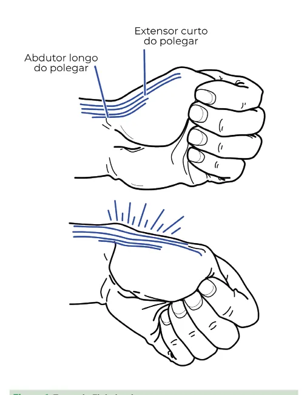
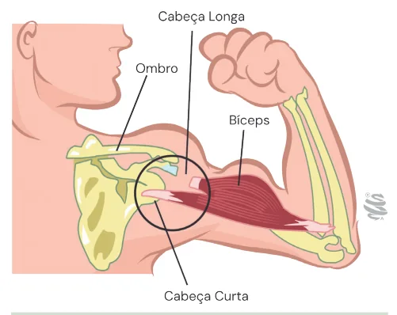
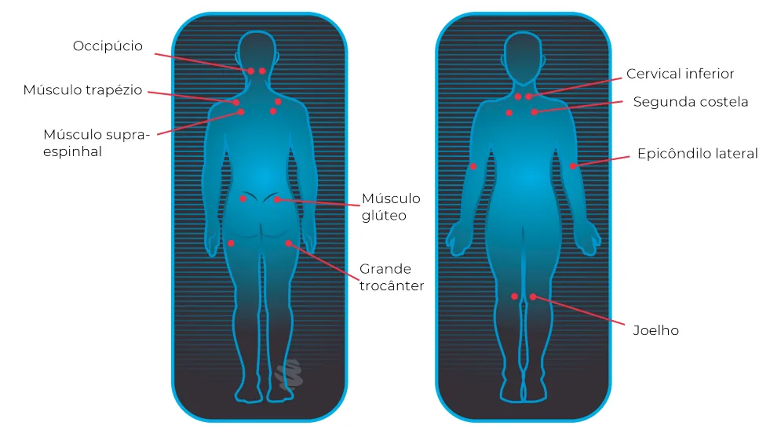

# Saúde do Trabalhador Lesões Musculoesqueléticas

<!-- page:1 -->

## SAÚDE DO TRABALHADOR: LESÕES

## MUSCULOESQUELÉTICAS

Outros agravos relacionados ao trabalho Distúrbios Musculoesqueléticos Relacionados ao | Coleta de informações sobre o posto Trabalho (LER/DORT) de trabalho (mobiliário, equipamentos,

- Definição: Lesões Musculoesqueléticas condições ambientais e organização do tendões, nervos e articulações, causadas ou que podem estar contribuindo para a lesão.

Relacionadas ao Trabalho (LER) ou Distúrbios trabalho) para identificar os fatores de risco. Osteomusculares Relacionados ao Trabalho | Observação da atividade do trabalhador (DORT) são afecções que acometem músculos, para identificar os movimentos e posturas agravadas pelas atividades de trabalho. | Considerar os sintomas: dor insidiosa,

- Histórico: Modernização e informatização variável de acordo com a região afetada, do trabalho, levando a novas exigências e podendo estar associada à depressão, ritmos acelerados. ansiedade, insegurança e hostilidade.

- Fatores de Risco:

- Exemplos: Biomecânicos: Mobiliário | Tenossinovites e Tendinites: As formas inadequado, posturas viciosas, força mais incidentes na população trabalhadora, excessiva e repetitividade. principalmente em situações de alta Organizacionais: Ritmo acelerado de repetitividade associada à força.

trabalho, cobrança de produtividade, falta | Doença de De Quervain: Inflamação da de autonomia, intensificação do ritmo bainha comum dos tendões do abdutor de trabalho e terceirização de tarefas de longo e extensor curto do polegar.

maior risco. | Dedo em gatilho: Inflamação dos tendões | Psicossociais: Pressão, estresse, falta de flexores dos dedos, dificultando o reconhecimento e competição exacerbada deslizamento dos mesmos em suas bainhas.

entre empresas. | Epicondilite Lateral (Cotovelo de Tenista): | Ambientais: Frio, vibrações e pressões. Inflamação da inserção dos músculos

- Fisiopatologia: a repetição de movimentos, extensores do punho.

posturas inadequadas e sobrecarga | Síndrome do Túnel do Carpo: Compressão muscular levam a: do nervo mediano ao nível do punho.

| Contratura muscular prolongada, | Tendinite do Supraespinhoso/Manguito sobrecarga, hiperplasia e hipertrofia das Rotador: Compressão das fibras do fibras musculares, com consequente supraespinhoso pelo acrômio.

dor e fadiga.

- Prevenção: Diminuição da irrigação sanguínea | Ergonomia no ambiente de trabalho:

nos músculos, causando dor crônica Adaptação de mobiliário e ferramentas e aparecimento de fibras musculares para minimizar posturas inadequadas, força avermelhadas (fibras em forma de excessiva e repetitividade.

roda denteada). | Pausas regulares: Interromper as atividades | Aumento da sensibilidade dos receptores de para realizar alongamentos e exercícios que dor nos músculos. promovam a circulação sanguínea.

| Desequilíbrio no recrutamento das fibras | Educação dos trabalhadores: Orientação musculares, gerando contrações excêntricas, sobre a importância da postura correta, dos ruptura de sarcômeros, inflamação, movimentos adequados e da identificação degeneração celular e calcificação. precoce de sintomas.

| Liberação excessiva de cálcio no interior das | Ginástica laboral: Programas de exercícios células musculares, afetando a função das específicos para fortalecer os músculos e mitocôndrias, aumentando a permeabilidade melhorar a flexibilidade, prevenindo lesões.

das membranas e tornando a célula mais | Acompanhamento médico regular: suscetível à ação de metabólitos tóxicos e Consultas periódicas para identificar radicais livres. precocemente qualquer sinal de LER/DORT

- Diagnóstico: avaliação clínica, ocupacional e e iniciar o tratamento o mais rápido possível. Exames de imagem para complementar o diagnóstico.

exame físico detalhado.

---

<!-- page:2 -->

## LER/DORT

Fisiopatologia Essencial

- Movimentos repetitivos e sobrecarga → microlesões

LER/Dort são lesões do sistema musculoesquelético → inflamação → dor crônica → possível degeneração (músculos, tendões, nervos e articulações) causadas ou tendínea e muscular.

agravadas por atividades laborais repetitivas, posturas

- Repetição de movimentos, força e posturas inadequadas ou sobrecarga. inadequadas causam sobrecarga muscular,

Histórico: Descritas desde Ramazzini (séc. XVII). A contraturas, fadiga, isquemia e inflamação. Revolução Industrial e a informatização intensificaram

- Hiperatividade e desequilíbrio das fibras musculares os casos, com maior impacto a partir do século XX, → ruptura de sarcômeros, degeneração celular, principalmente em atividades repetitivas e mecanizadas. fibrose e calcificações.

Principais Sintomas: Dor insidiosa, parestesia,

- Liberação excessiva de cálcio no sarcoplasma → formigamento, fadiga, sensação de peso, edema, perda disfunção mitocondrial, aumento da permeabilidade de força ou dificuldade para realizar movimentos finos. da membrana e maior susceptibilidade a radicais livres e metabólitos tóxicos.

## FATORES DE RISCO E ETIOPATOGENIA

- A sensibilização dos nociceptores

- Principais fatores de risco: musculares perpetua quadros de dor crônica e Grau de adequação do posto de trabalho (altura, disfunções funcionais. Frio, vibrações e pressões localizadas.

alcance, ergonomia, iluminação). Prevenção

- Adaptação ergonômica do posto de trabalho. Posturas inadequadas (manutenção de posições

- Pausas e alternância de tarefas.

extremas ou desconfortáveis).

- Ginástica laboral e educação em saúde (postura e Carga musculoesquelética: tensão, peso e impacto técnica correta).

sobre articulações.

- Intervenções organizacionais (redução da Carga estática: manutenção prolongada da repetitividade e pressão). Invariabilidade da tarefa: monotonia e sobrecarga

contração muscular contra a gravidade. Impacto Ocupacional

- Podem levar à incapacidade laboral temporária ou em segmentos específicos. permanente, afastamento e perda de função. Exigências cognitivas: aumento da tensão Notificação muscular devido ao estresse.

- LER/Dort são agravos de notificação compulsória e Fatores organizacionais e psicossociais: ritmo devem ser registrados no SINAN.

de trabalho intenso, baixa autonomia, pressão por

- Notificação Semanal metas, ambiente hostil.

- Para segurados do INSS, exige emissão de CAT. Repetitividade: alta frequência de execução dos Papel do SUS: Atenção multiprofissional (UBS, NASF/ mesmos movimentos. eMulti, fisioterapia, terapia ocupacional, psicologia).

Casos graves são encaminhados a Cerest. CONCEITOS ESSENCIAIS Tratamento:

- Alta repetitividade:

- Controle da dor (analgésicos e anti-inflamatórios, com Atividades com ciclo de trabalho igual ou inferior a uso criterioso).

30 segundos.

- Fisioterapia (cinesioterapia, eletrotermoterapia). Atividades que exigem repetição de padrões de

- Psicoterapia (suporte para estresse e ansiedade).

movimento por mais de 50% do tempo do ciclo

- Terapia ocupacional (órteses e reabilitação funcional).

de trabalho.

- Atividade manual com emprego de força: AFECÇÕES TENDÍNEAS, TENOSSINOVIAIS E Ocorre quando objetos com mais de 4,5 kg são SINOVIAIS (LER/DORT) manuseados ocasionalmente (menos de 1/3 do Tenossinovites e Tendinites tempo de trabalho) com uma só mão, em tarefas

- Incidência: São as formas mais comuns na como levantar, carregar, empurrar ou puxar. população trabalhadora. Se o esforço é frequente (em mais de 1/3 do ciclo

- Fatores de risco: Movimentos repetitivos de trabalho), 2,7 kg ou mais já são considerados associados à força.

esforço elevado.

- Clínica: Dor insidiosa, localizada nos tendões

Exemplos de Lesões: acometidos, podendo evoluir para limitação funcional.

- Tenossinovites, tendinites, Doença de De Quervain, Doença de De Quervain

Dedo em Gatilho, Epicondilites, Síndrome do Túnel do

- Inflamação da bainha comum dos tendões do abdutor

Carpo, tendinopatias do ombro (manguito rotador). longo e extensor curto do polegar. Diagnóstico

- Sinais e sintomas:

- Clínico (história ocupacional + exame físico). | Dor na região dorsal do polegar, podendo irradiar

- Exames complementares (USG, RM) apenas para antebraço, cotovelo ou ombro.

quando necessários. | Dificuldade para segurar objetos por longo tempo

- Observação do posto e da atividade de (histórico clássico em lavadeiras).

trabalho é fundamental.

---

<!-- page:3 -->

- Diagnóstico clínico:

- Clínica: Teste de Finkelstein: Desvio ulnar do punho com | Dor no epicôndilo lateral, com irradiação para flexão do polegar provoca dor sobre o processo ombros e mãos.

estilóide do rádio (face radial). | Frequente em atividades como apertar parafusos repetidamente. Figura 1: Teste de Finkelstein.

Dedo em Gatilho

- Inflamação dos tendões flexores dos dedos, com formação de nódulos ou espessamentos que dificultam o deslizamento na bainha tendínea.

- Clínica: Incapacidade de estender o dedo após flexão máxima. Ao tentar estender, ocorre sensação de “salto” como se o dedo estivesse preso. Associado a atividades manuais com força e compressão palmar (uso de alicates, tesouras).

Tenossinovite dos Extensores dos Dedos e do Carpo

- Causa: Sobrecarga muscular estática e movimentos repetitivos dos dedos.

- Clínica: Dor insidiosa na face dorsal do antebraço e punho. Pode haver redução de força, sensação de peso, desconforto e alteração da caligrafia. Frequente em digitadores e operadores de mouse.

Tenossinovite dos Flexores dos Dedos

- Causa: Movimentos repetitivos de flexão dos dedos e mãos.

- Clínica: Semelhante à dos extensores, mas acomete a face interna do antebraço e punho.

Epicondilite Lateral (Cotovelo de Tenista)

- Inflamação da inserção dos músculos extensores e supinadores do punho, podendo envolver o nervo radial. parafusos repetidamente.

- Testes diagnósticos: Teste de Cozen: o examinador provoca a extensão do punho contra a resistência com o cotovelo mantido em 90 graus, tendo a mão em pronação; Teste de Mill: o examinador palpa região do epicôndilo lateral e faz a pronação passiva do antebraço, flexão do punho e extensão do cotovelo;

Interpretação: Teste positivo se dor referida no epicôndilo lateral do cotovelo. Interpretação: Teste positivo se dor referida no epicôndilo lateral do cotovelo.

Epicondilite Medial

- Inflamação da inserção dos músculos flexores do punho na borda medial do cotovelo.

- Clínica: Dor medial, associada à flexão repetitiva do punho. Pode envolver o nervo ulnar (menos comum). Profissões de risco: descascadores de fios elétricos.

Tendinite Bicipital

- Inflamação da bainha sinovial do tendão da porção longa do bíceps, que aparece à palpação do tendão no sulco bicipital durante manobras de pronação e supinação do antebraço;

- Surge em atividades em que o braço é mantido em elevação por longos períodos;

- Sinal do “Popeye”: Manifestado pela presença de saliência devido à retração do ventre do bíceps.

Figura 2: Sinal de Popeye. TENDINITE DO SUPRAESPINHOSO E MANGUITO ROTADOR

- Mecanismo: Compressão das fibras do supraespinhoso pelo acrômio durante a abdução do braço acima de 45 graus, levando a inflamação e degeneração dos tendões do manguito rotador (supraespinhoso, infraespinhoso, subescapular e bíceps).

---

<!-- page:4 -->

- Síndrome do Impacto/Síndrome de Colisão: Refere- 2. Teste de Phalen: Flexão forçada dos punhos a 90° se ao atrito mecânico crônico entre o acrômio e as por 60 segundos, induzindo sintomas.

estruturas do manguito, comum em trabalhadores 3. Phalen invertido: Extensão forçada dos punhos, que realizam movimentos repetitivos com os também provocando dor ou parestesia.

braços elevados. 4. Teste de Durkan: Compressão direta do nervo Manifestações clínicas: mediano no túnel do carpo.

- Dor localizada no ombro, frequentemente descrita Síndrome do Canal de Guyon como profunda, podendo irradiar para todo o

- Compressão do nervo ulnar ao passar pelo canal membro superior. de Guyon (próximo ao osso pisiforme), mais rara

- Sensação de peso no braço, limitação funcional e dor que a STC.

ao elevar o braço.

- Quadro clínico:

- Ombro congelado (capsulite adesiva): Pode ocorrer | Alteração da sensibilidade no 4º e 5º dedos secundariamente à tendinite, levando à impotência (anular e mínimo).

funcional e rigidez progressiva. | Redução da força de preensão e pinça fina. Testes ortopédicos:

- Fatores de risco: Atividades com pressão direta

1. Teste de Neer: O examinador eleva passivamente sobre a base da palma ou movimentos repetitivos que

o membro do paciente com uma mão e com a envolvem flexão/pressão sobre o nervo ulnar. outra mão fixa a escápula; Interpretação: Positivo Síndrome do Pronador Redondo se houver dor pela compressão dos tendões

- Compressão do nervo mediano abaixo da prega do manguito. do cotovelo, entre os dois ramos do músculo

2. Teste de Jobe (ou “Empty Can Test”): Abdução pronador redondo.

interna dos ombros em 90 graus e o examinador

- Manifestações clínicas:

direcionando o polegar para baixo, contra | Alterações de sensibilidade nos dedos inervados a resistência; Interpretação: dor na região pelo nervo mediano (1º ao 3º dedos) e região tenar.

do manguito. | Diminuição da força de preensão e pinça. Cistos Sinoviais (Gânglios)

- Fatores de risco: Atividades com prono-supinação

- Definição: Tumefações císticas benignas, vigorosa do antebraço (ex.: apertar parafusos ou uso habitualmente indolores, cheias de líquido sinovial, repetitivo de ferramentas manuais).

localizadas principalmente na face extensora do carpo. Síndrome do Desfiladeiro Torácico

- Associação: Comum em trabalhadores que realizam

- Compressão do feixe vásculo-nervoso (plexo braquial atividades manuais repetitivas com força ou pressão e vasos subclávios) na região do desfiladeiro torácico, sobre a região do punho. espaço anatômico formado pelos músculos escaleno

- Clínica: anterior, escaleno médio e a primeira costela. Restrição de movimento quando volumosos.

- Manifestações clínicas: Dor pode ocorrer em atividades que exigem esforço | Dor, parestesia e sensação de peso em manual contínuo. membro superior. Pode haver redução do pulso radial ou sinais

AFECÇÕES NERVOSAS RELACIONADAS de isquemia. AO TRABALHO

- Fatores de risco: Posturas prolongadas com os braços

Síndrome do Túnel do Carpo (STC) elevados acima da altura dos ombros ou compressão

- Compressão do nervo mediano na altura do punho, do ombro contra objetos.

geralmente provocada por hipertrofia ou edema dos

- Testes diagnósticos:

tendões flexores que atravessam o túnel do carpo. | Teste de Wright: Hiperabdução do membro

- Quadro clínico: superior com avaliação do pulso radial por 1 minuto.

1. Parestesias (formigamento) e dor noturna, com | Teste de Adson: Avaliação da permeabilidade

possível despertar do paciente. da artéria subclávia, com extensão e rotação

2. Impotência funcional e fraqueza de pinça da cabeça, reduzindo o pulso radial em caso

(dificuldade de segurar objetos). de compressão.

3. Alterações sensoriais na face palmar dos três

primeiros dedos (polegar, indicador e médio) e na AFECÇÕES MUSCULARES RELACIONADAS região tenar. AO TRABALHO

4. Irradiação da dor para antebraço ou braço, com Síndrome da Dor Miofascial (SDM)

caráter difuso.

- Distúrbio musculoesquelético caracterizado por

- Fatores de risco: Tarefas manuais repetitivas, dor localizada, geralmente em pontos-gatilho uso de força e desvios do carpo (flexão ou (trigger points), situados nas zonas de transição extensão prolongada). musculotendíneas, principalmente em ombros,

- Testes ortopédicos diagnósticos: pescoço e membros superiores.

1. Teste de Tinel: Dígito-percussão sobre o túnel do

carpo reproduzindo parestesia.

---

<!-- page:5 -->

Tabela 1: Novos critérios para o diagnóstico de fibromialgia. É preciso ter as três condições a seguir:

Índice de Dor Generalizada (IDG) ≥ 7 Escala de Severidade dos Sintomas (ESS) ≥ 5 ou IDG entre 3-6 e ESS ≥ 9 Presença dos sintomas há pelo menos três meses Ausência de outra doença que possa explicar o quadro ÍNDICE DE DOR GENERALIZADA (IDG): somar o número de regiões que apresentaram dor ao longo da última semana Valor máximo = 19 Pescoço Braço esquerdo Dorso inferior Mandíbula direita Antebraço direito Quadril direito Mandíbula esquerda Antebraço esquerdo Quadril esquerdo Ombro direito Tórax Coxa direita Ombro esquerdo Abdome Coxa esquerda Braço direito Dorso superior Perna direita / esquerda

- Relação com o trabalho: | Índice de Dor Generalizada (IDG) ≥ 7 e Escala Comum em atividades com sobrecarga de Severidade dos Sintomas (ESS) ≥ 5, ou IDG osteomuscular, movimentos repetitivos, 3-6 + ESS ≥ 9. Associada aos mesmos fatores de risco os sintomas.

manutenção de postura estática ou força excessiva. | Ausência de outra condição clínica que justifique descritos para LER/Dort (carga mecânica, falta de

- Sintomas associados:

pausas, estresse). | Fadiga persistente e sensação de inchaço.

- Características clínicas: | Sono não reparador. Dor profunda, difusa ou referida, exacerbada pela | Cefaleia, diarreia ou alterações gastrointestinais (ex.: Restrição de movimento, rigidez muscular e | Tensão pré-menstrual (em mulheres) e dores sensação de peso. musculares após esforço leve. Resposta contrátil involuntária à palpação dos | Alterações cognitivas (dificuldade de pontos (twitch response). concentração e memória).

palpação dos pontos-gatilho. síndrome do intestino irritável). Síndrome da Fibromialgia (FM) Diferenças Clínicas Importantes

- Distúrbio de dor crônica generalizada que acomete

- SDM: Dor localizada e relacionada diretamente à o sistema osteomuscular, caracterizado por sobrecarga em grupos musculares específicos.

hipersensibilidade difusa e presença de pontos

- Fibromialgia: Dor generalizada, crônica e dolorosos específicos (tender points). frequentemente associada a sintomas sistêmicos e

- Critérios diagnósticos (ACR – 2010/2016): distúrbios do sono. Dor generalizada bilateral, acima e abaixo da cintura,

- Verificar Tabelas 1 e 2 incluindo esqueleto axial, por no mínimo 3 meses.

Tabela 2: Escala de severidade dos sintomas (ESS). Somar a gravidade dos três sintomas principais + gravidade dos sintomas somáticos gerais.

Valor máximo = 12. Atribuir uma gradação para cada um dos três sintomas principais a seguir.: AUSENTE = 0 LEVE = 1 MODERADO = 2 GRAVE = 3 Fadiga Sono não reparador Alterações cognitivas Considerando os demais sintomas somáticos* em geral, indicar se o paciente tem:

Nenhum sintoma = 0 Poucos sintomas = 1 Um número “moderado” de sintomas = 2 Uma “grande carga” de sintomas = 3

---

<!-- page:6 -->

Figura 3: Fibromialgia - pontos dolorosos. Lombalgia

- Cerca de 80% das pessoas apresentam dores lombares ao longo da vida;

- Maior causa de incapacidade de curta e longa duração entre os trabalhadores.

Etiologias:

- Mecânicas: compõem a maioria das causas;

- Sobrecarga lombossacral;

- Discopatia;

- Estruturais: Degenerativa; Espondilolistese; Estenose de medula espinhal; Fratura.

- Outras causas, nãomecânicas: Levantamento manual frequente ou de carga pesada; Carregamento; Tração ou empurro; Balanço; Torção e posturas não neutras repetitivas do tronco; Vibração; Postura sentada prolongada.

- Exame neurológico;

- Caminhar sobre a ponta dos pés – S1-S2; F Caminhar sobre os calcanhares – L4-L5; F Flexão dos quadris – L2-L3; D Extensão dos joelhos – L3-L4; d Flexão dos joelhos – L5-S1; E Reflexo patelar – L4; T Reflexo aquileu – S1. T

- Sinais de alarme; F Red flags; P Dor noturna; | Febre; Perda de peso imotivada; Trauma; Antecedente pessoal de câncer; Uso de drogas endovenosas; Imunossupressão; Ritmo inflamatório de dor; Rigidez matinal prolongada; Hipoestesia; Anestesia em sela e distúrbios esfincterianos.

- Yellow flags; Depressão; Ansiedade; Litígio; Insatisfação com o trabalho; Crença de que o trabalho é lesivo; Expectativa de compensação trabalhista; Expectativa de tratamento passivo; Isolamento social; Problemas financeiros; Superproteção familiar; Ausência de suporte familiar.

## REFERÊNCIAS

Figuras 1 à 3. Figuras BRASIL. Ministério da Saúde. Secretaria de Vigilância em Saúde. Departamento de Vigilância em Saúde Ambiental e Saúde do Trabalhador.

Dor relacionada ao trabalho: lesões por esforços repetitivos (LER): distúrbios osteomusculares relacionados ao trabalho (DORT). Brasília, DF:

Editora do Ministério da Saúde, 2012. Tabelas 1 e 2. Tabelas Galvez-Sánchez CM, Reyes Del Paso GA. Diagnostic Criteria for Fibromyalgia: Critical Review and Future Perspectives. J Clin Med. 2020 Apr 23;9(4):1219. doi: 10.3390/jcm9041219. PMID: 32340369; PMCID:

PMC7230253

