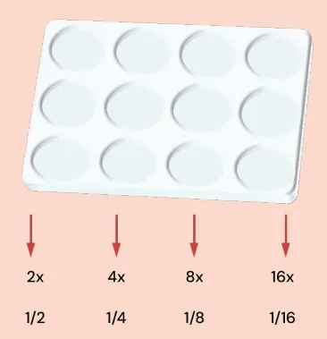
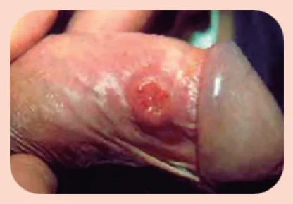
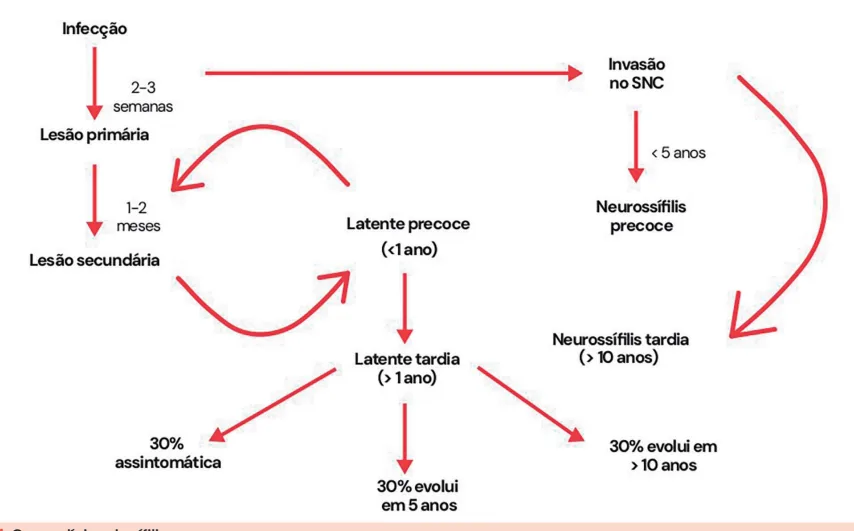
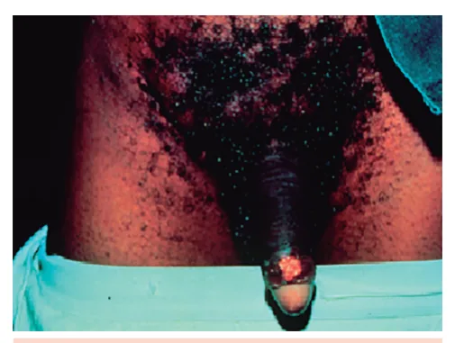
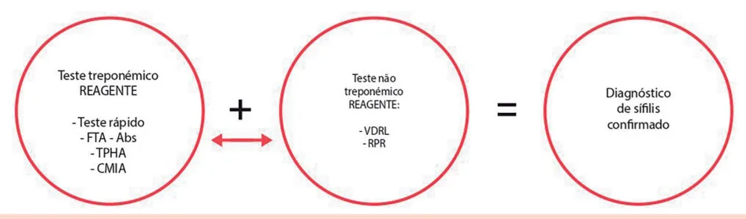
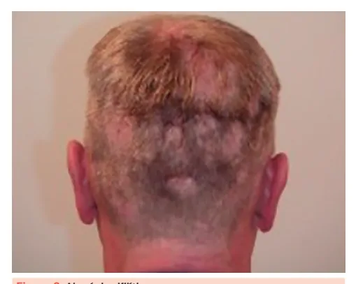
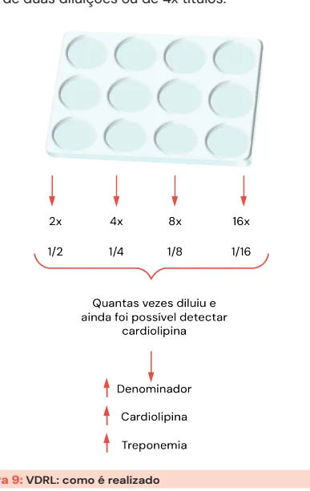

# Sífilis e Uretrites Infecciosas

<!-- page:1 -->

> ⚠️ Seção reconstruída a partir de OCR (PDF original em colunas, texto intercalado) — confira contra a fonte original.

**Sífilis, Uretrites Infecciosas e outras ISTs**: toda erupção cutânea sem causa determinada deve ser investigada com teste para sífilis.

Manifestações precoces (<1 ano de infecção) não se resolvem sozinhas — necessitam tratamento.

**Tratamento resumido**:
- **Formas precoces** (primária, secundária, latente precoce): Penicilina G benzatina 2.400.000 UI, dose única; ou Doxiciclina por 15 dias;
- **Formas tardias** (latente tardia, terciária): Penicilina G benzatina 7.200.000 UI (2.400.000 UI, 3x, com intervalo de 7-10 dias); ou Doxiciclina por 30 dias.

## Cura = Queda de 2 Diluições

- **6 meses** — formas precoces;
- **12 meses** — formas tardias;
- Se persistentemente positivo, mesmo com critérios de cura preenchidos → **serofast**.

---

<!-- page:2 -->

**Curso dos testes sorológicos para sífilis**: testes treponêmicos (FTA-ABS, TPHA, CMIA) e não treponêmicos (VDRL/RPR) — usados na sorologia, no controle de cura e podendo indicar cicatriz sorológica na infecção primária, secundária, latente precoce ou formas tardias.

## Jarisch-Herxheimer

- Ocorre em quadros de **alta treponemia**;
- Lise bacteriana após o tratamento → liberação de antígenos → resposta inflamatória;
- 24-48h após a penicilina;
- Febre, rash, mialgia, cefaleia;
- Piora das lesões;
- Aumento de VDRL;
- **Não é alergia** — tratamento sintomático.

## Introdução

- Mesmo antes do aparecimento da úlcera genital, o treponema já pode invadir o sistema nervoso central!
- Sendo assim, a **neurossífilis** (precoce ou tardia) deve ser considerada como outra doença, e não como um sinônimo de sífilis terciária.
- Verificar Figura 1 na próxima página.

## Etiologia e Contágio

**Considerações iniciais**:
- É causada pelo *Treponema pallidum*.
- O contágio pode ocorrer:
  - Todo e qualquer contato sexual;
  - Vertical (mãe → filho);
  - Transfusões sanguíneas.
- A sífilis **não se adquire** com acidente por objetos perfurocortantes.

> ⚠️ Quadro-resumo reconstruído a partir de OCR — confira contra a fonte original.

**Quadro-resumo (ISTs associadas a úlceras/uretrites)**:
- ISTs "estranhas" sem agente identificado: doxiciclina/azitromicina;
- **Linfogranuloma venéreo**: adenopatia inguinal, unilateral, dolorosa, coalescente, com supuração, fistulização e proctite;
- **Donovanose**: nodulação subcutânea que evolui para úlcera granulosa com sangramento fácil, sem adenite;
- **Uretrites infecciosas**: gonococo e clamídia:
  - Sem agente identificado ou gonococo identificado: ceftriaxona 500mg + azitromicina 1g;
  - *Chlamydia trachomatis* identificada: azitromicina 1g.

## Clínica — Sífilis Primária

- **Período de incubação**: variável, pode ser de poucos dias, mas em média de 1-2 semanas;
- A lesão inicia no local de inoculação — podendo não ser visível, principalmente em mulheres;
- São lesões de características **ulceradas, bordas infiltradas (elevadas), fundo limpo, indolor**;
- **Autolimitada**: resolução em 1-8 semanas;
- Linfadenite satélite, unilateral, sem supuração;
- **O diagnóstico é clínico!** Na sífilis primária, os testes diagnósticos ainda não são positivos!

---

<!-- page:3 -->

Figura 1: Curso clínico da sífilis.

- **Microscopia de campo escuro**: operacionalmente difícil e pouco disponível.

Figura 2: *Treponema pallidum* em microscopia de campo escuro e exemplos de úlcera de sífilis primária.

## Úlceras Genitais: Abordagem Sindrômica

> ⚠️ Seção reconstruída a partir de OCR — confira contra a fonte original.

**Diagnósticos diferenciais — possíveis agentes etiológicos e infecção gerada**:
- *Chlamydia trachomatis* → Linfogranuloma venéreo (LGV);
- *Haemophilus ducreyi* → Cancroide (também chamado de cancro mole);
- Vírus do herpes simples (tipo 2) → Herpes genital;
- *Klebsiella granulomatis* → Donovanose;
- *Treponema pallidum* → Sífilis.

- **Úlcera genital com duração menor que 4 semanas**: deve-se tratar para sífilis e cancro mole;
- **Úlcera genital com >4 semanas**: biópsia e avaliar entre as causas.

### Linfogranuloma Venéreo (*Chlamydia trachomatis*)

1. Lesão indolor de inoculação: pápula, pústula ou exulceração;
2. Caracteristicamente destaca-se a linfadenopatia inguinal coalescente (1-6 semanas após), dolorosa, unilateral, com supuração/fistulização;
3. Pode cursar com proctite/proctocolite;
4. Tratamento: doxiciclina por 21 dias ou azitromicina por 3 semanas.

### Cancro Mole (Figura 3)

- Doloroso, múltiplos, friável, sangrante, às vezes múltiplas, com saída de secreção e deixa cicatriz;
- Tratamento: azitromicina 1g ou ceftriaxona 250mg.

### Herpes Genital

- Vesículas que podem ulcerar, base eritematosa, queimação.

### Donovanose

1. Nodulação subcutânea indolor (pseudobulbão) em região de dobras que ulcera com sangramento fácil e sem adenite;
2. Diagnóstico: biópsia (corpúsculo de Donovan);
3. Tratamento: azitromicina por 3 semanas ou doxiciclina por 21 dias.

---

<!-- page:4 -->

## Clínica — Sífilis Secundária

**Na sífilis secundária há uma disseminação hematogênica e alta treponemia, com maiores títulos de VDRL!**

- Características: rash maculopapular, descamativo nas bordas, podendo ser localizado ou generalizado. Atinge região palmar e plantar (diagnóstico diferencial com farmacodermia, arboviroses e doenças "monolike").

Figura 4: Exemplo de sífilis secundária.

- Toda erupção cutânea sem causa determinada deve ser investigada com teste para sífilis;
- Podem existir sintomas sistêmicos devido à treponemia por via hematogênica: mialgia; cefaleia; diarreia; linfonodomegalia generalizada (deve ser considerada a possibilidade de doenças "monolike" e HIV); tosse seca; faringite (placas acinzentadas em mucosas).

**Formas atípicas de manifestação de sífilis secundária**:
- Hepatite;
- Acometimento renal (albuminúria transitória, síndrome nefrótica ou nefrite aguda com hipertensão e insuficiência renal aguda);
- **Condiloma lata (plano)**: placas esbranquiçadas, por vezes algo verrucosas, confluentes, em áreas de umidade (períneo, principalmente) — Figura 5;
- **Lues maligna**: ulcerações com muitos sintomas sistêmicos (lembrar da comorbidade com HIV);
- **Alopecia sifilítica** — Figura 6.

Figura 7: Fluxograma diagnóstico de sífilis.

## Clínica — Sífilis Latente

A forma latente (assintomática) divide-se em dois tipos:

- **Precoce**: até 1 ano do contato; VDRLs razoavelmente altos; recorrência de sintomas da sífilis secundária; tratar como forma precoce.
- **Tardia**: após 1 ano (ou quando não se sabe); VDRLs baixos ou negativos; tratar como forma tardia.

Verificar Figura 7.

**Atenção**: todo e qualquer título de VDRL, sem histórico de tratamento prévio, deve ser valorizado para investigar sífilis latente!

---

<!-- page:5 -->

Figura 8: Gráfico de curso dos testes.

## Diagnóstico

### Testes Diagnósticos

- **Treponêmicos** (FTA-ABS/TPHA; ELISA; sorologia; teste rápido; CMIA) — são mais específicos.
  - Positivam após a lesão primária, antes dos testes não treponêmicos, e permanecem positivos em altos títulos, inclusive após tratamento (**cicatriz sorológica**);
  - Não realizam controle de cura;
  - Por positivarem precocemente e terem melhor sensibilidade para formas tardias, os testes treponêmicos são os preconizados pelo Ministério da Saúde para o rastreio da sífilis;
  - Obs.: em breve estará disponível teste rápido não treponêmico, mas por hora só há treponêmico.
- **Testes não treponêmicos** — importantes para monitorar a resposta ao tratamento. Exemplos: VDRL/RPR.
  - Enxergam uma estrutura da parede do treponema (cardiolipina), por isso se correlacionam com a treponemia;
  - Pouco sensíveis nas formas tardias;
  - Títulos altos na forma secundária e latente precoce;
  - Positivam depois dos testes treponêmicos.

- O VDRL é dado de acordo com a quantidade de diluições em que ainda foi possível detectar cardiolipina. Nesse caso, 1/16 > 1/4;
- Em gestantes, idosos e pacientes reumatológicos, o VDRL pode ser falso-positivo (até 1/8): confirmar sempre com teste treponêmico!
- "O VDRL é o que o examinador vê" → examinador-dependente. Devido a isso, valoriza-se o aumento de duas diluições ou de 4x nos títulos.

**Curso dos testes**: verificar Figura 8.

- O *screening* inicial de sífilis deve ser feito com teste treponêmico! Eles apresentam maior sensibilidade para formas latentes tardias;
- Mas o diagnóstico fecha com ambos (treponêmico + não treponêmico).

Figura 9: VDRL — como é realizado.

## Clínica — Sífilis Terciária

- Quanto mais antiga é a infecção, menores tendem a ser os títulos de VDRL. No geral, sífilis tardias possuem VDRLs de até 1/8. Mas não há nada na literatura que estabeleça um corte!
- O Estudo da Sífilis Não Tratada de Tuskegee mostrou que 1/3 evolui rápido; 1/3 evolui devagar; 1/3 nunca vai ter nada.
- Afeta qualquer órgão e sistema!
- Principais acometimentos:

---

<!-- page:6 -->

> ⚠️ Fluxograma reconstruído a partir de OCR — confira contra a fonte original.

**Figura 10: Tratamento da sífilis**

- Se não sabe quando se contaminou: primária, secundária, latente precoce (**formas precoces**) → Penicilina G benzatina 2.400.000 UI ou Doxiciclina por 14 dias. Respondem mais — maiores chances de negativar o VDRL. Cura: queda de 2 diluições em 6 meses.
- Latente tardia, terciária (**formas tardias**) → Penicilina G benzatina 7.200.000 UI (2.400.000 UI, 3x, com intervalo de 7-10 dias) ou Doxiciclina por 28 dias. Respondem menos — serofast. Cura: queda de 2 diluições em 12 meses.

**Principais acometimentos da sífilis terciária**:
- Cardiovascular: aneurisma de aorta;
- Pele e tecidos derivados do ectoderma: goma sifilítica;
- Neurológico — mas **neurossífilis não é sífilis terciária, é outra doença!**

**Diagnóstico da sífilis terciária**:
- Treponêmicos positivos em altos títulos;
- Não treponêmicos positivos em baixos títulos (<1/8);
- Biópsia de tecido (ex.: goma sifilítica).

- Lesão de sífilis terciária: pesquisar neurossífilis. A pessoa já está infectada há tanto tempo que há maiores riscos de o treponema ter invadido o SNC.

## Tratamento

Verificar Figura 10.

### Critérios de Cura

- **Formas precoces** → maiores treponemias → reagem mais ao tratamento. Queda de 2 diluições em 6 meses; negativa em 1-2 anos.
- **Formas tardias** → menores treponemias. Queda de 2 diluições em 12 meses; podem não negativar (**serofast**); VDRL persistentemente positivo em títulos baixos.

### Falha Terapêutica

- **Não existe resistência do treponema à penicilina!**
- Sempre suspeitar de reinfecção.
- **Critérios para retratamento**:
  - Ausência de queda de VDRL em 2 diluições em 6-12 meses;
  - Elevação de dois títulos ou mais (ex.: 1/4 → 1/16).
- Pesquisar neurossífilis (LCR) em paciente assintomático:
  - Soronegativos: sem critério de cura, excluindo-se possibilidade de reinfecção;
  - PVHIV: se não preencher critério de cura, mesmo se houver reexposição.

## Reação de Jarisch-Herxheimer

- Ocorre em formas com **alta carga de treponemas**, estando presente em ~50% das formas primárias e 90% das formas secundárias;
- Lise bacteriana → liberação de antígenos → resposta inflamatória, 24-48h após a penicilina;
- Febre, rash, mialgia, cefaleia;
- Piora das lesões;
- Aumento de VDRL.

Figura 11: Reação de Jarisch-Herxheimer.

## Uretrites

### Principais Agentes Etiológicos

- *Chlamydia trachomatis* → Clamídia;
- *Neisseria gonorrhoeae* → Gonorreia;
- *Candida albicans* → Candidíase vulvovaginal;
- *Trichomonas vaginalis* → Tricomoníase;
- *Mycoplasma genitalium* → Infecção causada por Mycoplasma;
- Múltiplos agentes → Vaginose bacteriana.

- *Neisseria gonorrhoeae* e *Chlamydia trachomatis*:
  - Pacientes assintomáticos com vida sexual ativa e fatores de risco → rastreio com PCR a cada 6 meses;
  - Pacientes sintomáticos → Gram + PCR de clamídia e gonococo + cultura.

---

<!-- page:7 -->

> ⚠️ Tabela reconstruída a partir de OCR — confira contra a fonte original.

**Tabela 1: Tratamento de uretrites infecciosas**

| Condição clínica | 1ª opção | Comentários |
|---|---|---|
| Uretrite sem identificação do agente etiológico | Ceftriaxona 500mg, IM, dose única + Azitromicina 500mg (2 comprimidos), VO, dose única | 2ª opção: Ceftriaxona 500mg, IM, dose única + Doxiciclina 100mg, 1 comprimido, VO, 2x/dia, por 7 dias |
| Uretrite gonocócica e demais infecções gonocócicas não complicadas (uretra, colo do útero, reto e faringe) | Ceftriaxona 500mg, IM, dose única + Azitromicina 500mg (2 comprimidos), VO, dose única | — |
| Uretrite não gonocócica / Uretrite por clamídia | Azitromicina 500mg (2 comprimidos), VO, dose única | 2ª opção: Doxiciclina 100mg, 1 comprimido, VO, 2x/dia, por 7 dias |
| Retratamento de infecções gonocócicas | Ceftriaxona 500mg, IM + Azitromicina 1000mg (retratamento) | Para casos de falha de tratamento; possíveis reinfecções devem ser tratadas com as doses habituais |

**Princípio importante**: o gonococo cresce melhor e mais rápido. Logo, se identificou gonococo, não se consegue ter segurança de que não haja clamídia junto. Mas, se só identificou clamídia, consegue-se ter segurança de que não tem gonococo.

**Atenção**: a resolução dos sintomas pode demorar até 7 dias após a conclusão da terapia.

**Novidade: "Doxy-PEP"** — doxiciclina após exposição sexual para prevenir sífilis, clamídia e gonorreia.
- Indicação: HSH (homens que fazem sexo com homens) e mulheres trans;
- Dose: 200 mg de doxiciclina, 24-72h após a exposição;
- Diminui o risco em 65% de ISTs.

Verificar Tabela 1.

## Referência

Figura 2: *Treponema pallidum* em microscopia de campo escuro e exemplos de úlcera de sífilis primária. Jan R. Mekkes, reproduzida com permissão.

Figura 3: Cancroide (cancro mole). BRASIL. Ministério da Saúde. Secretaria de Vigilância em Saúde. Programa Nacional de DST e Aids. Manual de Bolso das Doenças Sexualmente Transmissíveis. 2. ed. Brasília: Ministério da Saúde, 2005. 108 p. Série Manuais, n. 24.

Figura 4: Exemplo de sífilis secundária. Jan R. Mekkes, reproduzida com permissão.

Figura 5: Condylomata lata. Jan R. Mekkes, reproduzida com permissão.

Figura 6: Alopecia sifilítica. Jan R. Mekkes, reproduzida com permissão.
