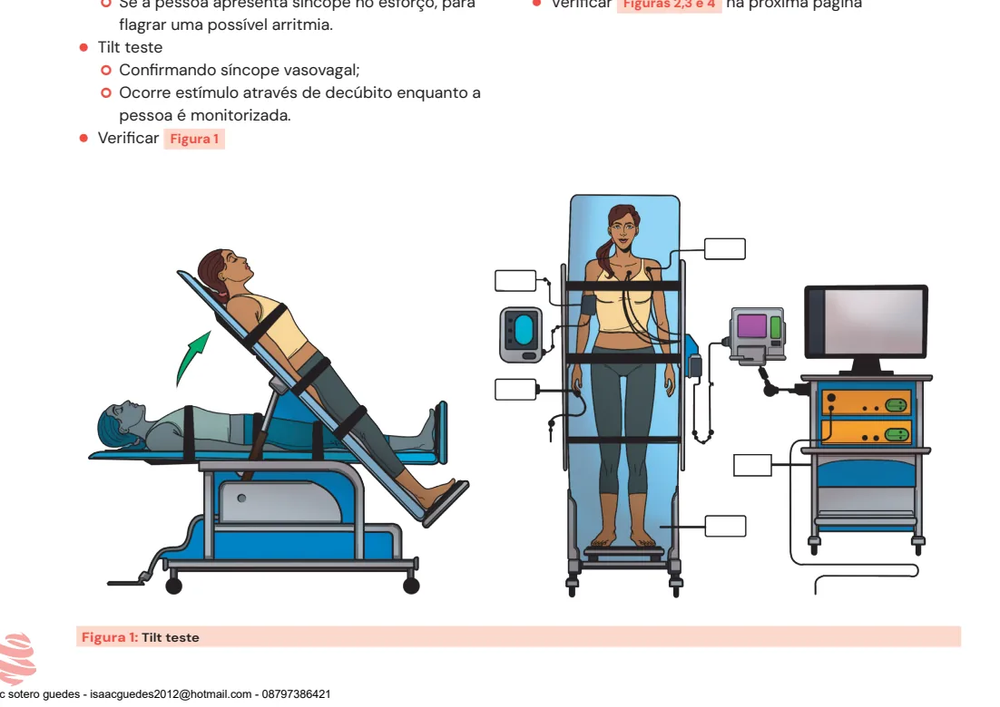
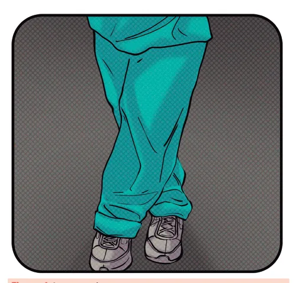
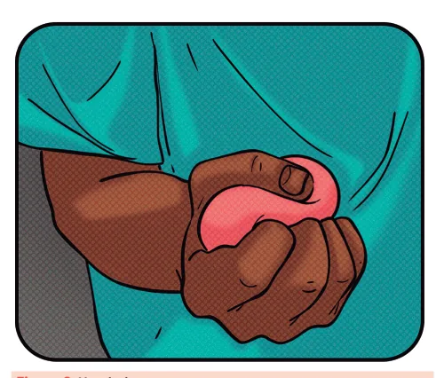

# Síncope

<!-- page:1 -->

- Verificar se o paciente realmente teve síncope (perda de consciência por hipofluxo cerebral). Recuperação total e rápida da consciência;
- As principais etiologias são: neuromediada, cardiogênica, hipotensão ortostática;
- Buscar causas graves de síncope na anamnese, exame físico e ECG.

## Definição

- A síncope é definida como a perda transitória da consciência por hipofluxo cerebral, com perda de tônus muscular e recuperação espontânea, sendo assim, rápida e completa. Hipoglicemia e crise convulsiva são causas de perda transitória do nível de consciência, porém não são síncopes, conforme definição.

## Etiologias

### Hipotensão Ortostática (Postural)

- Caracterizada por queda da pressão sistólica **> 20 mmHg** e/ou queda da pressão diastólica acima de **10 mmHg** com a mudança para ortostase. Aferir pressão deitado e após 3 min em pé (ou se sintomas);
- Desidratação, disautonomia, medicamentoso; idoso que acabou de levantar, às vezes, pela manhã (um pouco desidratado).

### Síncope Reflexa (Neuromediada) → Vasovagal

- É a causa mais comum de síncope;
- Fatores desencadeantes são sugestivos: ortostase prolongada, ambientes quentes, dor, desconforto sensorial, punção venosa, refeição, estresse emocional. Pródromos sugestivos: calor/calafrio, palidez, náusea e vômito, dor abdominal, sudorese;
- **Reflexo vasovagal**: redução da pré-carga (em pé por muito tempo, por exemplo), levando a uma redução do débito cardíaco e pressão arterial → ativação dos barorreceptores leva a aumento de catecolaminas para aumentar o DC e manter a PA (levando também à taquicardia, sudorese, palidez cutânea por vasoconstrição – aumento do tônus simpático). Com o aumento do tônus simpático, o ventrículo passa a bater vigorosamente e vazio, estimulando os mecanorreceptores (ou fibras C) no átrio, ventrículo e artéria pulmonar → estimulam no núcleo dorsal do vago a retirada do tônus simpático e aumento do tônus parassimpático (vasodilatação e bradicardia = hipotensão e síncope), também conhecido como **reflexo de Bezold-Jarisch**;
- Síncope em posição sentada, deitada ou no esforço, e alterações no exame clínico e no ECG, devem levantar a suspeita de síncope cardiogênica;
- Síncope vasovagal e por hipotensão ortostática podem ser tratadas prioritariamente com medidas comportamentais e ajuste de medicações.

### Cardiogênica

- Arritmias (taquiarritmias e bradiarritmias), isquemias, TEP maciço, mixoma atrial, estenose aórtica, doença estrutural que leva à obstrução do fluxo sanguíneo, cardiomiopatia hipertrófica;
- Sempre buscar a identificação dessas causas cardiogênicas (são as mais graves).

## Avaliação

- Escuta atenta do paciente para entender os mecanismos que levaram à condição;
- Anamnese + exame físico + ECG, na grande maioria dos casos, são suficientes para a avaliação do risco da síncope.

### História

- Sistemática e detalhada (confirmar que houve síncope);
- Cardiopatia ou histórico familiar de cardiopatia, síncope, morte súbita;
- Medicações (hipotensores, diuréticos, antiarrítmicos);
- Posição do corpo no momento do evento e fator precipitante;
- Testemunhas para descrever o episódio.

### Exame Físico

- Identificar doença estrutural cardíaca (avaliar congestão, sopros, turgência jugular e se há edema de MMII);
- Identificar sinais de doenças neurológicas que podem sugerir disautonomia e elevar a chance de ter uma hipotensão ortostática. Por exemplo, doença de Parkinson e diabetes avançado com neuropatia periférica;
- **PA e FC deitado e em pé**, com 1, 2 e 3 minutos, conseguindo avaliar a hipotensão ortostática e a SPOT (síndrome postural ortostática taquicardizante) – episódio de reflexo vasovagal sem hipotensão.

---

<!-- page:2 -->

## Exames Complementares

### Eletrocardiograma

- **Intervalo QT**: se síndrome do QT longo, o paciente pode ter feito uma Torsades de Pointes (taquiarritmia polimórfica);
- **Intervalo PR**: se curto com onda delta (pré-excitação), sugere uma síndrome de Wolff-Parkinson-White e pode ter feito uma arritmia potencialmente grave, desencadeando a síncope;
- Bloqueio de ramo direito com supra ST em V1 → padrão da síndrome de Brugada;
- Inversão de onda T de V1-V3 → recordando a displasia arritmogênica de VD;
- Outros: infartos (áreas inativas no eletro), bloqueios atrioventriculares, sobrecarga ventricular, podendo indicar insuficiência cardíaca ou valvopatias;
- Um ECG totalmente normal em um paciente jovem denota baixa probabilidade de causa cardíaca da síncope, embora não exclua.

### Outros

- **Holter/Looper** – monitorização por 24 horas/1 semana. Exames de baixo rendimento diagnóstico. Se a frequência da síncope for muito alta, por exemplo, semanalmente, pode ser tentado um Looper;
- **Ecocardiograma** – realizado apenas se houver suspeita de alteração estrutural;
- **Teste ergométrico** – se a pessoa apresenta síncope no esforço, para flagrar uma possível arritmia;
- **Tilt teste** – confirmando síncope vasovagal; ocorre estímulo através de decúbito enquanto a pessoa é monitorizada;
- Verificar Figura 1.

Figura 1: Tilt teste.

## Escores Prognósticos

- A maioria contém ECG anormal, idade avançada, paciente previamente cardiopata, síncope sentado e/ou palpitação precedendo a síncope;
- Não é necessário decorar nenhum escore, os preditores prognósticos são identificados com a clínica;
- Eles são interessantes para a documentação em prontuário (ex.: Escores OESIL, EGSYS).

## Tratamento

- **Síncopes de causa cardiogênica**: necessário tratar a causa encontrada.

### Vasovagal/Ortostática

- São diferentes, mas os mecanismos são parecidos;
- Orientar o paciente a se manter bem hidratado e por vezes até aumentar o sal da dieta;
- Reavaliar as medicações (inclusive uso de diuréticos);
- Orientações comportamentais (manobras para orientar o paciente):
  - **Handgrip** → apertar a mão (ambas de preferência), com uma bola ou algo maleável. Pode ser usado apertando os polegares;
  - **Armtensing** → segurar uma mão com a outra e puxar uma à outra fazendo força em direções opostas;
  - **Leg-crossing** → cruzar as pernas e apertar uma panturrilha contra a perna, fazer isso com ambos os MMII.
- Verificar Figuras 2, 3 e 4 na próxima página.

---

<!-- page:3 -->

Figura 2: Handgrip.

Figura 3: Armtensing.

Figura 4: Leg-crossing.

## Referências

Figuras 1-4: banco de imagens da MedCof adaptadas de Sydell and Arnold Miller Family Heart & Vascular Institute. Disponível em: https://www.clevelandclinic.org/heart. Acesso em: 4 ago. 2025.

