# Síndrome Coronariana Aguda Com Supra de St (scacsst)

<!-- page:1 -->

## SÍNDROME CORONARIANA AGUDA

## COM SUPRA DE ST (SCACSST)

Síndrome Coronariana Aguda (CM); IAMCSST (CM); INTRODUÇÃO E PAREDES

- Todo paciente com dor torácica no prontosocorro deve ter um ECG efeito e interpretado em

10 minutos;

- ECG com supra em duas ou mais derivações contíguas + clínica compatível = SCA com

SUPRA de ST;

- Localizando a parede e a artéria culpada. Supra de ST em: V1 e V2 (septal); V1-V4 (anterior); V1-V6, DI e aVL a. descendente anterior; V5, V6, DI e aVL (lateral); apenas DI e avL (lateral alta) → a. circunflexa; DII, dIII e aVF (inferior) → a. coronária direita acometimento da a. coronária direita (demais = a. circunflexa).

(anterior extenso) → (maioria). Supra em D3 maior que em D2 sugere

- Supra de ST inferior (dII, dIII,e aVF) → solicitar as derivações V3R e V4R para investigar infarto de ventrículo direito (VD) → se a elevação for maior que 0.5 mm, já se considera como supra!

## INTRODUÇÃO

- Síndrome coronariana aguda → frente ao paciente com sintomas típicos, sempre se deve realizar o eletrocardiograma (ECG) e interpretá-lo em, no máximo, 10 minutos, podendo assim classificar entre: SCA com supra de segmento ST, que, no caso, é um infarto agudo do miocárdio (IAM) com supra de ST no ECG (IAMCSST); SCA sem supra de segmento ST, podendo ser: IAM sem supra de ST (IAMSSST) → quando curva de troponina positiva; Angina instável → quando troponina negativa.

Figura 1: Fluxograma dos subtipos de SCA - Diante do Infra de ST de V1-V3, solicitar V7, V8 e V9, pois V1-V3 pode ser um “espelho” da parede posterior;

## DIAGNÓSTICOS DIFERENCIAIS

- Miopericardite, Sd. Takotsubo, dissecção de aorta, MINOCA.

## TRATAMENTO

- A primeira coisa é definir: Angioplastia primária ou trombólise. Angioplastia preferível se: 90 min no serviço ou até 120 min se transferência;

1. Trombólise: AAS 300mg , clopidogrel 300 mg,

enoxaparina, trombolítico. Checar critérios de reperfusão 60-90 min após;

2. Angioplastia: AAS 300 mg, clopidogrel, prasugrel ou

ticagrelor, enoxaparina. COMPLICAÇÕES

- Choque cardiogênico, choque de VD, rotura de parede livre e CIV. Se hipotensão súbita, congestão pulmonar, sopro novo, investigar imediatamente com Ecocardiograma.

- O achado de supra de ST representa a oclusão total da artéria coronária, isto é, um trombo oclusivo, geralmente relacionado à rotura de uma placa aterosclerótica;

- O IAM sem supra geralmente ocorre por erosão de uma placa, gerando sub oclusão do vaso.

Figura 2: Trombo oclusivo (acima) e trombo suboclusivo (abaixo)

## ANATOMIA E LOCALIZAÇÃO

## RELEMBRANDO A ANATOMIA

- A coronária direita e o tronco da coronária esquerda são ramos diretos da aorta;

- À esquerda, o tronco da coronária esquerda dará origem à artéria descendente anterior e à artéria circunflexa.

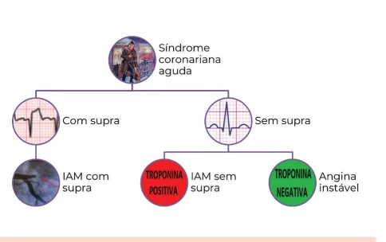

---

<!-- page:2 -->

## LOCALIZANDO A PAREDE E A ARTÉRIA

## CULPADA

- Supra de V1 e V2 → infarto septal → a descendente anterior;

- Supra de V1-V4 → infarto de parede anterior → a descendente anterior;

- Supra de V5, V6, D1 e aVL → infarto de parede lateral

→ a circunflexa;

- Apenas D1 e aVL → parede lateral alta → a circunflexa;

- Supra de V1-V6, D1 e aVL → infarto anterior extenso → a descendente anterior;

- Supra de D2, D3 e aVF → infarto de parede inferior → a coronária direita (maioria). Em 30% dos pacientes, a artéria acometida pode não ser a coronária direita, sugere acometimento da coronária direita.

Figura 3: Vasculatura coronariana e sim a circunflexa; supra em D3 maior que em D2 Figura 4: Localizando a artéria culpada - parede septal Figura 5: Localizando a artéria culpada - parede anterior Figura 6: Localizando a artéria culpada - parede lateral

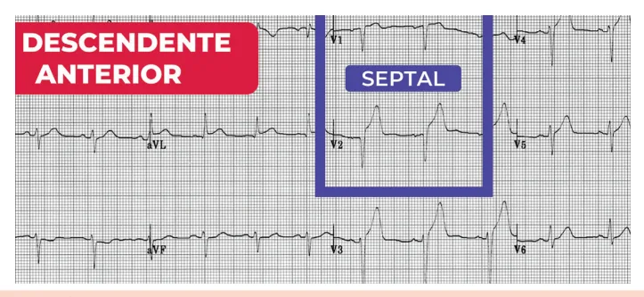

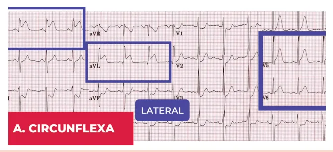

---

<!-- page:3 -->

Figura 7: Localizando a artéria culpada - parede lateral alta Figura 8: Localizando a artéria culpada - infarto anterior extenso Figura 9: Localizando a artéria culpada - parede inferior com supra em D3 maior que em D2 OUTROS PADRÕES | Supra discordante do QRS >= 5MM.

- O supra de V1-V3 está presente no BRE (bloqueio | No supra discordante do QRS = QRS de ramo esquerdo). Para diferenciar de um predominantemente negativo + supra (positivo) supra isquêmico (infarto) utilizam-se os critérios - sozinho, não fecha critério para supra de Sgarbossa; isquêmico, devendo-se ter pelo menos um dos

- Critérios de Sgarbossa (favoráveis à isquemia): outros critérios associados Infra V1-V3;

- Verificar Figura 10 e Figura 11 na próxima página Supra concordante com o QRS(> 1 MM);

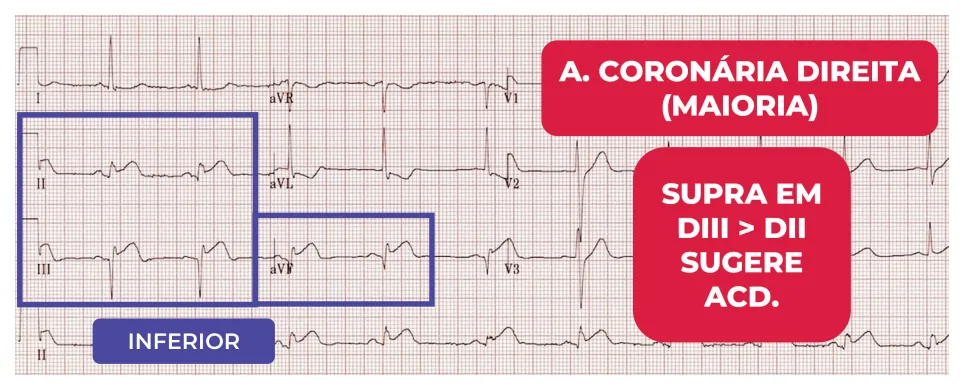

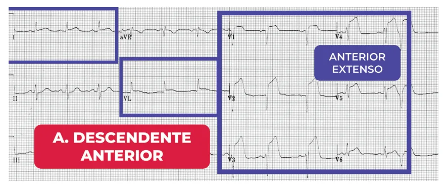

---

<!-- page:4 -->

Sugere paciente com BRE que está apresentando um

- Verificar Figura 12 infarto concomitante.

- Diante do infra de ST de V1-V3, deve-se também

- Supra de ST inferior (dII, dIII,e aVF) → solicitar as solicitar as derivações V7, V8 e V9, pois V1-V3 pode derivações V3R e V4R para investigar infarto de ser um “espelho” da parede posterior. Supra de ST de ventrículo direito (VD). Em V3R e V4R, se a elevação for V7-V9 sugere infarto de parede posterior maior que 0,5 mm, já se considera como supra. Nos

- Verificar Figura 13 outros casos, deve ser > 1 mm

Figura 10: BRE com supra de V1-V3. Figura 11: Supra com critério Sgarbossa positivo Figura 12: Supra de ST inferior com infarto de VD associado

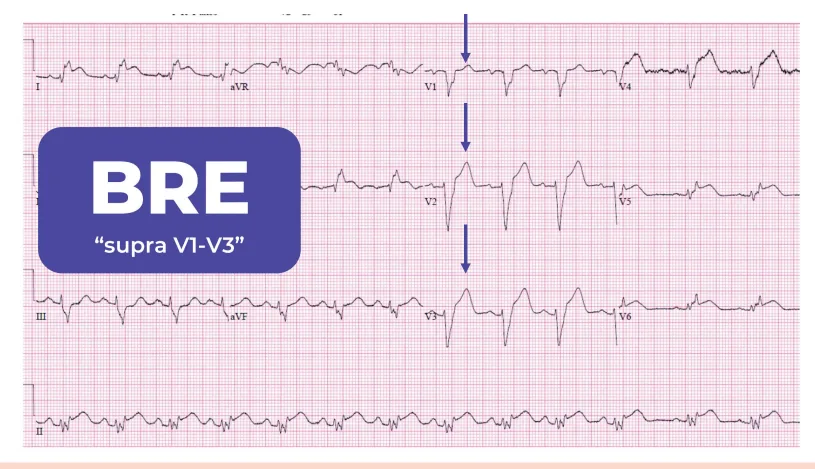

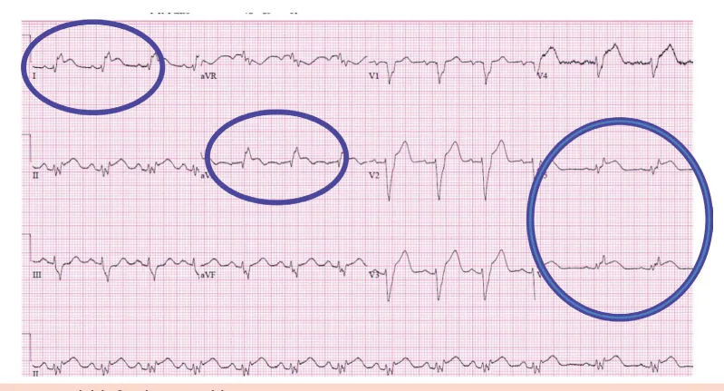

---

<!-- page:5 -->

Figura 13: Supra de ST posterior

## CONDIÇÕES QUE MIMETIZAM O

## IAM

## MIOPERICARDITE

- ECG: no ECG da pericardite → supra difuso + infra do segmento PR; supra sem imagem em espelho (além de avR e V1); supra “FELIZ” (supra com concavidade para CIMA);

Figura 14: Miocardite

- Takotsubo: possível ter supra e dor torácica; no momento do cateterismo → achado de balonamento apical com hipercinesia da base. Ausência de lesões obstrutivas nas coronárias.

Figura 15: Balonamento apical com hipercinesia da base Figura 16: Balonamento apical com hipercinesia da base no ECO Figura 17: Balonamento apical com hipercinesia da base na RNM

## DIAGNÓSTICO

- O Infarto com supra de ST é um diagnóstico clínico-eletrocardiográfico; Paciente com clínica típica (ex: dor torácica, dispneia, sintomas associados, irradiação da dor para braços ou mandíbula) + ECG com supra em 2 ou mais derivações contíguas; Não espere a troponina para iniciar o tratamento!

- NA SCA com supra ST, as medidas iniciais são: Sala de emergência; Monitorizar; Acesso venoso; Oxigênio (com alvo de saturação > 90%); Solicitar exames (ex.: troponina): a troponina tem relação prognóstica, mas não diagnóstica.

- Exame Físico (EF) sumário, procurando diagnóstico diferencial e complicação;

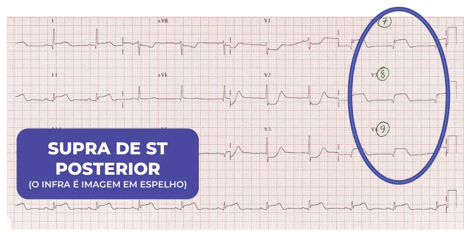

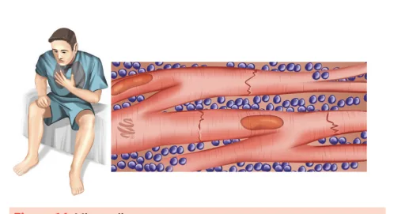

---

<!-- page:6 -->

## DIAGNÓSTICOS DIFERENCIAIS TRATAMENTO

- Principalmente Dissecção de Aorta Stanford A, especialmente se supra de ST em parede inferior; CONDUTA PRINCIPAL Para realizar esta investigação, deve-se avaliar no

- Objetivo principal: no infarto com supra, a nossa exame físico inicial: palpação do pulso e aferição prioridade é a desobstrução da coronária, seja por exame físico inicial: palpação do pulso e aferição da PA nos 4 membros: divergência de pressão entre os membros, especialmente quando PA em membros inferiores é menor que em superiores → considerar dissecção de aorta. Buscar sopro de associado a sintomatologia → considerar dissecção de aorta. Déficits neurológicos associados: quando a dissecção segue em direção às carótidas, pode haver déficit neurológico (= dor torácica + AVC); Pode haver supra de ST quando a dissecção da aorta atinge o óstio de alguma coronária, mais comumente a direita. Figura 18

IAo (insuficiência aórtica) na ausculta; Tal achado

- Figura 18: Supra ST na parede inferior

- O mesmo paciente do ECG acima realizou um

- Ecocardiograma, evidenciando lâmina de dissecção na aorta. O mesmo paciente também apresentava sopro de insuficiência aórtica.

## PESQUISA DE COMPLICAÇÕES

- Exemplos: choque cardiogênico e infarto de VD;

- Avaliar PA e FC → taquicardia pode ser um sinal inicial de choque cardiogênico;

- Ausculta pulmonar e avaliação do PVJ - pulso venoso jugular: choque com pulmão limpo e IAM inferior: → pensar em infarto de VD;

- Congestão franca, choque, iam anterior extenso parede anterior.

→ pensar em choque cardiogênico por infarto de Figura 19: Flap de dissecção da aorta no Ecocardiograma prioridade é a desobstrução da coronária, seja por meio da angioplastia ou trombólise, a depender da disponibilidade de recursos;

- A Angioplastia Primária sempre será a preferência: Se houver hemodinâmica no hospital → angioplastia primária (em até 90 min do primeiro contato com o hospital, preferencialmente 60 minutos); Não há cateterismo no hospital → transferência para abrir a artéria em até 120 min por meio da angioplastia primária;

- Trombólise: Se não é possível que o paciente esteja na sala de hemodinâmica em até 120 min; Paciente está com dor há menos de 12 horas! → Não trombolisar se dor > 12 horas. Contraindicações absolutas: AVCi/TCE 3 meses;

sangramento/neoplasia SNC; lesão vascular cerebral (MAV); sangramento ativo/discrasias; dissecção aguda de aorta;

SCA com supra ST no Hospital sem cateterismo:

- Medidas iniciais: sala de emergência, monitor, acesso venoso, oxigênio (sat > 90%), exames;

- AAS 300 mg VO;

- Inibidor de ADP (clopidogrel, prasugrel, ticagrelor);

Ataque: clopidogrel 300 mg, 75 mg se > 75a; não usar ticagrelor ou prasugrel na trombólise;

- Anticoagulante: enoxaparina 30 mg EV (bolus), e depois 1 mg/kg SC 12/12h (>75 anos: sem ataque e 0,75 mg/kg SC 12/12 h); HNF IV em BIC; fondaparinux.

- Trombolítico, ex.: alteplase 15 mg EV em bolus; depois em 60 min;

0.75 mg/kg EV em 30 min; depois, 0.5 mg/kg EV Tabela 1: Tratamento do IAMCSST O tempo de porta-agulha deve ser de 30 minutos, desde a chegada ao serviço até a administração do trombolítico.

Critérios de reperfusão (após 90min) para saber se o trombolítico deu certo: Resolução da dor; Redução do supra em 50%;

Arritmias de reperfusão (RIVA, extrassístoles ventriculares, TVNS); Pico precoce de marcador (tardio).

Precisa de cateterismo (CATE) SEMPRE: Se conseguiu a reperfusão → prazo de 2 a 24h para realizar o cateterismo;

Se ausência de reperfusão → angioplastia de resgate (urgência! CATE o mais rápido possível).

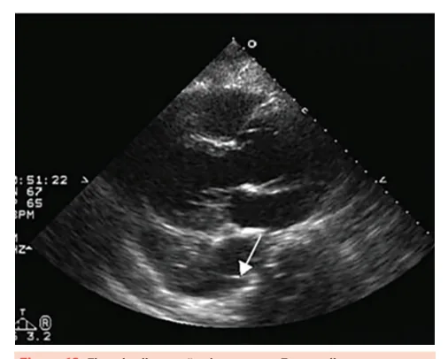

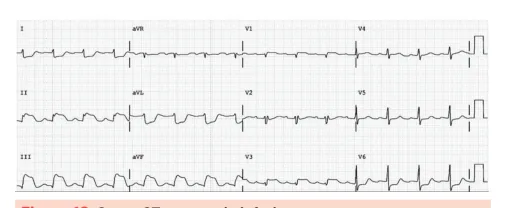

---

<!-- page:7 -->

## REFERÊNCIAS

SCA com supra ST no hospital COM cateterismo (angioplastia primária): | Medidas iniciais: monitor, acesso venoso, Figura 4: Localizando a artéria culpada - parede septal oxigênio, exames; Disponível em litfl.com/.

| AAS 300 mg VO; Figura 5: | AAS 300 mg VO; | Clopidogrel com ataque de 600 mg; ou ticagrelor ou prasugrel (podem ser utilizados).

| Anticoagulante: manutenção com 1 mg/kg SC 12/12h HNF IV em BIC. EVITAR o fondaparinux. | Cateterismo e angioplastia;

Tratamento adicional na SCA com supra ST: | Nitratos ou morfina (DOR) → evitar se indícios de infarto de VD, instabilidade hemodinâmica ou se realizou uso de sildenafil (nitratos) nas últimas 24h.

| Betabloqueador → VO em até 24h na ausência de contraindicação (que indica risco de choque cardiogênico): sinais de IC; idade > 70; Pas < 100;

FC >110. Essa indicação tem sido revisto realizarmos essa medicação via oral após estabilização e principalmente após angioplastia. Sempre garantir boa perfusão e estabilidade.

| IECA → em até 24h. Mais efetivo se: FEVE < 40%, ou se paciente com hipertensão arterial. | Todos os pacientes devem receber alta com estatina → iniciar em até 24h;

## MINOCA

- Infarto com coronárias sem lesões obstrutivas estenose < 50% É um diagnóstico transitório e não final. Principais causas: erosão e ruptura de placa não vistas no cateterismo; espasmo coronário; Ultrassom Intravascular (IVUS), Tomografia de e RNM auxiliam na investigação etiológica Figura 5: Localizando a artéria culpada - parede anterior

dissecção de coronária; infarto tipo 2. Coerência Óptica (OCT) — imagem intracoronária — Disponível em litfl.com/.

Figura 6: Localizando a artéria culpada - parede lateral Disponível em litfl.com/. Figura 7: Localizando a artéria culpada - parede lateral alta Disponível em litfl.com/.

Figura 8: Localizando a artéria culpada - infarto anterior extenso Disponível em litfl.com/. Figura 9: Localizando a artéria culpada - parede inferior com supra em D3 maior que em D2 Disponível em litfl.com/.

Figura 10: BRE com supra de V1-V3 Disponível em litfl.com/. Figura 11: Supra com critério Sgarbossa positivo Disponível em emergencymedicinecases.com Figura 12: Supra de ST inferior com infarto de VD associado Disponível em litfl.com/.

Figura 13: Supra de ST posterior Disponível em litfl.com/. Figura 15: Balonamento apical com hipercinesia da base https://doi.org/10.1590/S0103-507X2013000100012 Figura 16: Balonamento apical com hipercinesia da base no ECO https://doi.org/10.1016/j.ijcard.2016.02.012 Figura 17: Balonamento apical com hipercinesia da base na RNM https://doi.org/10.1016/j.ijcard.2016.02.012 Figura 18: Supra ST na parede inferior.

Disponível em litfl.com/. Figura 19: Flap de dissecção da aorta no Ecocardiograma Disponível em litfl.com/.

—
