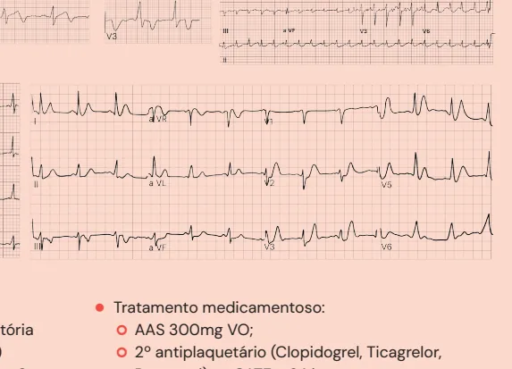
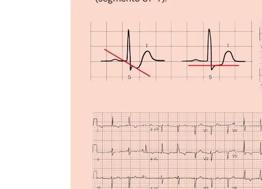
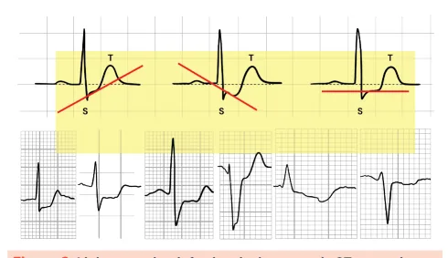
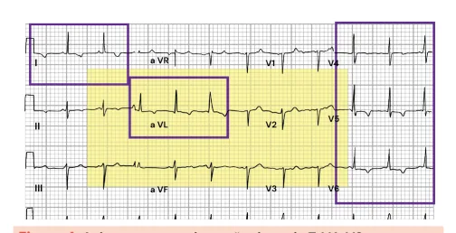
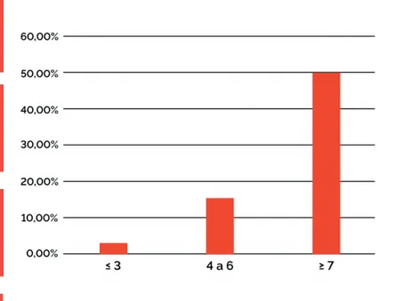
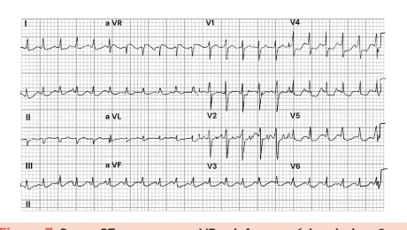

# Síndrome Coronariana Aguda Sem Supra de St (scassst)

<!-- page:1 -->

## SÍNDROME CORONARIANA AGUDA

## SEM SUPRA DE ST (SCASSST)

## IAMSSST (CM)

## DEFINIÇÕES

- Infarto: curva de troponina com pelo menos um valo dos seguintes: sintomas, alterações isquêmicas no E cateterismo ou autópsia;

- Alterações isquêmicas no ECG: infradesnivelament

Wellens (SW), supra de ST em aVR e Infra de ST difus (segmento ST-T). ESCORES

- HEART Score (quando há dúvida) - H- história

E- ECG A- Anos (idade) R- Risco (fatores) T- troponina. Investigação ambulatorial se ≤ 3;

- Definiu SCA sem supra? Estratificar o risco: Escore TIMI, GRACE.

## CONDUTA

- Cateterismo mais urgente quanto mais grave o paciente: Muito alto risco (INSTABILIDADES): 2 hs; Alto risco (GRACE > 140, TIMI >5, Tropo +, infra de ST): 24 hs; Demais casos: 72 hs.

## INFARTO AGUDO DO MIOCÁRDIO

- Para diagnosticar um infarto precisamos de: curva de troponina com pelo menos um valor acima do percentil Sintomas; Alterações isquêmicas no ECG; Alterações de imagem; Trombo na coronária por cateterismo ou autópsia.

99, associada a pelo menos um dos seguintes:

- Verificar Figura 1 na próxima página. or acima do percentil 99, associada a pelo menos um to do ST, achatamento ou inversão de onda T, síndrome de so, onda T de “De Winter”, alterações dinâmicas no ECG

ECG, alterações de imagem, trombo na coronária por

- Tratamento medicamentoso: AAS 300mg VO; 2º antiplaquetário (Clopidogrel, Ticagrelor, Anticoagulantes: Enoxaparina, HNF ou Fondaparinux; Enoxaparina 1 mg/kg 12/12h: 0,75 mg/kg 12/12 h se idosos (> 75 anos); 1 mg/kg 24/24 h se ClCr < 30 ml/min.

Prasugrel) se CATE > 24 hs;

- Todo paciente com dor torácica deve ter um ECG feito e interpretado em até 10 minutos. Na presença de supra de ST em duas ou mais derivações contíguas, l deverá ser diagnosticado imediatamente o IAM COM supradesnivelamento do segmento ST (IAMCSST).

Na ausência desse achado, vamos procurar outras alterações isquêmicas no ECG que possam estar relacionadas a SCA (síndrome coronariana aguda)

SEM supra de ST: | Além disso, sempre diante da suspeita de IAM, deve-se solicitar o marcador de necrose miocárdica (preferencialmente a troponina ultrassensível - US):

---

<!-- page:2 -->

| Troponina positiva + clínica de SCA = IAM sem

- Achatamento ou inversão de onda T → sugestivo de supra de ST; isquemia quando: Troponina negativa + clínica de SCA = | Onda T > 1 mm de profundidade. Presente em duas angina instável. ou mais derivações contíguas, com predomínio O IAMSSST traduz lesões em geral NÃO oclusivas positivo do QRS; O IAMSSST traduz lesões em geral NÃO oclusivas das coronárias. Graves, porém não totalmente oclusivas. Enquanto que o IAMCSST normalmente traduz lesão oclusiva.

Figura 1: Lesões oclusiva e não oclusiva, respectivamente.

## ELETROCARDIOGRAMA E

DIAGNÓSTICO DO IAMSSST PADRÕES ELETROCARDIOGRÁFICOS Os pacientes com IAMSSST podem apresentar padrões no ECG que indicam isquemia:

- Infradesnivelamento do ST → este pode ser classificados a partir da observação entre o ponto J e Ascendente → não específico para isquemia! Descendente → alta correlação com isquemia; Horizontal → alta correlação com isquemia.

Y (80 ms do ponto J): Figura 2: V1, aVL, V5 e V6 (derivações que representam parede lateral) com infradesnivelamento de ST.

Figura 3: Linha superior: infradesnivelamento de ST ascendente, descendente e horizontal, respectivamente. Linha inferior:

exemplos de infra de ST em ECG. positivo do QRS; | Dinâmica → ECG prévio sem inversão de onda T e agora com inversão.

Figura 4: Achatamento ou inversão de onda T. V4-V6 com inversão de onda T onde o QRS é predominantemente positivo.

- Síndrome de Wellens (SW) → alta especificidade para estenose crítica de Descendente Anterior (DA) proximal. As alterações devem ser observadas em A → normalmente é a primeira apresentação do paciente, definida por onda T bifásica (positiva e depois negativa); B → diante da progressão da isquemia, definida por onda T profunda negativa e simétrica.

V2-V4. É dividida em dois tipos: Figura 5: V2 e V3 com onda T bifásica. Figura 6: Onda T simétrica e negativa.

---

<!-- page:3 -->

- Supra de ST em AVR e infra de SR difuso →

- Onda T de “De Winter” (Robbert J de Winter, descrita não é IAMCSST porque não há supra em duas em 2008): Infra ST ascendente nas precordiais + onda derivações contíguas! T apiculada que começa abaixo da linha de base. Em Traduz um padrão de isquemia circunferencial = geral, associado a lesões triarteriais ou lesão grave de isquemia subendocárdica (primeira região a sofrer tronco da coronária E; No geral, representa uma alteração triarterial ou lesão grave de tronco da coronária E.

isquemia subendocárdica (primeira região a sofrer isquemia no coração) difusa; Figura 7: Supra ST apenas em aVR, e infra em várias derivações (V4-V6, D1, D2, aVL e aVF).

Figura 8: Eletrocardiograma com onda T de “De Winter” em V2-V5.

## Escore Heart

2 pontos: altamente suspeita História 1 ponto: moderadamente suspeita Nenhum ponto: pouco/nada suspeita 2 pontos: depressão significativa do segmento S ECG 1 ponto: distúrbios de repolarização inespecifíco Nenhum ponto: pouco/nada suspeita Anos 2 pontos: ≥ 65anos 1 ponto: ≥ 45 anos e < 65 anos (idade)

Nenhum ponto: < 45 anos Risco 2 pontos: ≥ 3 ou história de doenças ateroscleró 1 ponto: 1 ou 2 (fatores*)

Nenhum ponto: nenhum 2 pontos: ≥ 3x o limite superior Troponina 1 ponto: 1 - 3x o limite superior Nenhum ponto: ≤ limite superior *hipercolesterolemia, diabetes, hipertensão, obesidade (IMC > 30 Kg/m Figura 9: Escore Heart para aplicação em caso de dúvida diagnós tronco da coronária E;

- Alterações dinâmicas no ECG: Resposta / mudança no ECG perante as intervenções, comparativamente antes e depois. Exemplo: Infra de ST / Inversão de onda T que melhoram após nitratos, oxigênio, antiplaquetário e heparina.

## HEART SCORE

- Utilizada quando há dúvida diagnóstica se é IAM, como diante da clínica atípica e curva de troponina discreta/ questionável → usar o HEART Score apenas em casos duvidosos, confira abaixo o mnemônico: H- história; E- ECG; A- Anos (idade); R- Risco (fatores); T- troponina.

- Interpretação: ≤ 3 pontos = baixo risco - seguro dar alta e realizar estudo das coronárias ambulatorialmente; 4- 7 = internação hospitalar = avaliação das coronárias. Possibilidade de teste não invasivo maiores em 6 semanas os ótica m²), tabagismo (atual ou interrupção há 3 meses), história familiar de DAC stica associada ao IAM.

(ex: cintilografia). Eventos cardiovasculares ST Baixo risco = Escore Heart ≤ 3 pontos

---

<!-- page:4 -->

## ESTRATIFICAÇÃO DE RISCO

grande probabilidade de precisarem de revascularização cirúrgica. Nesses casos, oferecer

- Classifica estratos de risco: baixo, intermediário, alto o 2º antiplaquetário vai adiar a revascularização ou muito alto: cirúrgica, pois para operar precisa ficar 5 dias sem Risco de quê? Novo infarto, óbito, DAPT (dupla antiagregação plaquetária); Risco de quê? Novo infarto, óbito, revascularização miocárdica.

- O tratamento da SCA sem supra de ST é baseado nos estratos de risco, como o escore TIMI (abaixo) - cada critério pontua 1: Idade ≥ 65 anos; Mais de um episódio de angina nas 24h; Fatores de risco (3 ou mais); Infra de ST ≥ 0,5 mm; Aumento de troponina; Cate com lesão >50%.

- Interpretação do escore TIMI: 0-2: Baixo risco; 3-4:

Risco Intermediário; 5-7: Alto risco;

- Pacientes considerados de muito alto risco (precisam de cateterismo de emergência em até 2 horas): Instabilidade clínica: Dor torácica refratária; Instabilidade elétrica: Arritmias malignas, alteração dinâmica do ST-T recorrentes, especialmente supra de ST intermitente recorrente; Hemodinâmica: IC, Choque Cardiogênico ou complicações mecânicas do infarto.

- Pacientes considerados de alto risco (precisam de cateterismo de urgência em até 24 horas): h TIMI > 4. Escore GRACE > 140; Alterações dinâmicas do ST-T; Curva típica de troponina (diagnóstico de IAM sem supra); h Elevação transitória do ST; Alterações dinâmicas do ST/T.

- Pacientes considerados de risco intermediário h Escore GRACE entre 109-140; h Muitas comorbidades ou fatores de risco prévios:

(precisam de Cateterismo em até 72 horas): Diabetes, DRC, FEVE <40%, ATC prévia, CRVM prévia. h

## TRATAMENTO

h SCA SEM SUPRA DE ST

- Medidas iniciais: Monitor, acesso venoso, oxigênio e h exames; AAS 300mg VO;

- 2º antiplaquetário (APT): (algumas entidades defendem NÃO realizar na sala de emergência): D Diretriz de IAMSSST da SBC de 2021: Alguns I d pacientes de alto e muito alto risco têm DAPT (dupla antiagregação plaquetária); Solução proposta pela Diretriz: caso o CATE seja realizado com < 24 H do início da dor do paciente, pode f azer o 2º antiplaquetário na sala da hemodinâmica, preferindo ticagrelor ou prasugrel para o paciente apenas se o CATE for feito em até tratamento não for cirúrgico, pode realizar o 2º APT na sala de emergência, normalmente Clopidogrel. Se for realizar o CATE com < 24 horas, fazer ticagrelor ou prasugrel na sala de hemodinâmica.

(APT de início de ação mais rápido). Não há prejuízo 24h. Se o CATE for demorar mais de 24 horas ou o

- Anticoagulante: Enoxaparina SC 1mg/kg de 12/12h

(ajustar para idade/ClCr); Outras opções: HNF IV em BIC e fondaparinux; Alívio da dor: Nitratos ou morfina (DOR), com cautela;

- Atenção! Não se faz trombólise no IAMSSST.

## REFERÊNCIAS

Figura 2: V1, aVL, V5 e V6 (derivações que representam parede lateral) com infradesnivelamento de ST.

https://litfl.com/ Figura 3: Linha superior: infradesnivelamento de ST ascendente, descendente e horizontal, respectivamente. Linha inferior:

exemplos de infra de ST em ECG. https://litfl.com/ Figura 4: Achatamento ou inversão de onda T. V4-V6 com inversão de onda T no qual o QRS é predominantemente positivo.

https://litfl.com/ Figura 5: V2 e V3 com onda T bifásica. https://litfl.com/ Figura 6: Onda T simétrica e negativa.

https://litfl.com/ Figura 7: Supra ST apenas em aVR, e infra em várias derivações (V4-V6,D1,D2 aVL e aVF).

https://litfl.com/ Figura 8: Eletrocardiograma com onda T de “De Winter” em V2-V5”. https://litfl.com/ Figura 9: Escore Heart para aplicação em caso de dúvida diagnóstica associada ao IAM.

Diretrizes da Sociedade Brasileira de Cardiologia sobre Angina Instável e Infarto Agudo do Miocárdio sem Supradesnível do Segmento ST–2021. Rio de Janeiro: Arquivos Brasileiros de Cardiologia, 2021.
