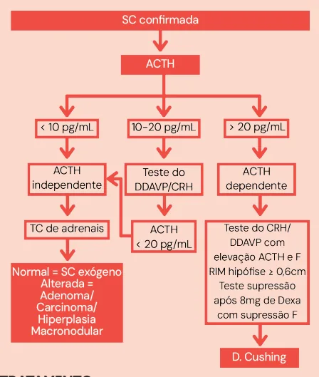
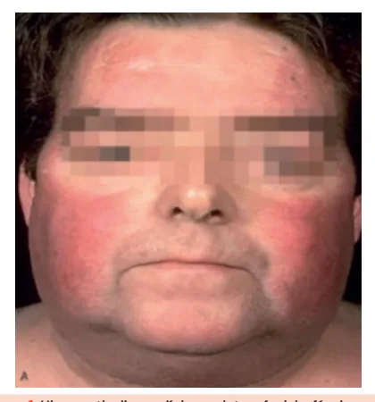
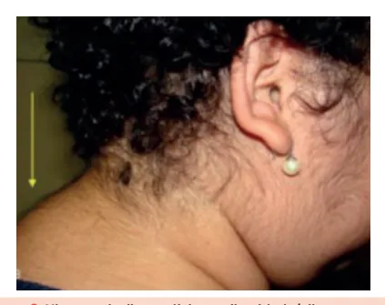
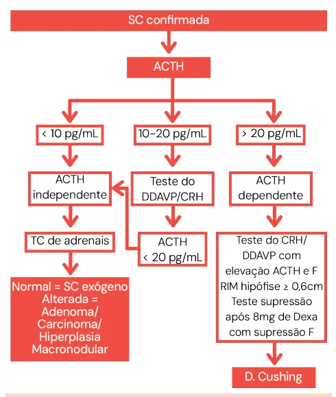
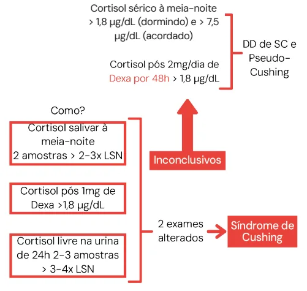

# Síndrome de Cushing

<!-- page:1 -->

Cushing (CM) ETIOLOGIAS Exógena

- Mais comum;

- Uso crônico de glicocorticoide.

Endógena

- Hiperprodução crônica de cortisol;

- ACTH-dependente → Doença de Cushing;

- ACTH-independente → Adenoma/Câncer adrenal.

## QUADRO CLÍNICO

Específico

- Fragilidade capilar (equimoses);

- Miopatia proximal;

- Estrias violáceas >1 cm;

- Giba/gibosidade;

- Fáscies em lua-cheia;

- Pletora facial.

Inespecífico

- Elevação da PA e glicemia;

- OP/osteopenia;

- Hipogonadismo hipogonadotrófico;

- Hirsutismo, acne e alopécia androgênica;

- DLP;

- Infecções de repetição;

- Fenômenos tromboembólicos.

Investigação

- Hipercortisolismo clínico → avaliar hipercortisolismo laboratorial: Cortisol pós 1mg de Dexametasona; Cortisol livre na urina de 24 horas; Cortisol salivar 23-00h.

- 2 alterados = Síndrome de Cushing.

## INTRODUÇÃO

## DEFINIÇÃO

- Síndrome de Cushing (SC) é um conjunto de achados clínicos e laboratoriais de hipercortisolismo;

- Não confundir – Doença de Cushing (DC) é um diagnóstico etiológico da Síndrome de Cushing hipofisário produtor de ACTH.

(SC), no caso, quando a SC é causada por um tumor ETIOLOGIAS

- Exógena (mais comum): uso de glicocorticoide;

- Endógena: hiperprodução crônica de cortisol, dependente de ACTH ou não dependente de ACTH.

- Verificar Tabela 1

- Verificar Tabela 2 INVESTIGAÇÃO ETIOLÓGICA

TRATAMENTO Escolha = cirúrgico

- Adenoma adrenal → adrenalectomia unilateral;

- Carcinoma adrenal → adrenalectomia + QT;

- Doença de Cushing → ressecção neurocirúrgica por via transesfenoidal.

Clínico = controle de sintomas

- Inicial → cetoconazol;

- Outros → CAB, etomidato, mitotane e pasireotide.

Tabela 1: Causas de Síndrome de Cushing ACTH-dependente. ACTH – Dependente (70-80%) Doença de Cushing (65-70%)

Síndrome do ACTH ectópico (5-10%) Síndrome do CRH ectópico (<1%) Síndrome do ACTH e CRH ectópicos (<1%)

Tabela 2: Causas de Síndrome de Cushing ACTH-independente ACTH – Independente (10-20%) Adenoma adrenal produtor de cortisol (15-20%)

Carcinoma adrenal (5-6%) Hiperplasia adrenal macronodular (<2%) Doença Adrenal Nodular Pigmentada Primária (<2%)

---

<!-- page:2 -->

## PSEUDO-CUSHING

- Paciente com quadro clínico (fenótipo) e/ou laboratorial de SC, porém com hipercortisolismo apenas leve ou moderado;

- Causas mais comuns são depressão e etilismo crônico. Outras: obesidade, SOP, abstinência alcoólica, doença renal crônica e outras doenças psiquiátricas;

- Fisiopatologia: hiperativação do eixo hipotálamohipofisário e aumento de secreção de CRH → elevação do cortisol;

- Diferenciação entre SC e Pseudo-Cushing requer eliminar o fator indutor do hipercortisolismo (por exemplo, na obesidade, alcançar a perda de peso; se é um paciente com depressão, tratar).

## HIPERCORTISOLISMO SUBCLÍNICO

- Pacientes com ausência de sinais ou sintomas de Figura 1: Hipercortisolismo clínico - pletora facial e fáscies em hipercortisolismo, porém com evidência laboratorial lua-cheia. Alta prevalência de HAS e DM2 e redução da densidade mineral óssea; Risco aumentado de fraturas vertebrais e IAM; Percentual de evolução para SC clássica é incerto.

de produção aumentada do cortisol:

## SINAIS MAIS ESPECÍFICOS

- Fragilidade capilar (equimoses/petéquias);

- Miopatia proximal;

- Estrias violáceas > 1 cm;

- Pletora facial;

- Fácies em lua cheia; Figura 2: Hipercortisolismo clínico - gibosidade/giba.

- Gibosidade.

## SINAIS INESPECÍFICOS

- HAS – aumenta a reabsorção de sódio e água;

- Osteopenia e osteoporose – cortisol inibe a ação dos osteoblastos;

- Devido ao excesso de cortisol, há um feedback negativo com FSH e LH, gerando um hipogonadismo hipogonadotrófico, o que leva a: irregularidade menstrual, amenorreia, redução da libido, disfunção erétil;.

- Hirsutismo, acne e alopecia androgênica – excesso de

SDHEA (andrógenos adrenais); Figura 3: Hipercortisolismo clínico - estrias violáceas.

- Diabetes e resistência à insulina – cortisol como hormônio contrarregulador da insulina;

- Dislipidemia – menor armazenamento de ácidos graxos livres e triglicérides nos adipócitos devido comprometimento da ação da insulina resultante do efeito contrarregulador do cortisol;

- Eventos tromboembólicos;

- Infecções de repetição – por redução da imunidade;

- Depressão, agitação, insônia e psicose;

- Hiperpigmentação cutaneomucosa nos casos de SC Figura 4: Hipercortisolismo clínico - equimoses.

ACTH dependentes, pelo aumento da produção de MSH (estimula melanina).

---

<!-- page:3 -->

## INVESTIGAÇÃO

- Hipercortisolismo clínico;

- Morbidades anormais para a idade como osteopenia/ osteoporose, HAS secundária e DM;

osteoporose, HAS secundária e DM;

- Crianças com ganho de peso e retardo do crescimento;

- Todos os incidentalomas adrenais;

- Incidentaloma hipofisário + hipercortisolismo clínico.

## MÉTODO DE INVESTIGAÇÃO

Cortisol sérico à meia-noite

> 1,8 µg/dL (dormindo) e > 7,5 µg/dL (acordado)

Figura 5: Investigação de Síndrome de Cushing.

- Cortisol salivar à meia-noite pois é o horário do ciclo circadiano que o cortisol está normalmente mais baixo: Se estiver aumentado nessa hora, indica um excesso de produção.

- Após 1 mg de dexametasona: a dexametasona inibe eixo corticotrópico em um indivíduo normal, levando à supressão do cortisol: Caso não ocorra a supressão, é sugestivo de hipercortisolismo.

- Cortisol livre na urina de 24h indica a produção total de cortisol ao longo do dia, se estiver aumentado também é sugestivo.

Dois desses exames alterados, associado ao hipercortisolismo clínico, confirmam a Síndrome de Cushing! Se apenas 1 alterado ou inconclusivo, fazer testes mais específicos como o cortisol sérico à meia noite e cortisol após 2 mg/dia de dexametasona por 48h.

- Após confirmação da Síndrome de Cushing – próximo passo é determinar se é ACTH dependente ou independente, através da dosagem do ACTH → Isso guiará a investigação etiológica. Figura 6: Investigação etiológica da Síndrome de Cushing.

## TRATAMENTO

## TRATAMENTO CIRÚRGICO

- Adenoma adrenal produtor de cortisol: adrenalectomia unilateral videolaparoscópica;

- Carcinoma adrenal: adrenalectomia unilateral + QT

(mitotane) / radioterapia;

- Hiperplasia adrenal macronodular: adrenalectomia unilateral da maior glândula com ou sem retirada de parte da glândula contralateral;

- Doença de Cushing (adenoma hipofisário): ressecção neurocirúrgica do tumor via transesfenoidal.

## TRATAMENTO MEDICAMENTOSO

- Controle laboratorial e clínico do hipercortisolismo não resolve a causa base; Terapia isolada em casos leves;

- Cetoconazol: inibe esteroidogênese adrenal e gonadal, pequena ação nos receptores corticotrofos, início rápido de ação;

- Outras opções: etomidato, mitotane, cabergolina e pasireotide.

## REFERÊNCIAS

Figura 1: Hipercortisolismo clínico - pletora facial e fáscies em lua-cheia. Vilar et.al. Endocrinologia Clínica. 7 ed. Guanabara Koogan, 2021 Figura 2: Hipercortisolismo clínico - gibosidade/giba.

Vilar et.al. Endocrinologia Clínica. 7 ed. Guanabara Koogan, 2021 Figura 3: Hipercortisolismo clínico - estrias violáceas.

Vilar et.al. Endocrinologia Clínica. 7 ed. Guanabara Koogan, 2021 Figura 4: Hipercortisolismo clínico - equimoses.

Vilar et.al. Endocrinologia Clínica. 7 ed. Guanabara Koogan, 2021

