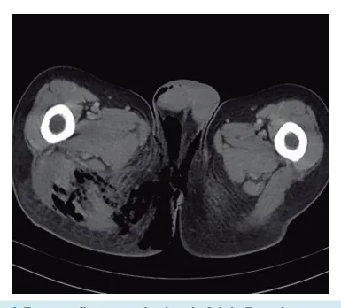

# Síndrome de Fournier

<!-- page:1 -->

## CIRURGIA GERAL

- Infecção necrotizante de partes moles do períneo e em homens;

- Acomete fáscia, músculo, pele e subcutâneo;

- Fatores de risco: Diabetes; Desnutrição; Obesidade; Imunossupressão.

## INFECÇÕES DE PARTES MOLES

- Podem ser divididas em: Pele e subcutâneo: Ex. celulite; Fáscia: Ex. fasceíte; Músculo: Ex. necrose (lesão “necrotizante”) ou miosite.

- Inicia com inflamação: Progride para infecção (supurativa); Estágio final é a necrose (necrotizante).

- Infecção necrotizante de partes moles do períneo e em homens;

- Acomete fáscia, músculo, pele e subcutâneo;

- Repercussão: Destruição e necrose progressivas; Acometimento de tecidos moles profundos

(+ fáscia).

- Diagnóstico normalmente é tardio, pois há sintomas em fase avançada;

- Fatores de risco: Diabetes; Desnutrição; Obesidade; Imunossupressão.

- Porta de entrada: Trauma; Cirurgias; Lesões de pele e/ou mucosa.

- Quadro clínico agudo e de rápida evolução: 1o = anestesia local, seguida de: Dor; Eritema; Calor; Rubor; Febre; Final: Secreção: Equimose; Necrose; Crepitação

(presença de gases); Sepse.

## DIAGNÓSTICO CLÍNICO

- Exame físico deve diagnosticar a doença e urgenciar o quadro!

- Exames Laboratoriais: Inespecíficos; Avaliar SIRS e distúrbios hidroeletrolíticos. - Quadro clínico agudo e de rápida evolução: Dor; Eritema; Calor; Rubor; Febre; Secreção: Equimose; Necrose; Crepitação; Sepse.

- Diagnóstico clínico = exame físico;

- Tratamento = Urgência cirúrgica: Antibiótico, hidratação e suporte; Desbridamento cirúrgico agressivo e reabordagens programadas.

- Exames de imagem: Dúvida diagnóstica em paciente estável; O exame de imagem não pode atrasar a abordagem cirúrgica! Achados: gás, espessamento de partes moles,

. edema e/ou necrose. Figura 1: Tomografia com achados da Sd de Fournier: Gás, espessamento e edema.

MICROBIOLOGIA Fasceíte Tipo I Tipo II Necrotizante (Polimicrobiana) (Monomicrobiana) Aeróbicos + Streptococcus Agentes Anaeróbicos beta hemolítico A Idoso, diabético, Qualquer faixa Paciente obeso, etária, sem fatores hipertenso aparentes MO varia com Pós-operatórios local; Pós cirurgia de cirurgias Detalhes contaminada ou limpas, faringite trauma assintomática

---

<!-- page:2 -->

## TRATAMENTO

| Reabordagens: | Curativo especializado;

- Antibiótico, hidratação e suporte: | Curativo à vácuo; Antibiótico: Deve cobrir: Gram-Positivos; | Suporte nutricional; Opções: Carbapenêmico e Clindamicina / | Fisioterapia;

Gram-Negativos e Anaeróbios; | Controle da Dor; Vancomicina e Tazocin. | Profilaxias → TEP e úlcera de estresse;

- Tratamento resolutivo é cirúrgico e urgente: | Controle de Comorbidades; Fase aguda (1a abordagem) = | Reconstrução tardia → Auxílio da CPL.

Desbridamento agressivo!

## REFERÊNCIAS

| Cicatrização por 2a intenção; | Sonda Vesical de Demora e flexi-seal se necessário; Figura 1: Tomografia com achados da Sd de Fournier:

| Em casos gravíssimos pode ser necessário Gás, espessamento e edema. desviar trânsito intestinal; Fonte: Case courtesy of Chris O’Donnell, Radiopaedia.org, rID: 16849 | Curativo;

| Reabordagens programadas.
