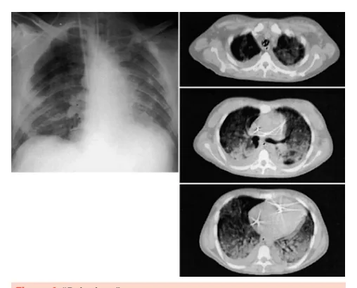
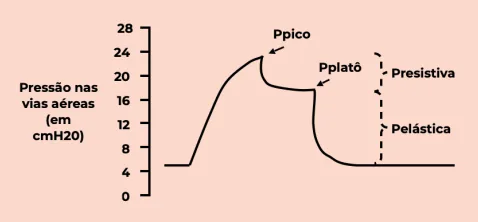
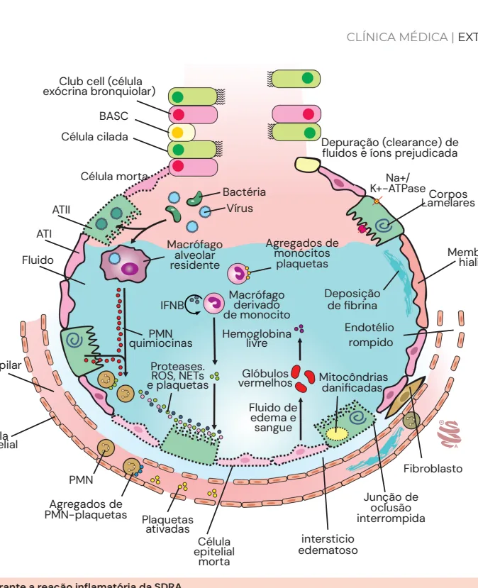
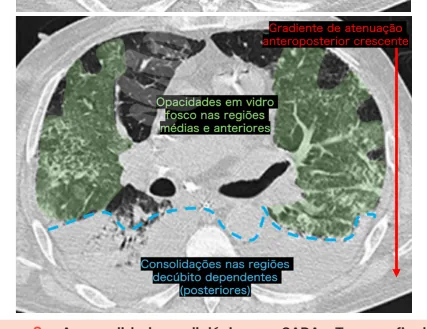
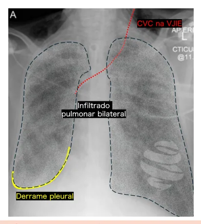

# Síndrome do Desconforto Respiratório Agudo (sdra)

<!-- page:1 -->

## SÍNDROME DO DESCONFORTO

## RESPIRATÓRIO AGUDO (SDRA)

Ventilação mecânica (CM) COVID (CM) SARA / SDRA (CM)

- SARA → P/F <300, agudo (<7 dias), infiltrado bilateral, não explicado por congestão cardiogênica; Diversas etiologias, incluindo pancreatite, politrauma, etc → lembrar da possibilidade no poli-inflamado.

## CLASSIFICAÇÃO DE GRAVIDADE

- SARA leve: P/F <300;

- SARA moderada: P/F <200;

- SARA grave: P/F <100.

## PILARES DO MANEJO

- 4-6 mL/kg, Pplatô < 30 cmH2O, driving pressure <

15 cmH2O, FR até 35 irpm;

- Hipercapnia permissiva: tolerar acidose respiratória protetora, desde que pH > 7,15 e que não ameace a vida do paciente.

CASO não seja possível manter ventilação

## HISTÓRIA

- O primeiro relato de SDRA foi no Lancet em 1967: Identificaram que os pacientes tinham lesão alveolar importante e a complacência pulmonar diminuída, e apresentavam relação de troca ruim; Geralmente com acidose e frequência respiratória alta.

- O conceito do “baby lung”: Foi introduzido em 2005; A massa funcional dos pulmões se encontrava reduzida devido às porções posteriores e inferiores do pulmão totalmente acometidas pelo infiltrado; Antes do infiltrado, o volume pulmonar era maior, mas depois houve perda de parênquima pulmonar, deixando, em tese, o pulmão menor como o de um bebê e a troca gasosa comprometida – já que temos uma área não ventilável/perfundível.

- Verificar Figura 1

## FISIOPATOLOGIA

- Reação inflamatória que atrai células inflamatórias, principalmente macrófagos e neutrófilos; MEDIDAS DE RESGATE

Bloqueio neuromuscular

- Somente se assincronias INCORRIGÍVEIS e incapacidade de manter ventilação protetora.

- Prona → para pacientes em ventilação mecânica otimizada há 12 horas, com relação

PaO2 / FiO2 < 150; pronar por pelo menos de 16 horas.

- Óxido nítrico → se hipoxemia refratária, com hipertensão pulmonar e disfunção de ventrículo direito.

- Recrutamento alveolar → em prova, nunca (aumento de mortalidade se usado de forma rotineira). Medida de resgate no caso de falha das anteriores.

- ECMO VV → hipoxemia ou hipercapnia refratárias a todas as medidas anteriores. Aumento da permeabilidade vascular decorrente da inflamação → resposta inflamatória vigorosa com a presença de muitos marcadores; A inflamação destrói pneumócitos e o surfactante também é comprometido à medida que o alvéolo é inundado por fluido inflamatório.

- Verificar Figura 2 na próxima página

Figura 1: “Baby lung”

---

<!-- page:2 -->

Club cell (célula exócrina bronquiolar) BASC Célula cilada Depuração (clearance) de Célula cilada Célula morta Bacté ATII Vírus ATI Macrófago alveolar Fluido residente Mac IFNB der de m PMN Hemo quimiocinas l Capilar Proteases.

ROS, NETs G e plaquetas ve Célula endotelial PMN Agregados de PMN-plaquetas Plaquetas ativadas Célula epitelial morta Figura 2: Alvéolo durante a reação inflamatória da SDRA.

## DEFINIÇÃO DE BERLIM

- É preciso preencher os quatro critérios para caracterizar SDRA.

Tabela 1: Definição de Berlim para SDRA. Critério LEVE MODERADA GRAVE Aparecimento súbito dentro de 1 Tempo de semana após exposição a fator de início risco ou aparecimento ou piora de sintomas respiratórios 201-300 101 – 200 Hipoxemia ≤ 100 com com PEEP/ com PEEP (PaO2/FiO2) PEEP ≥5* CPAP ≥ 5* ≥ 5* Insuficiência respiratória não Origem do claramente explicada por insuficiência edema cardíaca ou sobrecarga volêmica Anormalidades Opacidades bilaterais** radiológicas * ESICM 2023 sugeriu retirar a necessidade de PEEP como critério diagnóstico e sugeriu CNAF como primeira opção em IRpA hipoxêmica.

** Não explicados por nódulos, derrames, massas ou colapsos lobares/ pulmonares.

- Sempre lembrar que as anormalidades radiológicas devem ser bilaterais e a opacidade deve ter característica inflamatória, não sendo justificada por patologias cardíacas ou tumorais. Depuração (clearance) de fluidos e íons prejudicada éria K+-ATPase Corpos s monócitos Membrana plaquetas hialina crófago Deposição rivado de fibrina monocito oglobina livre rompido ermelhos danificadas edema e sangue oclusão interrompida intersticio edematoso pulmão em corte axial e janela de pulmão evidencia consolidações nas regiões posteriores e opacidades em vidro fosco nos demais campos, caracterizando um gradiente anteroposterior que pode ser visto no contexto de SARA. No geral, as regiões decúbitodependentes apresentam opacidades de maior atenuação.

Na+/ Lamelares Agregados de Endotélio Glóbulos Mitocôndrias Fluido de Fibroblasto Junção de Figura 3: - Anormalidades radiológicas na SARA - Tomografia de

---

<!-- page:3 -->

## DIAGNÓSTICOS DIFERENCIAIS

- Insuficiências cardíacas: derrames de origem cardíacas não podem ser classificadas como SDRA;

- Doenças do tecido conjuntivo;

Figura 4: Anormalidades radiológicas na SARA. Radiografia de tórax frontal evidencia infiltrado pulmonar bilateral com consolidações e derrame pleural à direita.

## FATORES DE RISCO

## LESÕES PULMONARES DIRETAS

- Pneumonias (bacterianas, virais e fúngicas);

- Aspiração de conteúdo gástrico;

- Contusão pulmonar; Lembrar que o pico da lesão por contusão pulmonar acontece após 48h.

- Lesão por inalação;

- Afogamento.

## LESÕES PULMONARES INDIRETAS

- Sepse;

- Trauma não torácico ou choque hemorrágico;

- Pancreatite;

- Grande queimado;

- Intoxicações medicamentosas;

- Transfusões;

- Circulação extracorpórea (CEC);

- Edema de reperfusão após transplante pulmonar ou embolectomia. - Doenças do tecido conjuntivo;

- Neoplasias;

- Pneumonias intersticiais;

- Tuberculose;

- Doença pulmonar induzida por medicação: Bleomicina ou amiodarona; Síndrome do extravasamento vascular induzido por imunoterapia.

- Hemorragia alveolar difusa: Infecciosas: leptospirose; Não infecciosas: vasculites, síndrome de

Goodpasture, etc.

## PILARES DO TRATAMENTO

- Ventilação mecânica protetora: Volume corrente (Vt) < 6 ml/Kg; Podendo chegar até 4 ml/kg.

- Pressão de platô < 30 cmH2O;

- Driving pressure (Pplat – PEEP) < 15 cmH20: Pressão de distensão alveolar.

- PEEP conforme FiO2 (PEEP table);

- FR preferencialmente entre 30-35 (atentar para auto-PEEP): A fim de manter a ventilação dita ‘’protetora’’, pode- se tolerar hipercapnia e acidose discretas hipercapnia permissiva).

(paCO2 até 80mmHg e pH até 7,15 – chamada de

- Balanço hídrico zerado ou negativo (a fim de evitar sobrecarga volêmica).

- Bloqueio neuromuscular é feito se: Assincronias incontroláveis.

Atenção! Prona se paO2/FiO2 < 150 com 12h de ventilação mecânica otimizada – lembrar que a prona deve ser feita por pelo menos 16h.

- Ajuste de PEEP conforme PEEP table – não decorar, consultar se necessário;

- Em casos de acidose metabólica: não adianta fazer ventilação protetora se o pH está muito baixo! Se o paciente apresenta acidose metabólica importante, é preconizado aumentar o volume corrente para 6-8ml/kg.

## BLOQUEADORES NEUROMUSCULARES

- Dois estudos avaliaram o uso, o ACURASYS e o

ROSE trial;

- Foram utilizados em pacientes com P/F < 150 e a infusão dos bloqueadores foi feita por pelo menos

48 horas;

- O ACURACYS mostrou redução de mortalidade e o

ROSE mostrou resultados semelhantes, sem benefício;

- Dessa forma, devemos individualizar a conduta para o nosso paciente.

---

<!-- page:4 -->

## HIPOXEMIA REFRATÁRIA REFERÊNCIAS

- Corticóide: Utilizar em SDRA por covid-19 (Recovery trial); Figura Cofexpress Discutível em outras etiologias. Radiopaedia. Radiopaedia.org – Radiology resource. disponível em: https://

- Ventilação oscilatória de alta frequência: radiopaedia.org/

- Ventilação oscilatória de alta frequência: r Foi relatado aumento de mortalidade (OSCAR e

OSCILLATE trial). R

- Óxido nítrico inalatório: r Hipoxemia refratária e disfunção de ventrículo direito: R Vasodilatação nas regiões onde há ventilação, r melhorando a perfusão dessas regiões.

- Manobra de recrutamento: R

- Em prova, NUNCA! r

- ECMO: medida de resgate - hipoxemia e hipercapnia refratária. radiopaedia.org/ radiopaedia.org/ radiopaedia.org/ radiopaedia.org/

Figura 1: “Baby lung” Radiopaedia. Radiopaedia.org – Radiology resource. disponível em: https:// Figura 3: Anormalidades radiológicas Radiopaedia. Radiopaedia.org – Radiology resource. disponível em: https:// Figura 4: Anormalidades radiológicas Radiopaedia. Radiopaedia.org – Radiology resource. disponível em: https://
