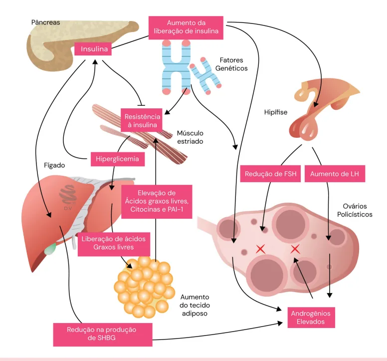

# Síndrome dos Ovários Policísticos (SOP)

<!-- page:1 -->

## Síndrome dos Ovários Policísticos (SOP)

- Endocrinopatia mais comum da mulher no menacme — 15% das mulheres em idade reprodutiva;
- **Tríade (Critérios de Rotterdam)**: irregularidade menstrual; hiperandrogenismo (clínico ou laboratorial); ovários micropolicísticos (> 20 folículos ou volume maior que 10 cc);
- **Diagnóstico é de exclusão**: afastar hiperplasia adrenal congênita, tumor virilizante, tireoidopatias, hiperprolactinemia ou iatrogenias;
- **Diagnóstico em adolescentes e adultos jovens**: em risco de SOP; no mínimo após 2 anos da menarca ou 18 anos de idade; se os sintomas forem persistentes.

## Considerações Gerais

- Descrita em 1935 por Stein-Leventhal: 7 pacientes com anovulação, hirsutismo e ovários aumentados que apresentaram ciclos regulares após a gestação ou ressecção ovariana;
- A síndrome dos ovários policísticos é a endocrinopatia mais comum em mulheres no período reprodutivo;
- Atinge de 6 a 20% (13,6%) das mulheres em idade reprodutiva;
- Não apresenta etiologia totalmente conhecida; teorias apontam para a correlação de origem genética poligênica, ambiental e multifatorial;
- Heterogeneidade das manifestações clínicas: diferentes apresentações e critérios diagnósticos; em virtude de tal fato, o estabelecimento do diagnóstico é difícil;
- **Tripé da SOP**:
  - Hiperandrogenismo em 80% dos casos;
  - Anovulação crônica: infertilidade em 30-40% dos casos;
  - Alterações ultrassonográficas: até ¼ da população jovem pode apresentar ultrassom com ovários semelhantes ao de pacientes com SOP.

## Fisiopatologia

Dois pontos principais em relação aos mecanismos que envolvem a SOP.

### Hiperandrogenismo

- Há alteração na pulsatilidade do GnRH. Nesse sentido, observa-se: aumento na amplitude dos pulsos de GnRH; FSH normal, eventualmente baixo; LH elevado (geralmente há esse desbalanço);
- Ocorre um aumento da produção de androgênio pelas células da teca;
- A conversão de androgênios em estrona ocasiona uma proliferação endometrial;
- A elevada produção de androgênios e estrona cursa com feedback anormal no hipotálamo e na hipófise; a ausência de ovulação leva à ausência de progesterona, atuando no endométrio;
- A longo prazo, o indivíduo apresenta alteração do perfil lipídico.

### Hiperinsulinemia

- A redução de síntese de SHBG causa aumento de androgênios livres;
- O aumento de IGF-1 causa a inibição de FSH;
- A insulina tem ação sinérgica ao LH nas células da teca, aumentando a produção de androgênios;
- Aumento da resistência insulínica e hiperglicemia;
- Desbalanço LH/FSH: alteração do crescimento folicular (atresia) e produção ainda maior de androgênios;
- A produção hormonal deixa de ser cíclica.

## Fatores Genéticos

- Prevalência em mães e irmãs é maior que o dobro da população geral;
- Padrão de herança poligênico;
- Diferentes graus de penetrância, fatores ambientais e epigenéticos dificultam a identificação precisa;
- Diferentes genes e reguladores já foram descritos, o que pode justificar os diferentes fenótipos.

## Obesidade x SOP

- **Pacientes com SOP sem obesidade**: alteração na expressão dos receptores de LH nos ovários; hiperandrogenismo clássico.

---

<!-- page:2 -->

*Figura 1: Fisiopatologia da SOP.*

- **Pacientes com SOP e obesidade**: redução dos receptores de insulina periféricos → resistência insulínica + hiperinsulinemia; aumento dos receptores de insulina ovarianos → hiperandrogenismo.

Verificar Figura 1.

## Quadro Clínico

- A forma clínica é definida pela presença de hirsutismo;
- A quantificação é dada pelo índice de Ferriman-Gallwey > 5 (referências mais antigas usam o valor de corte > 8);
- Acne, seborreia: não existe definição precisa para o estabelecimento diagnóstico;
- Alopecia hiperandrogênica — frontal e central;
- Sintomas de virilização: clitoromegalia, aumento da massa muscular, alopecia, voz grossa. É incomum no contexto de SOP.

### Anovulação

- Presença de ciclos menstruais longos: > 35 dias ou < 8 ciclos por ano;
- Amenorreia: ausência da menstruação por período maior que 3 meses;
- Sangramento uterino anormal, não estrutural, de causa ovulatória.

### Infertilidade

- Anovulação crônica;
- Aumento da frequência de abortamento precoce.

## Síndrome Metabólica

- Obesidade: pode cursar com síndrome da apneia obstrutiva do sono (SAOS);
- Sinais de hiperinsulinemia: acantose nigricans; intolerância à glicose; diabetes mellitus tipo II (DM2);
- Dislipidemia (DLP);
- Hipertensão arterial sistêmica (HAS);
- É interessante lembrar os critérios diagnósticos de síndrome metabólica: circunferência abdominal > 102 cm em homens ou 88 cm em mulheres; triglicerídeos > 150; HDL < 40 em homens e < 50 em mulheres; PAS > 130 e/ou PAD > 85 mmHg; glicemia de jejum > 110.

## Diagnóstico

- É um diagnóstico de exclusão, mas precisa preencher critérios;
- A solicitação dos exames complementares se dá para descartar as demais causas de anovulação e de hiperandrogenismo;
- Os critérios da SOP são clínicos;
- Excluídas as demais causas, é possível estabelecer o diagnóstico através dos critérios de Rotterdam (2018);
- Critérios de Rotterdam: ver Figura 3.

---

<!-- page:3 -->

> ⚠️ Trecho reconstruído a partir de OCR de duas colunas — confira contra a fonte original.

### Fluxograma Diagnóstico

- **Oligo-amenorreia** → se **SIM**: SOP; se dúvida, descartar outras causas de tumor adrenal, hiperplasia adrenal congênita (HAC), tumor ovariano, disfunções tireoidianas, avaliando PRL, DHEA-S, 17-OHP, testosterona, PRL, TSH.

*Figura 2: Fluxograma diagnóstico da SOP.*

**Critérios de Rotterdam** — presença de pelo menos 2 dos 3 critérios:

- Hiperandrogenismo clínico ou laboratorial;
- Ciclos anovulatórios;
- USG com imagem sugestiva:
  1. Presença de 20 ou mais folículos com tamanho entre 2-9 mm (em pelo menos um ovário); e/ou
  2. Volume ovariano ≥ 10 cc (em pelo menos um ovário).

Verificar Figura 2.

**Adolescentes**:

- Comumente apresentam ciclos anovulatórios nos primeiros 2 anos após a menarca;
- Acne e sinais de hiperandrogenismo não são confiáveis nessa faixa etária;
- Os níveis de testosterona são variáveis e mais frequentemente elevados;
- Pode haver um padrão policístico na ultrassonografia dos ovários, que não deve ser usada no diagnóstico;
- Nesse sentido, o diagnóstico torna-se mais difícil pela perda do critério ultrassonográfico e pela frequente irregularidade menstrual;
- Inicialmente classificadas como "em risco de SOP";
- Diagnóstico no mínimo após 2 anos da menarca ou após 18 anos de idade, se os sintomas forem persistentes.

**Descartar outras causas de anovulação e hiperandrogenismo** — verificar Tabela 1.

> ⚠️ Tabela reconstruída a partir de OCR — confira contra a fonte original.

**Tabela 1: Diagnósticos diferenciais das causas de anovulação e hiperandrogenismo**

| Condição a excluir | Exame |
|---|---|
| Hiperprolactinemia | Prolactina |
| Hiperplasia adrenal congênita forma tardia (deficiência de 21-hidroxilase) | 17-OH-progesterona |
| Alteração na tireoide | TSH e T4 livre |
| Tumores secretores de androgênio ou uso exógeno | Testosterona total e livre, S-DHEA |
| Síndrome de Cushing | Cortisol salivar noturno às 23h ou teste de supressão com 1 mg de dexametasona |

**Teste de supressão com dexametasona**: administrar 1 mg de dexametasona por via oral às 23 horas do dia anterior, e colher amostra para a dosagem de cortisol entre 7 e 8 horas da manhã seguinte. O cortisol deve estar abaixo de 50 nmol/L. Realizar em casos com suspeita clínica. Não há indicação de realização rotineira.

*Os exames hormonais devem ser realizados entre o primeiro e o quinto dia do ciclo ou em qualquer época nas pacientes com amenorreia.*

---

<!-- page:4 -->

## Fenótipos

**Fenótipo A ("All")**

- Critérios diagnósticos: hiperandrogenismo + anovulação + ovários policísticos;
- Distúrbios reprodutivos e metabólicos: +++.

**Fenótipo B ("Barba")**

- Critérios diagnósticos: hiperandrogenismo + anovulação;
- Distúrbios reprodutivos e metabólicos: +++.

**Fenótipo C ("Cicla Normalmente")**

- Critérios diagnósticos: hiperandrogenismo + ovários policísticos;
- Distúrbios reprodutivos e metabólicos: ++.

**Fenótipo D ("Depilada")**

- Critérios diagnósticos: anovulação + ovários policísticos;
- Distúrbios reprodutivos e metabólicos: +/-.

**Obs.**: os fenótipos A e B apresentam quadros com repercussões endocrinológicas, reprodutivas e metabólicas mais graves. O fenótipo D demonstra repercussões menos graves, do ponto de vista endocrinológico.

## Avaliação Complementar — Exames Diagnósticos

- **Hormônio anti-mülleriano (AMH)**: algumas sociedades já passaram a aceitar seu uso em substituição ao critério ultrassonográfico (das informações acerca da reserva ovariana); se a paciente preencher critério com anovulação e hiperandrogenismo, não precisa de AMH ou USG; não tem um valor de corte único; idealmente, o valor do exame deve ser colocado numa curva conforme a idade da paciente (percentis); não usar em adolescentes;
- Androgênios, USG TV;
- Alterações frequentes — sem necessidade de solicitar: LH/FSH > 1 (inversão na relação LH/FSH); AMH elevado.

**Avaliação metabólica obrigatória**:

- Glicemia de jejum e HbA1c;
- Curva glicêmica;
- Síndrome metabólica: circunferência abdominal; perfil lipídico (TGL e HDL); pressão arterial.

## Tratamento

### Mudança de Estilo de Vida

- Introduzir atividade física e alimentação saudável;
- Perda ponderal em pacientes com sobrepeso ou obesidade (primeiro tratamento).

### Medicamentoso

- Metformina (> 1500 mg por dia) ou análogos do GLP-1 (liraglutida, semaglutida);
- Indicado nos casos de intolerância à glicose, acantose nigricans ou em pacientes obesas com antecedente familiar de DM2.

### Cirúrgico

- Considerar cirurgia bariátrica se obesidade > grau II e refratária;
- Na vigência de obesidade mórbida associada à falha do tratamento clínico.

### Disfunção Menstrual sem Hiperandrogenismo Clínico

Objetivar a proteção endometrial:

- Progestagênio intermitente por 10 dias — progesterona micronizada ou medroxiprogesterona;
- Contínuo — desogestrel (efeito contraceptivo);
- Anticoncepcional combinado oral: se hiperandrogenismo, preferir ciproterona ou gestodeno.

**Obs.**: uso de estrogênio exógeno aumenta a SHBG, o que reduz os níveis de androgênios (e estrogênios) livres circulantes.

### Tratamento da Infertilidade Associada

- Inicial: MEV + metformina; não utilizar antiandrogênicos ou contraceptivos;
- Avaliação completa do casal infértil;
- Indução de ovulação (coito programado ou IIU): letrozol (primeira escolha); clomifeno ou gonadotrofinas (2ª linha);
- Se for necessário realizar FIV, a paciente é de alto risco para hiperestímulo ovariano.

**Tratamento da Infertilidade — resumo geral (Pilares do tratamento)**:

- Mudanças de estilo de vida;
- Metformina;
- Tratamento da obesidade;
- Proteção endometrial +/- contracepção;
- Tratamento da infertilidade: se anovulação (ciclos irregulares) → letrozol 5 mg/dia por 5 dias. Perda de peso e uso de metformina podem normalizar o ciclo em mais da metade das pacientes.

**Investigação adicional**: glicemia de jejum (ou HbA1c), curva glicêmica; pressão arterial, circunferência abdominal, perfil lipídico; alta associação com síndrome metabólica.
