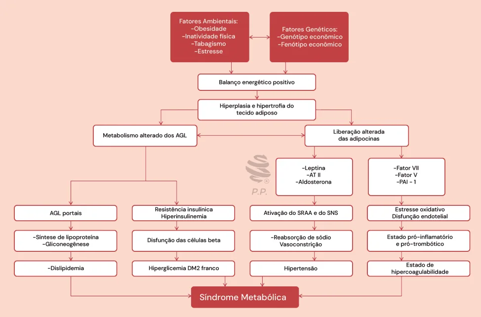
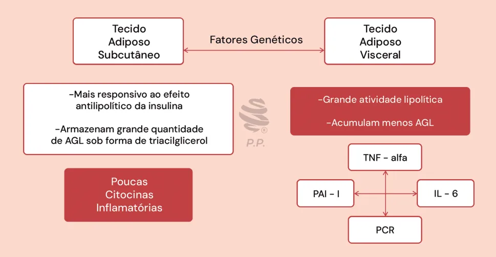
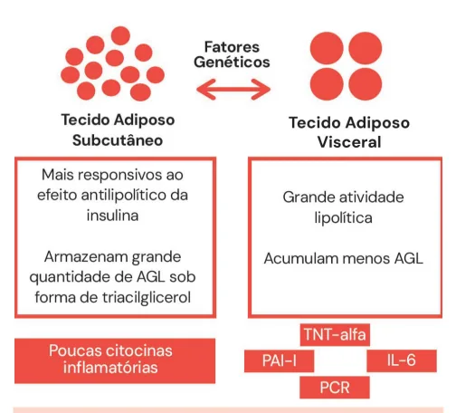
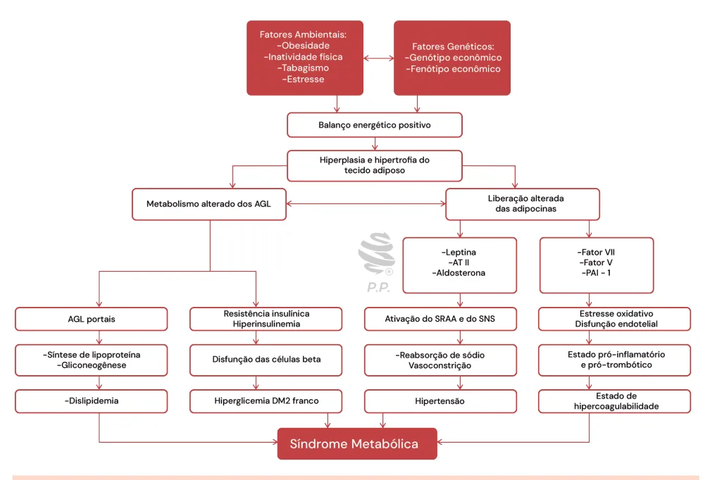

# Síndrome metabólica e Obesidade

<!-- page:1 -->

## SÍNDROME METABÓLICA

Síndrome Metabólica (CM)

## FISIOPATOLOGIA

COMPLICAÇÕES Diabetes Mellitus E Pré-Diabetes Elevado Risco Cardiovascular Doença Hepática Gordurosa Metabólica

- 3 x evento cardiovascular Câncer

- 4 x morte por DAC

- Mama, colorretal e endometrial

- 2,4 x morte por qualquer causa Doença De Alzheimer

---

<!-- page:2 -->

CRITÉRIOS DIAGNÓSTICOS 3 - PA elevada ou HAS 1 - Obesidade Abdominal

- IDF e NCEP

- IDF

- PA > ou = 130x85mmHg Mulheres > ou = 80cm 4 - TGL elevado Homens > ou = 94cm

- IDF e NCEP

- NCEP-ATP III z > ou = 150mg/dL Mulheres > ou = 88cm 5 - HDL baixo Homens > ou = 102cm

- IDF e NCEP

2 - GJ alterada ou DM

- Mulheres < ou = 50mg/dL

- IDF

- Homens < ou = 40mg/dL > ou = 100mg/dL IDF = Obesidade Abdominal + 2/4 critérios

- NCEP NCEP = 3/5 critérios > ou = 110mg/dL

## CONCEITO

- Pode ser dita como: Um conjunto interligado de fatores fisiológicos, bioquímicos, clínicos e metabólicos que aumentam diretamente o risco de doença cardiovascular e diabetes mellitus tipo 2.

## PRINCIPAIS MANIFESTAÇÕES E

## SUAS FISIOPATOLOGIAS

- Dislipidemia aterogênica;

- Hiperglicemia;

- Hipertensão;

- Estado de hipercoagulabilidade;

- Disfunção endotelial;

- Estresse oxidativo;

- Liberação de citocinas inflamatórias pelos Figura 1: Tecido Adiposo Visceral X Subcutâneo.

adipócitos viscerais;

## CRITÉRIOS/CLASSIFICAÇÃO

- Liberação excessiva de ácidos graxos livres;

- Resistência insulínica;

- Adiposidade visceral. NCEP-ATP III, 2001;

- Três ou mais dos seguintes critérios: obesidade

## FISIOLOGIA

abdominal (circunferência abdominal > 102 cm em homens e > 88 cm em mulheres); TGL ≥ 150 mg/dL;

- A base da síndrome metabólica parte do princípio HDL < 40 mg/dL (homens) e < 50 mg/dL (mulheres);

do acúmulo de tecido adiposo visceral; PA ≥ 130 x 85 mmHg ou diagnóstico de hipertensão

- Tecido adiposo visceral: demonstra células maiores, arterial sistêmica; GJ ≥ 110 mg/dL ou diagnóstico de com grande atividade lipolítica. Isto é, cliva e elimina diabetes mellitus.

elevada quantidade de ácidos graxos livres na circulação. É muito metabolicamente ativo, liberando INTERNATIONAL DIABETES FEDERATION, uma quantidade mais expressiva de citocinas 2005:

inflamatórias (TNF-alfa, PAI-I, IL-6 e PCR). Tal | Obesidade visceral (critério obrigatório); inflamação leva à resistência insulínica.

- Tecido adiposo subcutâneo: demonstra células Em homens: >94cm menores. É mais responsivo ao efeito antilipolítico da Em mulheres: >80cm insulina → isto é, a insulina é capaz de estocar maior quantidade de gordura dentro do tecido adiposo

- Associados a mais 2, dos seguintes critérios: TGL subcutâneo. Nesse sentido, é capaz de armazenar ≥ 150 mg/dL; HDL < 40 mg/dL (homens) e < 50 mg/ elevada quantidade de ácidos graxos livres sob a dL (mulheres); PA ≥ 130 x 85 mmHg ou diagnóstico forma de triacilglicerol. Sofre pouca influência das de hipertensão arterial sistêmica; GJ ≥ 100 mg/dL ou citocinas inflamatórias. diagnóstico de diabetes mellitus.

---

<!-- page:3 -->

Figura 2: Fisiopatologia da Síndrome Metabólica.

## COMPLICAÇÕES

- Associação com neoplasias Mama, colorretal e endometrial; Mediado

- Maior risco cardiovascular pela hiperinsulinemia, aumento do IGF-1, Epidemiologicamente, demonstra: 3x mais eventos inflamação crônica.

cardiovasculares; 4x mais mortes por DAC; 2,4x

- Doença de Alzheimer mais mortes por qualquer causa. | A resistência insulínica favorece algumas alterações, Tal fato é devido ao: HDL-c baixo; LDL pequeno tais quais: Aumento na produção de secreção de e denso elevado (demonstra maior potencial beta-amiloide; Redução na captação de glicose aterosclerótico pelo depósito na camada pelos neurônios; Formação de placas senis;

médiointimal dos vasos sanguíneos e apresenta Aumento da fosforilação de proteína tau. elevada capacidade oxidativa); Hipertrigliceridemia;

- Doença Hepática Gordurosa Metabólica

HAS; PAI-I elevado.

