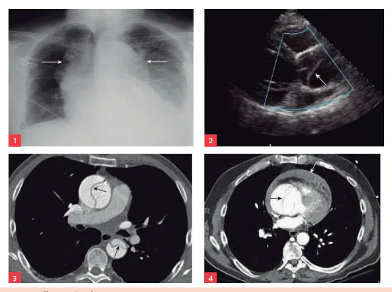
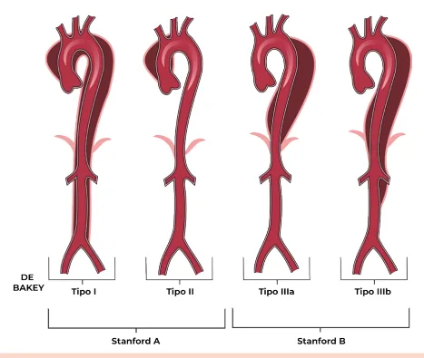

# Síndromes Aórticas Agudas

<!-- page:1 -->

Síndromes aórticas (CM); DEFINIÇÃO E FATORES DE RISCO D

- Quebra da integridade da parede da aorta, com potencial evolução rápida e fatal na ausência de tratamento.

- Dissecção de aorta, hematoma intramural e úlcera penetrante são as três manifestações, sendo a dissecção a mais comum e relevante.

- São fatores de risco para dissecção: hipertensão doenças inflamatórias da aorta; síndrome de Turner; T

Arterial (70%); tabagismo; doenças do colágeno (Marfan, Ehlers - Danlos); valva aórtica bicúspide; QUADRO CLÍNICO

- DOR ABRUPTA EXCRUCIANTE, afiada ou em “rasgo” no tórax ou dorso (90% dos casos). Sinais e sintomas associados: náusea, vômito, sudorese, síncope, sintomas neurológicos, insuficiência aórtica, insuficiência renal

(acometimento de aa. renais) e hipotensão (tamponamento ou rotura).

- Definição: condições em que há uma quebra da integridade da parede da aorta, com características clínicas semelhantes com evolução rápida e fatal, se não for tratado da maneira correta.

- Verificar Figura 1

## DISSECÇÃO DE AORTA

- Há um “rasgo” na camada íntima da aorta.

- Sangue penetra na camada média com alta pressão e empurra o flap de dissecção para o meio da aorta.

- Nesta condição há a separação dos lúmens:

verdadeiro e falso.

## HEMATOMA INTRAMURAL

- Ocorre um “vazamento” de sangue em baixas pressões para a camada média da aorta.

- Causas: rotura do vasa vasorum (vasos que ficam na adventícia da aorta) e microroturas da camada íntima

(não vistas em exames de imagem).

- No exame de imagem, há a aparência de um lúmen Ú preservado, mas há hematoma “ao redor” do lúmen, pois forma-se um trombo que “empurra” a camada mais externa da aorta para “fora”.

- DIAGNÓSTICO E COMPLICAÇÕES

- Escore ADD-RS 0 ou 1: Solicitar D Dímero (Se < 500 exclui SAA, Se > 500 realizar AngioTC de aorta)

- ADD-RS 2 ou 3: AngioTC de aorta.

- Se instabilidade hemodinâmica, realizar ecocardiograma na sala de emergência.

- São complicações: ruptura com choque hipovolêmico em poucos minutos, dissecção de ramos da aorta, AVC, infarto agudo do miocárdio, isquemia mesentérica, insuficiência renal.

## TRATAMENTO

- Analgesia, controle de FC e PA. Alvos: FC < 60 bpm e PA sistólica 100-120 mmHg. Usar esmolol ou metoprolol associados a nitroprussiato ou nitroglicerina;

- Stanford A: cirurgia cardíaca de emergência;

- Stanford B: cirurgia de emergência apenas se: rotura iminente, dor refratária, isquemia de órgão ou membro.

A B C Figura 1: A - Dissecção de Aorta; B - Hematoma intramural; C Úlcera penetrante. ÚLCERA PENETRANTE

- Ocorre a ruptura da placa aterosclerótica na aorta que permite que sangue entre para a camada média da aorta.

- Entretanto, a cicatriz/fibrose decorrente da aterosclerose confina a coleção de sangue (gerando, muitas vezes, um hematoma intramural).

- Como está relacionada à ruptura de placa aterosclerótica, acomete mais pacientes idosos e com fatores de risco cardiovascular.

---

<!-- page:2 -->

## DISSECÇÃO DE AORTA EXAME FÍSICO

- Sopro de insuficiência aórtica. Deve-se procurar ativamente em todo paciente com queixa de dor torácica aguda!

- Hipertensão refratária: envolvimento das

Figura 2: Dissecção de aorta FATORES DE RISCO

- Hipertensão Arterial (70%);

- Tabagismo;

- Doenças do Colágeno (Marfan, Ehlers - Danlos):

alteram a estrutura da aorta, deixando-a muito mais frágil; forças hidrodinâmicas normais atuam sobre uma camada média já enfraquecida;

- Valva Aórtica Bicúspide;

- Doenças Inflamatórias da Aorta: sífilis terciária (arterite sifilítica); arterite de Takayasu;

- Síndrome de Turner;

OBS: Valva aórtica bicúspide: interrompe o fluxo laminar e o reorienta, direcionando-o para a parede da aorta, aumentando o estresse de cisalhamento no local, devido ao aumento do turbilhonamento do sangue.

- Complicações: Rotura (paciente pode chegar à exsanguinação em poucos minutos); Dissecção de ramos da aorta: AVC, infarto agudo do miocárdio, isquemia mesentérica, insuficiência renal;

## QUADRO CLÍNICO

- DOR ABRUPTA EXCRUCIANTE no tórax ou dorso (90% dos casos). Qualidade: “afiada” ou “rasgo”.

- Sinais e sintomas associados: Náusea, vômito, sudorese. Síncope por tamponamento cardíaco (dissecção para o pericárdio), interrupção transitória do fluxo sanguíneo para a vasculatura cerebral (dissecção de carótidas), hipovolemia (rotura), tônus vagal excessivo ou arritmias. Sintomas neurológicos. Insuficiência aórtica. - Hipertensão refratária: envolvimento das artérias renais.

- Hipotensão: Tamponamento cardíaco (dissecção para o pericárdio) OU Hipovolemia (rotura);

- Em todo paciente com dor torácica, deve-se aferir pressão arterial nos 4 membros, pois quando há sistólica dos membros superiores, é um sinal indicativo de dissecção de aorta. É um sinal de baixa sensibilidade, mas quando está presente é muito específico.

20 mmHg ou mais de diferença na pressão arterial

## DIAGNÓSTICO

- Escore de Risco ADD-RS: é um escore utilizado para avaliar o risco do paciente ter dissecção aórtica, levando em consideração fatores de risco, característica da dor torácica e exame físico, como você pode observar abaixo:

a Escore de Risco ADD-RS

## 1. CONDIÇÃO 2. DOR DE ALTO 3. EXAME

DE ALTO RISCO? RISCO? FÍSICO DE ALTO RISCO? Marfan, Hx Dor torácica, Sopro novo de familiar de abdominal ou IAo, Diferença de dissecção, em dorso pulsos, Sinais manipulação abrupta, de forte neurológicos recente na intensidade focais, aorta, aneurisma ou em choque/hipode aorta, rasgando tensão.

valvopatia aórtica. CONDIÇÃO DOR DE ALTO EXAME DE ALTO RISCO? RISCO? FÍSICO DE ALTO RISCO? 0 ou 1 2 ou 3 D-dímero Angiotomografia de aorta SAA <500 Diagnóstico Definitivo:

- ESTÁVEL: angiotomografia de aorta total.

- INSTÁVEL: ecocardiograma Sinais de instabilidade: dor torácica; hipotensão;

(preferencialmente transesofágico). alteração do nível de consciência.

---

<!-- page:3 -->

Figura 3: Exames de imagem - dissecção de aorta.

1. Radiografia de tórax: alargamento mediastinal; 2.

Ecocardiograma: seta aponta para o flap de dissecção; 3. Angiotomografia: setas apontam para o flap de dissecção, presentes na aorta ascendente e descendente; 4.

Angiotomografia: seta preta aponta para flap da aorta ascendente e seta branca aponta para derrame pericárdico.

## CLASSIFICAÇÃO C

- - T

Figura 4: Classificações de Stanford e de De Bakey.

- Existem dois tipos de classificação para a dissecção S de aorta, a classificação de Stanford e a classificação de De Bakey.

- Classificação de Stanford É a mais importante de ser memorizada - pois vai guiar a conduta; STANFORD A: Há acometimento da aorta ascendente; STANFORD B: Não há acometimento da aorta ascendente.

- Classificação de De Bakey R Tipo I: Há acometimento da aorta ascendente e descendente; | Tipo II: Há acometimento da aorta ascendente isolada; Tipo IIIa: Há acometimento da aorta descendente limitada pelo diafragma; Tipo IIIb: Há acometimento da aorta descendente que ultrapassa o limite do diafragma.

## CONDUTA

- Conduta inicial: sala de emergência, monitorização, acesso venoso, oxigenioterapia e coletar exames.

- Controle de dor: morfina ou outra analgesia potente.

- Controlar fatores que aumentam a dissecção: Controle de FC: alvo de 60 bpm → esmolol BIC metoprolol - 5 mg, podendo ser repetida por, no máximo, três vezes (dose máxima 15 mg). Controle de PAS: alvo de 100-120 mmHg → Se PAS

frequência cardíaca (FC) e pressão arterial (PAS). EV (titular a dose pelo peso do paciente) OU

> 120 mmHg mesmo após o uso do esmolol ou metoprolol → nitroprussiato. Se hipotenso: volume + noradrenalina (vasopressor).

Stanford A

- Cirurgia de emergência.

- Mortalidade: 1 a 2 % por hora, 50% nas primeiras 48 h.

Stanford B

- Cirurgia vascular de emergência se: sinais de rotura iminente, dor refratária, isquemia de órgão ou membro.

- Na ausência desses 3 fatores, pode-se adotar uma conduta conservadora: expectar e programar a correção de forma eletiva, se necessário.

## REFERÊNCIAS

Figura 3: Exames de imagem - dissecção de aorta. Radiopedia.Disponível em radiopaedia.org

