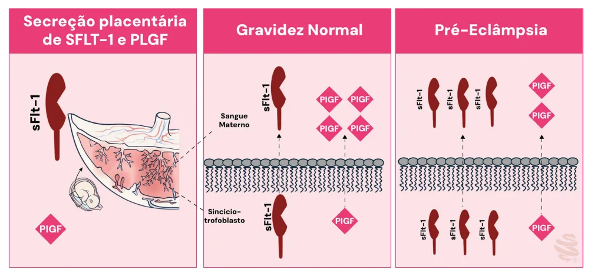

# Síndromes Hipertensivas na Gestação — Parte 2

<!-- page:1 -->

## Síndromes Hipertensivas na Gestação — Parte 2

### Pré-Eclâmpsia

- **Eclâmpsia**: convulsões tônico-clônicas generalizadas autolimitadas. Conduta: estabilização; sulfatação; resolução (não intempestiva); fazer controle de diurese.
- **Sulfato de magnésio**: esquemas Zuspan x Pritchard. Cuidado com a função renal. Não usar em casos de miastenia gravis. Ter gluconato de cálcio sempre à disposição.
- **Síndrome HELLP** é diagnóstico laboratorial (hemólise + alteração hepática + plaquetopenia): BI > 1,2 | DHL > 600 | TGO/TGP > 70 | Plaquetas < 100.000.

## Eclâmpsia

- Convulsões tônico-clônicas generalizadas e/ou coma associadas à pré-eclâmpsia.
- Quadro autolimitado.
- Casos atípicos sempre merecem investigação.

### Os 10 Passos da Eclâmpsia

1. Aspirar secreções + protetor bucal (Guedel).
2. Sat O2 + O2 a 8-10 L/min.
3. Instalar SG 5% IV.
4. Coleta de sangue + urina.
5. Decúbito lateral ou semi-sentada.
6. Sulfato de magnésio.
7. Nifedipina VO ou hidralazina EV se PA ≥ 160/110 mmHg.
8. Sonda vesical de demora.
9. Aguardar recuperação.
10. Programar interrupção.

- **Objetivo primário**: preservar via aérea e garantir oxigenação.
- Evitar indicar a resolução da gestação de maneira intempestiva.
- Controle clínico materno melhora oxigenação fetal (e reduz acidose).
- Cirurgia pode agravar quadro materno.
- Aguardar 4-6 horas — via obstétrica.

## Sulfato de Magnésio

### Indicações

- Se houver sinais de deterioração clínica e/ou laboratorial.
- Iminência de eclâmpsia.
- HELLP.
- Hipertensão de difícil controle / pico pressórico.

### Prevenção da Pré-Eclâmpsia

- Indicada se 1 fator de alto risco ou 2 fatores de risco moderado.
- Medicações: AAS 100 mg (ou 150 mg) + cálcio 1-2 g.
- **Predição de pré-eclâmpsia**: PLGF (fator de crescimento placentário) pode ajudar na predição; sFlt-1/PLGF pode auxiliar em casos duvidosos. Exame caro.

**Uso de sulfato de magnésio não indica o parto.**

### Sulfato de Magnésio (USP-SP)

- Sulfato de magnésio é um estabilizador de membrana e atua como profilaxia de convulsões.

**Indicações**:

- Iminência de eclâmpsia (obrigatória a tríade de sintomas).
- Trabalho de parto em pacientes com pré-eclâmpsia grave ou sobreposta.
- Seu uso indica parto.

### Esquemas de Tratamento

**Zuspan**:

- Ataque: 4 g IV lentamente.
- Manutenção: 2 g/h IV.

**Pritchard**:

- Ataque: 4 g IV lentamente + 10 g IM.
- Manutenção: 5 g IM 4/4h.
- Melhor esquema para situações em que for necessário transportar a paciente.
- Não usar se plaquetopenia.

**Contraindicação**: não usar se miastenia gravis.

- Se nova convulsão → nova dose de ataque de 2 g.
- Estado de mal epiléptico → indicada neuroimagem.
- Se foram feitas duas doses de "ataque" e sem controle → indicado benzodiazepínico.

### Cuidados

- Se houver insuficiência renal (creatinina > 1,3 mg/dL) → aplicar metade da dose.

### Critérios para Manutenção

- Reflexos patelares presentes.
- FR ≥ 12 irpm (ou 14 ou 16).
- Diurese ≥ 25 mL/h.

---

<!-- page:2 -->

- Dosar magnésio sérico somente se houver insuficiência renal ou redução de reflexos patelares.
- Níveis acima de 7 mEq/L podem gerar sinais de toxicidade.

**Tabela 1: Níveis de Magnesemia e Efeito Sistêmico Observado**

> ⚠️ Tabela reconstruída a partir de OCR — confira contra a fonte original.

| Magnesemia | Efeito |
|---|---|
| 4 – 7 mEq/L | Níveis terapêuticos |
| 8 – 10 mEq/L | Abolição de reflexo patelar |
| ≥ 12 mEq/L | Risco de parada cardiorrespiratória |

### Diagnóstico Diferencial

- Esteatose hepática da gravidez.
- Púrpura trombocitopênica trombótica (PTT).
- Síndrome hemolítico-urêmica.
- Hepatite aguda.

### Critérios para Suspensão

- Depressão respiratória.
- Diurese insuficiente.
- Abolição de reflexos patelares.

Se os critérios de suspensão estiverem presentes:

- Reavaliar de 1/1h até conseguir retornar; se aguardou até 2h, pode só retornar o esquema de tratamento; se passar de 2h, deve fazer novo ataque de 2 g.

### Intoxicação

- **Antídoto**: gluconato de cálcio 10% (1 g) EV.
- Indicado se: depressão respiratória e/ou abolição de reflexos profundos.
- Dar suporte respiratório: O2 5 L/min por máscara.

## Hipotensores de Ação Rápida

- **Meta**: redução de 15–25% na primeira hora.
- Diante de edema agudo de pulmão ou limitação da função do rim que indique terapêutica com diurético, a furosemida está eleita.

## Síndrome HELLP

- É uma complicação caracterizada por hemólise, elevação de enzimas hepáticas e plaquetopenia → diagnóstico laboratorial.

### Diagnóstico

**Hemólise**:

- Bilirrubina indireta > 1,2 mg/dL.
- DHL > 600 UI/L.
- Esquizócitos em sangue periférico.

**Alteração hepática**:

- TGO/AST ou TGP/ALT > 70 UI ou > 2x valor de referência.

**Plaquetopenia**:

- Plaquetas < 100.000/mm³.

**Tabela 2: Esquemas de Tratamento Anti-Hipertensivo em Caso de Eclâmpsia**

> ⚠️ Tabela reconstruída a partir de OCR — confira contra a fonte original.

| Medicação | Via | Dose |
|---|---|---|
| Hidralazina | EV | 5 mg (máx 30 mg) |
| Nifedipino | VO | 10 mg (máx 30 mg) |
| Nitroprussiato de sódio | EV | 0,5 – 10 mcg/kg/min |

### Diagnósticos Diferenciais (HELLP)

- Hepatite aguda.
- Colecistite.
- Pancreatite.
- Lúpus.
- Choque séptico.

### Classificação de Martin (1983)

- **Classe I**: < 50.000 plaquetas — maior risco de CIVD.
- **Classe II**: > 50.000 e < 100.000/mm³.
- **Classe III**: > 100.000 e < 150.000/mm³.

## Conduta (Síndrome HELLP)

- Ultrassonografia de abdome: avaliação hepática.
- Fazer controle de pressão arterial.
- Meta de parto: 34 semanas, desde que excelente controle clínico e melhora laboratorial progressiva; plaquetas devem estar, obrigatoriamente, > 100.000/mm³.

**Plaquetas**:

- Parto cesáreo → ideal ≥ 50.000/mm³.
- Parto vaginal → ideal ≥ 20.000/mm³ (pode transfundir).
- Se > 70.000/mm³, permite bloqueio de neuroeixo (ex.: raquianestesia).
- Dexametasona se < 50.000/mm³.

**Lembre-se**:

- É uma indicação de sulfato de magnésio (Ministério da Saúde).
- Para USP-SP, se for síndrome HELLP isolada (sem iminência de eclâmpsia ou eclâmpsia), não indica sulfatação.

## Calculadora fullPIERS

- Calculadora que pode auxiliar na identificação de pacientes com maior risco de complicação em 48h até 7 dias.
- Ajuda se houver dúvida, para: resolução ou não da gravidez; necessidade de UTI.
- Valor de corte: a partir de 30%.
- Parâmetros: idade gestacional; dor torácica ou dispneia; plaquetas; creatinina; AST/TGO; saturação de O2.

---

<!-- page:3 -->

**Tabela 3: Fatores de Risco para Pré-Eclâmpsia**

> ⚠️ Tabela reconstruída a partir de OCR — confira contra a fonte original.

| Risco | Apresentação clínica e/ou obstétrica |
|---|---|
| Alto | História de pré-eclâmpsia, principalmente acompanhada de desfechos adversos; gemelaridade; obesidade (IMC > 30); HAC; DM1 ou DM2; DRC; doenças autoimunes (ex.: lúpus, síndrome antifosfolípide) |
| Moderado | Nuliparidade; história familiar de pré-eclâmpsia (mãe e/ou irmãs); baixo nível socioeconômico; etnia afrodescendente; idade ≥ 35 anos; história pessoal de baixo peso ao nascer; gravidez prévia com desfecho adverso; intervalo > 10 anos desde a última gestação |
| Baixa | Gravidez prévia de termo e sem intercorrências |

*Figura 1: Comparação entre as secreções de sFlt-1 e PLGF em gestações normais e as complicadas com pré-eclâmpsia.*

## Extras & Prevenção

### Prevenção

- AAS 100 mg, 1x à noite, para pacientes de maior risco. Início até 16 semanas; manter até 36 semanas ou até o diagnóstico de pré-eclâmpsia.
- Cálcio 1-2 g/dia, indicado para todas as pacientes.
- Prevenção indicada para pacientes com 1 fator de alto risco ou ≥ 2 de risco moderado.

### Predição de Pré-Eclâmpsia

- Os marcadores sFlt-1 e PLGF auxiliam na diferenciação diagnóstica de síndromes hipertensivas na gestação; sFlt-1 (*soluble fms-like tyrosine kinase-1*) é fator antiangiogênico e PLGF (*placental growth factor*) é angiogênico. Em uma gravidez normal, espera-se PLGF abundante e baixos níveis de sFlt-1.
- A avaliação desses marcadores tem alto VPN para pré-eclâmpsia.
- Em uma gestação complicada com pré-eclâmpsia, há aumento da relação sFlt-1/PLGF, o que é marcador de má vascularização e aumento da resistência vascular.
- sFlt-1/PLGF ≤ 38 (na dúvida diagnóstica) → exclusão do diagnóstico nos próximos 7 a 14 dias.

