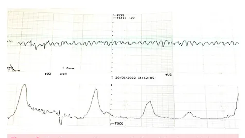
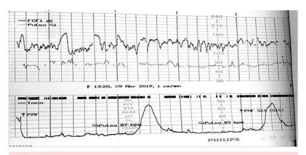
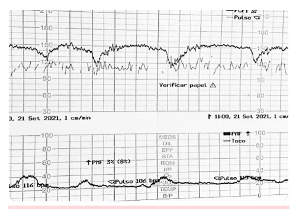
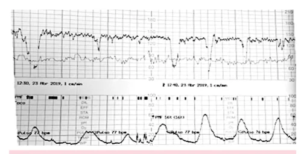

# Sofrimento Fetal Agudo

<!-- page:1 -->

## CATEGORIA I (INTRAPARTO)

- FC entre 110-160 bpm;

- Variabilidade entre 5 a 25 bpm;

- Aceleração transitória ou não!

- Desaceleração tipo I (DIP I) ou não!

Conduta

- Expectante.

## CATEGORIA II

- Não é categoria I nem categoria III;

- Reanimação intrauterina: mudança de decúbito, oxigênio suplementar, parar ocitocina e fluidos endovenosos.

## CATEGORIA III (INTRAPARTO)

- Variabilidade ausente + desacelerações tardias ou Bradicardia fetal;

(tipo2) / variáveis de mau prognóstico recorrentes

- Padrão Sinusoidal.

- Hipoxemia fetal leva à acidose;

- Causas agudas: Hipovolemia, hipotensão, hipertonia, taquissistolia, procidência de cordão.

- Causa Crônica: Insuficiência placentária.

## CARDIOTOCOGRAFIA

## INTRAPARTO

## CATEGORIA 1

- FC entre 110-160 bpm;

- Variabilidade entre 6-25 bpm;

- Aceleração transitória ou não!

- Desaceleração tipo I (DIP I) ou não!

Figura 1: Cardiotocografia categoria 1.

## CATEGORIA 2

- Não é nem categoria 1 nem categoria 3.

## CATEGORIA 3

- Variabilidade ausente + Desacelerações tardias

(tipo2) / variáveis de mau prognóstico recorrentes ou Bradicardia fetal; Conduta

- Reanimação intrauterina + parto imediato.

DESACELERAÇÕES DIP I (precoce)

- Desaceleração coincide com contração;

- Estímulo vagal;

- Bom prognóstico.

## DIP II (TARDIA)

- Desaceleração após contração;

- Hipóxia fetal (acidemia);

- Mau prognóstico.

## DIP III (VARIÁVEL)

- Desaceleração independe da contração;

- Compressão funicular;

- Bom ou Mau prognóstico.

- Padrão sinusoidal: Sinal de anemia fetal grave; Quadro de hipoxemia grave, com alto risco de óbito intraútero.

Figura 2: Cardiotocografia categoria 3, padrão sinusoidal.

## DESACELERAÇÕES - TIPOS

## TIPO 1 OU PRECOCE

- Queda gradual e simétrica;

- O Nadir da desaceleração coincide com o pico da contração;

- Mecanismo: estimulação vagal em decorrência da compressão cefálica durante a contração.

Figura 3: Desaceleração tipo 1.

---

<!-- page:2 -->

## TIPO 2 OU TARDIA

- Queda gradual e simétrica;

- Nadir da desaceleração ocorre após contração;

- Mecanismo: hipóxia fetal decorrente da redução do fluxo uteroplacentário durante contração uterina.

fluxo uteroplacentário durante contração uterina. Figura 4: Desaceleração tipo 2 (tardia). TIPO 3 OU VARIÁVEL

- Queda abrupta de frequência cardíaca fetal;

- Nadir da desaceleração independe da C contração uterina;

- Mecanismo: ocorre em decorrência da compressão do cordão umbilical;

- Pode, ou não, estar associada a sofrimento fetal.

- C

- Figura 5: Desaceleração variável (variável).

DIP 3 de mau prognóstico

- Retorno lento à linha de base;

- Duração >60s; A

- Recuperação em níveis inferiores à linha de base original; A

- Taquicardia compensatória;

- Queda da FC abaixo de 70bpm; A

- Morfologia em “W”;

A Figura 6: Cardiotocografia com desaceleração tardia de mau prognóstico. OBS.: Não confundir tipo III com tipo I ou II, somente pela desaceleração estar associada com uma contração.

## CONDUTA

- Expectante.

- Medidas de ressuscitação intrauterina: Oxigenoterapia suplementar; Decúbito lateral esquerdo; Fluidos endovenosos; Suspender ocitocina; Correção de Hipoglicemia.

- Após medidas de ressuscitação, deve-se repetir a cardiotocografia: Se melhorar → continuar assistência ao trabalho de parto; Se igual ou pior → parto pela via mais rápida.

- Ressuscitação intrauterina + parto imediato!

## REFERÊNCIAS

Figura 1: Cardiotocografia categoria 1. Arquivo Medcof Figura 2: Cardiotocografia categoria 2. Arquivo Medcof Figura 3: Cardiotocografia categoria 3, padrão sinusoidal.

Arquivo Medcof Figura 4: Desaceleração tipo 1. Arquivo Medcof Figura 5: Desaceleração tipo 2 (tardia).

Arquivo Medcof Figura 6: Desaceleração variável (variável). Arquivo Medcof

