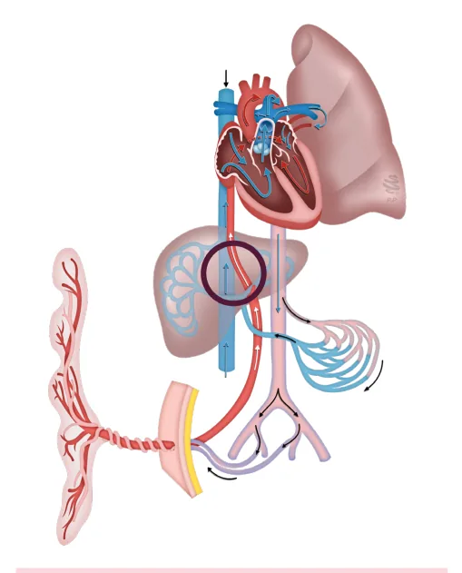
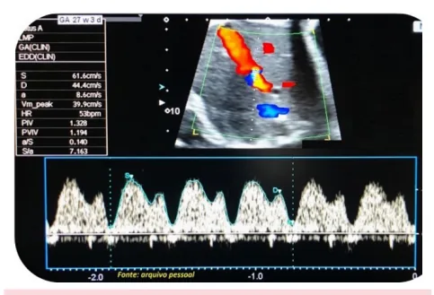

# Sofrimento Fetal Crônico

<!-- page:1 -->

## PBF = CTB + MR + MC + T + LA

- Fluxo uteroplacentário;

Índice de Líquido Amniótico

- Útil para diagnóstico diferencial de RCF x PIG e risco

- ≤ 5cm: oligoâmnio; de pré-eclâmpsia.

- 5,1 a 8cm: reduzido; Ducto Venoso

- 8,1 a 18cm: normal;

- Fluxo fetal;

- 18,1 a 24,9cm: aumentado;

- Avalia acidemia e função cardíaca;

- ≥ 25cm: polidrâmnio.

- IPV > 1 = Sofrimento fetal.

Maior Bolsão Vertical Artéria Umbilical

- <2cm: oligoâmnio;

- Fluxo feto-placentário;

- 2 e 2,9cm: reduzido;

- Avalia insuficiência placentária;

- 3-8cm: normal;

- Dx diferencial de RCF x PIG.

- >8cm: polidrâmnio; Artéria Cerebral Média

Oligoâmnio – Conduta

- Fluxo fetal;

- Expectante:

- Avalia priorização de órgãos-nobres; Malformações fetais;

- Estratificação de anemia fetal. Etiologia transitória hidratar, Rearranjo Hemodinâmico Fetal compensar doença etc.

- Na vigência de insuficiência placentária, as

- Conduta ativa (Parto): alterações hemodinâmicas ocorrem em ordem: Refratariedade clínica; | Artéria umbilical → artéria cerebral média → IG ≥ 37sem sempre; ducto venoso. IG ≥ 34sem se oligoâmnio grave;

- Centralização hemodinâmica fetal ocorre quando RCF ou Insuficiência Placentária. há aumento de resistência ao fluxo na artéria umbilical com queda da resistência na artéria

Atenção cerebral média: Corticoterapia se IG entre 25 e 34sem | Priorização de órgãos nobres (coração, Conduta não engloba RPMO cérebro e adrenais).

Parto por via obstétrica

- Alteração do ducto venoso sugere acidemia = sofrimento fetal.

## DOPPLERVELOCIMETRIA OBSTÉTRICA

Artérias Uterinas

- Não avalia vitalidade fetal;

| Aloimunização; | Colestase gravídica; AVALIAÇÃO DA VITALIDADE FETAL | Gestação prolongada; Tem por objetivo proteger o feto dos potenciais | Ruptura prematura de membranas ovulares.

efeitos da hipoxemia (aguda ou crônica) no decorrer Como avaliar da gestação.

- Cardiotocografia;

Indicações

- Perfil biofísico fetal – inclui cardiotocografia;

- Morbidades prévias:

- Perfil hemodinâmico fetal; Síndromes hipertensivas;

- Mobilograma*. Diabetes mellitus 1 e 2; Lúpus eritematoso sistêmico; * O Ministério da Saúde, em 2022, orienta a paciente, Síndrome Antifosfolípide; através do Mobilograma, sobre a percepção da Tireoidopatias; movimentação fetal. Idealmente, deve-se perceber 10 Hemoglobinopatias; movimentos fetais em menos de 1 hora. Caso alcance Cardiopatias; valores menores, é necessária uma avaliação em Pneumopatias; ambiente de pronto-socorro com cardiotocografia Neoplasias. e/ou perfil biofísico fetal.

- Morbidades gestacionais: Síndromes hipertensivas; PERFIL BIOFÍSICO FETAL Diabetes mellitus gestacional; Parâmetros Restrição do crescimento fetal (RCF);

- Cardiotocografia; Malformações fetais;

- Movimentos respiratórios;

---

<!-- page:2 -->

- Movimentos fetais;

- Tônus fetal;

- Líquido amniótico.

Tabela 1: Tabela 1: Parâmetros de normalidade do perfil biofísico fetal. Parâmetro Normal (2 pontos)

2 acelerações transitórias Cardiotocografia (feto reativo) Movimentos 1 ou + movimentos por respiratórios 30 segundos em 30 minutos.

3 ou + movimentos corporais ou de Movimentos fetais O membros em 30 minutos.

- 1 ou + movimentos de flexão/ abertura/fechamento das mãos.

Tônus fetal extensão de extremidades, Líquido amniótico 1 bolsão vertical ≥2cm

- OBS: Apenas o líquido amniótico é o marcador de sofrimento fetal crônico, todos os demais, se alterados, P sugerem sofrimento fetal agudo.

Líquido Amniótico (LA)

- A partir de 20 semanas é composto, majoritariamente, por líquido pulmonar e urina fetal;

- Deglutição x Diurese: Deglutição > urina = LA reduzido → oligoâmnio; Urina > deglutição = LA aumentado → polidrâmnio.

OBS: Cálculo do ILA: avaliação de 4 quadrantes do abdome materno. Procede-se com traçado vertical, e mensuração da distância.

Tabela 2: Interpretação dos valores de líquido amniótico. Maior Bolsão Índice de Líquido Classificação Vertical Amniótico 0 0 Anidrâmnio

- Oligoâmnio grave

< 1 cm < 3 cm

- < 2 cm < 5 cm Oligoâmnio

2 – 3 cm 5 – 8 cm Reduzido 3,1 – 8 cm 8,1 - 18 cm Normal

- 18,1 – 24,9 cm Aumentado

> 8 cm ≥ 25 cm Polidrâmnio Figura 1: Avaliação do índice líquido amniótico.

Oligoâmnio

- Causas fetais: RCF, malformações congênitas (ex:

doenças renais), gestação prolongada, pós-datismo;

- Causas maternas: insuficiência uteroplacentária vasculopatia, trombofilias, nefropatias, colagenoses, etc.), desidratação, infecção, medicações

(síndromes hipertensivas, diabetes com (betabloqueadores, IECA, diuréticos, etc.);

- Membranas ou placentárias: síndrome de transfusão feto-fetal, ruptura prematura de membranas ovulares.

Pontuação e Risco Tabela 3: Interpretação dos resultados do perfil biofísico fetal. Pontuação do PBF Interpretação 10/10 ou 8/10 (sem Baixo risco de hipóxia ou cardiotocografia)

asfixia fetal com LA normal. 8/10 com Provável hipóxia fetal crônica oligoâmnio 6/10 com LA Possível asfixia fetal ou resultado normal falso positivo 6/10 com Provável asfixia fetal oligoâmnio 4/10 Alta probabilidade de asfixia fetal 2/10 ou 0/10 Asfixia fetal Condutas

- 10/10 ou 8/10 com LA normal, ou 8/8 (sem cardiotocografia): conduta expectante;

- 8/10 com oligoâmnio: depende do oligoâmnio: Expectante, se: malformações fetais ou etiologia transitória (ex: desidratação); Parto, se: Refratariedade clínica; IG ≥ 37 semanas; IG ≥ 34 semanas e oligoâmnio grave (ILA < 3); RCF ou insuficiência placentária.

Oligoâmnio antes de 34 semanas: lembrar do uso de corticoide; Essas condutas não englobam casos de RPMO.

---

<!-- page:3 -->

- 6/10 com líquido normal: repetir em 6 – 24 horas. Se mantido, ou com piora, resolver a gestação;

- 6/10 com oligoâmnio: interrupção na viabilidade;

- 4/10: interrupção na viabilidade;

- 2/10 ou 0/10: interrupção na viabilidade.

- 2/10 ou 0/10: interrupção na viabilidade.

Artérias Uterinas:

- Avalia circulação uteroplacentária;

- Aplicações: Risco de pré-eclâmpsia; Risco de RCF; Diagnóstico de RCF x PIG; Incisura protodiastólica – risco de pré-eclâmpsia

(veja o segundo pico menor, ali é a incisura).

- Avaliação quantitativa → índice de pulsatilidade artéria esquerda): Alterado quando IP médio > percentil 95 para idade gestacional (IG).

(IP) médio entre a artéria uterina direita e a

- Avaliação qualitativa: Incisura protodiastólica: pode ser fisiológica até final do segundo trimestre.

Figura 2: Incisura protodiastólica. Artéria Umbilical

- Avalia circulação fetomaterna;

- Aplicações: Diagnóstico de RCF; Estratificação de gravidade da RCF.

- Avaliação quantitativa → IP: Alterado se IP > percentil 95 para IG; Avaliação qualitativa → fluxo diastólico final positivo. Figura 4: Doppler de artéria umbilical com fluxo diastólico final ausente.

(presente, zero ou ausente). Figura 3: Doppler de artéria umbilical com fluxo diastólico final Figura 5: Doppler de artéria umbilical com fluxo diastólico final reverso.

- Verificar Tabela 4 na próxima página.

Artéria Cerebral Média

- Avalia circulação fetal;

- Aplicações: Diagnóstico de RCF; Estratificação de gravidade da RCF; Predição de anemia fetal (ex: aloimunização); Avaliação quantitativa: IP: alterado se IP <percentil 5 para IG = vasodilatação cerebral; Relação cérebro-placentária (IP ACM/IP umbilical): Pico de Velocidade Sistólica (PVS) para estratificação de anemia fetal → avaliado em múltiplos da mediana (MoM).

alterado se <1 ou <p5 para idade gestacional. Quando alterada (vasodilatada), sugere tendência à priorização dos órgãos nobres fetais — cérebro, adrenais e coração.

Figura 6: Dopplervelocimetria normal de artéria cerebral média.

---

<!-- page:4 -->

Tabela 4: Valores de Referência de Doppler Obstétrico. Índices de Doppler Idade A Umb ACM RCP A Ut DV gestacional (PI) (PI) (PI) (PI)

(IPV)5 (semanas) (p95)¹ (p5)² (p5)³ (p95)4 20 2,03 1,37 0,65 1,61 >1.0 21 1,96 1,4 0,75 1,54 >1.0 22 1,9 1,45 0,85 1,47 >1.0 23 1,85 1,47 0,92 1,41 >1.0 24 1,79 1,5 1 1,35 >1.0 25 1,74 1,51 1,05 1,3 >1.0 26 1,69 1,52 1,1 1,25 >1.0 27 1,65 1,53 1,15 1,21 >1.0 29 1,57 1,53 1,2 1,17 >1.0 28 1,61 1,53 1,23 1,13 >1.0 30 1,54 1,52 1,25 1,1 >1.0 31 1,51 1,51 1,27 1,06 >1.0 32 1,48 1,5 1,28 1,04 >1.0 33 1,46 1,47 1,27 1,01 >1.0 34 1,44 1,43 1,27 0,99 >1.0 35 1,43 1,4 1,25 0,97 >1.0 36 1,42 1,37 1,22 0,95 >1.0 37 1,41 1,32 1,17 0,94 >1.0 38 1,4 1,28 1,23 0,92 >1.0 39 1,4 1,21 1,08 0,91 >1.0 Figura 7: Circulação fetal com destaque para ducto venoso 40 1,4 1,18 1 0,9 >1.0 (círculo preto).

1 Arduini e Rizzo, 1990 / Índice de pulsatilidade da artéria umbilical (anormal > p95) 2 Arduini e Rizzo, 1990 / Índice de pulsatilidade da artéria cerebral (anormal > p5)

3 Baschat, 2003 / Relação cérebro-placentário - PI ACM / PI A umb (anormal > p95) 5 Clínica Obstétrica HC - FMUSP / Ducto venoso Índice de pulsatilidade venosa (anormal > 1,0)

P - percentil Ducto Venoso

- Avalia circulação fetal;

- Aplicações: Avaliação dos casos mais graves de RCF precoce; Figura 8: Ducto venoso com onda “a” positiva e IPV normal. Insuficiência cardíaca fetal (ex: hidropisia); Rastreamento de aneuploidias e cardiopatias

(1º trimestre).

- Avaliação quantitativa → IP Venoso (IPV): IPV > percentil 95 (ou > 1,0) = aumento da resistência.

- Avaliação qualitativa → onda “a”: Onda “a” ausente; Onda “a” reversa.

- Indicativo de acidose fetal e representa a sobrecarga do coração direito;

- O ducto venoso é um shunt que joga sangue oxigenado da veia umbilical para a veia cava inferior.

Figura 9: Ducto venoso com IPV alterado (IPV >1).

---

<!-- page:5 -->

Fluxograma 1: Adaptação hemodinâmica fetal observada no doppler obstétrico. ↑ IP AU ↓IP ACM ↑IP DV + Centralização Fetal Priorização de órgãos nobres NÃO É sofrimento fetal Adaptação Hemodinâmica

- As alterações hemodinâmicas fetais seguem uma ordem fisiopatológica, de modo que elas são, tipicamente progressivas;

- A centralização fetal representa a priorização dos órgãos nobres e não indica sofrimento fetal;

- Verificar Fluxograma 1 .

## REFERÊNCIAS

Figura 1: Avaliação do índice líquido amniótico. Acervo Medcof Figura 2: Incisura protodiastólica. Fonte: ABIDOYE, I. A.; AYOOLA, O. O.; IDOWU, B. M.; ADERIBIGBE, A. S.; LOTO, O.

M. Uterine artery Doppler velocimetry in hypertensive disorder of pregnancy in Nigeria. Journal of Ultrasonography, v. 17, n. 71, p. 253-258, dez. 2017. Acidemia = Sofrimento Fetal Figura 3: Doppler de artéria umbilical com fluxo diastólico final positivo.

Acervo Medcof Figura 4: Doppler de artéria umbilical com fluxo diastólico final ausente. Acervo Medcof Figura 5: Doppler de artéria umbilical com fluxo diastólico final reverso.

Acervo Medcof Figura 6: Dopplervelocimetria normal de artéria cerebral média. Acervo Medcof Figura 8: Ducto venoso com onda “a” positiva e IPV normal.

Acervo Medcof . Figura 9: Ducto venoso com IPV alterado (IPV >1). y Acervo Medcof
