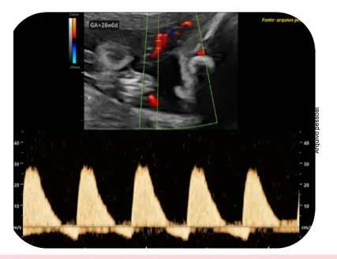
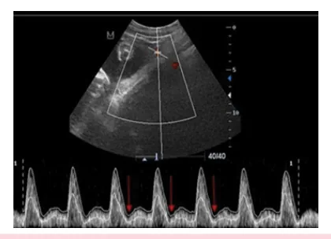

# Sofrimento Fetal Crônico

<!-- page:1 -->

## Visão Geral

### Perfil Biofísico Fetal (PBF)

**Componentes** — **PBF = Cardiotocografia + Movimentos Respiratórios + Movimentos Corporais + Tônus + Líquido Amniótico**

O perfil biofísico fetal integra múltiplos parâmetros para avaliar a vitalidade fetal e detectar sinais de sofrimento fetal crônico.

### Estudos de Fluxo — Parâmetros Principais

**Índice de Líquido Amniótico (ILA)**
- Útil para diagnóstico diferencial de **RCF (restrição de crescimento fetal) × PIG (pequeno para idade gestacional)** e risco de pré-eclâmpsia;
- Classificação:
  - ≤ 5 cm: oligoâmnio;
  - 5,1 a 8 cm: reduzido;
  - 8,1 a 18 cm: normal;
  - 18,1 a 24,9 cm: aumentado;
  - ≥ 25 cm: polidrâmnio.

**Maior Bolsão Vertical**
- < 2 cm: oligoâmnio;
- 2 a 2,9 cm: reduzido;
- 3-8 cm: normal;
- > 8 cm: polidrâmnio;
- Diagnóstico diferencial de RCF × PIG.

**Artéria Umbilical** — avalia fluxo feto-placentário e insuficiência placentária.

**Artéria Cerebral Média (ACM)** — avalia fluxo fetal, priorização de órgãos-nobres, estratificação de anemia fetal.

**Ducto Venoso** — avalia acidemia fetal e função cardíaca; **IPV > 1** = sofrimento fetal.

## Investigação da Vitalidade Fetal

### Objetivo

Proteger o feto dos potenciais efeitos da hipoxemia (aguda ou crônica) no decorrer da gestação.

### Métodos de Avaliação

- **Cardiotocografia**;
- **Perfil biofísico fetal** (inclui cardiotocografia);
- **Perfil hemodinâmico fetal**;
- **Mobilograma** — avaliação da percepção da movimentação fetal pela gestante (idealmente 10 movimentos fetais em menos de 1 hora; se menor, necessária avaliação em pronto-socorro com cardiotocografia e/ou perfil biofísico fetal).

### Indicações para Monitoramento Fetal

**Morbidades prévias**
- Síndromes hipertensivas;
- Diabetes mellitus tipos 1 e 2;
- Lúpus eritematoso sistêmico;
- Síndrome Antifosfolípide;
- Tireoidopatias;
- Hemoglobinopatias;
- Cardiopatias;
- Pneumopatias;
- Neoplasias.

**Morbidades gestacionais**
- Síndromes hipertensivas;
- Diabetes mellitus gestacional;
- Restrição do crescimento fetal (RCF);
- Malformações fetais;
- Aloimunização;
- Colestase gravídica;
- Gestação prolongada;
- Ruptura prematura de membranas ovulares (RPMO).

---

<!-- page:2 -->

## Perfil Biofísico Fetal

### Parâmetros de Normalidade

| Parâmetro | Normal (2 pontos) |
|---|---|
| **Cardiotocografia** (feto reativo) | 2 acelerações transitórias |
| **Movimentos respiratórios** | 1 ou mais movimentos por 30 segundos em 30 minutos |
| **Movimentos fetais** | 3 ou mais movimentos corporais ou de membros em 30 minutos; 1 ou mais movimentos de flexão/extensão de extremidades, abertura/fechamento das mãos |
| **Tônus fetal** | 1 ou mais movimentos de flexão/extensão de extremidades |
| **Líquido amniótico** | 1 bolsão vertical ≥ 2 cm |

> ⚠️ **Apenas o líquido amniótico é marcador de sofrimento fetal crônico.** Todos os demais parâmetros, se alterados, sugerem sofrimento fetal agudo.

### Líquido Amniótico (LA)

**Composição e Dinâmica**
- A partir de 20 semanas é composto majoritariamente por líquido pulmonar e urina fetal;
- **Deglutição vs. Diurese**:
  - Deglutição > urina = LA reduzido → oligoâmnio;
  - Urina > deglutição = LA aumentado → polidrâmnio.

**Cálculo do ILA**
- Avaliação de 4 quadrantes do abdome materno, com traçado vertical e mensuração da distância.

### Interpretação dos Valores de Líquido Amniótico

| Maior Bolsão Vertical | Índice de Líquido Amniótico (ILA) | Classificação |
|---|---|---|
| 0 | 0 | **Anidrâmnio** |
| < 1 cm | < 3 cm | **Oligoâmnio grave** |
| < 2 cm | < 5 cm | **Oligoâmnio** |
| 2-3 cm | 5-8 cm | **Reduzido** |
| 3,1-8 cm | 8,1-18 cm | **Normal** |
| — | 18,1-24,9 cm | **Aumentado** |
| > 8 cm | ≥ 25 cm | **Polidrâmnio** |

*Figura 1: Avaliação do índice de líquido amniótico.*

### Oligoâmnio — Causas e Conduta

**Causas fetais**
- RCF, malformações congênitas (doenças renais), gestação prolongada, pós-datismo.

**Causas maternas**
- Insuficiência uteroplacentária (vasculopatia, trombofilias, nefropatias, colagenoses, síndromes hipertensivas, diabetes);
- Desidratação;
- Infecção;
- Medicações (betabloqueadores, IECA, diuréticos).

**Causas relacionadas à membrana ou placenta**
- Síndrome de transfusão feto-fetal;
- Ruptura prematura de membranas ovulares.

**Conduta**
- **Expectante**: se etiologia transitória (ex: desidratação, medicação — hidratar, compensar doença etc.), ou se malformações fetais;
- **Ativa (Parto)**: se refratariedade clínica; IG ≥ 37 semanas; IG ≥ 34 semanas com oligoâmnio grave (ILA < 3) + RCF ou insuficiência placentária.
  - **Corticoterapia** se IG entre 25-34 semanas;
  - Essas condutas **não englobam casos de RPMO**.

### Interpretação dos Resultados do Perfil Biofísico Fetal

| Pontuação do PBF | Interpretação | Conduta |
|---|---|---|
| **10/10** ou **8/10** (sem cardiotocografia) | Baixo risco de hipóxia ou asfixia fetal com LA normal | Expectante |
| **8/10 com LA normal** ou **8/8** (sem cardiotocografia) | Baixo risco | Expectante |
| **8/10 com oligoâmnio** | Provável hipóxia fetal crônica | Depende do oligoâmnio: expectante se transitório; parto se refratário, IG ≥ 37 sem ou IG ≥ 34 sem com oligoâmnio grave |
| **6/10 com LA normal** | Possível asfixia fetal ou resultado falso positivo | Repetir em 6-24 horas; se mantido ou pior, resolver |
| **6/10 com oligoâmnio** | Provável asfixia fetal | Interrupção na viabilidade |
| **4/10** | Alta probabilidade de asfixia fetal | Interrupção na viabilidade |
| **2/10** ou **0/10** | Asfixia fetal | Interrupção na viabilidade |

## Dopplervelocimetria Obstétrica

### Aplicações Gerais

Tem por objetivo:
- Avaliar circulação uteroplacentária e fetomaterna;
- Diagnóstico de RCF;
- Estratificação de gravidade de RCF;
- Diagnóstico diferencial de RCF × PIG;
- Rastreamento de aneuploidias e cardiopatias;
- Predição de anemia fetal.

---

<!-- page:3 -->

### Artérias Uterinas

**Função**
- Avalia circulação uteroplacentária.

**Aplicações**
- Risco de pré-eclâmpsia;
- Risco de RCF;
- Diagnóstico de RCF × PIG.

**Avaliação Quantitativa**
- **Índice de Pulsatilidade (IP)** médio entre artéria uterina direita e esquerda: alterado quando **IP médio > percentil 95 para idade gestacional (IG)**.

**Avaliação Qualitativa**
- **Incisura protodiastólica**: pode ser fisiológica até final do segundo trimestre; quando presente além desse período, indica risco de pré-eclâmpsia (observe o segundo pico menor no doppler).

*Figura 2: Incisura protodiastólica.*

### Artéria Umbilical

**Função**
- Avalia circulação fetomaterna.

**Aplicações**
- Diagnóstico de RCF;
- Estratificação de gravidade da RCF.

**Avaliação Quantitativa**
- **IP**: alterado se **IP > percentil 95 para IG**.

**Avaliação Qualitativa**
- **Fluxo diastólico final**: positivo, zero ou ausente (reverso).

*Figura 3: Doppler de artéria umbilical com fluxo diastólico final positivo.*

*Figura 4: Doppler de artéria umbilical com fluxo diastólico final ausente.*

*Figura 5: Doppler de artéria umbilical com fluxo diastólico final reverso.*

### Artéria Cerebral Média (ACM)

**Função**
- Avalia circulação fetal;
- Avalia priorização de órgãos-nobres (coração, cérebro, adrenais).

**Aplicações**
- Diagnóstico de RCF;
- Estratificação de gravidade de RCF;
- Predição de anemia fetal (ex: aloimunização).

**Avaliação Quantitativa**
- **IP**: alterado se **IP < percentil 5 para IG** = vasodilatação cerebral;
- **Relação cérebro-placentária** (IP ACM / IP umbilical): alterada se < 1 ou < p5 para idade gestacional;
- **Pico de Velocidade Sistólica (PVS)**: para estratificação de anemia fetal, avaliado em múltiplos da mediana (MoM).

**Interpretação**
- Quando vasodilatada (alterada), sugere tendência à priorização dos órgãos nobres fetais.

*Figura 6: Dopplervelocimetria normal de artéria cerebral média.*

### Ducto Venoso

**Anatomia e Função**
- Shunt que transporta sangue oxigenado da veia umbilical para a veia cava inferior;
- Avalia casos mais graves de RCF precoce;
- Avalia insuficiência cardíaca fetal (ex: hidropisia);
- Rastreamento de aneuploidias e cardiopatias (1º trimestre).

**Avaliação Quantitativa**
- **IP Venoso (IPV)**: **IPV > percentil 95 (ou > 1,0)** = aumento de resistência.

**Avaliação Qualitativa**
- **Onda "a"**: pode estar presente, ausente ou reversa;
- Ausência ou reversão da onda "a" = indicativo de acidose fetal, representa sobrecarga do coração direito.

*Figura 7: Circulação fetal com destaque para ducto venoso.*

*Figura 8: Ducto venoso com onda "a" positiva e IPV normal.*

*Figura 9: Ducto venoso com IPV alterado (IPV > 1).*

---

<!-- page:4 -->

### Tabela de Valores de Referência — Índices de Doppler Obstétrico

> ⚠️ Dados de tabela com muitos parâmetros e idades gestacionais; conteúdo preservado em formato tabulado abaixo para precisão clínica.

| IG (semanas) | A Umb IP (p95) | ACM IP (p5) | RCP IP (p5) | A Ut IP (p95) | DV IPV |
|---|---|---|---|---|---|
| 20 | 2,03 | 1,37 | 0,65 | 1,61 | > 1,0 |
| 21 | 1,96 | 1,40 | 0,75 | 1,54 | > 1,0 |
| 22 | 1,90 | 1,45 | 0,85 | 1,47 | > 1,0 |
| 23 | 1,85 | 1,47 | 0,92 | 1,41 | > 1,0 |
| 24 | 1,79 | 1,50 | 1,00 | 1,35 | > 1,0 |
| 25 | 1,74 | 1,51 | 1,05 | 1,30 | > 1,0 |
| 26 | 1,69 | 1,52 | 1,10 | 1,25 | > 1,0 |
| 27 | 1,65 | 1,53 | 1,15 | 1,21 | > 1,0 |
| 28 | 1,61 | 1,53 | 1,23 | 1,13 | > 1,0 |
| 29 | 1,57 | 1,53 | 1,20 | 1,17 | > 1,0 |
| 30 | 1,54 | 1,52 | 1,25 | 1,10 | > 1,0 |
| 31 | 1,51 | 1,51 | 1,27 | 1,06 | > 1,0 |
| 32 | 1,48 | 1,50 | 1,28 | 1,04 | > 1,0 |
| 33 | 1,46 | 1,47 | 1,27 | 1,01 | > 1,0 |
| 34 | 1,44 | 1,43 | 1,27 | 0,99 | > 1,0 |
| 35 | 1,43 | 1,40 | 1,25 | 0,97 | > 1,0 |
| 36 | 1,42 | 1,37 | 1,22 | 0,95 | > 1,0 |
| 37 | 1,41 | 1,32 | 1,17 | 0,94 | > 1,0 |
| 38 | 1,40 | 1,28 | 1,23 | 0,92 | > 1,0 |
| 39 | 1,40 | 1,21 | 1,08 | 0,91 | > 1,0 |
| 40 | 1,40 | 1,18 | 1,00 | 0,90 | > 1,0 |

**Legendas:**
- IG: Idade gestacional
- A Umb IP: Índice de pulsatilidade da artéria umbilical (anormal > p95) — Arduini e Rizzo, 1990
- ACM IP: Índice de pulsatilidade da artéria cerebral média (anormal < p5) — Arduini e Rizzo, 1990
- RCP IP: Relação cérebro-placentária (IP ACM / IP umbilical; anormal < p5) — Baschat, 2003
- A Ut IP: Índice de pulsatilidade arterial uterino (anormal > p95)
- DV IPV: Índice de pulsatilidade venosa do ducto venoso (anormal > 1,0) — Clínica Obstétrica HC-FMUSP
- p: percentil

---

<!-- page:5 -->

## Rearranjo Hemodinâmico Fetal

### Conceito

Na vigência de insuficiência placentária, as alterações hemodinâmicas fetais ocorrem em ordem específica e progressiva:
1. Aumento de resistência ao fluxo na **artéria umbilical**;
2. Queda de resistência na **artéria cerebral média** (vasodilatação);
3. Alterações no **ducto venoso** (sugerindo acidemia).

### Adaptação Hemodinâmica vs. Sofrimento Fetal

- **Centralização hemodinâmica fetal**: ocorre quando há aumento de resistência ao fluxo na artéria umbilical com queda concomitante na artéria cerebral média;
- **Priorização de órgãos nobres** (coração, cérebro, adrenais): **não é sofrimento fetal**, é adaptação normal;
- As alterações hemodinâmicas fetais são tipicamente progressivas e seguem uma ordem fisiopatológica;
- **Alteração do ducto venoso** sugere **acidemia = sofrimento fetal**.

*Fluxograma 1: Adaptação hemodinâmica fetal observada no doppler obstétrico.*
- Aumento de IP de artérias uterinas → Diminuição de IP de ACM → Aumento de IP de ducto venoso + Centralização fetal → Priorização de órgãos nobres (não é sofrimento fetal, é adaptação) → Acidemia/Sofrimento fetal

## Referências

Figura 1: Avaliação do índice de líquido amniótico. Acervo Medcof

Figura 2: Incisura protodiastólica. Fonte: ABIDOYE, I. A.; AYOOLA, O. O.; IDOWU, B. M.; ADERIBIGBE, A. S.; LOTO, O. M. Uterine artery Doppler velocimetry in hypertensive disorder of pregnancy in Nigeria. Journal of Ultrasonography, v. 17, n. 71, p. 253-258, dez. 2017.

Figura 3: Doppler de artéria umbilical com fluxo diastólico final positivo. Acervo Medcof

Figura 4: Doppler de artéria umbilical com fluxo diastólico final ausente. Acervo Medcof

Figura 5: Doppler de artéria umbilical com fluxo diastólico final reverso. Acervo Medcof

Figura 6: Dopplervelocimetria normal de artéria cerebral média. Acervo Medcof

Figura 7: Circulação fetal com destaque para ducto venoso. Acervo Medcof

Figura 8: Ducto venoso com onda "a" positiva e IPV normal. Acervo Medcof

Figura 9: Ducto venoso com IPV alterado (IPV > 1). Acervo Medcof
