# Suporte Avançado de Vida em Pediatria (PALS)

<!-- page:1 -->

## Suporte Avançado

## de Vida em

## Pediatria

## Dra. Camilla Castro

## EMERGÊNCIA

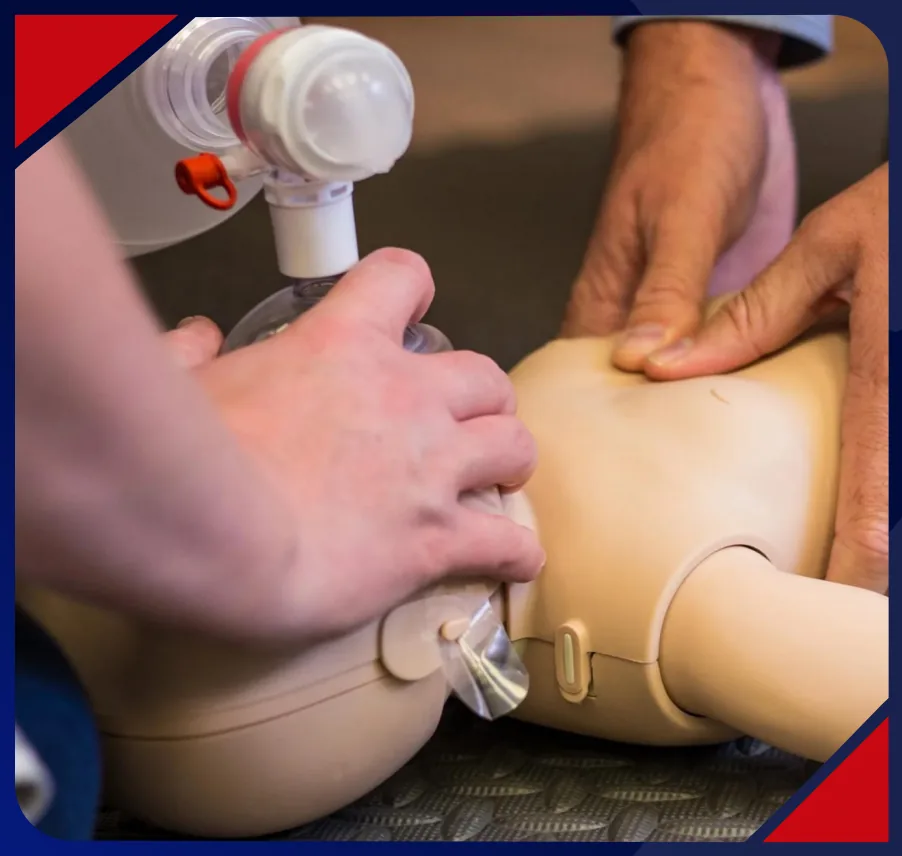

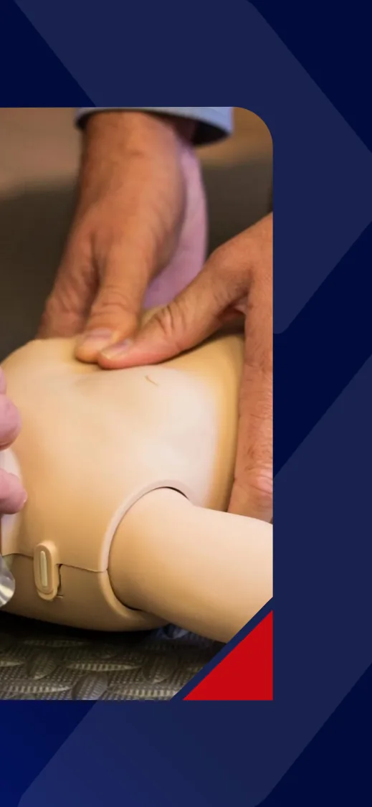

---

<!-- page:2 -->

## NESSA AULA

## REVISAREMOS

## o SBV (BLS)

o PCR avançada

## o Bradicardia sintomática

o Taquicardias

---

<!-- page:3 -->

## PALS

## Sistematização do atendimento!

## Reconhecimento

## RCP de alta qualidade

## Desfibrilação

## Ressuscitação avançada

Fonte: AHA 2025

## Cuidadoos pós PCR

## Recuperação e sobrevida

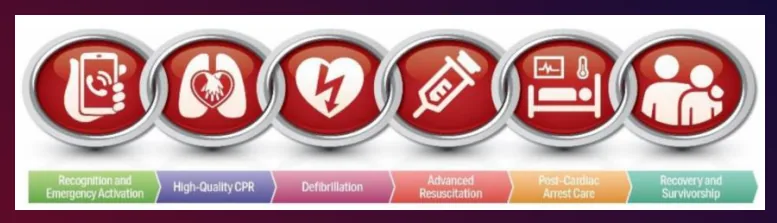

---

<!-- page:4 -->

## Triângulo de avaliação pediátrica

## Aparência

## Consciência

## Tônus

## Comportamento

## Esforço Respiratório Circulação

## Frequência Cor da pele

## Sinais de esforço Sinais de sangramento

## Ruídos

---

<!-- page:5 -->

- Avaliação: Intervenção Reavaliação

## X-ABCDE (= ATLS)

## Avaliação secundária / SAMPLE

## Trabalho

- Exames complementares. em equipe

---

<!-- page:6 -->

## Suporte Avançado de Vida em

## Pediatria (PALS)

## Suporte Básico de Vida

## em Pediatria

---

<!-- page:7 -->

## 1- Checar a segurança do ambiente

## 2- Checar responsividade (com estímulo tátil)

## 3- Chamar ajuda e acionar serviço de emergência

## 4- Checar respiração e pulso simultaneamente por

## mínimo 5s, máximo 10s

## Figura 1: Técnica para checagem de pulso na

## criança até 1 ano (braquial) e nos maiores de 1 ano

## (carotídeo ou femoral)

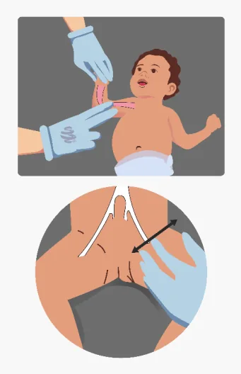

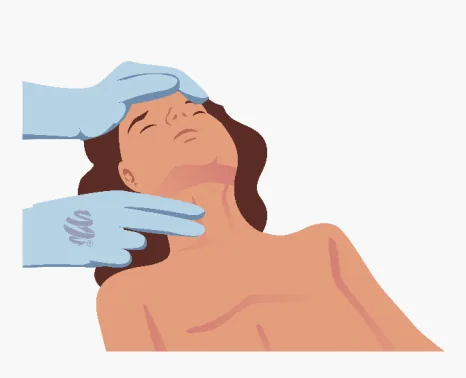

---

<!-- page:8 -->

## 5 - RCP = CAB

## Sozinho: 30 compressões x 2

## ventilações

## ≥ 2 socorristas: 15 x 2

## 6 - DEA

## < 8 anos: pás pediátricas ou atenuador

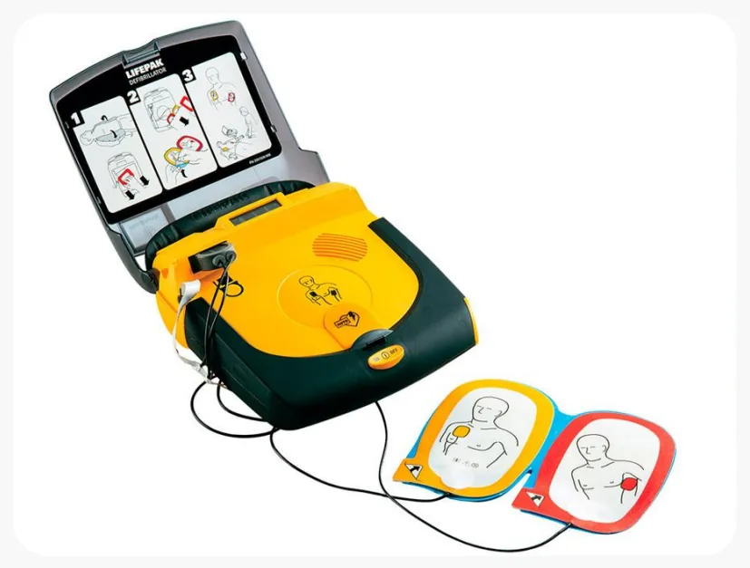

---

<!-- page:9 -->

## Compressões cardíacas

## <1 ano: técnica dos 2 polegares com as mãos circundando o tórax. Se não

## conseguir envolver o tórax → base de uma das mãos

## AHA 2025: a tradicional técnica de 2 dedos para RCP em bebês não é mais

## recomendada

## A partir de 1 ano: uma mão ou duas mãos sobrepostas

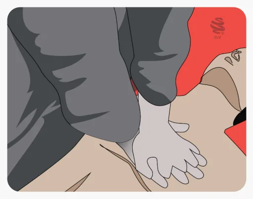

---

<!-- page:10 -->

## Comprimir 1/3 do tórax

## Retorno completo

## Frequência 100 - 120 cpm

## Alternar funções a cada 2 min

---

<!-- page:11 -->

## Ventilação

## Cabeça em posição neutra e elevar o queixo

## Anteriorização da mandíbula se suspeita de lesão cervical

## “Boca-a-boca”/ dispositivos de barreira/ dispositivo BVM

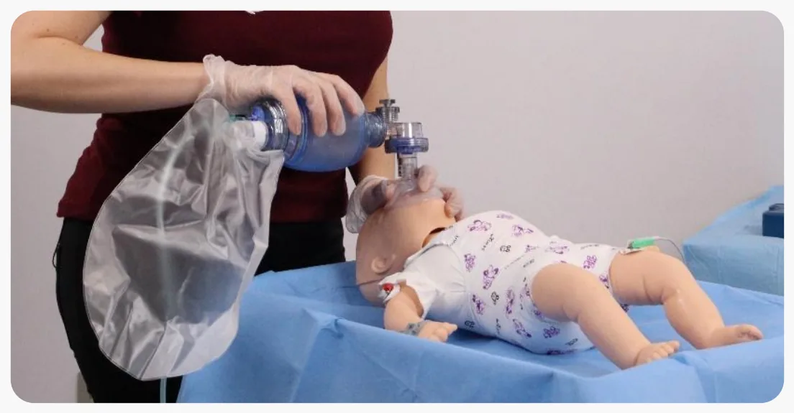

---

<!-- page:12 -->

## QUESTÃO

## HSL 2024

## Uma criança de 7 meses de idade é encontrada abandonada em uma rua sem saída

## Entre as opções abaixo, a sequência mais correta para início da reanimação é

## A) Verificar o nível de consciência, se não responder chamar por ajuda, verificar a

## respiração, verificar o pulso carotídeo

## B) Verificar o nível de consciência, se não responder chamar por ajuda, verificar o

## pulso braquial, verificar a respiração

## C) Chamar por ajuda, verificar o nível de consciência, verificar a respiração, verificar

## o pulso carotídeo

## D) Verificar o nível de consciência, se não responder chamar por ajuda, verificar a

## respiração, verificar o pulso braquial

## E) Verificar o nível de consciência, se não responder chamar por ajuda, verificar o

## pulso carotídeo, verificar a respiração

---

<!-- page:13 -->

---

<!-- page:14 -->

## Suporte Avançado de Vida

## em Pediatria (PALS)

## PCR avançada

---

<!-- page:15 -->

## Acesso venoso

## Acesso venoso periférico

## Cateter venoso central (cateter umbilical - RN)

## Acesso intraósseo

## Locais: tíbia, fêmur distal, espinha ilíaca anterossuperior, etc

## Indicações: PCR, choque, falha de acesso

## Contraindicações: fraturas, lesões, tentativas anteriores

## Duração: até 24h

---

<!-- page:16 -->

## Paciente não intubado: 2x, nos intervalos das compressões

## Paciente intubado: 1 ventilação a cada 2-3 segundos

## Se IOT: Tubo com cuff

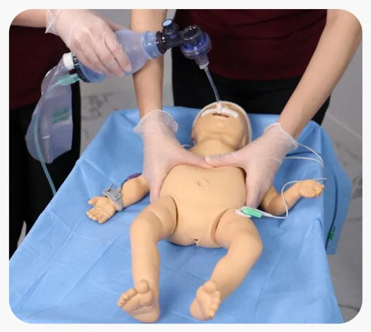

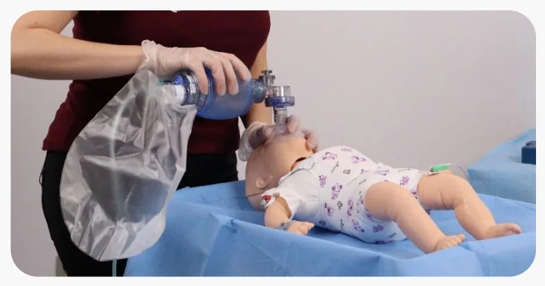

---

<!-- page:17 -->

## QUESTÃO ENARE 2023

## Lactente de 3 meses de idade, internado por bronquiolite, evoluiu com piora respiratória

## Permaneceu em leito de enfermaria enquanto aguardava a transferência para a UTI. A

## enfermagem foi chamada pela mãe, porque a criança ficou “molinha”. A criança estava

## cianótica e inconsciente, sem movimento respiratório e sem pulso. São iniciadas as manobras

## de reanimação cardiopulmonar pela equipe. Qual é a relação da compressão ventilação durante

## o atendimento dessa criança?

## A) Se estiver sendo ventilada com máscara orofacial, manter uma relação de 15 compressões

## para duas ventilações

## B) Se estiver sendo ventilada com máscara orofacial, manter uma relação de 30 compressões

## C) Manter uma relação de 3 compressões para uma ventilação

## D) Se estiver com via aérea avançada, manter uma relação de 15 compressões para duas

## E) Se estiver com via aérea avançada, manter uma relação de 3 compressões para uma

---

<!-- page:18 -->

---

<!-- page:19 -->

## USP-SP 2023

## Paciente de 2 meses, sexo masculino, foi admitido no pronto atendimento após

## mãe ter notado que ele estava com os lábios arroxeados. Na admissão

## encontrava-se arresponsivo, com perda de tônus muscular e com respiração

## superficial e hipoxemia, tendo sido prontamente iniciadas ventilações assistidas

## O paciente havia recebido as imunizações previstas no calendário vacinal há

## cerca de 5 horas e teve febre precedendo o quadro

---

<!-- page:20 -->

## Assinale a alternativa abaixo na qual está representada a escolha da máscara adequada

## o posicionamento correto do coxim e o posicionamento correto da mão na máscara

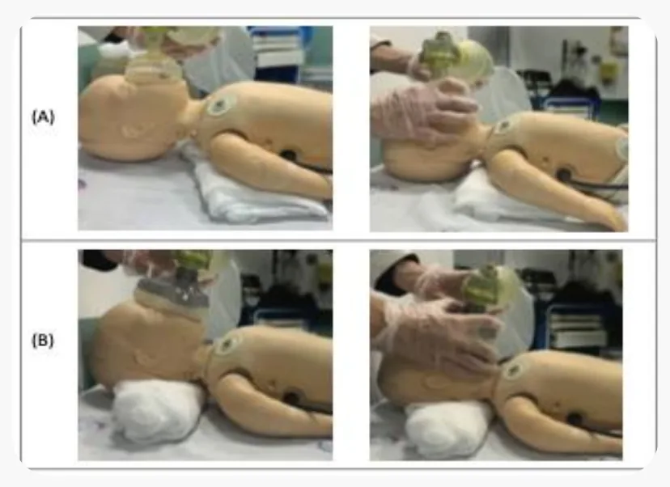

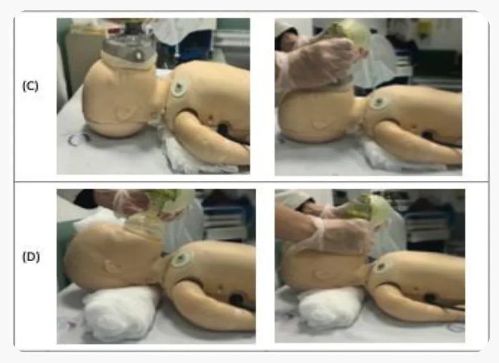

---

<!-- page:21 -->

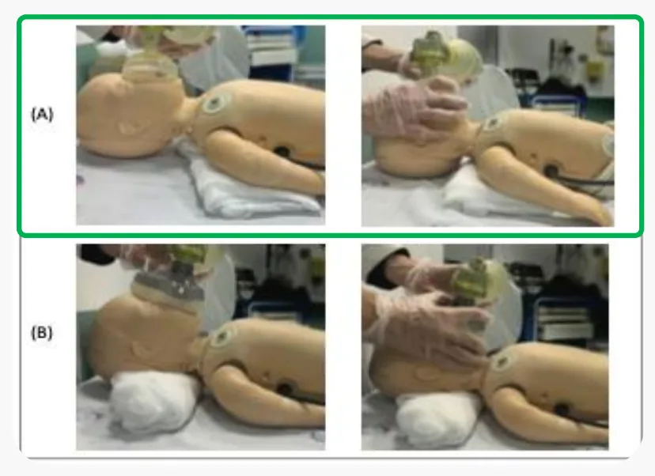

---

<!-- page:22 -->

## ENARE 2023

## Paciente pediátrico de 10 anos sofre uma parada cardiorrespiratória em ambiente

## hospitalar. Sobre esse caso, assinale a alternativa correta

## A) Com via aérea avançada estabelecida, é recomendado realizar 2 ventilações para 15

## B) Com via aérea avançada estabelecida, é recomendada 1 ventilação a cada 6 segundos

## (10/min)

## C) Com via aérea avançada estabelecida, é recomendada 1 ventilação a cada 2 a 3

## segundos (20 a 30/min), sem interromper as compressões

## D) É aconselhável administrar a primeira dose de epinefrina em até 8 minutos depois do

## início das compressões torácicas.Aplicar pressão na i

## E) A lidocaína é contraindicada na reanimação cardiopulmonar em pacientes pediátricos

---

<!-- page:23 -->

## segundos (20 a 30/min), sem interromper as compressões

---

<!-- page:24 -->

## Ritmos

## Chocáveis: TVSP/ FV • Não chocáveis: assistolia e AESP

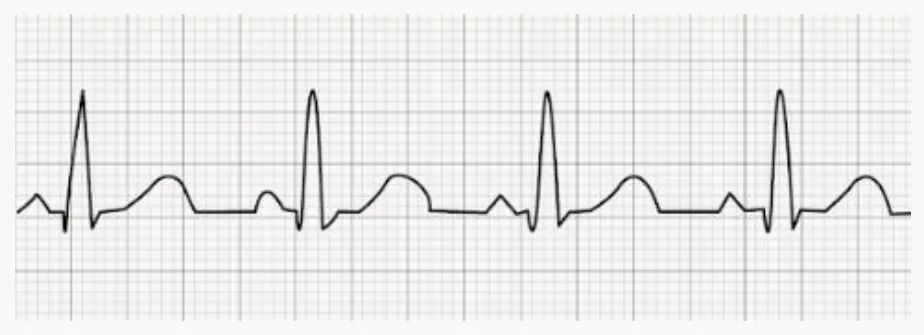

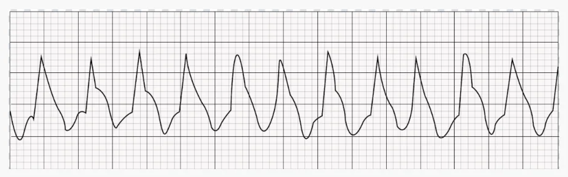

---

<!-- page:25 -->

## Chocáveis

## Parada Cardíaca Súbita (atividade física, cardiopata)

## Sobrevida mais alta

## Menos comuns

## Não chocáveis

## Parada Hipóxica (respiratória ou choque hipovolêmico)

## Mais comuns

## Sobrevida menor

---

<!-- page:26 -->

## ENARE 2021

## Sobre as causas de parada cardiorrespiratória (PCR) na faixa etária pediátrica, assinale a

## alternativa correta

## A) Geralmente é um evento súbito

## B) Os ritmos cardíacos mais frequentes são a bradicardia e a assistolia

## C) As arritmias ventriculares são muito comuns, principalmente em PCR extra-hospitalar

## D) Costuma ser de origem cardíaca, sendo a fibrilação ventricular o ritmo mais comum

## E) No ambiente hospitalar, as causas mais comuns são infarto agudo do miocárdio e

## miocardite

---

<!-- page:27 -->

---

<!-- page:28 -->

## Parada cardiorrespiratória

## Inicie a RCP

## Forneça oxigênio

## Coloque o monitor/desfibrilador

## Ritmo chocável?

## Sim Não

FV/TVSP Assistolia/AESP

## Epinefrina

## imediatamente

## Choque

## RCP 2 min

## Epinefrina a cada 3 a 5 min

## Considere via aérea

## Acesso IV/IO

## avançada, capnografia

---

<!-- page:29 -->

## INEP 2023

## Um pré-escolar aguardando um atendimento eletivo foi vítima de colapso súbito em ambiente

## intra hospitalar; parece inconsciente e está cianótico. De acordo com as diretrizes do suporte

## avançado de pediatria (2020), deve-se, inicialmente

A) Avaliar a responsividade e, se não houver resposta, chamar por ajuda; logo após palpar pulso

## carotídeo e verificar a respiração, simultaneamente; se pulso carotídeo ausente, iniciar

## compressões torácicas (15 compressões torácicas: 2 ventilações)

## B) Avaliar a responsividade e, se não houver resposta, chamar por ajuda; logo após palpar pulso

## radial e verificar a respiração, simultaneamente; se pulso radial ausente, iniciar compressões

## torácicas (30 compressões torácicas: 2 ventilações)

## C) Chamar por ajuda, avaliar a responsividade e, se não houver resposta, palpar pulso radial e

## verificar a respiração, simultaneamente; se pulso radial ausente, iniciar compressões

## torácicas (15 compressões torácicas: 2 ventilações)

## D) Chamar por ajuda e, se não houver resposta, palpar pulso carotídeo e verificar a respiração

## simultaneamente; se pulso carotídeo ausente, iniciar compressões torácicas (30

## compressões torácicas: 2 ventilações)

---

<!-- page:30 -->

A) Avaliar a responsividade e, se não houver resposta, chamar por ajuda; logo após palpar

## pulso carotídeo e verificar a respiração, simultaneamente; se pulso carotídeo ausente, iniciar

## compressões torácicas (15 compressões torácicas: 2 ventilações)

---

<!-- page:31 -->

## ENARE 2024

## Paciente do sexo feminino, 12 anos, é admitida no pronto-socorro após intoxicação exógena. É

## ofertado oxigênio a 100% e constata-se bradicardia no monitor. Em determinado momento, o

## oxímetro de pulso não consegue mais detectar a saturação, o monitor acusa assistolia e a

## paciente aparentemente não apresenta pulso central palpável. Assinale a alternativa que

## apresenta uma conduta correta nesse caso

A) Iniciar ventilação com bolsa-válvula-máscara 20 a 30 ventilações por minuto com

## compressões torácicas contínuas

## B) Iniciar ventilação com bolsa-válvula-máscara sincronizadas com compressões torácicas e

## providenciar a desfibrilação com 2 J/kg

C) Proceder imediatamente à intubação orotraqueal, por se tratar de uma urgência nesses casos,

## e ventilar cerca de 6 a 8 vezes por minuto

D) Como o ritmo de parada é assistolia, está indicada a administração de adrenalina a cada 3 a 5

## minutos, sem indicação de desfibrilação

## E) Deve-se trocar a pessoa que administra as compressões torácicas a cada 4 minutos

---

<!-- page:32 -->

A) Iniciar ventilação com bolsa-válvula-máscara 20 a 30 ventilações por minuto com

C) Proceder imediatamente à intubação orotraqueal, por se tratar de uma urgência nesses casos,

D) Como o ritmo de parada é assistolia, está indicada a administração de adrenalina a cada 3 a 5

---

<!-- page:33 -->

## Em um paciente pediátrico em parada cardiorrespiratória, qual é a conduta correta?

## A) Se o ritmo de choque for Atividade Elétrica Sem Pulso (AESP), está indicada a

## cardioversão com choque

## B) O ritmo de choque deve ser verificado e, caso se detecte assistolia, não há indicação

## de choque

## C) Se o paciente estiver com via aérea avançada, deve-se usar a relação 15

## compressões para cada ventilação

## D) No momento da intubação, usar sedativo e analgésico, mas é contraindicado o uso

## de relaxante neuromuscular

## E) Na indicação de choque, a dose inicial é de 1 J/Kg

---

<!-- page:34 -->

## B) O ritmo de choque deve ser verificado e, caso se detecte assistolia, não há

## indicação de choque

---

<!-- page:35 -->

## Ritmos chocáveis

## 2 a 4 J/kg

## FV/TVSP

- aumentar dose até 10 J/k

(bifásica 120-200J ou mono 1° RCP 2 m Choque Amiodarona ou Trate as causas

## Sim

## 2°

Choque kg ou máximo disponível ofásica 360J)

## Adrenalina: 0,01 mg/kg

## EV; ET: 0,1 mg/kg

3° min

## Amiodarona: 5 mg/kg

u lidocaína

## Lidocaína: 1 mg/kg

s reversíveis

---

<!-- page:36 -->

## Medicações

## Adrenalina: 0,01 mg/kg EV, máx. 1 mg = 0,1 mL/kg da adrenalina diluída 1:10.000

## Endotraqueal: 10x mais (0,1 mg/kg) – 0,1 mL/kg da adrenalina pura (1: 1.000)

## Amiodarona: 5 mg/kg até 300mg (repetir até 3x, máx 150 cada)

---

<!-- page:37 -->

## Causas reversíveis

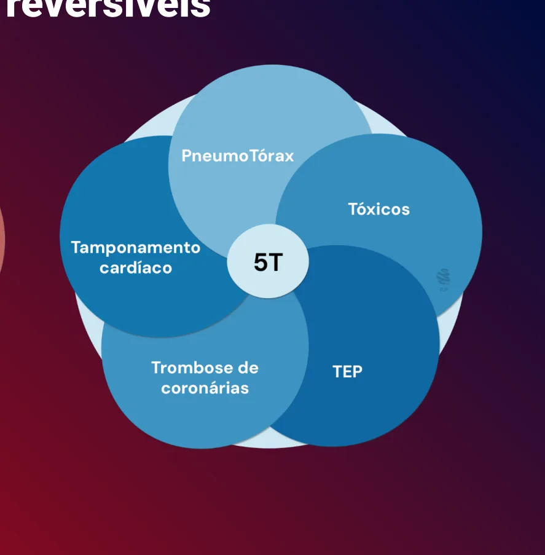

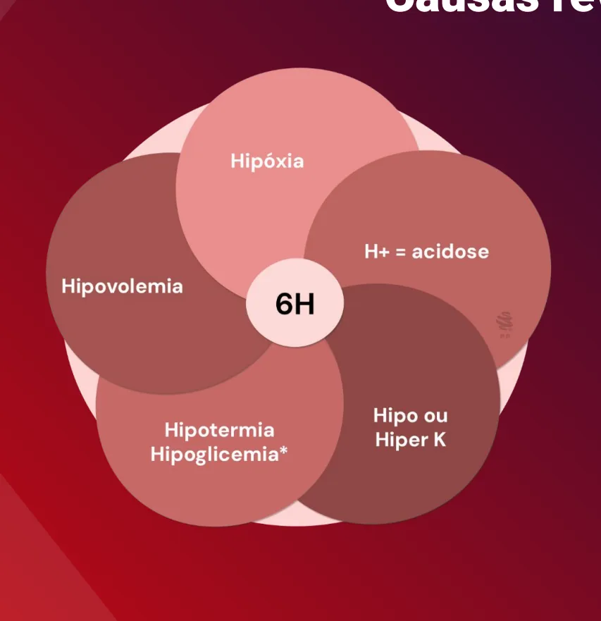

---

<!-- page:38 -->

## PALS 2022

## Paramédicos foram acionados para irem até a casa de uma criança com história de vômitos e

## diarreia que se encontra reativa apenas a estímulo doloroso, respiração irregular, desidratada

## pálida, com dor à palpação do abdome, abdome distendido, cianótica

## É iniciada ventilação com bolsa-valva-máscara com oxigênio a 100% por FC 36. Evoluiu com

## PCR, sendo realizada RCP com 2 socorristas. Após 2 min, reavaliada e mantinha-se sem pulsos

## palpáveis. Retomada RCP e realizada dose de adrenalina. Após 2 min, paciente seguia em PCR

## Qual a próxima medida neste momento?

## A) Epinefrina

## B) Amiodarona

## C) SF 0,9% 20 mL/kg

## D) Atropina

---

<!-- page:39 -->

---

<!-- page:40 -->

## Cuidados pós-parada

## Normoxemia e PaCO2 adequada

## Monitorizar: sinais vitais + lactato, débito urinário, saturação

## venosa central

## Controle de temperatura

## Neuromonitoramento

## Eletrólitos e glicose

## Sedação: sedativos e ansiolíticos

---

<!-- page:41 -->

## ENARE 2022

## As recomendações para a reanimação cardiopulmonar pediátrica estão sempre em revisão e

## em constante atualização, para melhor cuidar dos pacientes, oferecendo a melhor chance

## possível de desfechos favoráveis. Sobre esse tema, informe se é verdadeiro (V) ou falso (F) o

## que se afirma a seguir e assinale a alternativa com a sequência correta

## ( ) Para maximizar as chances de bons resultados, a epinefrina deve ser administrada o quanto

## antes, idealmente em até cinco minutos depois do início da parada cardiorrespiratória de um

## ritmo não chocável

## ( ) A taxa de ventilação assistida recomendada tem sido aumentada para uma ventilação a cada

## 2 a 3 segundos (20 a 30 ventilações por minuto) para todos os casos de ressuscitação

## pediátrica

## ( ) Tubos endotraqueais com cuff são sugeridos para reduzir o vazamento de ar e a

## necessidade de trocas de tubos para pacientes de qualquer idade com necessidade de

## intubação

## ( ) O uso rotineiro de pressão cricoide durante a intubação não é mais recomendado

---

<!-- page:42 -->

## (V) Para maximizar as chances de bons resultados, a epinefrina deve ser administrada o quanto

## (V) A taxa de ventilação assistida recomendada tem sido aumentada para uma ventilação a

## cada 2 a 3 segundos (20 a 30 ventilações por minuto) para todos os casos de ressuscitação

## (V) Tubos endotraqueais com cuff são sugeridos para reduzir o vazamento de ar e a

## (V) O uso rotineiro de pressão cricoide durante a intubação não é mais recomendado

---

<!-- page:43 -->

## Bradicardia

---

<!-- page:44 -->

## Estado mental agudamente alterado

## Bradicardia sintomática

## Sinais de choque

## Hipotensão

## Mantenha as vias aéreas patentes

## Ventilação com pressão positiva e oxigênio

## Monitorização + acesso

## RCP e Epinefrina

## Atropina se tônus vagal aumentado ou

## bloqueio AV primário

## Identifique e trate causas subjacentes

## Marcapasso

---

<!-- page:45 -->

## Causas

## Hipotermia Tóxicos

## Hipóxia

---

<!-- page:46 -->

## Criança com bradicardia é avaliada e são detectados sinais de choque e hipotensão

## Iniciou-se ventilação com pressão positiva, sem melhora mesmo com ventilação efetiva e

## suporte de oxigênio. A frequência cardíaca é de 45 bpm. Qual é a conduta mais adequada

## nesse caso?

## A) Manter a ventilação com pressão positiva e considerar intubação orotraqueal

## B) Iniciar compressões torácicas e ventilações (RCP)

## C) Realizar cardioversão com choque não sincronizado

## D) Solicitar avaliação de cardiologista e realizar reposição volumétrica

## E) Administrar adenosina, podendo repetir após 5 minutos se não houver melhora

---

<!-- page:47 -->

---

<!-- page:48 -->

## Taquicardia

---

<!-- page:49 -->

## Taquicardias

## Avaliação e suporte iniciais

## Avalie o ritmo com ECG ou monitor

## Comprometimento cardiopulmonar?

## QRS estreito ou alargado?

---

<!-- page:50 -->

Taquicardias com estabilidade hemodinâmica Estre

## Taquicardia sinusal

## Ondas P presentes/normais

## Intervalo de RR variável

## Bebês: frequência geralmente <220/min

## Crianças: frequência geralmente <180/min

## Pesquise e trate a causa

Taquicardia suprav

- Ondas P ausentes/anorma

## Intervalo RR não variável

- Bebês: frequência geralme

- Crianças: frequência geralm

- Histórico de alterações abr Avalie a duração do QRS eito Alargado

## Possível

## ventricular

## Recomenda-se consultar

## um especialista

## Tratar causas

## Considerar antiarrítmico

ais;

## Considere manobras vagais

ente ≥ 220/min; mente ≥ 180/min; Adenosina 0,1 mg/kg → 0,2 mg/kg ruptas na frequência.

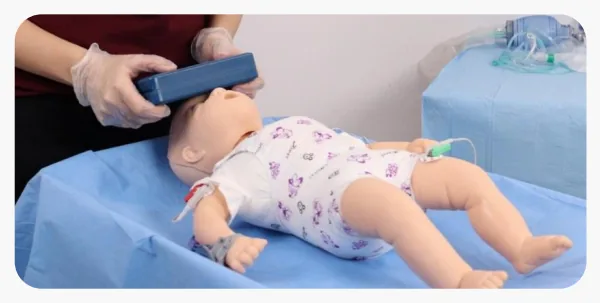

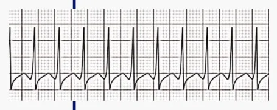

---

<!-- page:51 -->

## Taquicardias instáveis

## Avalie a duração do QRS

## Estreito Alargado

## Provável Possível

## taquicardia supraventricular taquicardia ventricular

## Cardioversão sincronizada

## Se acesso IV/IO: adenosina

ou

## Se acesso indisponível ou

## adenosina ineficaz →

---

<!-- page:52 -->

## Em relação às características da taquicardia supraventricular (TSV), é correto afirmar que

## A) O eletrocardiograma típico apresenta onda P ausente ou anormal e QRS estreito, mas

## pode estar alargado em algumas situações

## B) A frequência cardíaca habitualmente encontra-se acima de 200 bpm ou acima de 160

## bpm na criança maior e não varia com atividade

## C) Apresenta frequência cardíaca abaixo do limite normal para a idade, com ritmo sinusal e

## onda P positiva nas derivações D2, D3, AVF

## D) A taquicardia supraventricular é a taquiarritmia menos comum na infância

## E) No tratamento medicamentoso, a lidocaína é o fármaco de escolha se não houver

## contraindicação

---

<!-- page:53 -->

---

<!-- page:54 -->

## Quanto à terapêutica nos casos de Taquicardia Supraventricular (TSV), assinale a

## A) A carga inicial na cardioversão elétrica sincronizada em paciente com TSV deve ser de

## 0,5 a 1 J/kg

## B) A desfibrilação elétrica não sincronizada está indicada imediatamente em paciente com

## TSV com instabilidade hemodinâmica

## C) A adenosina é o fármaco de escolha em casos de síndrome de Wolff-Parkinson-White

## com intervalo RR irregular

## D) A amiodarona é utilizada em TSV sem instabilidade hemodinâmica como droga de

## primeira escolha

## E) A manobra vagal pode ser realizada através de massagem do seio carotídeo ou

## compressão ocular

---

<!-- page:55 -->

---

<!-- page:56 -->

## Dra. Camilla Silva Castro e Sousa

---

<!-- page:57 -->

## 4- Checar respiração e pulso* simultaneamente por até 10s

## 5- RCP

## Sozinho: 30 compressões x 2 ventilações

“Seja Rápido, Ajude Rápido, Pois Corações Vivem!"

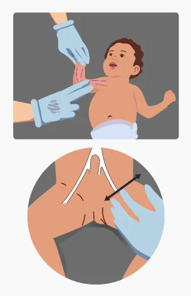

---

<!-- page:58 -->

- Comprimir 1/3 do tórax;

## Parada cardiorrespiratória • Retorno completo

- Frequência 100 -120 cpm;

- Alternar funções a cada 2 min.

Forneça oxigênio • Se IOT: 1 ventilação a cada 2-3 s

FV/TVSP Assistolia/AESP

## Adrenalina: 0,01 mg/kg EV; ET

## 0,1 mg/kg

## Choque: 2 J/Kg e aumenta de

## 2/2

## RCP 2 min Epinefrina a cada 3 a 5 min

## Acesso IV/IO Considere via aérea

Epinefrina a partir do 2º choque avançada, capnografia Amiodarona a partir do 3º

---

<!-- page:59 -->

## Mantenha as vias aéreas patentes; • Estado mental agudamente alterado

## Ventilação com pressão positiva e oxigênio; • Sinais de choque

## Monitorização + acesso. • Hipotensão

---

<!-- page:60 -->

Taquicardias com estabilidade hemodinâmica Estre

Taquicardia suprav

- Ondas P ausentes/anorma

- Bebês: frequência geralme

- Crianças: frequência geralm

- Histórico de alterações abr Avalie a duração do QRS eito Alargado

ais;

ente ≥ 220/min; mente ≥ 180/min; Adenosina 0,1 mg/kg → 0,2 mg/kg ruptas na frequência.

---

<!-- page:61 -->

ou

---

<!-- page:62 -->

## Bons Estudos!
