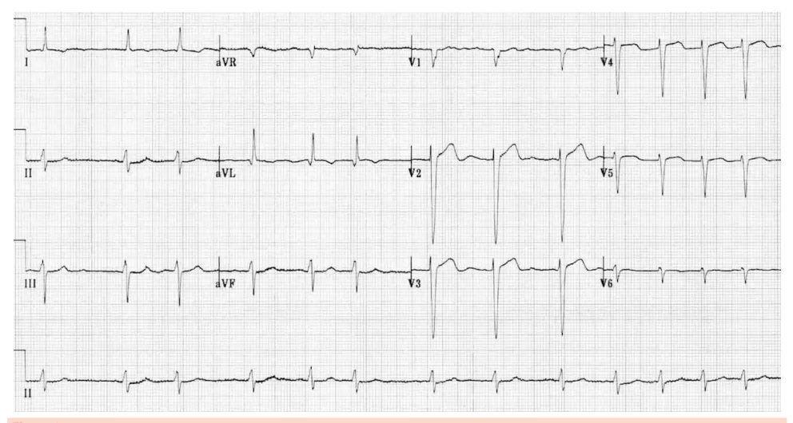
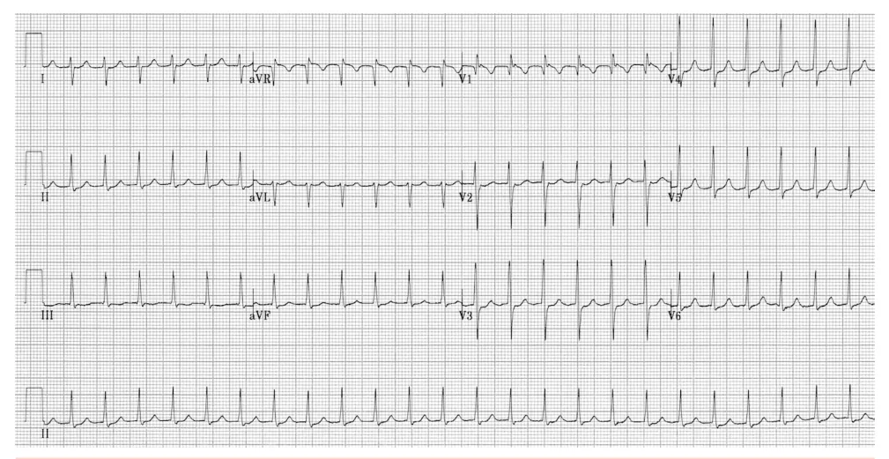
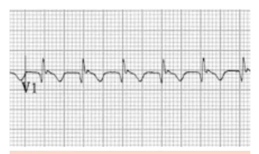
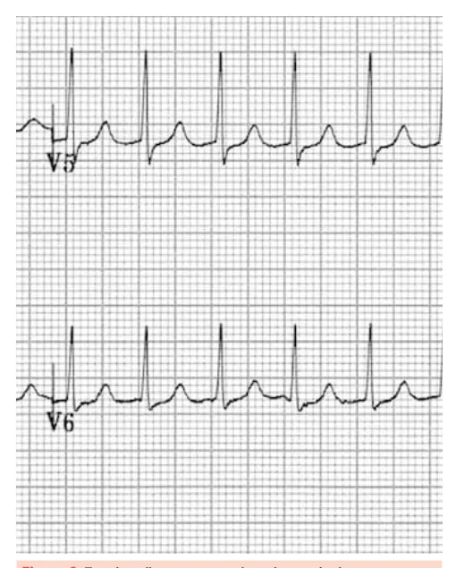
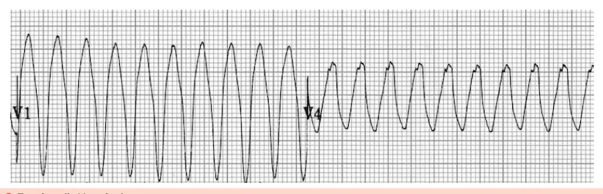

# Taquiarritmias

<!-- page:1 -->

## Fibrilação Atrial e Flutter

- Sempre avaliar o risco de AVC pelo **CHA2DS2-VA**: anticoagular sempre se escore **≥ 2**;
- Em algumas situações vamos anticoagular SEMPRE, independentemente do escore: cardiomiopatia hipertrófica, hipertireoidismo descompensado, amiloidose cardíaca, miocárdio não compactado; usar apenas varfarina se estenose mitral moderada ou importante ou prótese valvar mecânica (DOAC não);
- **Controle de FC**: betabloqueador, digoxina, amiodarona, bloqueadores do canal de cálcio não diidropiridínicos (não usar em pacientes com fração de ejeção (FE) reduzida);
- **Reverter o ritmo**: principalmente se IC com FE reduzida. Demais pacientes, ponderar;
- **FA aguda, no PS**: se instável: cardioversão elétrica sincronizada;
- Se estável: controlar FC, anticoagular;
- Se < 24h: considerar reversão do ritmo;
- Se > 24h: ECOTE ou anticoagulação por 3 semanas antes de reverter o ritmo.

## Taquicardia de QRS Estreito e RR Regular

- TA / TRN / TAV (TAV: onda P retrógrada mais distante do QRS anterior do que na TRN);
- **Tratamento**: instável = CVE; estável = manobra vagal → adenosina 6 mg → adenosina 12 mg.

## Taquicardia de QRS Largo

- **Torsades de Pointes**: relacionada ao intervalo QT aumentado (congênito ou adquirido – lembrar de remédios!);
- Taquicardias com QRS largo e monomórfico: > 70% taquicardia ventricular. Para diferenciar de taquicardia supraventricular com aberrância de condução, existem vários critérios (Pava, Santos, Brugada).

## Fibrilação Atrial - Conduta

### ECG

- Ritmo irregularmente irregular: intervalos RR distintos, sem um padrão;
- Ausência de onda P: não é possível determinar uma linha de base;
- Somente pode ser caracterizada como taquicardia nos casos com resposta ventricular aumentada, ou seja, com FC (frequência cardíaca ventricular) **> 100/110 bpm**. Para valores menores, considera-se fibrilação atrial com frequência adequada;
- Cálculo da FC na FA → nº de intervalos RR (na derivação D2 longa) x 6;
- Verificar Figura 1 na próxima página.

### Classificação

- **Paroxística**: duração < 7 dias; em geral, demonstra reversão espontânea;
- **Persistente**: duração > 7 dias;
- **Permanente**: médico e paciente definiram que não vão tentar reverter o ritmo. Manter apenas controle da frequência e anticoagulação.

### Estratificação de Risco

Avaliação do risco de AVC pelo escore **CHA2DS2-VA**:

- **C**: Insuficiência cardíaca – 1 ponto;
- **H**: Hipertensão arterial sistêmica – 1 ponto;
- **A**: Idade ≥ 75 anos – 2 pontos;
- **D**: Diabetes mellitus – 1 ponto;
- **S**: História de acidente vascular cerebral (AVC) – 2 pontos;
- **V**: Doença vascular (IAM prévio, doença vascular periférica e placa na aorta) – 1 ponto;
- **A**: Idade entre 65 e 74 anos – 1 ponto.

- Anticoagular sempre se: escore ≥ 2;
- Considerar a anticoagulação: escore ≥ 1.

### Escore HAS-BLED

- Não validado para pacientes em uso de DOACs;
- É um escore útil para avaliar o risco de sangramento do paciente.

Fatores de risco para sangramento:

- **H**: Hipertensão arterial – 1 ponto;
- **A**: Alteração de função hepática ou renal – 1 ponto para cada alteração;
- **S**: Stroke – AVC – 1 ponto;
- **B**: Bleeding – sangramento prévio – 1 ponto;
- **L**: Labilidade do INR*** – 1 ponto;
- **E**: Elderly – idade avançada – 1 ponto;
- **D**: Drogas ou álcool – 1 ponto cada item.

**Interpretação**:

- Pontuação > 3 pontos: denota maior risco de sangramento;
- Ainda, a pontuação HAS-BLED > 3 sugere que seja feito um controle dos fatores de risco contidos no próprio escore;
- Escore HAS-BLED não contraindica o uso de anticoagulante.

### Opções Terapêuticas

- Os DOACs (anticoagulantes de ação direta) são liberados para uso na maioria dos casos de fibrilação atrial! Exceto: estenose mitral moderada e importante e prótese valvar mecânica;
- Opções:
  - **Rivaroxabana**: 20 mg, 1x ao dia;
  - **Dabigatrana**: 150 mg, 2x ao dia;
  - **Apixabana**: 5 mg, 2x ao dia;
  - **Edoxaban**: 60 mg, 1x ao dia.

---

<!-- page:2 -->

Figura 1: Fibrilação atrial.

### Anticoagular Independente do Escore CHA2DS2-VA

- Estenose mitral moderada ou importante (antigamente conhecida como FA valvar);
- Prótese valvar mecânica;
- Cardiomiopatia hipertrófica;
- Hipertireoidismo descompensado;
- Amiloidose cardíaca.

### Manejo FA Crônica

- **Controle de ritmo ou frequência**: no geral, a diferença de mortalidade não foi demonstrada. Em alguns grupos específicos, há diferenças. A tendência é tentar reverter o ritmo para sinusal, pelo menos uma vez, principalmente em pacientes jovens;
- **Controle da frequência cardíaca**: deve-se manter a frequência cardíaca < 110 bpm. As medicações possíveis de serem usadas:
  - Betabloqueadores - principais;
  - Bloqueadores do canal de cálcio não diidropiridínicos - não usar em pacientes com fração de ejeção (FE) reduzida (verapamil, diltiazem);
  - Digoxina.
- Sem comorbidades, HAS, ICFEp: betabloqueador, diltiazem, verapamil;
- IC com FE < 50%: magnésio, digitálico (deslanosídeo);
- Asma ou DPOC, com broncoespasmo: diltiazem/verapamil, digitálico;
- Posteriormente ao controle da frequência, proceder com CHA2DS2-VA + anticoagulação.

### Manejo da FA Aguda

**Primeira conduta** - avaliar a instabilidade → 5 D's da instabilidade hemodinâmica:

- Dispneia;
- Dor torácica;
- Diminuição da PA;
- Diminuição do nível de consciência;
- Desmaio (síncope).

**Conduta – paciente instável**:

- Assegurar que a instabilidade decorre da fibrilação atrial;
- FC, em geral, ≥ 150 bpm: pacientes com comorbidades cardiovasculares podem instabilizar com frequências mais baixas;
- Paciente sem sinais de sepse, hipovolemia grave e hemorragia, deve-se abordar com cardioversão elétrica sincronizada, independentemente do tempo de início do quadro: **120-200 J**.

**Conduta – paciente estável**:

- Abordar com controle de frequência e planejar anticoagulação.

**Conduta – FA aguda de início < 24h**:

- Considerar a cardioversão para reversão de ritmo;
- Após, manter o uso do antiarrítmico.

**Conduta – FA aguda de início > 24h**:

- Considerar solicitar ECO TE, para avaliar a presença de trombo, ou anticoagulação por 3 semanas para CVE;
- Após a CVE, proceder com anticoagulação por 4 semanas, mesmo se CHA2DS2-VA = 0.

## Flutter Atrial

- O manejo da anticoagulação é igual ao da FA!

### ECG

- É uma taquicardia com QRS estreito;
- Atividade atrial regular - FC ~300 bpm, com ausência de linha isoelétrica;
- Demonstra ondas F serrilhadas – são mais bem observadas em V1, D2, D3, aVF;
- A frequência ventricular depende da razão de condução do nó atrioventricular;
- Verificar Figura 2 na próxima página.

---

<!-- page:3 -->

Figura 2: Flutter Atrial.

## Taquicardia - QRS Estreito e RR Regular

### Tipos

- Taquicardia por reentrada nodal – TRN;
- Taquicardia por reentrada atrioventricular – TAV;
- Taquicardia atrial (TA).

### Contexto Geral TRN e TAV

- Paciente jovem;
- Coração estruturalmente normal;
- Início súbito de palpitações regulares.

Figura 3: Representação gráfica evidenciando as diferenças entre o circuito de reentrada nodal (à esquerda) e a via acessória presente na taquicardia por reentrada átrio-ventricular.

### Fisiopatologia

**Taquicardia por reentrada nodal (TRN)**

- Denota um circuito dentro do nó AV – via rápida e via lenta;
- Em geral, o estímulo parte para a via rápida;
- Contudo, se existir uma extrassístole supraventricular, a condução pela via rápida estará impedida, já que essa se encontrará em período refratário. Assim, o estímulo segue para via lenta. Ao final do trajeto, a via rápida sai do período refratário e o estímulo, além de despolarizar os ventrículos, pode também retornar pela via rápida, criando um circuito de reentrada;
- Ou seja, o estímulo que desce despolariza os ventrículos, e o estímulo que sobe despolariza os átrios (de baixo para cima);
- Se visíveis, ondas P estarão após o QRS, mas muito próximas dele e invertidas.

**Taquicardia por reentrada atrioventricular (TAV)**

- Todo o mecanismo decorre da existência de uma via acessória;
- Da mesma forma, pode ser formado um circuito de macrorreentrada;
- Assim, observa-se onda P mais longe do QRS.

### ECG

**Taquicardia por reentrada nodal**

- Se visíveis, as ondas P estarão após o QRS – muito próximas e invertidas: onda P retrógrada;
- Intervalo RP' < 70 ms;
- Pseudo R' (em V1) ou pseudo-S (em D2, D3).

Figura 4: Taquicardia por reentrada nodal em V1.

---

<!-- page:4 -->

Figura 5: Taquicardia por reentrada nodal em DII e DIII.

**Taquicardia por reentrada atrioventricular**

- Apresenta uma via acessória;
- Onda P observada mais distante do complexo QRS (intervalo RP' > 70 ms);
- Observe que a onda P retrógrada pode "puxar" o segmento ST para baixo, gerando um infradesnivelamento de ST;
- Verificar Figura 6.

### Conduta

- Se instável: cardioversão elétrica sincronizada;
- Estável → manobra vagal → adenosina 6 mg → adenosina 12 mg.

## Taquicardias com QRS Largo e Monomórfico

- Tipos: taquicardia ventricular (> 70%) ou taquicardia supraventricular com aberrância de condução (BRD, BRE, via acessória);
- Verificar Figura 7.

## Taquicardia - QRS Largo - Torsades de Pointes

- Apresenta complexo QRS largo e de característica polimórfica: relacionada ao intervalo QT aumentado.

Figura 6: Taquicardia por reentrada atrioventricular.

Figura 7: Torsades de Pointes.

Figura 8: Taquicardia Ventricular.

---

<!-- page:5 -->

## Cardioversão Elétrica Sincronizada

Deve ser realizada sempre que um paciente se apresentar com uma taquiarritmia e sinais de instabilidade decorrentes dela:

- Explicar o procedimento ao paciente;
- Fazer uso de sedação;
- Garantir aporte de oxigênio;
- Sincronizar com complexo QRS;
- Chocar aplicando pressão no tórax, com as pás;
- Atentar para o monitor sem retirar as pás do tórax do paciente.

## Referências

Figura 1: Fibrilação atrial. LITFL. Life in the Fast Lane. Disponível em: https://litfl.com.

Figura 2: Flutter Atrial. LITFL. Life in the Fast Lane. Disponível em: https://litfl.com.

Figura 4: Taquicardia por reentrada nodal em V1. LITFL. Life in the Fast Lane. Disponível em: https://litfl.com.

Figura 5: Taquicardia por reentrada nodal em DII e DIII. LITFL. Life in the Fast Lane. Disponível em: https://litfl.com.

Figura 6: Taquicardia por reentrada atrioventricular. LITFL. Life in the Fast Lane. Disponível em: https://litfl.com.

Figura 7: Torsades de Pointes. LITFL. Life in the Fast Lane. Disponível em: https://litfl.com.

Figura 8: Taquicardia Ventricular. LITFL. Life in the Fast Lane. Disponível em: https://litfl.com.
