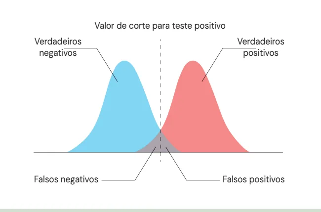
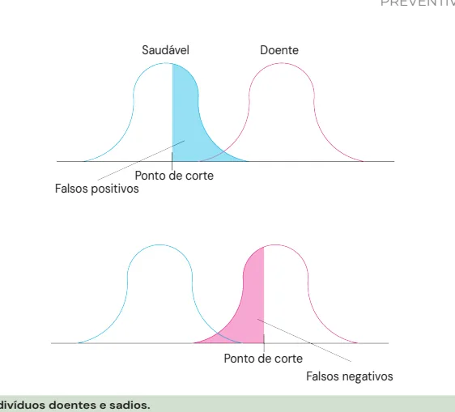
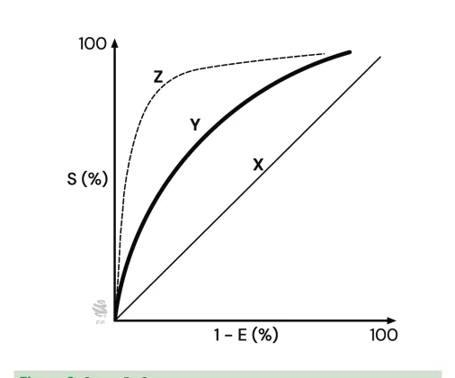
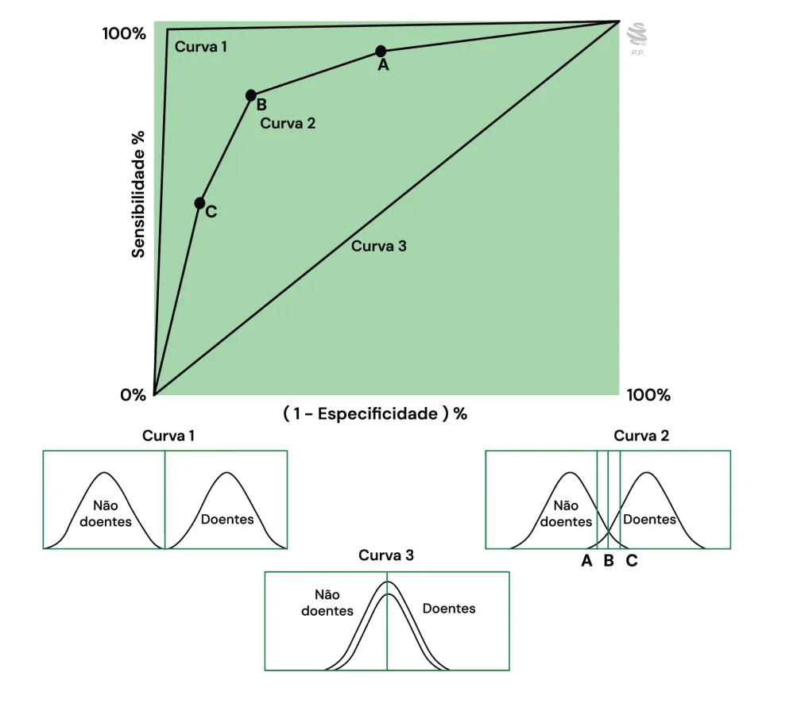
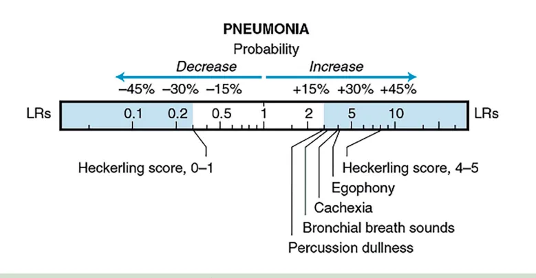
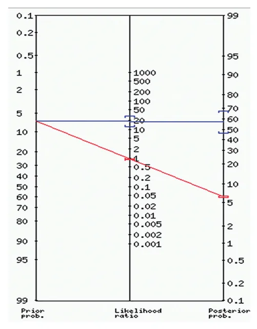

# Testes Diagnósticos Características Básicas

<!-- page:1 -->

## TESTES DIAGNÓSTICOS

## CARACTERÍSTICAS BÁSICAS

Tabela 1: Tabela de contingência na avaliação de testes. Doença Teste Positivo Verdadeiro Positivo (VP)

Teste Negativo Falso Negativo (FN) Total de Doentes (VP+FN) Tabela 2: Comparação entre sensibilidade e especificidade.

Alta Sensibilidade: Detecta a maioria dos doentes Teste negativo é muito confiável Bom para rastreamento Tabela 3: Indicador, definição e fórmula. Testes Diagnósticos.

Indicador D Capacidade do teste d Sensibilidade Capacidade do teste d Especificidade nã Valor Preditivo Positivo Probabilidade do pacie (VPP) o test Valor Preditivo Negativo Probabilidade do p (VPN) doença se Razão de Verossimilhança Quanto um teste po Positiva (RV+)

Razão de Verossimilhança Quanto um teste nega Negativa (RV-) Acurácia = ((VP + VN) / Total)

- Reflete a proporção de acertos do teste entre todos os resultados.

- Está relacionada tanto à sensibilidade quanto à especificidade.

## DEFINIÇÃO

- Testes diagnósticos são instrumentos utilizados para detectar ou excluir a presença de uma condição de saúde.

- Nenhum teste é perfeito: todos estão sujeitos a erros, como falsos positivos (indivíduos sem a doença com teste positivo) e falsos negativos (indivíduos com a doença com teste negativo). Não Doença

Total de Positivos Falso Positivo (FP) (VP + FP) Total de Negativos Verdadeiro Negativo (VN) (FN + VN)

Total Geral Total de Sadios (FP+VN) (VP+FN+FP+VN) Alta Especificidade: Descarta a maioria dos sadios (não doentes)

Teste positivo é muito confiável Bom para confirmar diagnóstico após um teste sensível Definição Fórmula de identificar corretamente os VP/(FN+VP)

doentes de identificar corretamente os VN/(FP+VN) ão doentes ente realmente ter a doença se VP/(FP+VP)

te for positivo paciente realmente não ter a VN/(FN+VN) o teste for negativo ositivo aumenta a chance da Sensibilidade / (1 doença Especificidade)

(1 - Sensibilidade) / ativo reduz a chance da doença Especificidade

- Na curva ROC, o teste com maior acurácia: Tem a curva mais próxima do canto superior esquerdo

s | Possui maior área sob a curva (AUC)

- A interpretação adequada exige correlação com o quadro clínico e com a prevalência da doença na

. população testada.

---

<!-- page:2 -->

Tabela 4: Tabela de Contingência Resumida. Doença Não Doença Teste positivo VP FP P Teste negativo FN VN N Doentes Sadios Total CLASSIFICAÇÃO DOS TESTES DIAGNÓSTICOS z À direita, nota-se o total de testes positivos (P) e o Os testes podem ser classificados de algumas total de negativos (N), bem como o total da amostra.

maneiras principais: De Acordo com a Finalidade Clínica: INDICADORES DE PERFORMANCE

- a) Rastreamento: Identificar precocemente uma

- Sensibilidade:

doença em pessoas assintomáticas (sem sintomas), | Definição: Capacidade de identificar corretamente visando a detecção em estágios iniciais para melhor os doentes (probabilidade de positivo em doentes).

prognóstico (ex: mamografia para câncer de mama). | Fórmula: (VP / (FN + VP)) x 100

- b) Diagnóstico: Confirmar ou excluir a presença | Valor Clínico: Alta sensibilidade é ótima para de uma doença em pessoas com suspeita (que descartar doenças (se negativo, exclui com apresentam sintomas ou sinais). confiança). Ideal para rastreamento. Não muda

- c) Avaliação de Progressão/Resposta ao Tratamento: com a prevalência da doença na população.

Monitorar a evolução de uma doença já diagnosticada

- Especificidade:

ou verificar a eficácia de um tratamento instituído. | Definição: Capacidade de identificar corretamente De Acordo com o Tipo de Resultado Fornecido: os não doentes (probabilidade de negativo em

- Quantitativo: Apresentam resultados não doentes). Dicotômicos: Resultado “sim” ou “não”, “positivo” | Valor Clínico: Alta especificidade é ótima para ou “negativo” (ex: teste rápido de gravidez). confirmar doenças (se positivo, confirma com Contínuos: Resultados expressos em uma escala confiança). Ideal para diagnóstico confirmatório.

numéricos (medidas). | Fórmula: (VN / (FP + VN)) x 100 numérica contínua (ex: níveis de glicose no sangue, Não muda com a prevalência da doença espessura endometrial). na população.

- Qualitativos: Apresentam resultados descritivos que

- Valor Preditivo Positivo (VPP): Observação: Mesmo testes qualitativos podem ser | Fórmula: (VP / (FP + VP)) x 100 convertidos em resultados numéricos através de | Valor Clínico: Alta utilidade clínica pós-teste.

dependem da percepção humana (ex: exames de | Definição: Probabilidade do paciente realmente ter imagem como radiografias, ultrassonografias). a doença se o teste for positivo escores (ex: classificação BI-RADS para mamografia, Depende da prevalência da doença:

que atribui uma categoria numérica à imagem). | Alta prevalência: VPP aumenta (se o teste der positivo, a doença é mais provável)

PERFORMANCE DOS TESTES DIAGNÓSTICOS | Baixa prevalência: VPP diminui (mesmo um teste

- A performance de um teste é avaliada usando uma positivo pode ser um falso positivo)

Tabela de Contingência 2x2, que compara a condição

- Valor Preditivo Negativo (VPN):

real do paciente com o resultado do teste. | Definição: Probabilidade de não ter a doença se o

- Verificar Tabela 4 teste for negativo.

- Dessa forma, obtém-se o quadro 2x2 (tabela | Fórmula: (VN / (FN + VN)) x 100 de contingência): | Valor Clínico: Alta utilidade clínica pós-teste. VP (verdadeiro positivo) para quem tem a doença e Depende da prevalência da doença: FN (falso negativo) para quem tem a doença e pode não excluir bem a doença) resultou negativo; | Baixa prevalência: VPN aumenta (se der negativo, FP (falso positivo) para quem não tem doença e o exame tem mais chance de estar correto) resultou positivo;

resultou positivo; | Alta prevalência: VPN diminui (um teste negativo

- Acurácia: VN (verdadeiro negativo) para quem não tem a | Definição: Reflete a proporção de acertos do teste doença e de fato testou negativo. entre todos os resultados.

- Ao somar os verdadeiros positivos e falsos negativos, | Acurácia = ((VP + VN) / Total) tem-se o total de doentes. E ao somar os falsos | Valor Clínico: Usada principalmente para definir positivos e verdadeiros negativos, tem-se o total o ponto de corte ideal em testes contínuos, de sadios; buscando o equilíbrio entre sensibilidade e especificidade (visualizada na Curva ROC).

---

<!-- page:3 -->

- Razão de Verossimilhança Positiva (RV+):

- Quando usar: Definição: Quanto um teste positivo aumenta a | Necessidade de uma abordagem rápida (ex: Fórmula: Sensibilidade / (1 - Especificidade) | Em ambiente ambulatorial com testes de Valor Clínico: RV+ > 10 indica forte evidência para baixo custo.

chance da doença. pacientes graves em UTI). confirmar. Não é influenciada pela prevalência. | Com material obtido de procedimentos invasivos.

- Razão de Verossimilhança Negativa (RV-): | Quando há dois ou mais testes com baixa Definição: Quanto um teste negativo reduz a sensibilidade individual para o diagnóstico.

chance da doença.

- Impacto nos Indicadores: Fórmula: (1 - Sensibilidade) / Especificidade | Aumenta a Sensibilidade do conjunto Valor Clínico: RV- < 0,1 indica forte evidência para | Aumenta o Valor Preditivo Negativo (VPN). Aumenta o número total de testes realizados

descartar. Não é influenciada pela prevalência. | Diminui a Especificidade APLICAÇÃO CLÍNICA DOS INDICADORES por paciente

- Para Rastreamento (não perder doentes): Priorize Testes em Série (Sequenciais) testes com alta sensibilidade. Um resultado negativo

- Os testes são realizados sequencialmente, um após é confiável para afastar a doença. o outro, com o resultado do primeiro determinando a

- Para Confirmação (ter certeza do diagnóstico): necessidade do próximo.

Priorize testes com alta especificidade. Um resultado

- Quando usar:

positivo é confiável para confirmar a doença. | Quando alguns testes são de custo elevado ou

- Interpretação no Contexto: Sempre considere a possuem risco para o paciente.

prevalência da doença na população do paciente ao | Indicados apenas depois que outros testes já interpretar VPP e VPN. As Razões de Verossimilhança sugeriram a presença da doença (reduzindo (RV) são úteis para calcular a probabilidade pós- a população a ser submetida aos testes mais teste, oferecendo um raciocínio mais preciso para o caros/arriscados).

caso individual.

- Impacto nos Indicadores: Maximiza a especificidade do conjunto.

ESTRATÉGIAS DE APLICAÇÃO DE TESTES | Maximiza o Valor Preditivo Positivo (VPP), DIAGNÓSTICOS assegurando que um resultado positivo final A escolha entre testes múltiplos em paralelo ou em série represente a presença real da doença.

é crucial na investigação diagnóstica, dependendo do | Diminui a Sensibilidade e o Valor Preditivo objetivo clínico e do perfil do paciente. Negativo (VPN).

Testes em Paralelo

- Múltiplos testes são realizados simultaneamente.

- Um resultado final é considerado positivo se qualquer um dos testes for positivo.

- Um resultado final é considerado negativo apenas se todos os testes forem negativos.

## VALOR DE CORTE

Valor de corte para teste positivo Verdadeiros Verdadeiros negativos positivos Falsos negativos Falsos positivos Figura 1: Distribuição de indivíduos doentes e sadios.

---

<!-- page:4 -->

Saudável Doente Ponto de corte Falsos positivos Ponto de corte Falsos negativos Figura 2: Distribuição de indivíduos doentes e sadios.

Um teste diagnóstico divide uma população em

- É possível realizar uma variação da linha de corte de duas curvas. um mesmo teste:

- A curva vermelha representa pessoas que têm uma | Para um teste X, a sensibilidade aumenta ao ponto doença e a curva azul representa as pessoas sadias; que reduz a especificidade;

- O teste está configurado com um valor de | No teste Y, tem-se o mesmo parâmetro, porém de corte no centro, separando pessoas com teste forma curva, aumentando a sensibilidade às custas positivo e negativo; de pouca redução de especificidade;

- No lado azul, existem as pessoas com teste | No teste Z, é possível crescer bastante a verdadeiramente negativo (não têm a doença e sensibilidade sem perder tanta especificidade;

testaram negativo);

- Dessa forma, observa-se que, ao aumentar um

- No lado vermelho, existem as pessoas com doença e parâmetro, haverá uma diminuição do outro (não há que testaram positivo; teste 100% específico e sensível);

- No entanto, existe uma sobreposição (taxa de erro dos

- No entanto, quanto mais próximo desses testes) entre pessoas com e sem a doença; parâmetros, maior é a acurácia (alta sensibilidade e No lado direito, estão pessoas que não têm a alta especificidade);

doença, mas que testaram positivo (FP);

- Ao escolher um determinado teste, é possível calcular No lado esquerdo, estão pessoas que têm a doença, a área abaixo da curva, sendo que quanto maior a área mas que testaram negativo (FN). ROC, maior será a acurácia;

- Verificar Figura 2

- Logo, o teste Z é mais acurado do que o Y e, por sua vez, que o X. Figura 3

- Na primeira imagem, o ponto de corte foi tracionado para a esquerda, incluindo nos valores positivos a curva de pessoas doentes: Isso faz com que aumente a sensibilidade; A consequência disso é adicionar pessoas sadias, aumentando a taxa de falsos positivos.

- Na segunda imagem, o ponto de corte foi tracionado para a direita, tornando o teste mais específico: Ou seja, todos que testaram positivo para a direita certamente têm a doença, porém com chance de ter deixado algumas pessoas com doença para o outro lado (falso negativo).

## CURVA ROC (RECEIVER OPERATING

## CHARACTERISTIC)

- Ao colocar os resultados do teste em um gráfico, temse a Curva ROC (Receiver Operating Characteristic): No eixo das ordenadas, coloca-se os valores de sensibilidade e, nas abscissas, o complementar da Figura 3: Curva RoC.

especificidade. Figura 3

---

<!-- page:5 -->

- A curva 3 distribui a população entre doentes e sadios quase de forma sobreposta, não havendo diferenciação mesmo com sensibilidade alta;

Figura 4: Curva RoC e distribuição de indivíduos doentes e sadios.

- Ao melhorar a acurácia, observa-se a curva 2 na qual

- Portanto, o Likelihood Ratio positivo é a razão entre há sobreposição de melhor qualidade; as probabilidades de um teste ser positivo em uma

- No teste de alta acurácia (curva 1), observa-se uma população doente e em uma população saudável;

distribuição quase perfeita, sem sobreposição, não

- LR+ = ((VP/doentes) / (FP/saudáveis));

havendo falso positivo ou negativo.

- LR+ = Sensibilidade / (1 – Especificidade);

- Logo:

## RAZÃO DE VEROSSIMILHANÇA

- Interpretação:

## (LIKELIHOOD RATIO – LR) | LR+ = 1: Um resultado positivo não altera a

probabilidade da doença.

- A proporção de testes positivos entre doentes | LR+ > 1: Um resultado positivo aumenta a chance é obtida observando a tabela 2x2. evidência para a presença da doença (ex: LR+ de 10

(verdadeiro positivo) e entre os sadios (falso positivo) da doença. Quanto maior o valor, mais forte é a

- LR+ = ((VP/doentes) / (FP/saudáveis)); significa que a chance de doença é 10 vezes maior

- LR- = ((FN/doentes) / (VN/saudáveis)); após um resultado positivo).

LR+ | LR+ < 1: Um resultado positivo diminui a chance

- Quantas vezes mais provável é de se encontrar da doença (situação rara para um teste positivo, um teste positivo em pessoas doentes do que em indicaria um teste com performance muito pobre pessoas sadias.; ou uma interpretação invertida).

---

<!-- page:6 -->

Figura 5: Razão de verossimilhança de achados semiológicos na pneumonia. LR- de zero), mais forte é a evidência para a ausência

- Quantas vezes mais provável encontrar um da doença (ex: LR- de 0,1 significa que a chance teste negativo em pessoas doentes do que em de doença é reduzida em 10 vezes após um pessoas sadias. resultado negativo). LR- = 1: Um resultado negativo não altera a | LR- > 1: Um resultado negativo aumenta a chance probabilidade da doença. da doença (situação rara e indesejável para um LR- < 1: Um resultado negativo diminui a chance teste diagnóstico).

da doença. Quanto menor o valor (mais próximo

- Verificar Figura 5

- Os valores de razão de verossimilhança (LR) para

- Uma percussão maciça multiplica em 3x a pneumonia estão representados na régua acima: probabilidade de a pessoa ter pneumonia;

- De 0 a 1 estão os valores negativos e após 1 estão os

- Já o Heckerling Score multiplica em 8, aumentando valores positivos. em 40% a probabilidade de a pessoa estar trazem valor de LR para o raciocínio clínico.

Características encontradas no exame físico e anamnese com pneumonia;

- Verificar Tabela 5

- Ou seja, quanto vão multiplicar a probabilidade de a pessoa ter pneumonia ou não:

Tabela 5: Probabilidades de ter pneumonia. Sinais Pontos Temperatura > 37,8°C 1 FC > 100 bpm 1 Crepitação 1 Murmúrios vesiculares reduzidos 1 Ausência de asma 1 Escore LR Probabilidade pós teste APS (pré-teste 5%) Emergências (pré-teste 15%)

0 0,12 1% 2% 1 0,2 1% 3% 2 0,7 4% 11% 3 1,6 8% 22% 4 7,2 27% 56% 5 17,0 47% 75%

---

<!-- page:7 -->

NOMOGRAMA DE FAGAN REFERÊNCIAS Figura 1: Distribuição de indivíduos doentes e sadios. Adaptado de POLO, Tatiana Cristina Figueira; MIOT, Hélio Amante.

Figura 6: Normograma de Fagan. O Normograma de Fagan é uma ferramenta gráfica baseada no Teorema de Bayes, utilizada para estimar a probabilidade pós-teste a partir da probabilidade préteste e da razão de verossimilhança (Likelihood Ratio – LR) do teste diagnóstico.

Estrutura

- Eixo esquerdo: Probabilidade pré-teste (prevalência estimada da doença).

- Eixo central: Razão de verossimilhança (LR).

- Eixo direito: Probabilidade pós-teste.

Como usar

- Traça-se uma linha reta da probabilidade pré-teste (à esquerda) passando pela LR (ao centro), interceptando a probabilidade pós-teste (à direita).

- A linha traduz o quanto o teste modifica a estimativa inicial.

Interpretação aplicada

- Um paciente com probabilidade pré-teste de 7% que realiza um teste com LR = 20 terá uma probabilidade pós-teste de cerca de 60%.

- Isso indica que o teste tem alto poder para aumentar a probabilidade da doença em caso de resultado positivo.

- Em contrapartida, um teste com LR = 1 não altera a probabilidade pré-teste, não sendo importante para o raciocínio. Aplicações da curva ROC em estudos clínicos e experimentais.

Jornal Vascular Brasileiro, v. 19, p. e20200186, 2020. Figura 2: Distribuição de indivíduos doentes e sadios. Adaptado de POLO, Tatiana Cristina Figueira; MIOT, Hélio Amante.

Aplicações da curva ROC em estudos clínicos e experimentais. Jornal Vascular Brasileiro, v. 19, p. e20200186, 2020.

Figura 3: Curva RoC. Adaptado de POLO, Tatiana Cristina Figueira; MIOT, Hélio Amante. Aplicações da curva ROC em estudos clínicos e experimentais. Jornal Vascular Brasileiro, v. 19, p. e20200186, 2020.

Figura 4: Curva RoC e distribuição de indivíduos doentes e sadios. Adaptado de POLO, Tatiana Cristina Figueira; MIOT, Hélio Amante. Aplicações da curva ROC em estudos clínicos e experimentais. Jornal Vascular Brasileiro, v. 19, p. e20200186, 2020.

Figura 5: Razão de verossimilhança de achados semiológicos na pneumonia. MCGEE, Steven. MCGEE, Steven. Evidence-based physical diagnosis e-book. Elsevier Health Sciences, 2021.

Figura 6: Normograma de Fagan. NSAWOTEBBA, Andrew et al. Effectiveness of thermal screening in detection of COVID-19 among truck drivers at Mutukula Land Point of Entry, Uganda.

PloS one, v. 16, n. 5, p. e0251150, 2021. Tabela 1: Tabela de contingência na avaliação de testes. Autoral.

Adaptado de ROUQUAYROL, Maria Zélia; GURGEL, Marcelo. Rouquayrol: epidemiologia e saúde. Medbook, 2021.

Tabela 2: Comparação entre sensibilidade e especificidade. Autoral. Embasado em ROUQUAYROL, Maria Zélia; GURGEL, Marcelo. Rouquayrol: epidemiologia e saúde. Medbook, 2021.

Tabela 3: Indicador, definição e fórmula. Testes Diagnósticos. o Autoral. Embasado em ROUQUAYROL, Maria Zélia; GURGEL, Marcelo. Rouquayrol: epidemiologia e saúde. Medbook, 2021.

Tabela 4:. Tabela de Contingência Resumida. Autoral. Adaptado de ROUQUAYROL, Maria Zélia; GURGEL, Marcelo. Rouquayrol:

epidemiologia e saúde. Medbook, 2021. Tabela 5:. Probabilidade de ter pneumonia. Adaptado deMCGEE, Steven. Evidence-based physical diagnosis e-book. Elsevier Health Sciences, 2021.

