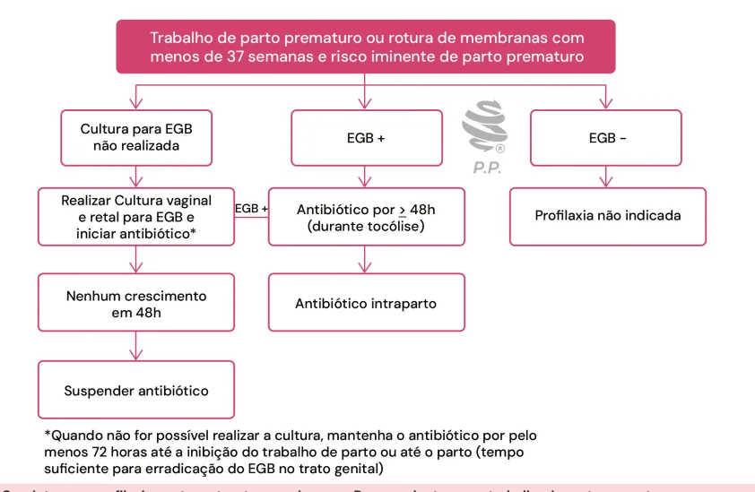

# Trabalho de Parto Prematuro

<!-- page:1 -->

- Definição: Contrações uterinas regulares que modificam o colo uterino antes de 37 semanas completas, mas após 20-22 semanas.

Tocólise

- Objetivo: dar tempo do corticoide fazer efeito;

- Contraindicações: óbito fetal, malformação fetal incompatível com a vida, alteração de vitalidade fetal, quadros hipertensivos graves, hemorragia materna com instabilidade, corioamnionite, doenças cardíacas graves, maturidade fetal comprovada.

## PREMATURIDADE

## DEFINIÇÃO

- Nascimento antes de 37 semanas, mas após 20 –

22 semanas. FATORES DE RISCO

- Antecedente de Trabalho de Parto Prematuro (TPP);

- Socioeconômicos: drogadição, tabagismo, etilismo etc.;

- Depressão, ansiedade;

- Infecções;

- Gemelaridade, polidrâmnio;

- Incompetência istmocervical (IIC), colo curto, malformações uterinas;

- Ruptura prematura de membranas ovulares (RPMO);

- Estresse físico ou mental.

## TRABALHO DE PARTO

PREMATURO DIAGNÓSTICO Contrações uterinas + Modificação do colo:

- Esvaecimento;

- Amolecimento;

- Dilatação.

## MEDIDAS DE PREDIÇÃO

- Dosagem de fibronectina: VPN de 90 a 95%, tornando-se pouco provável parturição em até 15 dias;

- Medida do comprimento cervical (<25mm) em pacientes com fatores de risco ou sintomáticas → aumento do risco.

## CONDUTA

- Anamnese;

- Exame clínico completo: buscar causa → quadro infeccioso, uso de drogas, estressores;

- Cardiotocografia;

- Ultrassonografia;

- Laboratorial: urina 1, urocultura e Pesquisa de estreptococo do grupo B (EGB). Corticoterapia

- Objetivo: Maturação pulmonar;

- Quando fazer? Entre 24 e 34 semanas de gestação.

Neuroproteção fetal

- Quando fazer? Até 31 semanas e 6 dias e parto iminente.

Profilaxia EBG

- Esquemas: Ampicilina 2g EV + 1g 4/4h ou Penicilina s Cristalina 5mi UI EV + 2,5mi UI 4/4h.

- Pilares do tratamento: Corticoide; Tocólise; Neuroproteção fetal; Profilaxia EGB.

Corticoide

- Objetivos: Maturação pulmonar: principal; Redução de hemorragia periventricular; Redução de enterocolite necrosante.

- Maior efeito de 24h após e até 7 dias.

Tabela 1: Esquemas de corticoterapia antenatal. Dexametasona Betametasona 6 mg 12/12h por 48h 12 mg 24/24h por 48h 4 doses total 2 doses total Quando fazer?

- Indicada entre 24 e 34 semanas de gestação.

Tocólise Quando?

- Membranas íntegras;

- Até 4 a 5 cm de dilatação;

- Entre 24 e 34 semanas.

Objetivo

- Para que dê tempo de fazer o ciclo do corticoide.

Contraindicações Absolutas

- Óbito fetal;

- Anomalia fetal letal;

- Alteração de vitalidade fetal;

- Quadros hipertensivos graves;

- Hemorragia materna com instabilidade;

- Corioamnionite;

- Doenças cardíacas graves.

Medicações

- Agonistas beta-adrenérgicos → Terbutalina IV

- Bloqueadores de canais de cálcio → Nifedipino VO

- Inibidores da prostaglandina sintetase → Indometacina

VO ou VR

- Antagonista específico do receptor de ocitocina → Atosiban IV

Na falha de um tocolítico, pode-se tentar outro.

---

<!-- page:2 -->

Agonistas beta-adrenérgicos

- Se parto prematuro eletivo, iniciar, pelo menos, 4 horas;

- Efeitos colaterais:

- Contraindicado se paciente tiver miastenia gravis. Palpitação, mal-estar, tremores; Hiperglicemia, hipocalemia; ANTIBIOTICOTERAPIA Taquiarritmias;

- Coletar cultura vaginal + perianal e pesquisar EGB; Edema agudo de pulmão.

- Esquemas:

- Não utilizar: suspeita de infecção, cardiopatas, | Ampicilina 2g IV + 1g 4/4h ou hipertensas e diabéticas. | Penicilina cristalina 5miUI IV (ataque) + 2,5miUI primeira escolha atual) Profilaxia EGB – Quando fazer

Bloqueadores de canal de cálcio (off label, porém 4/4h (manutenção)

- Efeitos colaterais:

- Urocultura positiva para EGB no pré-natal; Rubor, cefaleia, náuseas e hipotensão.

- Rastreio positivo antes do trabalho de parto;

- Não usar se: doença cardiovascular, disfunção

- Filho anterior com sepse precoce por EGB hepática, hipotensão, hipertensas prévias.

- EGB desconhecido: Idade gestacional <37 semanas;

Cuidado em associar com sulfato de magnésio → risco | RPMO ≥18 horas e IG ≥ 37 semanas ; de hipotensão grave e bloqueio neuromuscular | Febre materna (≥38oC).

- Verificar Figura 1

Inibidores das prostaglandinas-sintetases

- Efeitos colaterais: E DEPOIS? Náusea, vômito, gastrite, doença do

- Não recomendar repouso;

refluxo gastroesofágico;

- Não fazer uso de tocolítico de manutenção; Constrição canal arterial;

- Progesterona 200mg via vaginal? Incerto Oligoâmnio.

- Dose de resgate de corticoide (segundo ciclo):

- Não utilizar se: idade gestacional > 32 | Menos de 34 semanas;

semanas, restrição do crescimento fetal e/ou | Primeiro ciclo há mais de 7 - 14 dias. oligoâmnio presentes.

Antagonista da ocitocina E SE NÃO DEU CERTO – PARTO

- Efeitos colaterais:

- Parto Vaginal Maravilhoso, porém caro. | Apresentação cefálica fletida → sem restrições;

Neuroproteção fetal | Vigilância bem estar fetal;

- Até 31 semanas e 6 dias/ | Evitar amniotomia;

- Se alta probabilidade de parto em 24 horas; | Não fazer episiotomia de rotina.

- Fórceps: idealmente IG > 34 semanas;

Sulfato de Magnésio

- Cesárea: apresenta dificuldades técnicas.

4g EV + 1g EV 1h/1h Figura 1: Conduta para profilaxia contra estreptococo do grupo B em pacientes com trabalho de parto prematuro.

