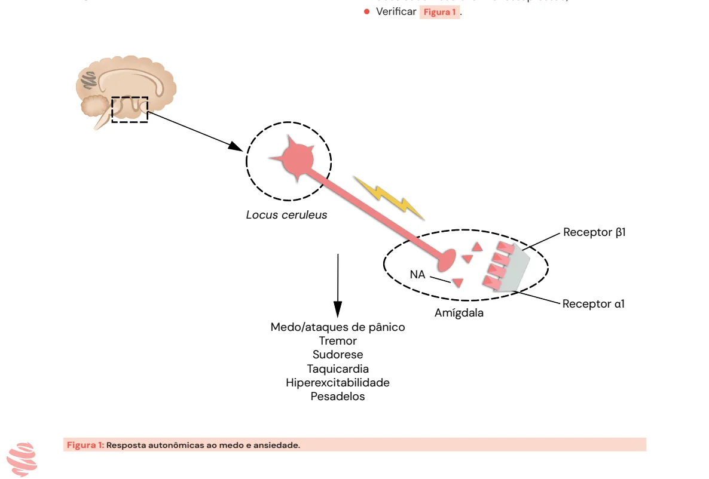
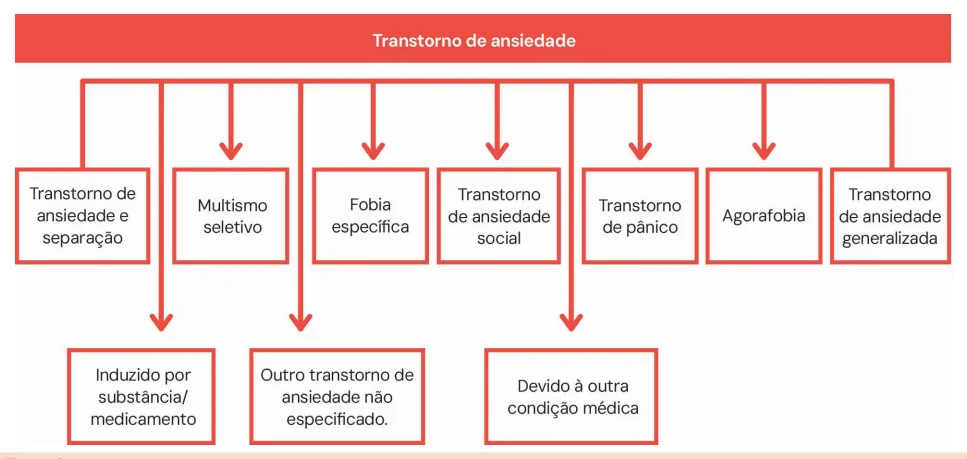
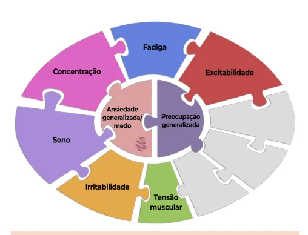

# Transtorno de Ansiedade

<!-- page:1 -->

## Visão Geral — Transtornos de Humor e Ansiosos

- **Medo** é uma resposta real, imediata e adaptativa, mediada pela amígdala e pela noradrenalina.
- **Ansiedade** é a antecipação de uma ameaça futura, geralmente exagerada e persistente, envolvendo o circuito córtico-estriato-tálamo-cortical.
- **Síndrome ansiosa** é composta por sintomas físicos, cognitivos, emocionais e comportamentais.

### Ataque de Pânico

- **Início súbito**, com pico em minutos.
- **Necessário pelo menos 4 sintomas** como: palpitação, tremor, falta de ar, dor torácica, tontura, medo de morrer ou enlouquecer.
- Pode ocorrer isoladamente ou no contexto do transtorno do pânico.

### Tratamento Geral

- **Psicoterapia é preferencial** e mais eficaz — preferencialmente terapia cognitivo-comportamental focada no trauma, EMDR (dessensibilização e reprocessamento por movimentos oculares) ou exposição escrita.
- **ISRS** (Inibidores Seletivos da Recaptação da Serotonina) são a primeira escolha farmacológica: fluoxetina, sertralina, paroxetina.
- **Benzodiazepínicos são contraindicados**, pois prejudicam o processamento do trauma e aumentam o risco de dissociação.

### Transtorno Obsessivo-Compulsivo (TOC)

- Caracteriza-se por **obsessões** (pensamentos intrusivos) e/ou **compulsões** (rituais repetitivos), com duração superior a uma hora por dia ou que causem prejuízo funcional.
- Exemplo clássico: medo de contaminação com lavagens excessivas.
- **Insight geralmente preservado**.
- **Tratamento**: terapia cognitivo-comportamental e ISRS (fluvoxamina, sertralina, escitalopram).

### Ansiedade Normal vs. Transtorno de Ansiedade

- **Ansiedade normal**: transitória e proporcional à ameaça, promovendo enfrentamento.
- **Transtorno de ansiedade**: resposta persistente, desproporcional e leva à esquiva e prejuízo funcional.

## Causas Orgânicas e Medicamentosas

**Condições médicas:**
- Disfunções da tireoide, feocromocitoma, hipoglicemia, DPOC e arritmias.

**Fármacos e substâncias:**
- Cafeína, corticosteroides, ISRS em fase inicial, abstinência de álcool ou benzodiazepínicos.

---

<!-- page:2 -->

## Introdução

Os transtornos de ansiedade estão entre os quadros psiquiátricos mais prevalentes na prática clínica e nas provas de residência médica. Envolvem respostas desproporcionais de medo ou preocupação (ansiedade), frequentemente acompanhadas de sintomas físicos.

### Medo

- **Resposta emocional aguda, real e adaptativa** diante de um perigo iminente. Faz parte do sistema fisiológico de defesa ("luta ou fuga").
- **Circuito predominante**: amígdala.
- **Neurotransmissores**: GABA, serotonina, noradrenalina.
- **Sintomas físicos**: taquicardia, tremores, sudorese, hiperexcitabilidade, pesadelos.

### Ansiedade

- **Antecipação de uma ameaça futura** (medo antecipatório). Pode ser adaptativa em níveis leves, mas se torna patológica quando exagerada e persistente.
- **Circuito predominante**: córtico-estriato-tálamo-cortical.
- **Sintomas típicos**: tensão muscular, vigilância, comportamento de cautela/esquiva, insônia, irritabilidade, preocupação excessiva.

## Respostas Autonômicas ao Medo e Ansiedade

- **Locus ceruleus**: região do tronco encefálico onde se localizam os neurônios noradrenérgicos.
- A **amígdala** se conecta ao locus ceruleus. A ativação do locus ceruleus pela amígdala promove intensa liberação de noradrenalina, desencadeando a resposta simpática típica: **medo intenso, ataques de pânico, tremores, sudorese, taquicardia, hiperexcitabilidade e pesadelos**.
- **Responsável pela resposta clássica de "luta ou fuga"**, mediada principalmente por noradrenalina e adrenalina.
- **Repercussões clínicas**: hiperativação simpática sustentada aumenta risco de aterosclerose, isquemia cardíaca, elevação da pressão arterial, redução da variabilidade da frequência cardíaca, infarto do miocárdio e até morte súbita.
- **Resposta endócrina**: A amígdala possui conexões com o hipotálamo, que se comunica com a hipófise, estimulando a liberação de hormônios adrenocorticais pela glândula adrenal. Isso aumenta os níveis séricos de cortisol. Quando essa ativação se torna crônica, o excesso de cortisol contribui para alterações metabólicas prejudiciais: resistência à insulina, dislipidemia, obesidade visceral e imunossupressão.

*Figura 1: Respostas autonômicas ao medo e ansiedade — receptor β1 e α1 via amígdala e locus ceruleus.*

---

<!-- page:3 -->

## Ataque de Pânico

- **Tipo particular de resposta ao medo**.
- **Resposta abrupta de medo intenso com pico em minutos**.
- **Sintomas físicos e cognitivos intensos** (descarga adrenérgica): palpitações, tremores, dor torácica, parestesias, despersonalização, desrealização, medo de morrer ou "enlouquecer".
- Pode ocorrer isoladamente ou em vários transtornos, não limitados aos transtornos de ansiedade.

## Fobia

- **Medo irracional, intenso e desproporcional** ("desadaptativa") a um objeto ou situação específica.
- Caracteriza-se por **esquiva e sofrimento significativo**.
- **Tipos**: fobia social, fobia específica, agorafobia.

## Síndromes Ansiosas

- **Conjunto de sintomas físicos, cognitivos, afetivos e comportamentais** resultantes de ativação exagerada do sistema de alerta.
- Presente em transtornos de ansiedade, mas também em outros quadros psiquiátricos e clínicos.
- **Baseada no modelo cognitivo-comportamental**: um evento externo ou interno (como um sintoma corporal ou situação social) é interpretado de forma disfuncional pelo indivíduo (avaliação cognitiva distorcida), o que leva a uma reação emocional (medo, angústia) e, por sua vez, a alterações comportamentais e sintomas físicos. Essas reações reforçam o circuito, perpetuando o quadro.

**Modelo cognitivo-comportamental da ansiedade:**

Evento → Avaliação Cognitiva → Emoção → Comportamento → Reforço do Ciclo

### Manifestações Clínicas

**Pensamentos e sentimentos frequentes:**

- "Vou ser atacado."
- "Estão me avaliando mal."
- "Não serei socorrido."
- "Algo está errado com meu corpo."
- "Preocupo-me com tudo."
- "Estou fora de controle."

**Sintomas físicos comuns:**

- Tensão muscular
- Dispneia/sensação de sufocamento
- Palpitações
- Dor torácica atípica
- Tontura/sensação de desmaio
- Sudorese
- Parestesias

**Comportamentos associados:**

- Hipervigilância constante
- Evitação de lugares, pessoas ou situações
- Restrição progressiva da vida social e funcional

> ⚠️ Tabela 1 ambígua no OCR original (Diferenciação da ansiedade adaptativa e o transtorno de ansiedade) — conteúdo essencial já descrito acima em seções separadas. A tabela comparava "Ansiedade normal" (transitória, proporcional à ameaça, promove enfrentamento) vs. "Transtorno de ansiedade" (persistente, excessiva, desproporcional, leva à esquiva e prejuízo funcional).

## Ansiedade Secundária

Frente às síndromes ansiosas também é essencial descartar **causas orgânicas** (outras condições médicas) e **uso de medicamentos/substâncias**.

### Ansiedade Secundária à Condição Médica

**Cardiovascular**: síndromes coronarianas agudas, insuficiência cardíaca, arritmias.
**Pulmonar**: asma, DPOC.
**Endócrina**: disfunção tireoidiana, hiperparatireoidismo, hipoglicemia, menopausa, doença de Cushing, insulinoma, feocromocitoma.
**Hematológica**: anemia.
**Neurológica**: epilepsia, encefalopatia, tremor essencial.

### Ansiedade Secundária ao Uso de Medicamentos/Substâncias

- **Corticoides**
- **Simpaticomiméticos**: efedrina, adrenalina, pseudoefedrina
- **Tiroxinas**
- **Antidepressivos** (tricíclicos e ISRS) em fases iniciais
- **Estimulantes**: cafeína, anfetamina, aminofilina, cocaína, teofilina, metilfenidato
- **Descontinuação de**: barbitúricos, benzodiazepínicos, narcóticos, álcool, sedativos (abstinência)
- **Broncodilatadores**
- **Dopaminérgicos**: amantadina, bromocriptina, levodopa, metoclopramida, antipsicóticos
- **Insulina** (associada à hipoglicemia)

## Transtornos de Ansiedade

Apresentam a síndrome ansiosa como manifestação primária ou principal. Podem ser subclassificados de acordo com a presença de desencadeantes.

### Sem Desencadeante Específico

- **TAG** (Transtorno de Ansiedade Generalizada)
- **TP** (Transtorno do Pânico)

### Com Desencadeante Específico

- Transtorno de ansiedade social (fobia social)
- Agorafobia
- Fobia específica (objetos ou situações simples)
- Transtorno de ansiedade de separação
- Transtorno de ansiedade de doença

*Figura 2: Transtornos de ansiedade segundo o DSM-5 — a duração dos sintomas auxilia na diferenciação entre eles. Mínimo de 1 mês: mutismo seletivo/transtorno do pânico. Mínimo de 6 meses: TAG, transtorno de ansiedade de separação, fobia específica, agorafobia.*

---

<!-- page:4 -->

## Outros Transtornos com Síndrome Ansiosa

Apresentam a síndrome ansiosa como manifestação de importância central, mas são classificados em outras categorias segundo o DSM-5. Possuem um desencadeante específico:

- **TEPT** (Transtorno de Estresse Pós-Traumático)
- **TEA** (Transtorno de Estresse Agudo)
- **TA** (Transtorno de Adaptação)
- **TOC** (Transtorno Obsessivo-Compulsivo)
- Transtorno de ansiedade de doença
- Transtorno de sintomas somáticos

*Figura 3: Sintomas do TAG.*

### Transtorno de Ansiedade Generalizada (TAG)

- **Ansiedade e preocupação excessivas e persistentes**, de difícil controle, envolvendo vários domínios da vida (trabalho, saúde, finanças, relações interpessoais), presentes na maioria dos dias por pelo menos **6 meses**.
- **Critérios DSM-5**:
  - Ansiedade/preocupação excessiva na maioria dos dias por ≥ 6 meses
  - Dificuldade de controlar a preocupação
  - Presença de 3 ou mais dos seguintes sintomas:
    - Inquietação ou sensação de estar com "nervos à flor da pele"
    - Fadiga
    - Dificuldade de concentração ou "brancos mentais"
    - Irritabilidade
    - Tensão muscular
    - Alterações do sono (dificuldade para iniciar ou manter o sono; sono não reparador)
  - Alterações funcionais ou sofrimento clinicamente significativo

### Transtorno do Pânico

- **Presença de ataques de pânico inesperados e recorrentes**, seguidos de preocupação persistente e/ou mudanças comportamentais desadaptativas.

**Ataques de pânico (DSM-5):**

- **Crises súbitas de medo ou desconforto intensos**
- **Início abrupto, com pico em minutos**
- **Presença de pelo menos 4 sintomas físicos/cognitivos**, como:
  - Palpitação, sudorese, tremores
  - Dispneia, dor torácica, náusea
  - Sensação de desrealização ou despersonalização
  - Medo de morrer, enlouquecer ou perder o controle
  - Tontura, parestesia, calafrios/ondas de calor
- **Pelo menos um dos ataques é seguido por ≥ 1 mês de**:
  - Preocupação persistente com novos ataques ou suas consequências (ex.: infarto, "enlouquecer")
  - Alterações comportamentais desadaptativas (ex.: esquiva de atividades físicas, multidões, lugares fechados)

---

<!-- page:5 -->

### Transtorno de Ansiedade Social (Fobia Social)

- O indivíduo apresenta **medo, ansiedade ou esquiva** diante de situações sociais em que possa ser avaliado pelos outros.
- **Exemplos comuns**: falar em público; comer ou beber em público; conhecer pessoas novas.
- **Ideias centrais**: medo de avaliação negativa, humilhação, rejeição ou ofender alguém.
- O **medo é reconhecido como exagerado e desproporcional** frente ao contexto real.
- Pode levar a **prejuízo funcional importante** e comprometimento social ou ocupacional.
- **O tratamento farmacológico não é eficaz** — preferencialmente terapia cognitivo-comportamental.

### Agorafobia

- Caracteriza-se por **medo ou ansiedade intensa** diante de duas ou mais das seguintes situações:
  - Uso de transporte público (ônibus, metrô, avião)
  - Ambientes abertos (praças, estacionamentos)
  - Ambientes fechados (lojas, cinemas, teatros)
  - Multidões ou filas
  - Estar sozinho fora de casa
- O **medo decorre da possibilidade de não conseguir escapar** ou não receber ajuda adequada caso ocorra um sintoma súbito (ex.: crise de pânico, queda, incontinência, desmaio).
- **Essas situações**:
  - Quase sempre geram ansiedade
  - São frequentemente evitadas
  - Ou só são enfrentadas com a presença de um acompanhante confiável
- O **medo é desproporcional ao risco real** e inadequado ao contexto sociocultural.

### Fobia Específica

- **Medo ou ansiedade intensa** diante de objetos ou situações específicas.
- Ocorrem por **≥ 1 mês** após o contato.
- A **resposta fóbica é**: imediata, persistente e desproporcional ao perigo real; frequentemente leva à evitação ativa da situação ou objeto.
- **Tipos comuns**:
  - Fobia de animais
  - Ambientes naturais (altura, tempestade, água)
  - Sangue-injeção-ferimentos
  - Situações específicas (aviões, elevadores, dirigir)
  - Outros (engasgar, vômito, etc.)

### Transtorno de Estresse Pós-Traumático (TEPT)

**História de trauma real:**

- Exposição a evento com risco real ou ameaça de:
  - Morte
  - Lesão grave
  - Violência sexual
- **Formas de exposição**:
  - Vivenciado diretamente
  - Testemunhado
  - Conhecimento de evento com familiar ou amigo próximo
  - Exposição repetida a detalhes do trauma (ex.: profissionais de saúde)
  - Não inclui: filmes, mídias ou notícias (exceto por obrigação ocupacional)

**Sintomas emocionais principais** (presentes por ≥ 1 mês):

- **Intrusão**: flashbacks, pesadelos, lembranças recorrentes
- **Evitação**: pensamentos, lugares, pessoas
- **Alterações negativas em cognição e humor**: ex., culpa, desesperança, isolamento
- **Excitação/reatividade aumentada**: ex., irritabilidade, hipervigilância, insônia

**TEPT difere dos transtornos relacionados ao estresse** (transtorno de estresse agudo e transtorno de adaptação).

> ⚠️ Tabela 2 ambígua no OCR — Diferenciação entre TEPT e transtornos relacionados ao estresse. Elementos identificáveis:
> - TEPT: Evento traumático = Sim; Início ≥ 1 mês; Duração até 6 meses após trauma.
> - TEA (Transtorno de Estresse Agudo): Evento traumático = Sim; Início imediato (até 3 dias); Duração 3 dias a 1 mês.
> - Transtorno de Adaptação: Evento traumático = Não (até 3 meses do estressor não traumático); Duração ≤ 6 meses após evento estressor.

---

<!-- page:6 -->

### Exemplos de Estressores Não-Traumáticos (Adaptação)

- Separação conjugal, mudança de cidade, falência, diagnóstico médico leve.

### Transtorno Obsessivo-Compulsivo (TOC)

- **Distúrbio caracterizado por obsessões e/ou compulsões**, reconhecidos como excessivos e indesejados pelo paciente.
- **Insight geralmente preservado**.
- TOC caracteriza-se pela presença de **obsessões e/ou compulsões por > 1h/dia** ou com sofrimento significativo ou prejuízo funcional, social ou ocupacional.

**Obsessões:**

- Pensamentos, imagens ou impulsos recorrentes e intrusivos
- Causam ansiedade ou desconforto
- Exemplos: medo de contaminação, dúvida excessiva, ideias de simetria ou catástrofes

**Compulsões:**

- Ações repetitivas ou atos mentais (ex.: lavar, verificar, contar, repetir palavras)
- Realizadas como tentativa de reduzir a ansiedade causada pelas obsessões (são uma "resposta" às obsessões)
- Não estão conectadas de forma realista ao que se pretende evitar

> ⚠️ Tabela 3 (Principais dimensões do TOC) estava muito fragmentada no OCR. Conteúdo reconstruído em texto abaixo com as principais dimensões identificáveis:

**Principais dimensões do TOC:**

- **Contaminação**: obsessão com germes/secreções → compulsões de lavagens excessivas, banhos repetitivos
- **Ordem/Simetria**: obsessão com simetria → compulsões de alinhar, contar, repetir ações
- **Dúvida/Checagem**: obsessão com verificação → compulsões de verificar portas, gás, luz várias vezes
- **Religiosidade/Moralidade**: obsessão com pensamentos ruins/escrúpulos religiosos → compulsões de rezar compulsivamente, evitar situações
- **Acúmulo (hoarding)**: dificuldade em descartar objetos, acúmulo em excesso

**Insight:**

- A maioria dos pacientes reconhece que seus pensamentos e comportamentos são excessivos (sintomas egodistônicos).
- Casos graves podem ter insight prejudicado.

### Transtornos Relacionados ao TOC

- **Transtorno dismórfico corporal**: preocupação com defeitos físicos mínimos ou inexistentes; comportamentos repetitivos (espelho, comparação, camuflagem).
- **Tricotilomania**: arrancar os próprios cabelos repetidamente, com dificuldade de controle.
- **Transtorno de escoriação (skin picking)**: lesionar a pele de forma repetitiva, frequentemente causando feridas.
- **Transtorno de acumulação (hoarding)**: dificuldade persistente em se desfazer de objetos, mesmo inúteis; ambientes se tornam inutilizáveis.

## Tratamento dos Transtornos de Ansiedade

O tratamento não-farmacológico inclui exercícios físicos, psicoeducação e psicoterapia. O tratamento farmacológico envolve o uso de ansiolíticos. Em geral, a **combinação de fármacos com psicoterapia é mais eficaz** do que cada uma das medidas de forma isolada. Exceção: nos casos de fobia específica, em que só a psicoterapia costuma ser indicada.

### Psicoterapia

- **Terapia cognitivo-comportamental (TCC)**: é a abordagem com maior evidência científica para todos os transtornos de ansiedade. Trabalha a reestruturação de pensamentos disfuncionais.
- **Psicoterapia de orientação analítica (POA) / psicodinâmica**: útil para quem deseja entender os conflitos inconscientes ligados à ansiedade.
- **Mindfulness**: técnicas de atenção plena que auxiliam no manejo da ansiedade e da ruminação.

### Ansiolíticos

**Inibidores Seletivos da Recaptação de Serotonina (ISRS):**

- **Primeira escolha**.
- **Fluoxetina**: mais ativadora (cautela em casos de insônia ou agitação).
- **Sertralina, citalopram, escitalopram**: bem tolerados; **escitalopram tem perfil mais seguro**.
- **Paroxetina**: evitar em idosos e gestantes.
- **Fluvoxamina**: mais usada em TOC.

**Inibidores da Recaptação de Serotonina e Noradrenalina (IRSN):**

- Venlafaxina, desvenlafaxina, duloxetina.
- Alternativa eficaz quando há resposta insuficiente aos ISRS ou comorbidade dolorosa.

**Outros:**

- **Antidepressivos tricíclicos**: eficazes, mas com mais efeitos colaterais.
- **Betabloqueadores** (ex.: propranolol): úteis em ansiedade social/de desempenho (como antes de apresentações).
- **Anticonvulsivantes**: usados em casos específicos, como transtorno de ansiedade generalizada (TAG) resistente.

### Benzodiazepínicos

- **São ansiolíticos/sedativos com potencial para dependência**.
- **Indicações pontuais**: ataques de pânico, insônia grave ou agitação intensa; agitação psicomotora por abstinência alcoólica (inclusive delirium tremens); intoxicação por estimulantes (como cocaína).
- **Quando não usar**: como monoterapia para transtornos ansiosos; por tempo prolongado; após eventos traumáticos agudos; em delirium de idosos; na intoxicação por álcool.
- **A escolha do BZD considera a meia-vida**:
  - **Curta duração** (< 5h): alprazolam, midazolam
  - **Intermediária** (5–24h): lorazepam (preferido em hepatopatas), bromazepam
  - **Longa** (> 24h): clonazepam, diazepam
- **Riscos**: dependência, tolerância, prejuízo cognitivo, amnésia e sintomas de abstinência.
- **Procedimento para retirada**: deve ser gradual, para evitar síndrome de abstinência. Exemplo: reduzir 1/4 da dose a cada 2 semanas.
- **"Drogas Z"** (ex.: zolpidem): hipnóticos não-benzodiazepínicos. Apesar de usados para insônia, não são benzodiazepínicos, mas também exigem cautela.

---

<!-- page:7 -->

## Tratamento do TEPT

- **Psicoterapia é a base do tratamento**.
- **Terapia cognitivo-comportamental focada no trauma** é a abordagem com melhor evidência. Inclui:
  - Reinterpretação dos significados do trauma
  - **Terapia de processamento cognitivo**: trabalha a ressignificação e reestruturação de pensamentos disfuncionais relacionados ao trauma
  - **Terapia de exposição prolongada**: expõe gradualmente o paciente às memórias traumáticas de forma controlada, favorecendo a dessensibilização
  - **Exposição escrita (narrativa)**: o paciente escreve e revisita o relato do trauma, promovendo reestruturação cognitiva
  - **Dessensibilização e reprocessamento por movimentos oculares (EMDR)**: técnica validada que utiliza estímulos bilaterais (como movimentos oculares) durante a recordação do trauma, facilitando o reprocessamento emocional

### Tratamento Farmacológico do TEPT

- **ISRS (primeira linha)**: fluoxetina, sertralina, paroxetina.
- **IRSN**: alternativa quando não há resposta aos ISRS.
- **Não se deve utilizar benzodiazepínicos**: podem atrapalhar o processamento do trauma, aumentar o risco de dependência e agravar sintomas dissociativos.

## Referências

- Figura 1: Respostas autonômicas ao medo e ansiedade — receptor β1 (noradrenalina) e α1 mediados pela amígdala e locus ceruleus.
- Figura 2: Transtornos de ansiedade segundo o DSM-5 — hierarquia diagnóstica e duração dos sintomas.
- Figura 3: Sintomas do Transtorno de Ansiedade Generalizada.
