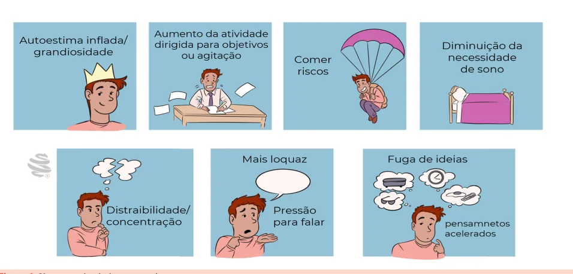
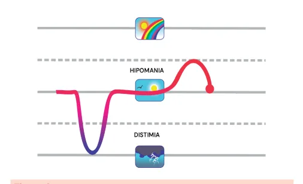

# Transtorno de Humor

<!-- page:1 -->

## TRANSTORNO DE HUMOR III

## MANIA E TRANSTORNO BIPOLAR

Transtorno de humor e ansiosos (CM)

## SÍNDROME MANÍACA

- Ciclotimia: oscilações entre sintomas hipomaníacos

- Humor elevado ou irritado, acompanhado de e depressivos subclínicos por pelo menos 2 anos;

pelo menos 3 sintomas (ou 4, se humor irritado):

- Ciclagem rápida: quatro ou mais episódios distintos autoestima inflada, redução da necessidade de humor nos últimos 12 meses.

de sono, fuga de ideias, fala excessiva, Tratamento do transtorno bipolar agitação ou aumento de atividade dirigida,

- Estabilizadores de humor são a base do tratamento:

impulsividade, distração; | lítio: eficaz na mania, depressão e manutenção;

- Duração mínima de 7 dias, ou qualquer duração se requer monitoramento; previne suicídio;

houver internação ou sintomas psicóticos; | valproato: primeira linha na mania e manutenção

- Mnemônico “DISPARA”: no TB tipo I; Distração; | lamotrigina: eficaz na fase depressiva e Irritabilidade; manutenção; não usar na mania; Sono reduzido; | carbamazepina: opção menos utilizada; Pensamento acelerado; | quetiapina: primeira linha em todos os polos; Alegria; | aripiprazol e risperidona: eficazes na Riscos Aumentados. mania e manutenção;

Mania e hipomania | lurasidona: indicada na depressão bipolar;

- Mania: humor eufórico com 3 sintomas ou irritado | clozapina: reservada para casos refratários.

com 4 sintomas, por pelo menos 7 dias, com

- Evitar uso isolado de antidepressivos, prejuízo funcional ou psicose. principalmente tricíclicos, devido ao risco de

- Hipomania: sintomas semelhantes por pelo menos virada maníaca. Estimulantes também podem necessidade de hospitalização.

4 dias, sem psicose, sem prejuízo grave, sem induzir mania;

- Intervenções psicossociais:

Transtornos bipolares (TB) | psicoeducação é a primeira linha;

- Transtorno bipolar tipo I: episódio de mania, com ou | terapia cognitivo-comportamental e terapia sem episódio depressivo; focada na família podem ser úteis

- Transtorno bipolar tipo II: episódio de hipomania + como adjuvantes.

episódio depressivo maior;

- Duração ≥ 7 dias (ou qualquer duração, se houver necessidade de internação ou sintomas psicóticos);

- Ter humor elevado (expansivo) ou irritado é

- Sintomas desproporcionais aos fatos da vida e critério obrigatório; distintos do estado habitual;

- Acompanhado de pelo menos 3 sintomas (se humor

- Pode haver taquipsiquismo e prejuízo acentuado no elevado) ou 4 (se humor irritado): funcionamento social/profissional. autoestima inflada ou grandiosidade; redução da necessidade de sono; Para lembrar os sintomas da síndrome maníaca, fuga de ideias ou sensação de utiliza-se o mnemônico “DISPARA”. pressão para falar ou fala excessiva (mais loquaz);

pensamentos acelerados;

- D: distraibilidade; aumento da atividade dirigida a objetivos ou

- I: irritabilidade;

agitação psicomotora;

- S: sono reduzido; envolvimento excessivo em atividades com alto

- P: pensamento acelerado;

potencial de consequências dolorosas (ex: gastos

- A: alegria;

excessivos, sexo desinibido, decisões impulsivas);

- RA: riscos aumentados. aumento da distraibilidade (dificuldade

- Verificar Figura 1 na próxima página de concentração).

---

<!-- page:2 -->

Figura 1: Sintomas da síndrome maníaca.

## MANIA E HIPOMANIA (DSM-5)

- Mania: humor eufórico/expansivo + 3 sintomas ou; humor irritado/disfórico + 4 sintomas; por ≥ 7 dias.

- Hipomania: ≥ 4 dias, menor intensidade, sem sintomas psicóticos, sem prejuízo acentuado, sem necessidade de hospitalização.

Um episódio de mania é suficiente para fechar o diagnóstico de transtorno bipolar. Figura 3: TB tipo II.

## TRANSTORNOS BIPOLARES (TB)

- Ciclotimia: ≥ 2 anos com oscilações entre sintomas

- TB I: mania com ou sem episódio depressivo maior depressivos leves e hipomaníacos, sem critérios

(quando sem depressão, chamada de mania unipolar); completos para EDM, mania ou hipomania; Figura 4: Ciclotimia.

Figura 2: TB tipo I.

- Ciclagem rápida: ≥ 4 episódios de humor distintos nos últimos 12 meses.

- TB II: hipomania + episódio depressivo maior (EDM).

Não é uma forma mais leve que o TB I, já que a tentativa de suicídio pode ocorrer durante os episódios de depressão;

Figura 5: Ciclagem rápida.

---

<!-- page:3 -->

## TRANSTORNO DEPRESSIVO MAIOR (TDM) E

- Carbamazepina: muitas interações e risco de efeitos

TRANSTORNO BIPOLAR adversos, não é de 1.ª linha; É fundamental diferenciar o transtorno bipolar do

- Lamotrigina: indicada em polaridade depressiva transtorno depressivo maior (depressão unipolar), pois predominante; boa opção na manutenção; não é isso modifica o tratamento do paciente. indicada no episódio maníaco; risco de reação de isso modifica o tratamento do paciente.

Tabela 1: Diferenciação do TDM (depressão unipolar) da bipolaridade. Unipolaridade Bipolaridade Hipersonia;

Hiperfagia ou aumento de peso; Insônia inicial/ Retardo ou agitação sono reduzido; psicomotora; Perda do apetite Sintomas ou de peso;

Sintomas psicóticos; Nível de atividade Culpa patológica; normal; Labilidade do Queixas humor; somáticas.

Irritabilidade; Pensamento acelerado. Primeiro episódio Primeiro episódio depressivo com > Curso da depressivo com < 25 anos;

doença 25 anos; Duração longa do Múltiplos episódios. episódio atual. História familiar História familiar História negativa para positiva para familiar bipolaridade. bipolaridade.

## TRATAMENTO DO TRANSTORNO BIPOLAR

- Estabilizadores de humor tratam mania e depressão no TB;

- Antidepressivos podem induzir a virada maníaca, especialmente os tricíclicos;

- Estimulantes (metilfenidato, lisdexanfetamina, cocaína, anfetaminas) também podem desencadear mania.

Estabilizadores de humor

- São a base essencial para o sucesso do tratamento.

Lítio

- “Antimaníaco” e “estabilizador do humor” clássico;

- Indicado no episódio depressivo, maníaco e na manutenção do TB I e II;

- Excreção renal, requer monitoramento de litemia, TSH,

T4 e função renal;

- Previne suicídio e potencializa antidepressivos;

- Efeitos adversos: tremor, hipotireoidismo, diarreia, bradicardia, ganho de peso, acne, alopecia e rash;

- Cuidado: medicamentos que interferem na função renal podem aumentar a litemia.

Anticonvulsivantes

- Valproato/divalproato: 1.ª linha para episódio maníaco e manutenção no TB 2.ª linha para depressão bipolar; Efeitos adversos: ganho de peso, alopecia, sedativo. indicada no episódio maníaco; risco de reação de hipersensibilidade cutânea.

I (mais efetivo no TB I); Antipsicóticos atípicos

- Quetiapina: 1.ª linha em todos os polos (mania, depressão, manutenção);

- Aripiprazol: 1.ª linha para mania e manutenção;

- Risperidona: 1.ª linha para mania;

- Lurasidona: 1.ª linha para depressão bipolar;

- Olanzapina: não é de 1.ª linha;

- Clozapina: casos refratários.

Intervenções psicossociais

- Adjuvantes à farmacoterapia;

- Podem ser úteis em episódios depressivos agudos e na fase de manutenção.

- Psicoeducação (primeira linha);

- Terapia cognitivo-comportamental (TCC;

segunda linha);

- Terapia focada na família (TFF; segunda linha).

## ESTABILIZADORES DE HUMOR – LÍTIO

- “Antimaníaco” e “estabilizador do humor” clássico;

- Usado no episódio depressivo, maníaco e na manutenção do transtorno bipolar I e II;

- Apresenta excreção renal (cuidado com a função renal).

Estreito índice terapêutico: requer monitoramento regular → diuréticos podem aumentar os níveis séricos.

- Potencializa antidepressivos e previne o suicídio.

Efeitos adversos

- Gastrointestinais: náuseas, diarreia;

- Cardíacos: bradicardia sinusal;

- Renais: doença renal crônica: medicamentos que alteram a função renal aumentam a litemia.

- Neurológicos: tremores bilaterais;

- Endócrinos: hipotireoidismo: ganho de peso.

- Sempre monitorizar níveis séricos de lítio, função renal,

TSH e T4 livre. ESTABILIZADORES DE HUMOR – ANTICONVULSIVANTES

- Valproato (ácido valproico/divalproato);

- Primeira linha para mania e manutenção do TB I;

- Segunda linha no episódio depressivo do TB;

- Terceira linha para fase de manutenção no TB II;

- Risco de amenorreia e de ovários policísticos em mulheres em idade fértil;

- Melhor que o lítio em pacientes que fazem uso de substâncias psicoativas ou possuem ansiedade;

- Boa opção para mania disfórica ou humor predominantemente irritado;

- Carbamazepina: NÃO é de primeira linha; muitas interações medicamentosas; colaterais importantes;

- Lamotrigina: considerar quando há polaridade depressiva predominante/depressão cognitiva/opção na manutenção.

---

<!-- page:4 -->

## ESTABILIZADORES DE HUMOR – REFERÊNCIAS

## ANTIPSICÓTICOS

- AP atípicos (antagonista 5HT-DA); Figura 1: Sintomas da síndrome maníaca.

- Quetiapina: primeira linha em todos os polos (TB I e Acervo Medcof.

II) e manutenção; Figura 2: II) e manutenção;

- Aripiprazol: primeira linha na mania e manutenção; A

- Risperidona: primeira linha na mania;

- Lurasidona: primeira linha depressão bipolar/ A depressão cognitiva;

- Olanzapina: NÃO é primeira linha; A

- Clozapina: casos mais refratários.

A Figura 2: TB tipo I. Acervo Medcof. Figura 3: TB tipo II. Acervo Medcof. Figura 4: Ciclotimia. Acervo Medcof.

Figura 5: Ciclagem rápida. Acervo Medcof. Tabela 1: Diferenciação do TDM (depressão unipolar) da bipolaridade.

Acervo Medcof.
