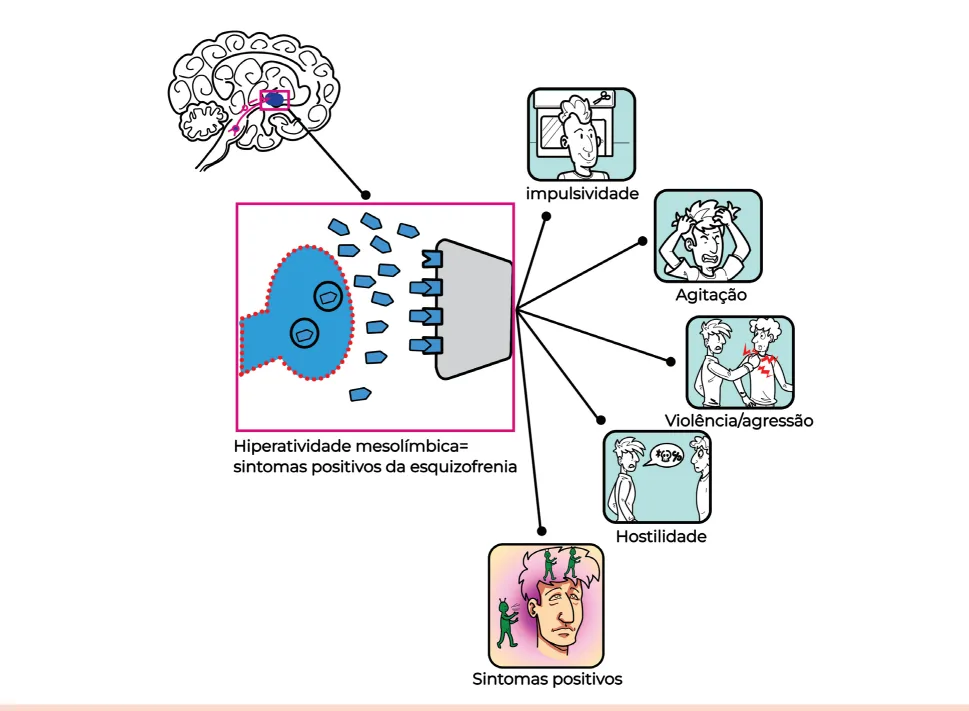
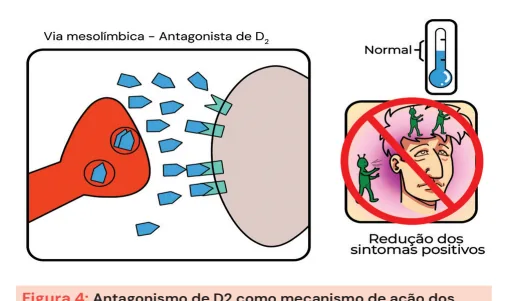

# Transtorno Psicótico

<!-- page:1 -->

Abuso de Substâncias e Psicose (CM) PSICOSE

- Típicos (1ª geração):

- É a perda de contato com a realidade; | Mais sintomas extrapiramidais;

- Sintomas positivos: delírios, alucinações auditivas, | Alta potência: haloperidol;

comportamento e pensamento desorganizados; | Baixa potência: clorpromazina.

- Sintomas negativos (“6As”): Alogia, Aparência

- Atípicos (2ª geração):

descuidada, Afeto embotado, Anedonia, | Mais metabólicos, menos extrapiramidais; Avolição, Associabilidade. | Clozapina: refratários (risco de agranulocitose);

QUADROS EM QUE HÁ PSICOSE | Olanzapina, quetiapina, risperidona, aripiprazol,

- Psicose associada: lurasidona, ziprasidona; Transtorno bipolar (mania), depressão psicótica,

- Efeitos adversos:

abuso de substâncias, demências, Parkinson; | Metabólicos (clozapina, olanzapina): ganho de

- Psicose como núcleo diagnóstico: peso, diabetes mellitus, dislipidemia; Psicótico breve (<1 mês); | Hematológicos (agranulocitose, Esquizofreniforme (1-6 m); neutropenia): clozapina; Esquizofrenia (>6 m, 1 m de fase ativa); | Reduz limiar convulsivo: clozapina; Transtorno delirante (>1 mês, delírios isolados); | Hiperprolactinemia: risperidona, amisulprida. Esquizoafetivo (fase ativa com sintomas afetivos | Distúrbios do movimento (bloqueio D2 Psicótico induzido por substância. | Distonia aguda: torcicolo, crise

+ 2 semanas de psicose isolada); via nigroestriatal): Esquizofrenia (protótipo psicótico) oculógira, biperideno;

- Critérios DSM-5: | Parkinsonismo: rigidez, tremor, biperideno (por ≥ 2 sintomas (1 obrigatoriamente dos 3 curto prazo);

primeiros): delírios, alucinações, discurso | Acatisia: inquietação motora, desorganizado, comportamento desorganizado/ propranolol, benzodiazepínico;

catatônico, sintomas negativos; | Discinesia tardia: irreversível, movimentos | Prejuízo funcional; orais/coreiformes, suspender anticolinérgicos.

| Duração >6 meses (1 mês de fase ativa). | Síndrome neuroléptica maligna: Vias neurobiológicas | “Que MERDA”:

- Mesolímbica: dopamina aumentada resulta em | M: Mente alterada;

sintomas positivos; | E: Elevação de temperatura;

- Mesocortical: dopamina diminuída resulta em | R: Rigidez;

sintomas negativos/cognitivos; | D: Disautonomia;

- Amígdala/pré-frontal: | A: Antipsicótico causa;

agressividade e desorganização. | Conduta: suspender droga + dantrolene + ANTIPSICÓTICOS bromocriptina/amantadina + suporte.

- Tratamento da psicose;

- Mecanismo: bloqueio D2 (dopamina) +

5HT2A (serotonina);

## SÍNDROME PSICÓTICA

| Os sintomas negativos podem ser lembrados com o mnemônico “6As”:

- A psicose é definida como a perda de contato com a | Alogia;

realidade, caracterizada por distorções na percepção | Aparência descuidada; e na relação com o mundo: | Afeto embotado;

| Sintomas positivos: delírios, alucinações | Anedonia; (principalmente auditivas), pensamento e | Avolição;

comportamento desorganizados (tolo, pueril, | Associabilidade. agitação ou catatônico/hiporreativo ao ambiente);

- Verificar Figura 1 na próxima página Sintomas negativos: redução de capacidades e expressões emocionais, como apatia, anedonia, embotamento afetivo e cognitivo.

---

<!-- page:2 -->

- Transtorno psicótico breve: Sintomas psicóticos típicos (delírios, alucinações, desorganização) com duração <1 mês e recuperação total.

- Transtorno esquizofreniforme:

- E

- V

Figura 1: Sintomas negativos.

- O insight costuma estar gravemente comprometido;

- Em geral, trata-se de um quadro clínico grave, com prejuízo funcional importante.

## TRANSTORNOS COM PSICOSE ASSOCIADA

- Psicose pode estar presente em diversos transtornos, como: T Transtorno bipolar (fase maníaca); Depressão com sintomas psicóticos; Uso/abstinência de substâncias (álcool, cocaína, maconha, alucinógenos); Transtornos neurocognitivos (demências); Doença de Parkinson.

- TRANSTORNOS EM QUE A PSICOSE É C

## CARACTERÍSTICA DEFINIDORA

- Transtorno psicótico induzido por substância/medicamento: Delírios e/ou alucinações surgem durante ou após o uso/abstinência de substância capaz de induzir tais sintomas.

- Transtorno esquizoafetivo: Fase ativa da doença marcada por episódios de humor (mania ou depressão) + sintomas psicóticos.

Há, obrigatoriamente, ao menos 2 semanas de sintomas psicóticos sem sintomas afetivos (de humor).

- Transtorno delirante: Delírios persistentes (>1 mês), não bizarros, sem alteração global do funcionamento, nem comportamento desorganizado. - Transtorno esquizofreniforme: Quadro idêntico ao da esquizofrenia, com duração entre 1 e 6 meses. Pode ou não haver prejuízo funcional.

- Esquizofrenia: Protótipo dos transtornos psicóticos. Exige presença de sintomas por >6 meses, sendo pelo menos 1 mês de sintomas da fase ativa.

Esquizofrenia A esquizofrenia é o protótipo do transtorno psicótico. Manifestações clínicas

- Os sintomas podem ser divididos em: Sintomas positivos: delírios (persecutórios e autorreferentes são os mais comuns), alucinações comportamento desorganizados, catatonia; Sintomas negativos: embotamento afetivo, avolição, alogia, anedonia, isolamento social.

(auditivas são mais comuns), discurso e

- Requer impacto funcional significativo e evolução crônica.

Vias neurobiológicas

- Existem 3 vias de neurotransmissores, com suas respectivas teorias ligadas à psicose: Via mesolímbica (dopamina aumentada): origem dos sintomas positivos; Via mesocortical (dopamina reduzida): relacionada aos sintomas negativos e cognitivos; Amígdala e córtex pré-frontal: modulam desorganização, agressividade e afeto.

Teorias neuroquímicas

- Dopaminérgica: hiperatividade D2 na via mesolímbica mesocortical (sintomas negativos);

(sintomas positivos); hipoatividade D1 na via

- Glutamatérgica: disfunção de receptores NMDA;

- Serotoninérgica: hiperatividade de receptores 5HT2A.

- Verificar Figura 2 na próxima página

Critérios diagnósticos (DSM-5)

- Exige presença de sintomas por >6 meses, sendo pelo menos 1 mês de sintomas da fase ativa;

- Critérios: A. Dois (ou mais) dos seguintes sintomas, presentes por pelo menos 1 mês: Delírios; Alucinações; Discurso desorganizado; Comportamento grosseiramente desorganizado ou catatônico; Sintomas negativos. B. Prejuízo funcional significativo (social, ocupacional ou acadêmico); C. Duração mínima de 6 meses, com pelo menos 1 mês de sintomas da fase ativa.

---

<!-- page:3 -->

Figura 2: Teoria dopaminérgica e os sintomas positivos.

## ANTIPSICÓTICOS

- O tratamento farmacológico das síndromes psicóticas/ sintomas psicótico é baseado em antipsicóticos;

- Todos os antipsicóticos atuam modulando neurotransmissores, principalmente dopamina de receptores 5HT2A), com variações em seletividade e intensidade.

(bloqueio de receptores D2) e serotonina (bloqueio Antagonista de D2 D2 5HT2A AP 5HT2A 5HT1A Agonista Antagonista Antagonista parcial de de 5HT2A/D2 de 5HT2A D2/5HT1A D2 AP Figura 3: Mecanismos de ação dos antipsicóticos (AP). / Figura 4: Antagonismo de D2 como mecanismo de ação dos

O bloqueio D2 na via mesolímbica leva à redução dos sintomas positivos.

## TÍPICOS (1ª GERAÇÃO)

- Ação: antagonista potente e seletivo de receptores D2;

- Também chamados de neurolépticos;

- Mais sintomas extrapiramidais;

- Sedativos úteis na agitação;

- Classificam-se em: Alta potência: haloperidol, droperidol; Baixa potência: clorpromazina, levomepromazina.

---

<!-- page:4 -->

ATÍPICOS (2ª GERAÇÃO) | Mais frequente em mulheres;

- Ação: antagonismo combinado de 5HT2A (serotonina) | Piora com biperideno;

e D2 (dopamina); | Conduta: suspender anticolinérgicos,

- Menor risco de efeitos extrapiramidais; avaliação especializada.

- Maior risco de ganho ponderal e de alterações

- Maior risco de ganho ponderal e de alterações metabólicas (olanzapina, clozapina);

- Clozapina: escolha em casos refratários, exige controle de agranulocitose;

- Exemplos: risperidona, quetiapina, olanzapina, aripiprazol, cariprazina, ziprasidona, lurasidona.

A diferença entre as gerações dos antipsicóticos está no perfil de tolerabilidade (efeitos adversos), ou seja, possuem atividade antipsicótica semelhante.

## EFEITOS ADVERSOS DOS ANTIPSICÓTICOS

- Metabólicos: hiperlipidemia, resistência insulínica, diabetes mellitus (clozapina e olanzapina);

- Ganho de peso: clozapina, olanzapina e quetiapina

(maior risco);

- Hematológicos: agranulocitose e neutropenia (clozapina);

- Redução do limiar convulsivo: clozapina;

- Hiperprolactinemia: risperidona, amisulprida;

- Síndrome metabólica: olanzapina, clozapina;

- Agranulocitose: clozapina (monitorar leucócitos).

Distúrbios do movimento

- Via nigroestriatal é responsável pelo controle dos movimentos;

- O antagonismo D2 na via nigroestriatal leva à produção de movimentos anormais, chamados de sintomas extrapiramidais. Distonia aguda: Contrações musculares anormais sustentadas levando a posturas anormais de S predomínio cefálico; Espasmos, torcicolo, crise oculógira; Conduta: biperideno (anticolinérgico) 2-4 mg, oral; biperideno 5 mg, intramuscular; Parkinsonismo induzido por fármaco: Rigidez, tremor, bradicinesia; Conduta: biperideno 2-4 mg, oral (por curto prazo). Acatisia: Inquietude motora, dificuldade de permanecer parado; Conduta: propranolol 40 a 80 mg/dia, benzodiazepínicos, não usar anticolinérgicos. Discinesia tardia: Movimentos involuntários (coreiformes, atetoides, esterotipias); Irreversíveis em 50%; Início tardio (mínimo de 3 meses do uso do antipsicótico); Movimentos presentes no mínimo por 4 semanas; Via nigroestriatal -antagonista/ agonista parcial de D2 agonista parcial de D2 tardia de movimentos anormais.

prometazina (anti-histamínico) 25-50 mg, oral (casos leves). Distonia = Antagonista/ PIF - Parksonismo Normal induzido por farmacos BAIXA Acatisia Discinesia Figura 5: Antagonismo e agonismo parcial de D2 leva à produção Síndrome neuroléptica maligna

- Emergência iatrogênica grave;

- Fisiopatologia: antagonismo dopaminérgico D2 intenso;

- Quadro clínico: Alteração do estado mental; Rigidez muscular intensa; Febre alta; Disautonomias; Sudorese intensa; CPK elevada, leucocitose.

- Diagnóstico diferencial: síndrome serotoninérgica seletivos da recaptação da serotonina e inibidores da monoamina oxidase).

(presença de mioclonias, história de uso de inibidores

- Mnemônico “Que MERDA”: M: mente alterada; E: elevação da temperatura; R: rigidez; D: disautonomia; A: antipsicótico como causa.

- Conduta: Suspensão imediata do antipsicótico; Suporte clínico; Dantrolene, bromocriptina, amantadina; Monitoramento em ambiente hospitalar.
