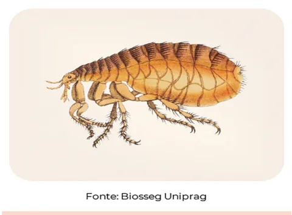

# Transtornos Alimentares e Transtornos de Sintomas Somáticos

<!-- page:1 -->

## Transtornos Alimentares

### Definição

**Perturbação persistente na alimentação ou no comportamento alimentar** que resulte em **consumo ou absorção alterada de nutrientes**, com comprometimento da saúde física ou do funcionamento psicossocial.

> Nota: **Obesidade não é um transtorno mental/alimentar** segundo o DSM-5.

### Principais Tipos

- **Anorexia nervosa (AN)**
- **Bulimia nervosa (BN)**
- **Transtorno de compulsão alimentar (TCA)**
- **Transtorno alimentar restritivo/evitativo (TARE)**
- **Transtorno de ruminação (TR)**
- **Pica**

> Importante: **Anorexia nervosa, bulimia nervosa e transtorno de compulsão alimentar são diagnósticos excludentes entre si**. Se critérios para anorexia nervosa forem preenchidos, este prevalece sobre bulimia nervosa e transtorno de compulsão alimentar.

> Nota: Transtorno de ruminação e pica **podem coexistir** com outros transtornos mentais (inclusive com anorexia nervosa ou transtorno de compulsão alimentar), desde que critérios diagnósticos sejam atendidos separadamente.

---

## Diferenciação Entre Transtornos Alimentares

### Fluxograma Diagnóstico

**Ingestão alimentar insuficiente com peso/IMC abaixo do esperado?** (IMC < 18,5 kg/m² em adultos; IMC/idade < p5 ou Z-score < -2 em crianças/adolescentes)

#### Sim:

**Autoimagem distorcida? Acha-se obeso? Medo intenso de engordar?**

- **Sim** → **Anorexia Nervosa** (subtipos: restritivo / compulsão-purgativa)
- **Não** → **TARE** (Transtorno Alimentar Restritivo/Evitativo)

#### Não:

**Compulsão alimentar ≥ 1x/semana por ≥ 3 meses + comportamentos compensatórios (vômito, laxantes, etc)?**

- **Sim** → **Bulimia Nervosa (BN)** (autoavaliação influenciada por peso e forma corporal)
- **Não** → **Transtorno de Compulsão Alimentar (TCA)** (compulsão sem compensação, com sofrimento associado)

Figura 1: Fluxograma para diferenciação entre os transtornos alimentares.

---

### Mnemônicos Úteis

#### Para Diferenciação

**"A autoimagem está dIstorcIda?"**

- **Sim, pense em**: Anorexia; Bulimia (ambas têm a letra **I**)
- **Não, pense em**: TARE e TCA (não possuem a letra I em suas siglas, logo, não têm autoimagem distorcida)

#### Purga

**"Purga = Pulga = Bicho/Animal"**

- **B**ulimia = **B**icho (comportamento purgativo presente)
- **AN**orexia = **AN**imal (comportamento purgativo presente no subtipo compulsão-purgativa)

Figura 2: Purga lembra pulga, que é um bicho/animal. "B" de bulimia e "AN" de anorexia nervosa.

---

## Tratamento dos Transtornos Alimentares

> **Abordagem sempre multidisciplinar!**

### Não Farmacológico

- **Terapia familiar**
- **TCC** (Terapia Cognitivo-Comportamental)
- **Psicoterapia**

### Farmacológico

- **Anorexia Nervosa**:
  - Medicações têm aplicabilidade limitada
  - **Olanzapina** pode ser considerada

- **Bulimia Nervosa**:
  - **Fluoxetina** (ISRS com eficácia comprovada e aprovação formal)
  - Outros inibidores seletivos da recaptação de serotonina (ISRS)

- **Transtorno de Compulsão Alimentar (TCA)**:
  - **Lisdexanfetamina**
  - **Evitar bupropiona** (risco aumentado de convulsões, especialmente em pacientes com purga ou baixo peso)

---

<!-- page:2 -->

## Transtornos de Sintomas Somáticos

### Definição

**Um ou mais sintomas somáticos que causam sofrimento significativo ou comprometimento funcional**, com pensamentos, sentimentos ou comportamentos excessivos relacionados a esses sintomas.

**Duração**: ≥ 6 meses

### Critérios Diagnósticos

- **Preocupações persistentes e desproporcionais** com os sintomas
- **Ansiedade elevada** acerca da saúde
- **Tempo/energia dedicados** aos sintomas são excessivos

---

## Diferenciação Entre Transtornos com Queixas Somáticas

| Transtorno | Características Principais |
|---|---|
| **Transtorno de Sintomas Somáticos** | Há sintomas físicos + sofrimento real + exagero nas preocupações |
| **Transtorno de Ansiedade de Doença** | Preocupação em ter ou adquirir doença grave, mas sem sintomas somáticos |
| **Transtorno de Sintomas Neurológicos Funcionais (Conversivo)** | Sintomas neurológicos (motores ou sensoriais) incompatíveis com doenças clínicas |
| **Transtorno Factício** | Produção voluntária de sintomas para assumir papel de doente (sem ganho externo claro) |
| **Simulação (Malingering)** | Produção voluntária de sintomas com ganho externo evidente (ex: afastamento do trabalho) |

---

## Referências

Figura 2: Purga lembra pulga, que é um bicho/animal. SÃO FALCÃO – BIOLOGIA e GEOLOGIA. Enciclopédia Animal (Pulga/Pulgão). SãoFalcão-Biogeo.blogs.sapo.pt, 17 out. 2012. Disponível em: https://saofalcao-biogeo.blogs.sapo.pt/23376.html. Acesso em: 20 jun. 2025.
