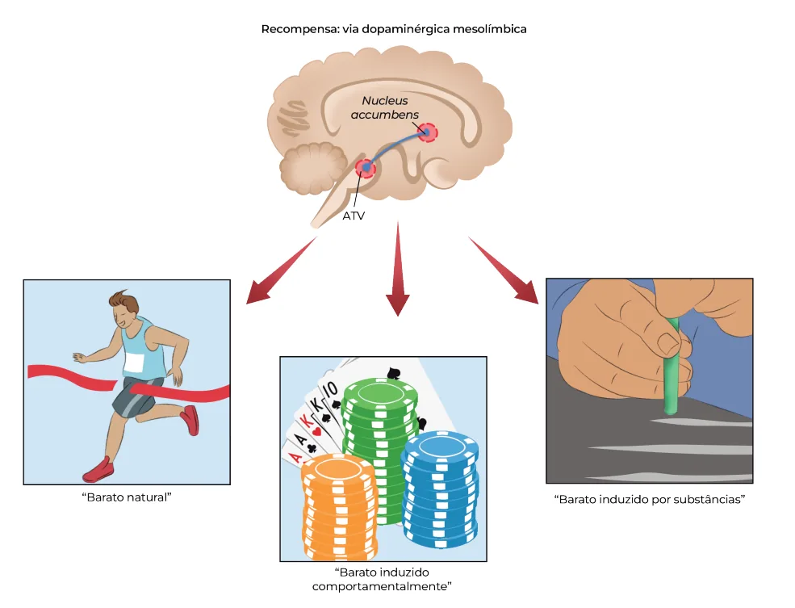
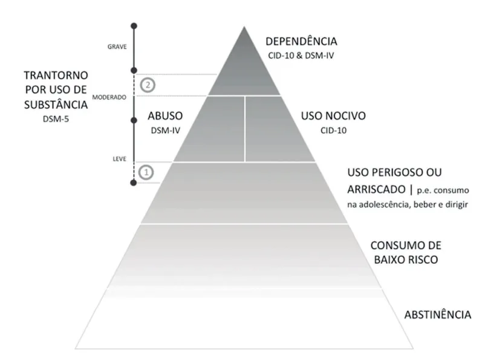
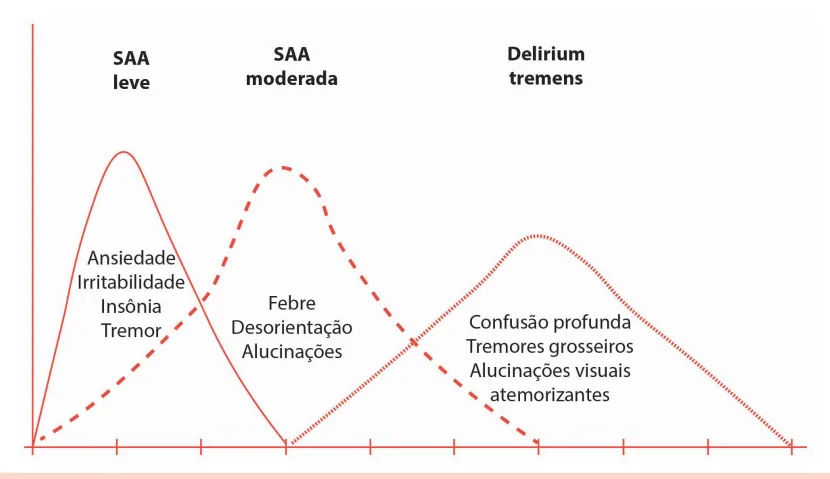

# Transtornos Relacionados a Substâncias - Álcool

<!-- page:1 -->

## TRANSTORNOS RELACIONADOS

## A SUBSTÂNCIAS: ÁLCOOL

Abuso de Substâncias e Psicose (CM) SUBSTÂNCIAS PSICOATIVAS

- Naltrexona: antagonista opioide, reduz

- Estimulantes: cocaína, crack, fissura e prazer. Contraindicado:

anfetaminas, nicotina; hepatopatia, uso de opioides para analgesia;

- Depressores: álcool, opioides, inalantes;

- Acamprosato: regulação GABA/glutamato.

- Perturbadoras: maconha, LSD, Seguro em hepatopatas;

quetamina, ayahuasca;

- Topiramato: Aumenta GABA / reduz

- Club drugs: ecstasy (MDMA), LSD. glutamato (AMPA). Reduz reforço positivo;

## TRANSTORNOS RELACIONADOS A

- Baclofeno: agonista GABA-B. Reduz fissura.

SUBSTÂNCIAS Transtornos induzidos pelo álcool

- Transtorno por uso de substâncias (TUS) Intoxicação alcoólica:

é um padrão problemático de uso, com ≥2

- Sintomas: fala arrastada, nistagmo, sintomas em 12 meses: ataxia, coma; Baixo controle (uso maior do que o

- Conduta: suporte + tiamina intramuscular/ previsto, falha em parar); intravenosa antes da glicose + haloperidol Prejuízo social (desempenho, abandono (se agitação);

de atividades);

- Evitar benzodiazepínico e anti-histamínico. Uso arriscado (em contextos perigosos); Abstinência alcoólica (SAA): Critérios farmacológicos

- Início: até 6h após interrupção;

(tolerância e abstinência). pico: 24–48h; ÁLCOOL

- Duração: 7–10 dias;

- Alta incidência em clínica e psiquiatria;

- Escore CIWA-Ar:

- Rastreamento: | 0–9: leve (ambulatorial); CAGE: ≥2 pontos indica provável | 10–18: moderada (ambulatorial);

dependência. Neste caso, | 18: grave (hospitalar). aplicar o AUDIT;

- Manejo ambulatorial: AUDIT: | Tiamina intramuscular 300 mg/sem e <8: baixo risco; depois oral nas semanas 2–3; 8 a 15: consumo de risco; | Diazepam ou lorazepam (hepatopatas); 16 a 19: consumo nocivo;

- Manejo hospitalar: ≥20: TUS moderado a grave. | Diazepam 10–20 mg de hora em

Espectro do uso (NIAA) hora, oral;

- 1 dose = 14 g álcool puro ou 350 mL cerveja | Crises convulsivas: 150 mL vinho | 45 mL destilado; diazepam intravenoso;

- Baixo risco: | Adjuvantes: haloperidol ou clonidina. Homens: 4 doses/dia a 14 doses/semana; Wernicke-Korsakoff: Mulheres/idosos: 3 doses/dia a 7

- Wernicke (agudo, reversível): confusão, doses/semana. ataxia, nistagmo.

- Binge: ≥5 (homem) ou ≥4 (mulher e | Tiamina intramuscular/intravenosa antes idoso) em 2h; da glicose.

- Uso pesado: ≥5 episódios binge/mês.

- Korsakoff (crônico): amnésia

Tratamento do TUS por álcool anterógrada + confabulação.

- Leve: intervenção breve (modelo FRAMES), | Tiamina ataque 500 mg intravenosa 3x/ terapia cognitivo comportamental (TCC) dia (3d), manutenção 150 mg (3–5d).

breve, redução de danos; Delirium tremens:

- Moderado/grave: TCC, grupos de apoio,

- 1–4 dias após abstinência;

abordagem multiprofissional (APS, RAPS,

- Delírios, alucinações, agitação

CAPS), farmacoterapia, possível internação. intensa, microzoopsias; Fármacos:

- Conduta:

- Dissulfiram: bloqueia aldeído- | Diazepam até 60 mg/dia ou lorazepam;

desidrogenase, induzindo efeito aversivo | Haloperidol 5 mg/dia (risco (rubor, vômito, sudorese); de convulsão!);

| Clonidina se necessário.

---

<!-- page:2 -->

## INTRODUÇÃO

Não confundir os transtornos relacionados a substâncias com o transtorno mental induzido por

- Substâncias psicoativas atuam no SNC, alteram substância/medicamento (ex.: psicose induzida funções mentais e induzem autoadministração; por cocaína).

- Podem ser classificadas em:

- Podem ser classificadas em: Estimulantes: T Cocaína; ( Crack; Anfetaminas; Nicotina. Depressoras: Álcool; Opioides; C Inalantes. P Perturbadoras / alucinógenas: m Maconha; LSD; Psilocibina; V Quetamina; A Mescalina; v Ayahuasca. r Club drugs: p Ecstasy (MDMA); d LSD.

- A SUBSTÂNCIAS

- Pelo DSM-5, podem ser divididos em: Transtorno por uso de substâncias (TUS); Transtornos induzidos por substâncias (ex.:

intoxicação, abstinência).

- Tabela 1: Grupo de sintomas para diagnóstico de TUS.

Quantos Grupo sintomas Uso em maior qua Baixo controle 4 esforço ma Falhas em Prejuízo social 3 Uso em Uso arriscado 2 Critérios farmacológicos TRANSTORNO POR USO DE SUBSTÂNCIAS (TUS)

- Padrão problemático de uso, com sintomas cognitivos, comportamentais e fisiológicos;

- Persistência do uso apesar de prejuízos significativos;

- Envolve alterações cerebrais duradouras que favorecem recaídas e fissuras (craving).

Critérios DSM-5 Presença de 2 ou mais dos 11 critérios, dentro de 12 meses, distribuídos em 4 grupos:

- Verificar Tabela 1 vias dopaminérgicas do cérebro e está diretamente relacionada ao sistema de recompensa, motivação, prazer, reforço de comportamentos e também ao desenvolvimento de dependência de substâncias.

VIAS E ESTÁGIOS MOTIVACIONAIS A via mesolímbica dopaminérgica é uma das principais

- Origem: Área tegmentar ventral (ATV);

- Estruturas-alvo: Núcleo accumbens: estrutura-chave do circuito de recompensa; Amígdala: envolvida nas emoções; Hipocampo: relacionado à memória contextual; Córtex pré-frontal: especialmente o medial e o orbitofrontal, ligados à tomada de decisão, julgamento e controle inibitório.

- Verificar Figura 1 na próxima página antidade ou tempo do que o pretendido, desejo de parar, alsucedido, muito tempo gasto com a substância papéis sociais, uso apesar de problemas sociais, abandono de atividades m situações perigosas, persistência apesar de risco físico/psicológico

Exemplos Tolerância e abstinência

---

<!-- page:3 -->

Figura 1: Ativação da via mesolímbica dopaminérgica. Tabela 2: Estágios motivacionais de Prochaska e DiClemente.

Estágio de mudança Característ Não se con Pré-contemplação droga como Considera poss poré Contemplação ambivalente e para Decisão p Preparação/determinação comportamen desenv Engajamento Ação com mud do comp Há modificação Manutenção de maneir

## ÁLCOOL

- O álcool é um droga depressora do sistema nervoso central;

- Aumenta a liberação de GABA;

- Reduz a liberação do glutamato. tica do estágio Abordagem do profissional vínculo terapêutico.

Psicoeducação e formação de nsidera o uso de Buscar induzir o indivíduo a o um problema. pensar sobre o uso e as suas consequências.

sível uma mudança, ém muito Trabalhar a ambivalência. Utilizar sem planejamento técnicas, como a balança decisória.

tentativa. para mudar o Trabalhar com o paciente o nto com ação em plano de ação. volvimento. no plano de ação, Reforçar os ganhos no processo.

dança visível Intensificar as estratégias portamento. de enfrentamento do comportamento Prevenção das recaídas e avaliação ra sustentada. dos resultados.

## AVALIAÇÃO E RASTREAMENTO

- Questionários utilizados: CAGE: define se há uso problemático do álcool; AUDIT: relaciona o escore ao diagnóstico e indica terapêutica.

---

<!-- page:4 -->

Não confundir esses escores com o ASSIST, utilizado ESPECTRO DO USO DO ÁLCOOL para rastreamento do uso nocivo de álcool, tabaco e Dose padrão de álcool no Brasil outras drogas.

- O Brasil adota as dosagens determinadas pelo NIAA

(National Institute on Alcohol Abuse and Alcoholism); CAGE

- 1 dose equivale a 14 g de álcool

- É um teste de triagem, não estabelecendo diagnóstico; puro, correspondendo a:

- C (“Cut down”): você já tentou diminuir ou | 350 mL de cerveja (5%);

cortar a bebida? | 150 mL de vinho (12%);

- A (“Annoyed)”: você já ficou incomodado ou irritado | 45 mL de destilado (vodka, gin, 40%).

com outros porque criticaram seu jeito de beber? Limites de consumo de baixo risco (NIAA)

- G (“Guilty”): você já sentiu culpado por causa do jeito Tabela 3: Limite de consumo de álcool considerado de baixo risco de beber?

- E (“Eye-opener”): você já teve que beber pela manhã Grupo Máximo diário Máximo semanal para aliviar ressaca, nervosismo?

Homens 4 doses 14 doses Sim em ≥2: risco de dependência ao álcool! Mulheres / Idosos 3 doses 7 doses AUDIT (Alcohol Use Disorders Identification Test)

- É ideal para compreender o padrão de consumo; Consumo em binge e consumo pesado (NIAA)

- Deve ser aplicado após o CAGE, a fim de

- Binge: ≥ 5 doses (homem) ou ≥ 4 doses (mulher) em ampliar o rastreamento; aproximadamente 2h, resultando em alcoolemia ≥

- São realizadas 10 perguntas com pontuação que varia 0,08 g/dL;

entre 0 a 40;

- Consumo pesado: binge em ≥ 5 dias no último mês.

- Interpretação: Pirâmide do uso do álcool Até 7 pontos: consumo de baixo risco;

- O uso de álcool se distribui em um continuum clínico, De 8 – 15 pontos: consumo de risco; que vai da abstinência até a dependência: De 16 – 19 pontos: consumo nocivo;

- Verificar Tabela 4 > 20 pontos: dependência, TUS moderado a grave.

Tabela 4: Pirâmide crescente do espectro do uso do álcool. Nível Características CID/DSM AUDIT Abstinência Ausência de consumo – – Até 14 doses/semana (homem) ou 7 Baixo risco – < 8 (mulher/idosos)

Consumo em situações de risco Uso perigoso/arriscado – 8–15 (ex.: dirigir, gravidez) Uso nocivo Com danos físicos/psíquicos evidentes CID-10 16–19 Abuso Padrão disfuncional recorrente DSM-4 16–19 Tolerância, abstinência, Dependência/TUS CID-10, DSM-4, DSM-5 ≥ 20 perda de controle, fissura O DSM-5 unificou “abuso” e “dependência” no diagnóstico de transtorno por uso de substância (TUS).

---

<!-- page:5 -->

Figura 2: Pirâmide do uso do álcool. TRATAMENTO DO TRANSTORNO

- As manifestações do “antabuse” são:

POR USO DE ÁLCOOL | Rubor facial;

- Sempre investigar e tratar comorbidades | Cefaleia;

psiquiátricas associadas; | Taquipneia;

- O tratamento combina intervenções psicossociais e | Precordialgia;

farmacológicas, ajustadas à gravidade do TUS; | Náuseas;

- TUS leve ou uso nocivo: | Vômitos; Intervenção breve (modelo FRAMES): | Sudorese. Feedback, Responsabilidade, Aconselhamento,

- O objetivo é criar uma aversão ao álcool e, desse Pode incluir: terapia cognitivo-comportamental

Menu de opções, Empatia e Autoeficácia; modo, desestimular seu uso;

- Efeito importante no tratamento de manutenção da de consumo;

(TCC) breve, técnica motivacional, diário abstinência e na redução de consumo de risco;

- Parece ser superior à naltrexona e ao acamprosato. Redução de danos. Naltrexona

- TUS moderado ou grave:

- É um antagonista opioide; Psicossociais:

- Age diminuindo o desejo de beber (fissura) e o prazer TCC, manejo de contingências, terapia familiar, ( reforço positivo) que é associado ao consumo grupos de apoio; de álcool; Farmacológicos;

- Ainda é capaz de reduzir as recaídas e, quando o Redução de danos; indivíduo recai, há uma tendência a consumir doses Cuidados colaborativos: equipe multiprofissional menores do álcool;

(e-Multi) na APS (atenção primária à saúde);

- Contraindicada em pacientes com hepatite aguda ou RAPS (rede de atenção psicossocial): atendimento insuficiência hepática;

ampliado em CAPS AD ou outros pontos da rede;

- Deve ser evitada em pacientes que possam necessitar Internação: indicada para desintoxicação, de analgesia com opioides (bloqueia o efeito quando necessário. analgésico destas medicações).

Tratamento farmacológico Acamprosato Dissulfiram

- Reduz a ação do glutamato e aumenta a do GABA;

- Inibe a enzima aldeído-desidrogenase (enzima que

- Diminui o consumo por diminuir os sintomas metaboliza o acetaldeído); relacionados à abstinência;

- Assim, gera o efeito aversivo “antabuse” quando em

- Possui efeito modesto;

uso em conjunto com o álcool;

- É uma espécie de “álcool artificial”, útil para tolerar a abstinência;

---

<!-- page:6 -->

- Vantagem de poder ser utilizada em pacientes com

- Manifestações:

problemas hepáticos e ter poucos efeitos adversos. | Confusão mental; Topiramato | Ataxia (afeta a marcha);

- Antagonista do receptor AMPA do glutamato e | Alterações na motilidade ocular:

facilitador da ação GABAérgica; | Oftalmoplegia; facilitador da ação GABAérgica;

- Reduz o reforço positivo e a fissura.

Baclofeno

- Agonista GABAérgico;

- Atua no controle da fissura.

TRANSTORNOS INDUZIDOS PELO ÁLCOOL Intoxicação por álcool S

- Quadro autolimitado de ingestão recente de álcool caracterizada por ao menos um dos seguintes: Fala arrastada; Tontura; Incoordenação; Instabilidade na marcha; Nistagmo; Prejuízo na atenção ou na memória; Estupor ou coma; Visão dupla.

+ alteração comportamental/descoordenação,

- Manejo: Suporte clínico; Tiamina 100 mg intramuscular ou intravenosa antes S da glicose (previne Wernicke); Se agitação ou heteroagressividade: haloperidol 5 mg intramuscular (cautela com risco de convulsão); Evitar: benzodiazepínicos e anti-histamínicos respiratória) e a hidratação desnecessária.

(aumentam a sedação e risco de depressão Encefalopatia de Wernicke

- Encefalopatia alcoólica; T

- Fase precoce da deficiência de B1 (tiamina);

- Reversível;

- Figura 3: Gravidade e temporalidade dos sintomas na SAA. | Oftalmoplegia; Nistagmo horizontal; Paralisia do olhar.

- Tratamento: Reposição de tiamina intramuscular ou intravenosa; Evita lesão no sistema nervoso central (SNC) e progressão para síndrome de Korsakoff.

Síndrome de Korsakoff

- Transtorno amnéstico crônico persistente induzido por álcool, decorrente da alteração crônica da deficiência de tiamina;

- Pode ser irreversível;

- Manifestações: Amnésia recente, anterógrada; Com ou sem confabulação.

- Tratamento: Tiamina: Ataque: 500 mg por via intravenosa, 3x/dia por 3 dias; Manutenção: 150 mg, intravenoso ou intramuscular, por mais 3 a 5 dias.

Síndrome da abstinência de álcool (SAA)

- É o conjunto dos sinais e sintomas que se manifestam nas primeiras 6 horas após a redução ou interrupção do uso de álcool;

- Apresentam curso flutuante e autolimitado;

- Atinge o pico em 24 a 48 horas após o início dos sintomas;

- Duração total: 7 a 10 dias.

Tratamento

- Deve-se inicialmente classificar a gravidade pelo Leve (0–9): manejo ambulatorial; Moderada (10–18): manejo ambulatorial; Grave (>18): manejo deve ser hospitalar.

CIWA-Ar (Clinical Withdrawal Assessment Revised):

- Verificar Figura 3

---

<!-- page:7 -->

- Conduta ambulatorial (casos leves ou moderados):

- É uma psicose orgânica que pode ser reversível, com Tiamina intramuscular, 300 mg, na primeira semana presença de delírios;

(a fim de evitar a evolução para síndrome de

- Outras manifestações: Tiamina oral, 300 mg/dia, nas semanas 2 e 3; | Rebaixamento do nível de consciência; Tiamina oral, 300 mg/dia, nas semanas 2 e 3; De acordo com os sintomas, pode ser associado o uso de benzodiazepínicos orais: Diazepam: 20-40 mg/dia; Clordiazepóxido; Lorazepam: se paciente hepatopata.

Wernicke-Korsakoff); | Confusão mental;

- Conduta hospitalar (casos graves): Fatores que sugerem SAA grave; Agitação psicomotora intensa, delirium tremens; História de crises convulsivas pregressas; Desorientação no tempo e no espaço; Presença de sintomas psicóticos, heteroagressão; Rede social de apoio inexistente ou ambiente facilitador ao uso de bebidas alcoólicas; Complicações e/ou comorbidades clínicas e/ou psiquiátricas graves (ex.: depressão grave com risco de suicídio). Tiamina intramuscular: 300 mg, na primeira semana; Benzodiazepínicos: Diazepam: 10-20 mg oral de hora em hora; Se convulsões, diazepam: 10-30 mg/dia oral ou Para hepatopatas: lorazepam.

tiamina oral, 300 mg/dia, nas semanas 2 e 3; 10 mg/endovenoso se crise vigente; Alguns autores sugerem, na abstinência alcoólica, 100-250mg intramuscular de tiamina, por 3 a 5 dias, para a prevenção da encefalopatia de Wernicke, e ácido fólico 5 mg diário por um mês.

Delirium tremens

- É uma das formas mais graves e complicadas de abstinência de álcool, sendo potencialmente fatal;

- Em geral, se desenvolve de 1 a 4 dias após o início da síndrome de abstinência; | Rebaixamento do nível de consciência; Desorientação em tempo e espaço; Desatenção; Agressividade verbal e física e humor disfórico; Alucinações táteis e visuais; Microzoopsias: visão de insetos ou pequenos animais próximos a ele ou caminhando por seu corpo.

- Manejo medicamentoso: Diazepam: 60 mg/dia oral; Lorazepam: 12 mg/dia oral. Associar, se necessário: Haloperidol: 5 mg/dia oral (porém atentar para o risco de convulsões, já que essa droga diminui o limiar convulsivo); Clonidina: 0,1 a 0,2 mg/dia oral.

## REFERÊNCIAS

; Tabela 1:: Grupo de sintomas para diagnóstico de TUS. Adaptado de AMERICAN PSYCHIATRIC ASSOCIATION. Manual diagnóstico e estatístico de transtornos mentais: DSM-5. 5. ed. Porto Alegre: Artmed, 2014.

Tabela 4:: Pirâmide crescente do espectro do uso do álcool. Adaptado de RIBEIRO, Marcelo de Araújo; LARANJEIRA, Ronaldo. Evolução do conceito de dependência química: atualizada, com comentários sobre o DSM-5. São Paulo: Secretaria Nacional de Políticas sobre Drogas, 2015. Disponível em: https://febract.org.br/portal/wp-content/ uploads/2020/04/Ribeiro-Laranjeira.-Evolu%C3%A7%C3%A3o-doconceito-de-depend%C3%AAncia-qu%C3%ADmica.-2015.pdf.

Acesso em: 30 jun. 2025. Figura 2:: Pirâmide do uso do álcool. RIBEIRO, Marcelo de Araújo; LARANJEIRA, Ronaldo. Evolução do conceito de dependência química: atualizada, com comentários sobre o DSM-5.

São Paulo: Secretaria Nacional de Políticas sobre Drogas, 2015. Disponível em: https://febract.org.br/portal/wp-content/uploads/2020/04/ Ribeiro-Laranjeira.-Evolu%C3%A7%C3%A3o-do-conceito-dedepend%C3%AAncia-qu%C3%ADmica.-2015.pdf.

Acesso em: 30 jun. 2025.
