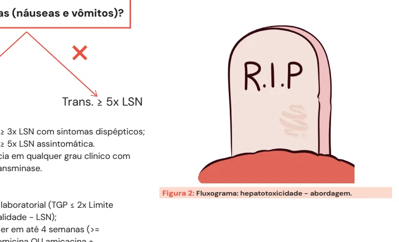
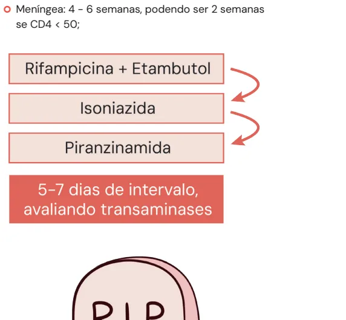

# Tratamento de Tuberculose e Efeitos Colaterais do RIPE

<!-- page:1 -->

> ⚠️ Seção reconstruída a partir de OCR (PDF original em colunas, texto intercalado) — confira contra a fonte original.

**Tuberculose: Tratamento Medicamentoso e Efeitos Colaterais**

**RIPE: 2 meses, sempre.**

- **RI** depende da forma:
  - 4 meses: pulmonar/ganglionar/pleural;
  - 2 meses: crianças e adolescentes com forma pulmonar não grave (provavelmente será estendido para adultos também);
  - 10 meses: óssea e meningoTB.

**Hepatotoxicidade**: TGP, 15-60 dias após início do RIPE.
- TGP > 3x LSN com sintomas dispépticos; > 5x LSN assintomático; icterícia clínica com alteração de transaminases.
- Suspender RIPE e aguardar TGP < 2x LSN por até 4 semanas.
- **Reintroduzir**: rifampicina + etambutol → isoniazida → pirazinamida.
- Caso TGP > 2x LSN após 30 dias de suspensão (hepatotoxicidade grave sem reversão efetiva): substituir por etambutol + levofloxacino + capreomicina/amicacina.

**Outros efeitos colaterais do RIPE**:
- **Rifampicina**: interação medicamentosa, mielotoxicidade, NIA (nefrite intersticial aguda), exantema, anemia hemolítica, síndrome colestática (BD).

## Introdução

### Tratamento Padrão

- **Fase intensiva**: 2 meses de RIPE, sempre — Rifampicina, Isoniazida, Pirazinamida e Etambutol.
- **Fase de manutenção**: RI → Rifampicina e Isoniazida. O tempo varia de 4 a 10 meses:
  - TB óssea e meningoTB: estender até 10 meses;
  - Crianças e adolescentes podem fazer o tratamento encurtado, de 2 meses (4 meses total). Possivelmente será estendido para adultos, mas ainda (até a produção deste material) não há nada oficial.
- A depender do peso: <35 kg → 2 cps; 35-50 kg → 3 cps; 50-70 kg → 4 cps; >70 kg → 5 cps.

> ⚠️ Tabela reconstruída a partir de OCR — confira contra a fonte original.

**Populações diferentes de bacilos**:

| Localização | Ambiente | Esquema eficaz | Velocidade de crescimento |
|---|---|---|---|
| Cavernas | O2 e pH neutro | RIPE | Rápido |
| Granulomas | Sem O2, pH neutro | RIP | Lento |
| Intramacrofágicos | Sem O2, pH ácido | RI | Muito lento |

**Mnemônico de efeitos adversos principais**:
- **Isoniazida**: neurotóxica — repor B6 (piridoxina);
- **Pirazinamida**: aumento do ácido úrico e mioglobinúria;
- **Etambutol**: neurite óptica.

### Seguimento

- Baciloscopia negativa em até 15 dias, podendo demorar até 2 meses (múltiplas cavernas, BAAR +++);
- Retirar do isolamento: 2 BAARs negativos em 2 dias consecutivos;
- **Falha de tratamento** — suspeitar de má adesão:
  - Repositivação de baciloscopia, confirmada em 2 amostras após o 4º mês de tratamento;
  - Persistência de positividade até o 4º mês (nunca negativar);
  - Principalmente: atenção à não melhora clínica (sem ganho de peso, manutenção de adinamia).

**TB + HIV**: DTG 2x.
- Tempo RIPE-TARV: até 7 dias na forma pulmonar; 4-6 semanas na meníngea (se CD4 <50: 2 semanas).

### Por Que Tão Longo e Com Tantas Drogas?

- Diferente penetração dos fármacos em sítios com bacilos ativos;
- Nas cavernas: O2 + pH neutro + nutrientes = crescimento rápido (RIPE);
- Nos granulomas: sem O2 + pH neutro = crescimento lento (RIP);
- Nos intramacrófagos: sem O2 + pH ácido = crescimento muito lento (RI).

### Internar?

- TB meningoencefálica;
- Intolerância incontrolável aos medicamentos anti-TB em ambulatório;
- Estado geral que não permita tratamento ambulatorial;
- Intercorrências clínicas e/ou cirúrgicas relacionadas ou não à TB que necessitem de tratamento e/ou procedimento em unidade hospitalar;
- Situação de vulnerabilidade social:
  - Ausência de residência fixa;
  - Grupos com maior possibilidade de abandono de tratamento, especialmente em casos de retratamento, falência ou multirresistência.
- **Isolamento por aerossol**. Suspensão do isolamento: 2 BAARs negativos em 2 dias consecutivos.

---

<!-- page:2 -->

## Seguimento

**O que queremos?** Negativação da baciloscopia + melhora clínico-laboratorial (radiológica...).

**Quando queremos?** Em 15 dias, podendo demorar até 2 meses (se baciloscopia inicial +++).

**Falência de tratamento**:
- Persistência de positividade até o 4º mês, se fortemente bacilífero;
- Nova positividade (após negativação) após o 4º mês (confirmada em segunda baciloscopia);
- Excluída má adesão/tomada errada de medicação (ex.: em jejum), suspeitar de resistência;
- **Abandono**: interrupção >30 dias → reinicia a contagem.

Figura 1: Negativação da baciloscopia + melhora clínico-laboratorial (radiológica...).

**Consultas**:
- Mensalmente;
- Maior frequência a critério clínico;
- Oferta de teste para diagnóstico de HIV ao iniciar o tratamento;
- Avaliação da adesão: mensalmente;
- Baciloscopias de controle: mensalmente;
- Radiografia de tórax: no 2º e 6º mês;
- Glicemia, função hepática e renal: avaliar hepatotoxicidade pelo RIPE (que pode ser assintomática).

## Efeitos Colaterais

### Rifampicina

- **Interação medicamentosa**: indutora do citocromo P450 — reduz o nível sérico de muitas medicações, como cumarínicos, anticonvulsivantes, anticoncepcionais orais e betabloqueadores;
- Urina alaranjada;
- Intolerância gástrica;
- NIA (nefrite intersticial aguda);
- Anemia hemolítica;
- Agranulocitose;
- Trombocitopenia;
- Icterícia isolada (BD);
- Vasculite;
- Exantema de hipersensibilidade.

**Indica suspensão da rifampicina e impossibilidade de reintrodução**: exantema moderado a grave, com demora para melhorar, eventualmente com sequela; trombocitopenia, leucopenia, eosinofilia, anemia hemolítica, agranulocitose, vasculite, nefrite intersticial.

### Isoniazida

- **Neurotoxicidade**: reposição de piridoxina (B6);
- Neuropatia periférica (em "bota e luva");
- Crise convulsiva;
- Psicose;
- Exantema de hipersensibilidade;
- Mielotoxicidade.

**Indica suspensão da isoniazida e impossibilidade de reintrodução**: psicose, crise convulsiva, encefalopatia tóxica ou coma, exantema grave.

### Pirazinamida

- É o fármaco **mais hepatotóxico**, de forma aguda!
- Aumento do ácido úrico → cuidado em pacientes com gota!

---

<!-- page:3 -->

- Poliartralgia;
- Rabdomiólise;
- Mioglobinúria e IRA (insuficiência renal aguda).

**Indica suspensão da pirazinamida com impossibilidade de reintrodução**: rabdomiólise com mioglobinúria e insuficiência renal.

### Etambutol

- Neurite óptica;
- Não deve ser usado em indivíduos <10 anos de idade.

**Indica suspensão do etambutol com impossibilidade de reintrodução**: exantema grave e neurite óptica.

## TB + HIV

- **Diagnóstico**: LAM (lipoarabinomanano urinário) — qualquer infecção oportunista/paciente gravemente doente; se imunossupressão avançada; teste à beira-leito, na urina; detecta TB em fase pré-clínica;
- **TARV** → 2DTG (dobra a dose do dolutegravir, devido à indução do citocromo P450);
- **Tempo RIPE-TARV**: pulmonar em até 7 dias; meníngea em 4-6 semanas, podendo ser 2 semanas se CD4 <50.

## Hepatotoxicidade

- 15-60 dias após o início do RIPE, mas pode acontecer tardiamente!
- Quais são as drogas potencialmente causadoras? **Pirazinamida > isoniazida > rifampicina**.

### Intensidade

Tem sintomas (náuseas e vômitos)?
- **Grave**: transaminases ≥3x LSN com sintomas dispépticos; transaminases ≥5x LSN assintomática. Incluindo icterícia em qualquer grau clínico com alteração de transaminase.

### Abordagem

Figura 2: Fluxograma — hepatotoxicidade: abordagem.

- Aguardar melhora laboratorial (TGP ≤2x LSN — Limite Superior da Normalidade);
- Se não acontecer em até 4 semanas (≥2x LSN): capreomicina ou amicacina + etambutol + levofloxacino;
- Reintroduzir na ordem inversa ao potencial de hepatotoxicidade.

