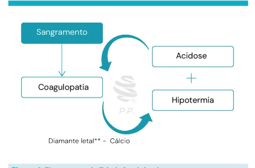

# Trauma choque

<!-- page:1 -->

Choque (CIR)

## CHOQUE

- Anormalidade circulatória causando hipoperfusão tecidual e orgânica.

Tabela 1: Classificação Choque Hipovolêmico. Volume perdido < 750 ml 750 - 1500 m Porcentagem < 15% 15 - 30% perdida Frequência < 100 > 100 cardíaca Frequência 14 - 20 20 - 30 respiratória Pressão arterial Normal Normal Normal ou Pressão de pulso Diminuída diminuída Débito urinário > 30 ml/h 20 - 30 ml/h Estado neurológico Ansioso Ansioso/letárg Resposta volêmica Cristalóide Cristalóide Tabela 2: Classificação resposta ao tratamento do choque hip Rápida Sinais vitais Voltam ao normal Perda estimada de Mínima (< 15%)

sangue Necessidade de Baixa sangue Tipo e correspondência a Preparação do sangue cruzada Necessidade da Possível cirurgia Presença precoce do Sim cirurgião Instabilidade

- Falta de permanência ou constância de certo estado ou condição; Inconstância e volubilidade.

## CHOQUE HEMODINÂMICO

- Anormalidade circulatória que causa hipoperfusão tecidual e orgânica;

- Conjunto de sinais e sintomas = Choque; Frequência cardíaca; Frequência respiratória; Pressão arterial; Tempo de enchimento capilar; Nível de consciência; Débito urinário; Déficit de bases e lactato.

- Conjunto de sinais e sintomas que requerem pronto diagnóstico e tratamento.

ml 1500 - 2000 ml > 2000 ml 30 - 40% > 40%

> 120 > 140 h 05 - 15 ml/h Ausente gico Ansioso/Confuso Confuso/letárgico e Cristalóide/sangue Cristalóide/sangue povolêmico.

30 - 40 > 35 Diminuída Diminuída Diminuída Diminuída Transitória Sem resposta Melhoria transitória Recorrência de diminuição do sangue Permanecem anormais Aumento da pressão e da frequência cardíaca Moderada e em progresso Severa (>40%)

(15% - 40%) Moderada a alta Imediata Liberação de sangue Tipo específico emergÊncia Provável Altamente provável Sim Sim

## CLASSIFICAÇÃO DO CHOQUE

Hipovolêmico:

- O mais comum no trauma;

- Hemorrágico até que se prove o contrário;

- Fontes prováveis de sangramento: Tórax, Abdome, Pelve, Grandes membros, retroperitôneo, na cena;

Obstrutivo/ Cardiogênico:

- Impede retorno circulatório; Pneumotórax hipertensivo; Tamponamento cardíaco → Tríade de Beck: Contusão cardíaca;

hipofonese de bulhas, hipotensão e turgência jugular.

---

<!-- page:2 -->

Neurogênico: Reposição volêmica

- Decorre de alta resposta simpática;

- 250/500 ml de Ringer Lactato e reavaliação constante

- Geralmente associado à TRM grave; (considerar transfusão precoce);

- Cursa com hipotensão e bradicardia. z (Plasma Lyte*);

- Tríade de Cushing → TCE grave: bradicardia,

- Transfusão se necessário.

- Tríade de Cushing → TCE grave: bradicardia, bradipnéia e hipotensão. T

Séptico

- Extremamente raro no contexto de trauma.

## MANEJO DO CHOQUE

- HIPOVOLÊMICO:

- 1º Parar o sangramento:

- Tórax → Drenagem de tórax → Toracotomia;

- Abdome → Laparotomia;

- Pelve → Fixar pelve + tamponamento;

- Membros → Compressão local, torniquete e/ou fixação externa;

- Retroperitônio → Laparotomia;

- Cena → Cuidado com ressangramento após estabilização.

2º Repor as perdas (ao mesmo tempo):

- 02 acessos venosos periféricos (AVP) calibrosos;

- Reposição volêmica: o 250/500 ml de Ringer Lactato e reavaliação constante (considerar transfusão precoce) Transfusão se necessário → sangue O - / + e/ou tipo específico.

- Colher exames = Tipagem sanguínea + Hb/Ht +

Gasometria arterial +- Beta hcg. H Alternativas ao acesso venoso periférico:

- Acesso intra-ósseo; Terço proximal da tíbia ou Terço distal do fêmur; 1ª escolha para crianças; * < 06 anos; Pode-se infundir qualquer medicação; Cuidado com osteomielite; Complicações: fratura iatrogênica, erro de punção.

- Acesso venoso central; Subclávia, Jugular, Femoral (escolha no trauma); Técnica asséptica com paciente bem posicionado; Risco de punções arteriais, pseudoaneurisma, pneumotórax.

- Dissecção venosa; F Safena (anterior e superior ao maléolo medial); a d ‘1cm pra cima e 1cm pro lado’; Técnica asséptica; Incisão generosa; dissecção; Ligadura distal; canulação proximal; Pode infundir tudo. F a d

- Transfusão se necessário.

Transamin

- Indicações: Trauma com sangramento com FC > 110 bpm e/ou

PAS < 90mmHg;

- Pode ser usado em até 3 horas do trauma;

- A administração é feita com 1g IV em bolus (10 min) +

1g IV ao longo de 8 horas.

## TRÍADE LETAL

Figura 1: Fluxograma da Tríade letal do choque. HEMODERIVADOS

- Concentrado de hemácias tipado;

- Auto-transfusão (Cell-Saver)*;

- Sangue total **;

- Protocolo de transfusão maciça: 10 unidades de hemácias em 24 horas ou 04 bolsas em 01 hora. Ressuscitação balanceada: 1:1:1

(plasma e plaquetas)**.

## REFERÊNCIAS

Tabela1: Tabela 1. Classificação Choque Hipovolêmico. Fonte: adaptado de COLÉGIO AMERICANO DE CIRURGIÕES. Suporte avançado de vida no trauma: ATLS: manual do curso de aluno. 10. ed. Rio de Janeiro: Revinter, 2018.

Tabela 2: Classificação resposta ao tratamento do choque hipovolêmico. Fonte: adaptado de COLÉGIO AMERICANO DE CIRURGIÕES. Suporte avançado de vida no trauma: ATLS: manual do curso de aluno. 10. ed. Rio de Janeiro: Revinter, 2018.

