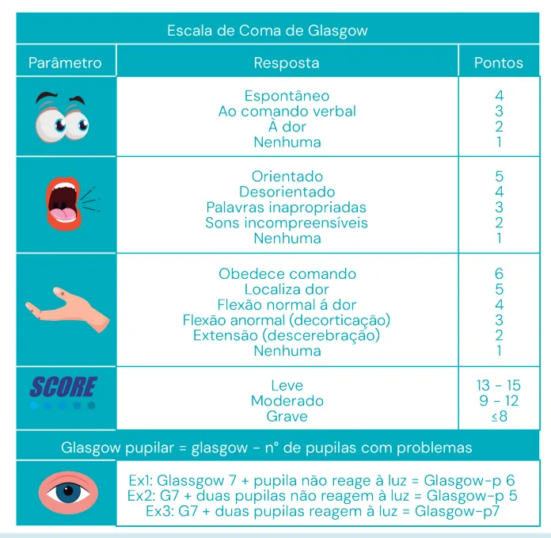

# Trauma - Conceitos iniciais e atendimento inicial ao trauma - ATLS

<!-- page:1 -->

## TRAUMA: INTRODUÇÃO AO

## TRAUMA E ATENDIMENTO INICIAL

Trauma (CIR) Conceito 1

- Trauma é uma doença

- Conceito 2 jovens incapacidade e anos de vidas perdidos prevenção primária

Principal causa de morte em Conceito 3 Doença que mais causa Conceito 4 Melhor medida ainda é a Figura 1: Conceitos gerais politrauma.

## CONCEITOS INICIAIS: S

- Principal causa de morte em jovens;

- Doença que mais causa incapacidade e anos de vida perdidos;

- Melhor medida → prevenção primária;

- Definição: Lesão de causa externa que causa desequilíbrio na homeostase do paciente.

## MORTALIDADE TRIMODAL

## PRIMEIRO PICO: MORTE IMEDIATA

- Lesões: Trauma cranioencefálico e raquimedular extenso; Lesões de grandes vasos exsanguinantes. T

- Mecanismo: Atropelamentos em alta velocidade; FAF e FAB de alta energia; Esmagamentos; Quedas de grandes alturas.

- Tratamento: PREVENÇÃO PRIMÁRIA.

## TRAUMA

- Doença hiperaguda → tratamento imediato

- Tratar primeiro o que mata primeiro

- Padronizar atendimento e equipes melhora o prognóstico do doente:

Figura 2: XABCDE do trauma.

## SEGUNDO PICO: MORTE PRECOCE

- Lesões: Obstrução de vias aéreas; Hematoma epidural ou subdural; Hemopneumotórax hipertensivo.

- Mecanismo: Acidentes automobilísticos; FAB ou FAF; Quedas.

- Tratamento: ATENDIMENTO INICIAL (preparo profissional e estrutural; atendimento inicial ao trauma

Golden Hour). OBS: EVITAR MORTES EVITÁVEIS TERCEIRO PICO: MORTE TARDIA

- Lesões: Complicações; Sepse; DMOs.

- Mecanismo: Lesões graves que recebem tratamento inicial bom; Complicações esperadas do tratamento.

- Tratamento: CUIDADOS HOSPITALARES (UTI;

reabilitação; fisioterapia; antibiótico).

---

<!-- page:2 -->

PADRONIZAÇÃO DO ATENDIMENTO E DAS EQUIPES. TRATAMENTO DOS ACHADOS → PRIORIZANDO O QUE MATA MAIS RÁPIDO.

## ATENDIMENTO INICIAL AO

POLITRAUMATIZADO PRÉ-HOSPITALAR:

- Preparação e planejamento;

- Segurança da cena.

- Foco → parar sangramento + garantir via aérea segura;

- Transporte rápido e com segurança;

- Comunicação entre equipes (ajuda a preparar a equipe hospitalar para receber o paciente vítima de trauma);

- Chegada ao hospital: passar informações objetivas → mnemônico MIST.

## MIST

- M - Mecanismo M - Atropelado

- I - Injúrias I - Trauma de tórax

- S - Sinais vitais S - PA, FC, SpO2

## T - IOT, AVP, 11 RL

- T-Tratamento

Figura 3: Mnemônico MIST - atendimento ao politraumatizado. HOSPITALAR:

- Sala e equipe preparadas;

- Avaliação e tratamento simultâneos;

- Monitorização;

- ABCDE;

- Reavaliação constante;

- Programar a transferência se necessário.

Controle do sangramento exsanguinante:

- Avaliar por inspeção - sangramentos externos exsanguinantes ativos: 10 = Compressão extrinseca e curativo oclusivo; 20 = Torniquete.

Via aérea e coluna cervical:

- Via aérea pérvia + colar: Conversar com o doente; Oferecer O² 15L/min com máscara não reinalante (Todo paciente vítima de trauma deve receber oxigênio); Aplicar colar cervical e headblock.

- Prancha rígida para o transporte;

- Via aérea não pérvia: TCE, Trauma de face, trauma cervical, hipóxia por choque etc; Garantir via aérea segura.

Respiração e ventilação:

- Avaliar pulmões, caixa torácica e diafragma;

- Garantir boa oxigenação para os tecidos;

- Exame físico direcionado;

- Avaliar sinais vitais;

- Identificar problemas que podem causar insuficiência respiratória: pneumotórax hipertensivo? Hemotórax?

Obstrução de via aérea não identificada no A? Rebaixamento do nível de consciência?;

- Tratar imediatamente: suporte clínico e ventilatório, drenagem de tórax se necessário.

Circulação e controle de sangramento:

- Identificação de choque → Parar sangramento e repor perdas;

- Realizar exame físico direcionado e checar sinais vitais;

- 02 acessos venosos periféricos calibrosos – de preferência na fossa antecubital;

- Coleta de sangue + tipagem sanguínea;

- 1L de ringer lactato aquecido (39º) para todos. → avaliar transfusão sanguínea e transamin.

---

<!-- page:3 -->

## RESUMÃO

1º - Encontrei um problema = tratei de imediato:

- Ex: garantir via aérea, drenar o tórax, realizar cirurgia, transferir para o neurocirurgião;

- Neurológico:

- Avaliação neurológica direcionada: Escala de coma de Glasgow; Déficits neurológicos; 2 Reatividade pupilar;

- Diagnóstico diferencial: uso de drogas e etilismo, hipoglicemia, doenças de base;

- Se suspeita de lesão neurológica: TC crânio + transferência para avaliação do neurocirurgião; Prevenir lesão secundária – hipóxia e hipovolemia.

- Verificar Figura 4

- A

- Exposição e controle do ambiente:

- Despir o doente: retirar os acessórios;

- Movimentação em bloco;

- Controle da temperatura do ambiente: hipotermia pode agravar o quadro.

Figura 4: Escala de coma de Glasgow. transferir para o neurocirurgião;

- Reavaliar a cada medida tomada: esse protocolo é dinâmico, pode existir a necessidade de voltar para uma das etapas se o paciente apresentar piora naquele aspecto.

2º – Completou a avaliação primária – paciente estável:

- Transferência para tratamento definitivo;

- Avaliação secundária: exame físico completo, pedir exames, tratamento definitivo.

## CUIDADO DEFINITIVO

- Avaliação primária acabou e paciente está estável;

- Avaliação secundária e transferência; Diagnosticar lesões despercebidas; Evitar erros e esquecimentos; Fazer uma revisão do caso.

## AMPLA

- Alergias

- Medicamentos

- Passado e prenhez

- Líquidos e alimentos

- Ambiente

