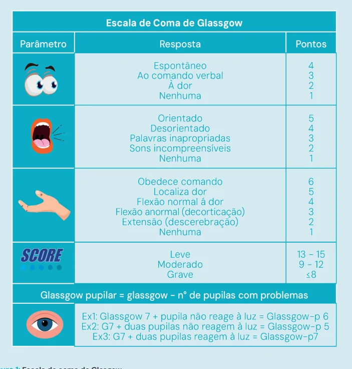
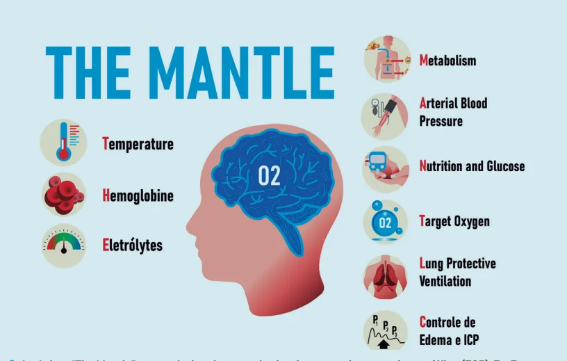
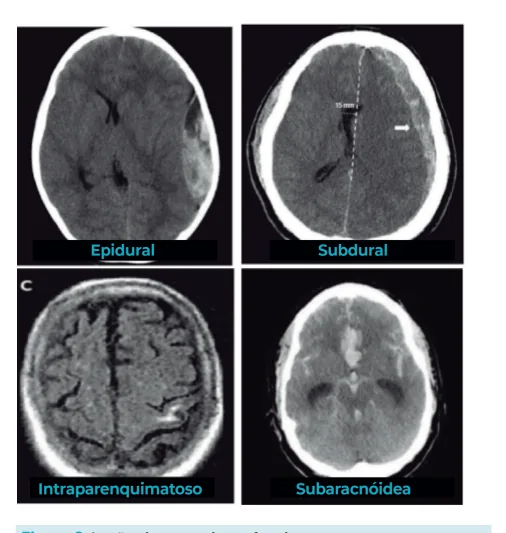

# Trauma Cranioencefálico

<!-- page:1 -->

## TRAUMA: TRAUMA

## CRANIOENCEFÁLICO

Trauma Cranioencefálico Atendimento primário: M

- Objetivo → prevenção da lesão cerebral secundária.

- Tratar hipóxia e hipotensão agressivamente;

- Intubar precoce e controlar ventilação;

- Tratar causas de hipotensão e repor perdas;

- Contraindicação a hipotensão permissiva;

- Cuidado com tratamentos não operatórios.

- CRASH III – autorizado transamin no TCE. T p

Figura 1: Escala de coma de Glasgow. CLASSIFICAÇÃO MORFOLÓGICA L Lesões difusas

- Concussão → perda de consciência < 6h;

- Lesão axonal difusa → Perda de consciência > 6h;

- Edema cerebral difuso → Perda com alteração

TC e PIC.

- CO

Mecanismos mais comuns

- Quedas;

- Atingido por um objeto;

- Trauma automobilístico.

- Em jovens: Lesões esportivas; Violência.

Trauma cranioencefálico leve → + comum. Trauma cranioencefálico grave → difícil tratamento e prognóstico ruim.

Lesões focais

- Hematoma epidural → Biconvexo, não ultrapassa suturas;

- Hematoma subdural → Formato de foice, ultrapassa suturas;

- Hematoma intraparenquimatoso → isquemia associada;

- Hemorragia subaracnóidea → acompanha giros.

---

<!-- page:2 -->

Figura 2: Acrônimo “The Mentle” para reduzir o dano cerebral após traumatismo cranioencefálico (TCE): T - Transporte de Oxigênio, H - Hemoglobina, E - Extração de Oxigênio, M - Metabolismo Final do Oxigênio, A - Arterialização, N Neuroproteção, T - Transporte de Oxigênio, L - Limite de Pressão Intracraniana, E - Estabilidade Interna

## CONCEITOS INICIAIS FISIOPATOLOGIA

- O principal objetivo no atendimento primário de

- Lesões primárias lesões por trauma direto, podendo pacientes com suspeita de TCE é a prevenção cursar com lesão axonal difusa, contusão, hematoma e de lesão cerebral secundária → Hipóxia e trauma penetrante.

hipertensão intracraniana;

- Lesões secundárias podem cursar com isquemia, má

- Mecanismos mais comuns: perfusão, edema e resposta inflamatória exacerbada. Quedas; traumas automobilísticos; atingidos por um

- Lembrar sempre da pressão intracraniana: Em jovens → lesões esportivas; violência. | Pressão de perfusão cerebral = fluxo sanguíneo

objeto (respectivamente); | Pressão intracraniana normal = 10mmHg;

- Cerca de 90% das mortes pré-hospitalares têm cerebral (PAM – PIC = PPC) → Doutrina de Embora a maioria se trate de traumas

TCE envolvido: Monro-Kellie.

## CLASSIFICAÇÃO CLÍNICA

cranioencefálicos leves. | As formas graves são de difícil tratamento e prognóstico. Escala de Coma de Glasgow (ECG)

- Guia de manejo inicial

## CONCEITOS ANATÔMICOS BÁSICOS

- Nos ajuda a diferenciar TCE leve, moderado e grave.

- Meninges → objetivo de envolver e proteger: | Leve -> 13 a 15. Dura mater; | Moderada -> 9 a 12. Aracnoide; | Grave -> <= 8. Pia mater.

## CLASSIFICAÇÃO MORFOLÓGICA

- O crânio → fraturas;

- Couro cabeludo é altamente vascularizado → choque hemorrágico; Fratura De Crânio

- Cérebro:

- Caixa craniana → com ou sem afundamento. Hematoma-intraparenquimatoso;

- Base de crânio → rinorreia, otorreia, sinal de Sistema ventricular -> Líquor; Battle, Guaxinim. Compartimentos intra-cranianos. Lesões Intracranianas

- Sangramentos intracranianos:

- Difusas Hematoma extradural → artéria meníngea média; | Concussão → perda da consciência < 6h. Hematoma subdural → pleno venoso; | Lesão axonal difusa → perda da consciência > 6h. Hemorragia subaracnóidea; | Edema cerebral difuso → Perda da consciência com Hemorragia intraparenquimatosa. alteração na TC de crânio e aumento da PIC.

---

<!-- page:3 -->

- Focais Reavaliação E Avaliação Secundária Hematoma epidural → Biconvexo, não

- AMPLA;

ultrapassa suturas;

- Mecanismo de trauma; Hematoma subdural → Formato de foice, ultrapassa suturas; Hematoma intraparenquimatoso → Hemorragia Subaracnóidea → Acompanha os giros.

Isquemia associada; S

- C

- T

- - - - Figura 3: Lesões intracranianas focais.

## ATENDIMENTO INICIAL AO TRAUMA

- ABCDE

- Prevenir lesão secundária. Primária é irreversível.

- Hipotensão, hipóxia, choque; Causam RNC

- Ringer Lactato**

## PAS T > 36

> 100/110

SpO2 > 95% Plaqueta PaO2 > 100 75.000 Ph PaCo2 7,35-7,45 35-45 PICC < 15 Analgesia e s PPC > 60 RASS 0 Figura 4: Soft Pack traumatismo cranioencefálico.

- Abuso de álcool e drogas;

- Uso de medicamentos → Reverter anticoagulantes/ plaquetários.

## SOFT PACK

- Não decorar, mas entender que precisamos manter uma boa homeostase no paciente com TCE:

- Verificar Figura 4

## CONDUTAS

TCE Leve → ECG 13 a 15:

- Observação neurológica por 24 horas.

- Realizar tomografia de crânio se: Glasgow < 15 após 02 horas; Fratura de crânio; Dois episódios eméticos; Em uso de anticoagulante; Idade > 65 anos; Perda de consciência > 5 minutos; Amnésia retrógrada > 30 minutos; Trauma de alta energia.

TCE Moderado → ECG 9 a 12:

- SOFT PACK;

- TC de crânio;

- Consulta urgente com neurocirurgião;

- Considerar passagem de PIC;

- Diagnósticos diferenciais para rebaixamento do nível de consciência → TRATAR.

TCE Grave ECG ≤ 8:

- SOFT PACK;

→

- TC de crânio;

- Consulta urgente com neurocirurgião;

- Considerar passagem de PIC;

- Diagnósticos diferenciais para rebaixamento do nível de consciência → TRATAR as > Sódio sedação INR < 1,4

6 Glicose 80-180 0 135-145 2 Cabeceira elevada e 5 centrada (45°) 0 Hb > 7

---

<!-- page:4 -->

HIPERTENSÃO INTRACRANIANA REFRATÁRIA Lesões Escalpelantes

- Suspeita clínica (PIC > 22 mmHg): assimetria de

- Realizar limpeza e hemostasia rigorosa;

pupilas, miose, decorticação ou descerebração, Afundamento de crânio: depressão respiratória, tríade de Cushing;

- Medidas de 1ª Linha: SOFT PACK; Sedação terapêutica; Aumentar PAM para aumentar PPC;

- Medidas discutíveis (2ª linha – sem evidência): Barbitúricos → causam hipotensão; Hipotermia controlada; Hiperventilação → Hipocapnia permissiva.

- Monitorizar quando: TCE grave (Glasgow < 9) TCE moderado + (idade, lesões focais, politrauma,

Glasgow < 10)

- Medidas temporárias (terapia ponte) → Cuidado com o efeito rebote: Fazer para transportar para a TC e/ou centro cirúrgico! Salina hipertônica NaCl 20% 0,5mg/kg em 5 min Manitol 20% 0,25 mg/kg;

- Fenitoína: Profilaxia de crise epiléptica; Dose: 1g em 40 min + 100 mg de 8/8 horas Indicações: fratura com afundamento; hematomas intracerebrais; antecedente de epilepsia; ferimentos penetrantes em crânio; considerar em Gasglow <10, crise epiléptica, hematomas e contusões;

- Profilaxia de TEV;

- Profilaxia de úlcera de estresse;

- Nutrição.

- Operar se: Exposta Contaminada Perda de contiguidade.

Lesões Penetrantes

- Limpeza e hemostasia rigorosa

## MANEJO CIRÚRGICO

Quando operar lesões focais? Desvio de linha média, efeito de massa, tamanho...

- Hematoma Epidural: > 30cm³; ECG < 9; DLM > 5 mm; Déficits focais;

- Hematoma Subdural: >1cm³; DLM > 5mm; ECG < 8;

- Hematoma Intraparenquimatoso: Efeito de massa; declínio neurológico;

lesão > 50cm³.

## REFERÊNCIAS

Figura 1: Escala de coma de Glasgow. Fonte: acervo Medcof. s Figura 2: Acrônimo “The Mentle” Fonte: acervo Medcof.

Figura 3: Lesões intracranianas focais. Fonte: adaptado de RADIOPAEDIA.ORG. Radiopaedia. [S.l.]: Radiopaedia.org, [s.d.]. Disponível em: https://radiopaedia.org. Acesso em: 27 maio 2025.

Figura 4: Soft Pack traumatismo cranioencefálico. Fonte: acervo Medcof.
