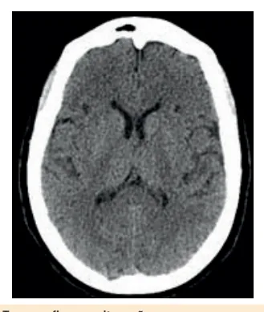
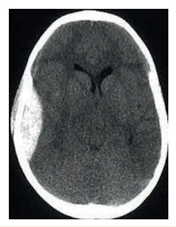
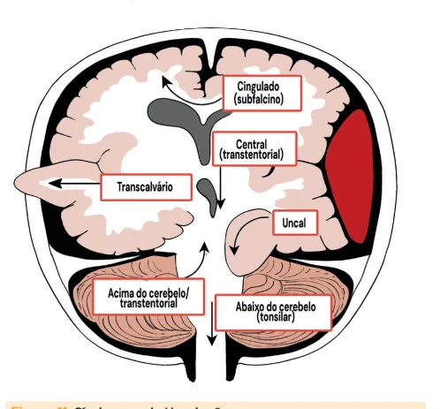
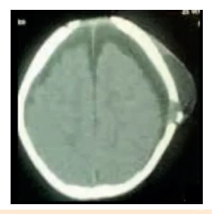
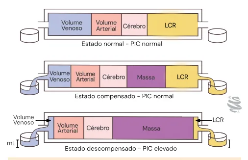
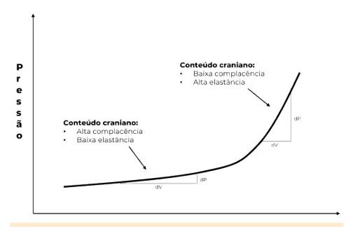
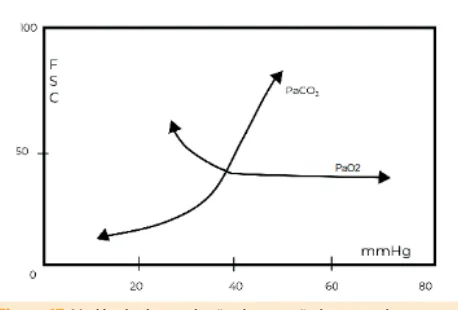
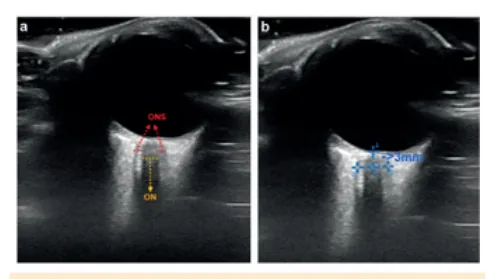

# Traumatismo Cranioencefálico e Hipertensão Intracraniana

<!-- page:1 -->

## TRAUMATISMO CRANIOENCEFÁLICO

## E HIPERTENSÃO INTRACRANIANA

TCE Hipertensão Intracraniana TCE temperatura, convulsões) → monitorização da

- Atendimento ao TCE: ATLS =ABCDE. D = pupilas, PIC (cateter intracraniano, USG nervo óptico,

GCS, reflexos, toque retal; Brain4care, etc.);

- Classificação do TCE:

- Sinais de HIC (PIC > 20 mmHg): rebaixamento Conforme Escala de Coma de Glasgow: do nível de consciência (1º), abaulamento de leve (15-14); moderado (9-13); grave (<9). fontanela, cefaleia e vômitos, alterações visuais e de

- Possíveis achados da TC de crânio: motricidade ocular (III par), coma, tríade de Cushing hemorragias epidural/ subdural/ subaracnoidea/ (hipertensão, bradicardia e alteração respiratória);

intraparenquimatoso; contusão cerebral, lesão

- Tratamento: tratar a causa (derivação, cirurgia), axonal difusa, edema cerebral, desvio de linha média, posicionamento (decúbito elevado, cabeceira em fraturas, hematoma subgaleal, isquemia, sinais de posição neutra), sedação e analgesia adequada, herniação (acima - subfalcina x abaixo - uncal); tratamento de crises convulsivas (fenitoína), ajuste

- TCE: lesão primária (irreversível) → lesão secundária metabólico (correção de hipoglicemia e multimodal e intervir agressivamente): PCO2 35-40, saturação adequada, controle de Monitorização habitual (FC, PA, FR, SatO2, EtCO2, sangramentos), manter normotermia, medicações neuroimagem, DTC, EEG, PIC, PPC, outros). corticoide se tumor ou infecção, nimodipino se HSA

(pode ser reversível; utilizar monitorização hiponatremia), estabilização clínica (PAM > 60, Temp, exames laboratoriais e de imagem) osmolares (salina hipertônica ou manitol), + monitorização neurológica (neurocheck, hiperventilação, craniectomia descompressiva, HIPERTENSÃO INTRACRANIANA (controle de vasoespasmo).

- PPC = PAM - PIC;

- Perda dos mecanismos de autorregulação (PAM, metabolismo cerebral - sedação x agitação,

O2, CO2, volemia, barreira hemato-encefálica, TRAUMATISMO CRÂNIO- AVALIAÇÃO INICIAL DO PACIENTE

## ENCEFÁLICO (TCE) POLITRAUMATIZADO

- Sala de emergência + MOVED;

## EPIDEMIOLOGIA

- Protocolo ABCDE;

- 134 TCEs / 100 mil crianças; A. Vias aéreas;

- EUA: 18 mil internações e 1500 mortes / ano; B. Respiração;

- ~30% dos atendimentos de PS. C. Circulação;

- Causas: D. (Disability) neurológico e dextro: Escala de Coma Quedas; de Glasgow; pupilas; déficits grosseiros; toque retal Acidentes relacionados a esportes; (avaliação de tônus do esfíncter); Trauma não acidental: Síndrome do bebê sacudido; E. Exposição e temperatura: inspeção da pele e partes Acidentes em veículos. moles; exame da ccoluna; retirar prancha rígida.

- Gravidade:

- Após estabilização inicial: Constitui uma das maiores causas de | SAMPLE = sinais e sintomas; alergias; medicações deficiências e dependência; em uso; passado médico; última refeição (last Melhor recuperação entre 6 meses e 1 ano; meal); evento que levou o paciente ao serviço; Crianças (0 - 17 anos) têm taxas de recuperação | Reavaliação seriada; Tomografia com alterações aumenta o risco de | Avaliação dos especialistas;

melhores que adultos jovens; | Tomografia computadorizada (TC), se necessário; hipertensão intracraniana em 50%; | Vacina anti-tetânica.

| Mortalidade intra-hospitalar de cerca de 10% para crianças e 20% adultos jovens. CLASSIFICAÇÃO

- Classificamos através da Escala de Coma de

Glasgow (GCS).

---

<!-- page:2 -->

Tabela 1: Escala de Coma de Glasgow. Setor avaliação/ Pontuação Olhos Fala Motor 6 - - - - - - - - - - - - - - - - - - Obedece comandos 5 - - - - - - - - - Resposta adequada Localiza dor 4 Abertura espontânea Confuso Reage a dor 3 Abertura ao chamado Palavras aleatórias Decortica 2 Ao estímulo doloroso Gemidos Descerebra 1 Não abre Não fala Não reage < 2 anos > 2 anos Hematoma subgaleal não frontal Perda de consciência ECG<15 ECG<15 Perda de consciência > 5s Vômitos Alteração mental Fratura Alteração mental Mecanismo de trauma grave Cefaleia intensa de crânio palpável Fratura de base de crânio Comportamento alterado Mecanismo de trauma grave NÃO SIM SIM NÃO Observação clínica TC de crânio Observação clínica Figura 1: Fluxograma do Estudo PECARN na avaliação e conduta do TCE Leve.

## PELA SOCIEDADE BRASILEIRA DE PEDIATRIA TCE LEVE: ESTUDO PECARN

(SBP)

- Verificar Figura 1 .

- Sinais de fratura de base de crânio:

Leve: GCS ≥ 14 | Sinal de Battle: hematoma retroauricular; Moderado: GCS 9 – 13 | Sinal do guaxinim: hematoma periorbitário;

Grave: GCS ≤ 8 | Sinal do duplo halo: presença de líquor → rinorreia, otorreia.

- Leve:

## | GCS 13 – 15; MECANISMO DE TRAUMA GRAVE

| GCS 15 + sem alterações neurológicas + sem sinais de

- Quedas de mais de 90 cm (< 2 anos) e mais de 150 cm alarme = mínimo (classificação antiga, em desuso); (≥ 2 anos); Perda de consciência até 30 min, desorientação/

- Ejeção do carro;

amnésia por até 24h, sem alterações ao exame

- Capotamento;

de imagem.

- Acidente automobilístico com óbito na cena;

- Moderado:

- Atropelamento de pedestre ou ciclista sem capacete; GCS 9 - 12;

- Trauma ocasionado por objeto de alto impacto. Perda de consciência até 24h, desorientação/ amnésia por 1 até 7 dias, podem haver alterações ao ATENÇÃO! Indivíduos com distúrbios hematológicos exame de imagem. também são considerados de alto risco

- Grave: Ex: Hemofilia, coagulopatias. GCS menor ou igual a 8; Perda de consciência por mais de 24h, TOMOGRAFIA COMPUTADORIZADA DE desorientação/amnésia por mais de 7 dias, podem CRÂNIO (TC) haver alterações ao exame de imagem. Hematoma extradural

- Intubação é indicada em: Glasgow < 9; instabilidade

- Sangramento agudo, em formato biconvexo, que hemodinâmica; lesão de face ou via aérea, indicação respeita as suturas. Geralmente, a causa é por impacto de cirurgia (entre outros). direto com lesão em artéria.

---

<!-- page:3 -->

Hematoma subdural

- Em geral, ocorre por aceleração e desaceleração, com lesão de veias-ponte. É um sangramento de formato côncavo-convexo, que desenha o cérebro e não respeita suturas. A progressão é mais lenta, não menos grave.

Hemorragia intraparenquimatosa

- Hemorragia localizada dentro do parênquima encefálico.

Hemorragia subaracnóide (HSA)

- Hemorragia em localização do líquor (interno aos ventrículos = escala de Fisher IV).

Contusão cerebral

- Área escura (isquêmica) com focos de sangramentos internos secundários a lesão vascular.

Lesão axonal difusa (LAD) Figura 4: Hematoma subdural a direita com desvio da linha média.

- Pode não haver alteração aguda na TC (melhor avaliação em ressonância nuclear magnética), porém é sugestivo de LAD quando encontram-se pequenas hemorragias intracranianas dispersas difusamente, em especial se associadas a edema.

Edema cerebral

- Desaparecimento dos ventrículos;

- Desaparecimento de sulcos e suturas;

- Perda de diferenciação das estruturas

(córtico-medular). Figura 5: Hemorragia intraparenquimatosa. Figura 2: Tomografia sem alterações. Figura 6: Contusão Cerebral.

Figura 3: Hematoma Extradural a Direita. Figura 7: Hemorragia subaracnoide.

---

<!-- page:4 -->

## SÍNDROMES DE HERNIAÇÃO

- A evolução do sangramento com efeito de massa pode cursar com síndromes de herniação, observe a imagem:

Figura 8: Lesão axonal difusa.

- Figura 9: Edema Cerebral.

- - Figura 10: Fratura de crânio e hematoma subgaleal.

TCE Lesão primária Reanimação Investigação cardiorespiratória diagnóstica Figura 12: Evolução do insulto ao SNC na HIC. Figura 11: Síndromes de Herniação.

## INSULTO AO SISTEMA NERVOSO CENTRAL (SNC)

- Verificar Figura 12 ;

- A lesão primária não é reversível → sobre ela pode-se apenas instituir medidas preventivas, de orientação da população;

- A ação de redução de mortalidade e sequelas se inicia sobre a redução das lesões secundárias → para isso é fundamental o diagnóstico precoce e a intervenção agressiva sobre insultos que possam ocasionar piora das lesões iniciais.

- Monitorização multimodal: Para melhor identificação e tratamento precoce de insultos secundários, quanto mais ferramentas à monitorização do paciente, melhor.

- Verificar Figura 13 na próxima página;

Lesão Secundária: Hipotensão, hipóxia, distúrbios metabólicos, hipertermia, etc. Tratamento Tratamento intensivo de lesões guiado por intracranianas monitorização

---

<!-- page:5 -->

Neuroimagem Temperatura esofágica e DTC Monitoração PIC e PPC Específica Convencional cardíaca contínua EEG Outros: Brain4care, microdiálise, NIRS, saturação cerebral, PRx, etc.

Neurocheck:

- Glasgow

- Pupilas

- Déficits

- Respiração repetidamente por toda a equipe de cuidados do paciente.

Figura 13: Métodos de monitorização neuro-intensiva. O neuroch HIPERTENSÃO INTRACRANIANA (HIC) Figura 14: Curva de Langfitt. Expressa a relação entre pressão e volume intracraniano.

- O SNC possui mecanismos de autorregulação que permitem “absorver pressão” de forma a manter o conteúdo intracraniano estável e saudável; entretanto, existem lesões que ocasionam o esgotamento desses mecanismos, provocando aumentos significativos na pressão intracraniana.

Fisiologia – Doutrina de Monro-Kellie

- A doutrina de Monro-Kellie nos explica o grande problema de ultrapassar os limites dos mecanismos de regulação da pressão intracraniana;

- Imaginando a calota craniana como uma caixa rígida, com apenas 2 saídas laterais, entende-se que ao aumentar algum dos conteúdos internos ou adicionando-se novos (tumor, hematoma, inchaço, etc.), ocorre compensação do aumento de pressão com drenagem de líquido cefalorraquidiano (LCR) para a coluna vertebral e/ ou contração do componente venoso, reduzindo o volume circulatório “não efetivo/ não estressado”, e, com isso, mantendo a pressão intracraniana adequada, em primeiro momento;

- A partir de determinado ponto, esgota-se o volume de líquor drenável e o volume de sangue venoso a ser redistribuído, chegando a um estado crítico em que só é viável manter a pressão intracraniana (PIC) reduzindo-se o fluxo sanguíneo arterial, ou seja, Oxímetria e capnografia exames laboratoriais heck é uma sequência de avaliações que devem ser realizadas gerando isquemia cerebral até morte cerebral, ou deslocando tecido cerebral, que significa um cenário de herniação (e lesão do tecido herniado).

Exame físico e Figura 15: Representação da Doutrina de Monro-Kellie. Mecanismos de autorregulação = regulação da pressão intracraniana (PIC)

Pressão de perfusão cerebral (PPC) = Pressão arterial média (PAM) – PIC

- O SNC possui mecanismos para manter o fluxo sanguíneo cerebral (FSC) estável apesar de variações da PAM, ou seja, mantém o FSC em uma banda autorreguladora; o principal mecanismo é o de vasoconstrição e dilatação arterial cerebral;

- Como vimos anteriormente, esse mecanismo também chega ao limite em determinadas situações, podendo inclusive gerar danos no paciente com hipertensão intracraniana;

- É importante que o FSC permaneça na banda auto-regulatória, visto que sua redução gera hipóxia cerebral e seu aumento pode ocasionar edema e aumento da PIC;

- Respiração: Concentração plasmática de oxigênio concentração plasmática de CO2 (aumento do CO2 causa vasodilatação cerebral e redução de CO2 promove vasoconstrição cerebral);

(hipóxia intensa causa aumento do FSC) e

---

<!-- page:6 -->

- Hemodinâmicas: PAM, volemia;

- Locais: Integridade da barreira hemato-encefálica cerebral (aumento da temperatura aumenta o consumo de O2, e aumenta o FSC; paciente agitado ou consumo de O2, e aumenta o FSC; paciente agitado ou com dor também tem aumento do FSC).

(BHC); resistência elástica cerebral e metabolismo

- Figura 16: Relação entre PAM e fluxo sanguíneo cerebral;

observar que a banda auto-regulatória garante manutenção de fluxo sanguíneo cerebral adequado em uma certa faixa de variação da PAM, mantendo bom funcionamento cerebral.

Figura 17: Variáveis de regulação da pressão intracraniana. Hipovolemia ↓PAM Choque Obstrução Ação farmacológica ↑ Edema ↑ Volume ↓PPC Sanguíneo cerebral Vasodilatação ↑ PIC ↑ Metabolismo cerebral ↓ Oferta de O2 cerebral ↑FSC Hipercapnia Cascata Isquêmica (vasodilatória) Ação farmacológica Figura 18: Ciclo vicioso da piora de perfusão cerebral por queda da PAM ou aumento da PIC.

Figura 19: Interferência da temperatura no metabolismo cerebral. Figura 20: Relação do grau de agitação com o metabolismo cerebral, e por consequência com o fluxo sanguíneo cerebral.

Monitorização da PIC

- Indicação: lesão intracraniana ou evento associado a HIC e GCS < 8 ou queda de GCS 2 ou mais pontos prejudique avaliação do nível de consciência.

(= todo TCE grave); necessidade de sedação que

- Métodos: Cateter de monitorização de PIC + Derivação precisa ser locado em posição intraventricular, permitindo também a drenagem de líquor; observe na imagem abaixo outras possíveis localizações para o monitor de pressão intracraniana; Brain 4-care; Ultrassonografia (USG) de bainha de nervo óptico:

Ventricular Externa (DVE). Neste caso, o monitor ainda não existe um valor determinado para pediatria → > 4,5 já é aumentado.

Figura 21: Equipamento de avaliação não invasiva da complacência cerebral; P2>P1 significa indiretamente aumento da pressão intracraniana.

Figura 22: Medida da bainha do nervo óptico pela ultrassonografia. Método não invasivo, com excelente correlação com aumento da pressão intracraniana, especialmente se as medidas forem comparadas ao longo do tempo.

---

<!-- page:7 -->

Tratamento da HIC | Terapêutico em crises convulsivas detectadas

- Abordagem cirúrgica se indicada: drenagem de clinicamente ou por eletroencefalograma (EEG).

hematomas; derivação de hidrocefalia; retirada de Monitorização com EEG e nível sérico de fenitoína tumores; craniectomia descompressiva – conduta (ajustar pelo nível sérico de albumina) são reservada para risco de morte iminente em vista do altamente recomendáveis, já que a maioria das reservada para risco de morte iminente em vista do péssimo prognóstico;

- Sedoanalgesia adequada: midazolam / fentanil barbitúrico → indicação de indução de coma barbitúrico em pacientes com HIC refratária a outras medidas (risco de hipotensão, polaciúria com hipocalemia e imunoparalisia);

/ propofol (cetamina – uso liberado para HIC);

- Correção de distúrbios metabólicos: evitar hipoglicemia e hiponatremia;

- Ressuscitação clínica: ventilação/oxigenação (manter saturação adequada e EtCO2 35 - 40); hemodinâmica cerebral acima de 60); controle agressivo de sangramentos (manter Hb > 9 g/dL no TCE grave).

(manter PAM adequada para pressão de perfusão Medidas para HIC aguda

- Cabeceira elevada 30°; posição neutra da cabeça;

- Normotermia/hipotermia (32 – 34 °C);

- Manitol/salina hipertônica (atenção especial na duração do efeito, e nos efeitos colaterais). Manitol possui efeito mais evidente na diurese → CUIDADO!

Manitol 20%: 0,5 - 2 g/kg em bolus Solução salina hipertônica (3% 3 mL/kg 7,5% ou 23,4% 0,5 mL/kg)

- Hiperventilação: manter EtCO2 entre 25 - 30; Ideal: manter normocapnia (35 -40); PEEP < PIC.

A hiperventilação é uma medida de ponte para outras condutas na iminência de herniação:

- Controle de PA: Manter PPC 60 - 120 (> 40 em recém-nascidos);

- Ajuste metabólico: Tratamento agressivo de febre;

- Tratamento de crises convulsivas: Fenitoína: profilático (7 dias) X terapêutico Tratar profilaticamente em: TCE grave ou qualquer sangramento intraparenquimatoso; altamente recomendáveis, já que a maioria das crises convulsivas são subclínicas.

(alta hospitalar com anticonvulsivante);

- Fluidos: Garantir normovolemia e normo/hiper osmolaridade (evitar hiponatremia). Opções:

transfusão de albumina e hemácias (alvo de Hb>7; nos pacientes com TCE grave, manter Hb>9; nos pacientes instáveis hemodinamicamente, manter Hb>10);

- Garantir nutrição: a introdução precoce tem relação com o melhor prognóstico;

- Corticoide (dexametasona): Em alguns casos, aumenta a mortalidade; indicado para tumores e/ou infecções;

contra-indicado para infarto, hemorragia, TCE;

- Nimodipino: HSA = tratamento de vasoespasmo.

## REFERÊNCIAS

Figura 2: Tomografia sem alterações. Arquivo pessoal da professora. Figura 3: Hematoma Extradural a Direita.

Arquivo pessoal da professora. Figura 4: Hematoma subdural a direita com desvio da linha. média, Arquivo pessoal da professora.

Figura 5: Hemorragia intraparenquimatosa. Arquivo pessoal da professora. Figura 6: Contusão Cerebral.

Arquivo pessoal da professora. Figura 7: Hemorragia subaracnoide. Arquivo pessoal da professora. Figura 8: Lesão axonal difusa.

Arquivo pessoal da professora. Figura 9: Edema Cerebral. Arquivo pessoal da professora. Figura 10: Fratura de crânio e hematoma subgaleal.

Arquivo pessoal da professora. Figura 22: Medida da bainha do nervo óptico pela ultrassonografia. Método não invasivo, com excelente correlação com aumento da pressão intracraniana, especialmente se as medidas forem comparadas ao longo do tempo.

Arquivo pessoal da professora.
