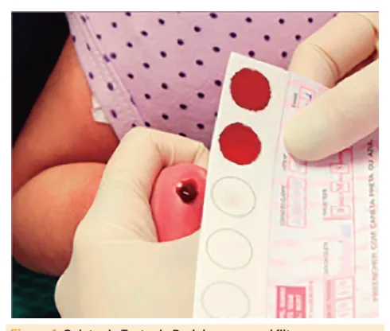
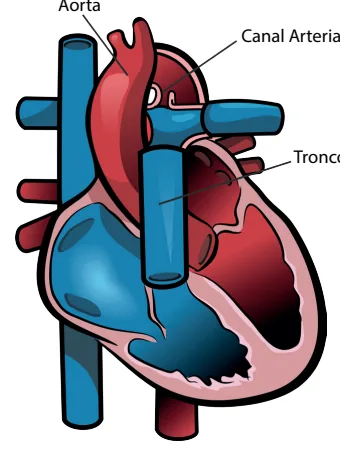
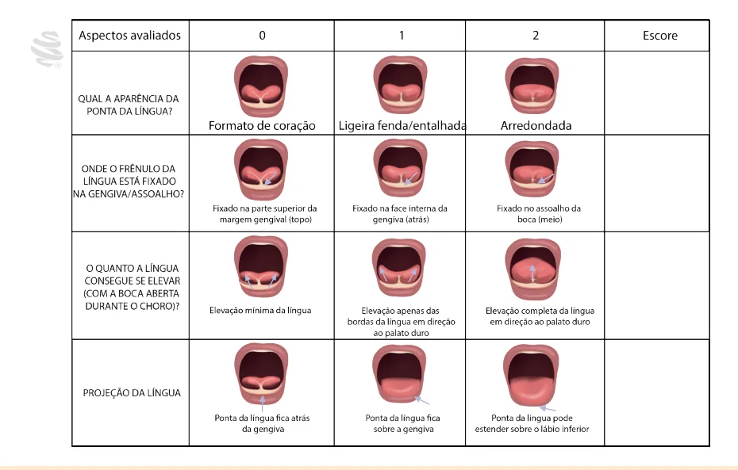
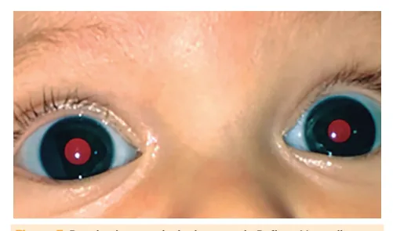

# Triagens Neonatais

<!-- page:1 -->

> ⚠️ Conteúdo desta página reconstruído a partir de OCR de duas colunas — confira contra a fonte original.

## Triagem Neonatal

**Teste do Pezinho**: para todos entre o 3º-5º dia (após 48h).

- Falciforme – eletroforese de Hb;
- Fenilcetonúria - fenilalanina;
- Fibrose cística - IRT;
- Hipotireoidismo congênito - TSH;
- Hiperplasia adrenal - 17OHP;
- Deficiência de biotinidase – biotinidase;
- Toxoplasmose congênita – IgM toxoplasmose;
- Ampliação: toxoplasmose congênita, IDP, galactosemia, homocistinúria.

**Teste da Orelhinha**: para todos, na maternidade.

- EOA - sem indicador de risco (IR) // PEATE - com IR;
- IR: preocupação dos pais com o desenvolvimento da criança, da audição, fala ou linguagem; HF de surdez ou consanguinidade; UTIN > 5 dias; intercorrências: VM, exsanguineotransfusão, medicações ototóxicas (furosemida, amicacina), asfixia, < 1500g; infecção congênita; anomalia craniofacial; síndrome genética.

**Teste do Olhinho**: reflexo vermelho, para todos na maternidade, 3x/ano até 3 anos. Avalia a transparência das estruturas oculares. Se duvidoso ou leucocoria – oftalmologista.

**Teste do Coraçãozinho**: cardiopatia crítica (dependente do canal arterial).

- ≥ 35 semanas entre 24-48h;
- Oxímetro de pulso MSD e MI;
- Normal: ≥ 95% e diferença ≤ 3%;
- Se duvidoso (90-94% e diferença ≥ 4%): repetir em 1h;
- Se ≤ 89%, solicitar avaliação cardiológica e ecocardiograma.

**Teste da Linguinha**: anquiloglossia, protocolo BRISTOL - se alterado (< 6), avaliar a mamada. Se aleitamento materno com dificuldade – considerar frenotomia.

## Conceitos

- **7 doenças obrigatórias**: mnemônico "FaFeFi HiHiBiTo":
  - Falciforme – hemoglobinopatias;
  - Fenilcetonúria;
  - Fibrose cística;
  - Hipotireoidismo congênito;
  - Hiperplasia adrenal;
  - Deficiência de biotinidase;
  - Toxoplasmose congênita.
- Em 2012 foram incluídas: a hiperplasia adrenal congênita e a deficiência de biotinidase.

**Critérios para inclusão na triagem neonatal (biológica)**

- História natural da doença bem conhecida;
- Teste que permita identificar antes das manifestações clínicas;
- Tratamento precoce (fase subclínica) traz benefícios (diminui morbimortalidade);
- Teste que dê diagnóstico precoce;
- Incidência alta;
- Custo-benefício;
- Aceitação pela população.

## Programa Nacional de Triagem Neonatal

- Composto por:
  - Triagem neonatal biológica;
  - Triagem de cardiopatia crítica;
  - Triagem auditiva neonatal;
  - Triagem ocular neonatal;
  - Triagem de anquiloglossia.
- Conjunto de ações preventivas para identificar precocemente algumas doenças, garantindo tratamento em tempo oportuno, evitando sequelas e morte;
- Contempla: diagnóstico presuntivo, confirmação do diagnóstico, tratamento e seguimento dos casos (cuidado integral nas Redes de Atenção do SUS);
- Iniciado em 2001, com implementação em fases; contemplava a fenilcetonúria, hipotireoidismo congênito, doença falciforme e outras hemoglobinopatias e fibrose cística.
- Realização do Teste do Pezinho Ampliado: ampliação gradual, chegando a 50 doenças:
  - Etapa 1: toxoplasmose congênita (IgM);
  - Etapa 2: galactosemia, aminoacidopatias, distúrbios do ciclo da ureia, distúrbios de beta-oxidação de ácidos graxos;
  - Etapa 3: doenças lisossômicas;
  - Etapa 4: imunodeficiências primárias (TREC, KREC);
  - Etapa 5: atrofia muscular espinhal.
- Atualização - maio de 2023: **Homocistinúria clássica**:
  - Erro inato do metabolismo (EIM) de proteínas, autossômico recessivo;
  - Quadro clínico: alterações oculares (luxação de cristalino, miopia), esqueléticas (hábito marfanoide), vasculares (tromboembolismo), neurológicas (acidente vascular encefálico, déficit intelectual, convulsão);
  - Triagem: espectrometria de massa em tandem;
  - Manejo: fórmula isenta de metionina, ácido acetilsalicílico (prevenção de evento tromboembólico), piridoxina (B6), ácido fólico, vitamina B12 se necessário.

---

<!-- page:2 -->

> ⚠️ Conteúdo desta página reconstruído a partir de OCR de duas colunas — confira contra a fonte original.

## Triagem Neonatal Biológica

- Para todos os recém-nascidos (RN);
- Sempre após 48 horas de vida;
- Ideal: entre 3 e 5 dias de vida;
- Coleta: punção na lateral da região plantar do calcanhar;
- Armazenamento em papel filtro (sangue seco).

> Figura 1: Coleta do Teste do Pezinho em papel filtro.

**Coleta - situações especiais**

- RN que recebeu transfusão de hemoderivados: 1ª amostra: 10 dias após transfusão; 2ª amostra: 120 dias após a última transfusão;
- RN pré-termo (RNPT) ≥ 1500g ou ≥ 32 semanas ou gravemente doente: 1ª: admissão; 2ª: 48-72h; 3ª: até 28 dias;
- RN pré-termo (RNPT) < 1500g ou < 32 semanas: 1ª: admissão; 2ª: 48-72h; 3ª: até 28 dias; 4ª: 4 meses se < 32 semanas ou hemotransfundidos.

### Hemoglobinopatias (Falciforme)

- Teste de triagem: eletroforese de hemoglobina em sangue seco;
- Possíveis resultados:
  - Padrão em RN: Hb FA (fetal + adulto);
  - Falciforme (S): Hb FAS (fetal + adulto + falciforme) = traço falciforme; Hb FS (fetal + falciforme) = homozigoto falciforme;
  - Hemoglobinopatia C: Hb FC (fetal + C); Hb FSC (fetal + falciforme + C);
  - Talassemias: Hb Barts (Hb gama4) = alfa talassemia.

### Fenilcetonúria (PKU)

- Defeito na enzima fenilalanina hidroxilase (conversão de fenilalanina em tirosina) – acúmulo de fenilalanina e excreção urinária de fenilcetonas;
- Erro inato do metabolismo de aminoácidos, autossômico recessivo;
- Quadro clínico - a partir dos 3 meses:
  - Atraso no DNPM;
  - Convulsões;
  - Urina com cheiro característico (odor de rato);
  - Eczema;
  - Hipopigmentação cutânea.
- Teste de triagem: dosagem de fenilalanina em sangue seco (após 48 horas de vida – após ingestão proteica adequada);
- Teste confirmatório: repetir dosagem de fenilalanina em papel filtro;
- Tratamento: dieta com baixo teor de fenilalanina.

### Fibrose Cística

- Defeito no canal de cloro CFTR → secreções espessas → sintomas respiratórios e do trato gastrointestinal (TGI);
- Autossômica recessiva (mutação mais frequente: F508del);
- Teste de triagem: tripsina imunorreativa (IRT) em sangue seco;
  - Se alterado = repetir em papel filtro em até 30 dias de vida;
  - Se novamente alterado = confirmar com cloro no suor;
  - Se íleo meconial, resultado pode ser falso-negativo, sendo necessário realizar o teste do suor.

### Hipotireoidismo Congênito

- Quadro clínico: ao nascimento pode ser assintomático!
  - Hipotonia, sonolência, fontanela ampla, icterícia prolongada, atraso do DNPM, déficit de crescimento, constipação, pele seca;
  - Urgência: desenvolvimento mental seriamente comprometido a partir de 2 semanas de vida.
- Teste de triagem: dosagem de TSH em papel filtro;
  - Se alterado: TSH 10-20 mUI/l = repetir TSH em papel filtro; TSH > 20 mUI/l = coletar venoso (TSH e T4 livre);
- Tratamento: iniciar levotiroxina até a 2ª semana de vida;
- Situações especiais: prematuros, baixo peso (< 2500g), gemelar, enfermos — deve-se repetir a triagem neonatal, repetir com 1 mês de vida, ou na alta, ou realizar a triagem tripla no 5º, 10º e 30º dia de vida.

### Hiperplasia Adrenal Congênita

- Autossômica recessiva;
- Deficiência de enzima da síntese de esteroides no córtex da adrenal: deficiência de 21-hidroxilase > 90%;
- Teste de triagem: 17-OH-progesterona em papel filtro; se alterado: 17-OHP elevada = repetir em papel filtro; muito elevada = consulta e 17-OHP sérica (teste confirmatório);
- Situação especial:
  - Falsos positivos: prematuridade e baixo peso;
  - Falsos negativos: uso de corticosteroide (materno e do RN).

---

<!-- page:3 -->

> ⚠️ Figura 2 (esteroidogênese adrenal) muito fragmentada pelo OCR — a via geral segue: colesterol → pregnenolona → 17-OH-pregnenolona → DHEA (zona reticulada); progesterona → 17-OH-progesterona → androstenediona/cortisol (zona fasciculada, via 21-hidroxilase); progesterona → 17-OH-progesterona/aldosterona (zona glomerulosa). Confira o esquema completo na fonte original.

## Deficiência de Biotinidase

- Erro inato do metabolismo da biotina;
- Autossômico recessivo;
- Alteração na enzima biotinidase → incapacidade de reciclar a biotina;
- Quadro clínico: manifestações com mais de 7 semanas de vida;
  - Neurológicas e cutâneas: crises epilépticas, hipotonia, microcefalia, atraso no DNPM, alopecia, dermatite.
- Teste de triagem: atividade da biotinidase em papel filtro;
- Teste confirmatório: dosagem quantitativa da atividade da biotinidase no plasma;
- Tratamento: suplementação de biotina.

## Imunodeficiências Primárias

**TREC**

- Marcador do desenvolvimento de linfócitos T;
- Triagem para SCID (imunodeficiência combinada grave) – TREC reduzido.

**KREC**

- Marcador do desenvolvimento de linfócitos B;
- Triagem para XLA (agamaglobulinemia ligada ao X) – KREC reduzido.

## Situações Especiais

**RN de alta e não coletou o teste do pezinho**

- Coletar até 28 dias de vida.

**Indicações de recoleta**

- Resultados alterados;
- Coleta precoce (< 48 horas);
- Amostra inadequada ou inválida;
- Prematuro ou recebeu transfusão.

**Toxoplasmose congênita**

- Triagem: IgM para toxoplasmose;
- Se alterado: coletar IgG e IgM pareado (mãe e bebê).

## Teste de Cardiopatia Crítica - Coraçãozinho

### Conceitos

- Cardiopatias dependentes do canal arterial;
- Teste da oximetria ou triagem de cardiopatia crítica.

**Canal arterial**

- Comunica aorta (Ao) e tronco pulmonar (TP);
- Fetal: shunt D → E;
- Inicia fechamento nas primeiras horas.

> Figura 3: Ilustração representando o canal arterial e sua relação com a artéria aorta e o tronco pulmonar.

**Cardiopatias críticas**

- Fluxo pulmonar dependente do canal arterial: atresia pulmonar;
- Fluxo sistêmico dependente do canal arterial: hipoplasia do coração esquerdo, coarctação de aorta crítica (cuidado: só vai ser detectada na triagem se for uma coarctação crítica);
- Circulação pulmonar e sistêmica em paralelo: transposição das grandes artérias.

### Triagem de Cardiopatia Crítica

- O teste é feito em RN ≥ 35 semanas entre 24-48 horas do nascimento;
- Oxímetro de pulso em membro superior direito (MSD) e um membro inferior (MI);
- Normal: SBP: ≥ 95% e diferença ≤ 3% entre os membros. Ministério da Saúde: ≥ 95% e diferença < 3% entre os membros.

---

<!-- page:4 -->

> ⚠️ Fluxogramas reconstruídos a partir de OCR — confira contra a fonte original.

**Figura 4: Teste de Cardiopatia Crítica - Fluxograma do Ministério da Saúde**

- SpO2 ≥ 95% e diferença < 3% → seguimento de rotina;
- SpO2 < 95% ou diferença ≥ 3% → repetir em 1 hora;
  - Se normalizar → seguimento de rotina;
  - Se mantiver alterado → ecocardiograma em até 24h e não dar alta.

**Figura 5: Teste de Cardiopatia Crítica - Fluxograma da Sociedade Brasileira de Pediatria**

- SpO2 ≥ 95% e diferença ≤ 3% → teste negativo: seguimento de rotina;
- SpO2 entre 90-94% ou diferença ≥ 4% → 1º teste duvidoso: repetir em 1 hora;
  - Se persistir → 2º teste duvidoso: repetir em 1 hora;
  - Se persistir → 3º teste duvidoso;
- SpO2 ≤ 89% → teste positivo: avaliação cardiológica + ecocardiograma; não dar alta.

## Triagem Auditiva Neonatal (TAN) – Teste da Orelhinha

- Para todos, no 1º mês de vida;
- Antes da alta;
- 1º mês: TAN;
- Até o 3º mês: confirmação da perda auditiva;
- 3º-6º mês: intervenção.

**Pode ser feito através de dois exames**

- **Emissões otoacústicas (EOA)**: perdas cocleares; RN sem indicadores de risco;
- **Potencial Auditivo de Tronco Encefálico (PEATE/BERA)**: perdas retrococleares — avalia a atividade eletrofisiológica do sistema auditivo (desde o nervo coclear até o mesencéfalo).

**Indicadores de risco**

- Preocupação dos pais com o desenvolvimento da criança, da audição, fala ou linguagem;
- História familiar de surdez iniciada na infância ou consanguinidade;
- Internação na UTIN > 5 dias, intercorrências (ventilação mecânica, exsanguineotransfusão, medicações ototóxicas – furosemida, amicacina; asfixia);
- Peso de nascimento < 1500g;
- Infecção congênita;
- Anomalia craniofacial;
- Síndrome genética.

> Figura 6: Fluxograma da Triagem Auditiva Neonatal.

---

<!-- page:5 -->

## Triagem Ocular – Teste do Olhinho

### Conceitos

- Teste do Olhinho (reflexo do olho vermelho);
- Deve ser feito em todos os RN ainda na maternidade e três vezes por ano (SBP) / duas a três vezes por ano (MS), nos primeiros 3 anos de vida;
- É feito com o oftalmoscópio direto pelo próprio pediatra;
- Avalia a transparência das estruturas oculares;
- Doenças triadas: catarata congênita, glaucoma congênito, retinoblastoma.

### Resultado

- Normal: reflexo vermelho, amarelado e simétrico;
- Duvidoso: assimétrico;
- Ausente: leucocoria (reflexo branco).

Em casos de exames duvidosos ou ausentes = encaminhar ao oftalmologista.

> Figura 7: Resultados possíveis do teste do reflexo vermelho: teste normal (reflexo vermelho bilateral).
> Figura 8: Teste do Reflexo Vermelho alterado (leucocoria à direita).
> Figura 9: Teste do Reflexo Vermelho duvidoso (assimétrico à esquerda).
> Figura 10: Protocolo BRISTOL (BTAT), utilizado no Teste da Linguinha.

## Teste da Linguinha — Anquiloglossia

- Frênulo lingual anormalmente curto e espesso ou delgado, que pode restringir em diferentes graus os movimentos da língua;
- Pode levar a alterações da fala, deglutição, má oclusão, mordida aberta e separação dos incisivos inferiores;
- Manifestações: dor/fissuras para amamentar, baixo ganho de peso, engasgos;
- Frênulo anterior: clássico, na região do ápice da língua;
- Frênulo posterior ou submucoso: inserção na região média ou posterior, sendo mais espesso, curto ou mesmo submucoso;
- Teste da Linguinha – através do Protocolo Bristol (BTAT): deve ser realizado em todo RN por profissional de saúde capacitado, na maternidade, antes da alta hospitalar (24-48h).

---

<!-- page:6 -->

## Protocolo BRISTOL

> ⚠️ Fluxograma reconstruído a partir de OCR — confira contra a fonte original.

**Figura 11: Fluxograma do Teste da Linguinha**

- Escore 0-3: suspeita de anquiloglossia grave → avaliar a mamada e encaminhar para rede especializada da região (NASF, BLH);
- Escore 4-5: duvidoso → seguimento na primeira semana de vida, avaliar amamentação:
  - Sem dificuldade no aleitamento materno (AM) → seguimento em UBS;
  - Com dificuldade no AM → considerar frenotomia, encaminhar para rede especializada da região (NASF, BLH).
- Escore 6-8: seguimento de rotina.

## Referências

Figura 1: Coleta do Teste do Pezinho em papel filtro. BRASIL. Ministério da Saúde. Secretaria de Atenção à Saúde. Departamento de Atenção Especializada e Temática. Triagem neonatal biológica: manual técnico. Brasília: Ministério da Saúde, 2016.

Figura 7: Resultados possíveis do teste do Reflexo Vermelho: teste normal (reflexo vermelho bilateral). SOCIEDADE BRASILEIRA DE PEDIATRIA – SBP. Teste do Reflexo Vermelho – Atualização. Documento Científico, 2022.

Figura 8: Teste do Reflexo Vermelho alterado (leucocoria à direita). SOCIEDADE BRASILEIRA DE PEDIATRIA – SBP. Teste do Reflexo Vermelho – Atualização. Documento Científico, 2022.

Figura 9: Teste do Reflexo Vermelho duvidoso (assimétrico à esquerda). SOCIEDADE BRASILEIRA DE PEDIATRIA – SBP. Teste do Reflexo Vermelho – Atualização. Documento Científico, 2022.
