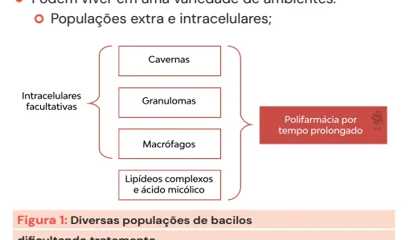
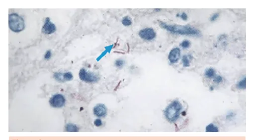
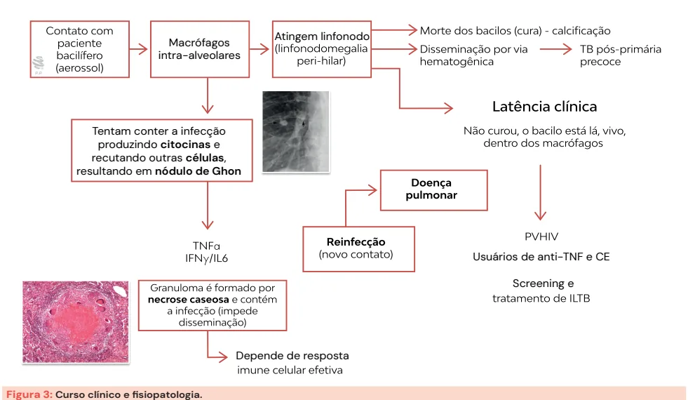
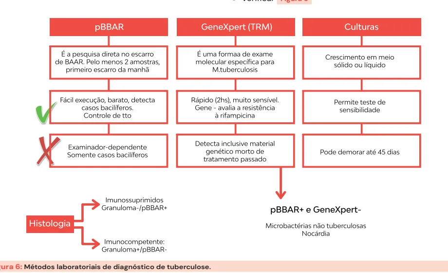
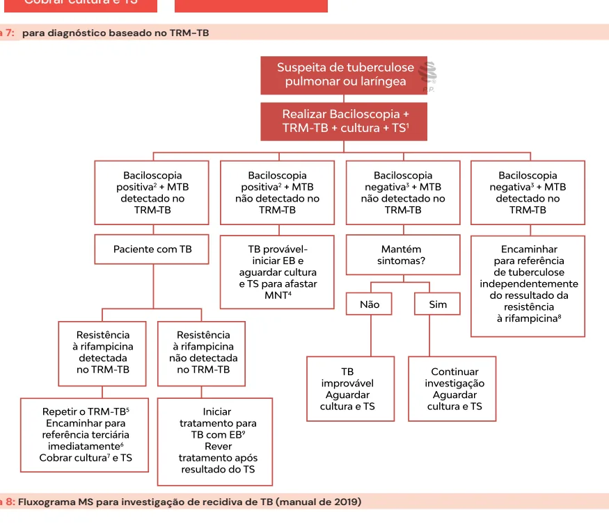
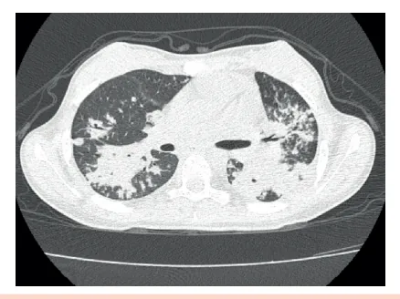
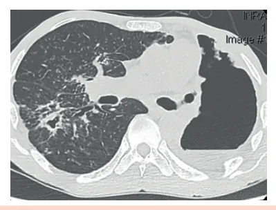
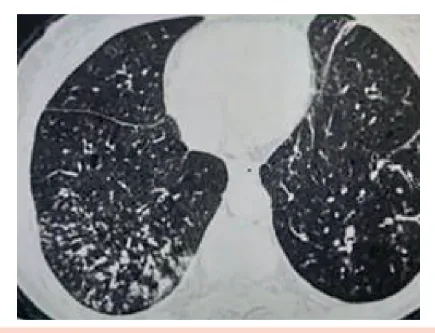

# Tuberculose Pulmonar

<!-- page:1 -->

Tuberculose Pulmonar Clínica e Diagnóstico (CM) ILTB (CM) ILTB (TUBERCULOSE LATENTE): PPD OU IGRA

- PPD >= 5mm : PVHIV ; anti-TNF ; contactantes domiciliares ; pred > 15mg/d/30d Contactantes domiciliares : se PPD < 5 mm, repetir em 8 semanas e verificar incremento de 10mm PVHIV que são contactantes domiciliares:

não depende de PPD e retrata mesmo que já tenha tratado

- PPD >= 10 mm : DM, DRC, neoplasias hematológicas e CP, pré-tx, trabalhadores, silicose

- Medicação : rifapentina + isoniazida / semana /

12 sem ; DIAGNÓSTICO

- Sintomático respiratório : temporalidade = tosse

> 3 semanas Populações de alto risco : qualquer tosse Morador de área livre, albergues, comunidades terapêuticas, privados de liberdade, profissionais de saúde / prisional.

- Laboratorial: acredite na tuberculose apesar dos exames laboratoriais negativos. Fecha-se diagnóstico por critério clínicoepidemiológico / clínico-radiológico.

## MICROBIOLOGIA

## COMPLEXO M. TUBERCULOSIS – SÃO 7

- M. tuberculosis;

- M. africanum;

- M. bovis – Bacilo de Calmette-Guérin

(BCG = Bovis atenuado);

- M. pinnipedii;

- M. canetti;

- M. microti;

- M. capra.

Apresenta crescimento lento - tratamento deve ser prolongado e com polifarmácia, pois fármacos atuam apenas durante a replicação

- Podem viver em uma variedade de ambientes. Populações extra e intracelulares; Formas disseminadas, paciente imunossuprimido : pBAAR - em escarro, + em bx - sem granuloma TRM-TB: molecular, caro, persiste positivo mesmo após cura, sensibilidade varia com pBAAR pBAAR + : TRM também positivo em > 95% pBAAR - : sensibilidade de TRM cai para 69% pBAAR positivo / TRM negativo = suspeitar de nocardia / micobact. não tuberculosas mas por uma questão epidemiológica, já se inicia tratamento de TB. Cultura: demora até 2 meses, teste de sensibilidade LF-LAM: imediato, pesquisa TB doença (não Indicações : gravemente doente, CD4<100 em ambulatório e < 200 em internação

Figura 1: Diversas populações de bacilos dificultando tratamento. | pBAAR: bacilífero, barato, examinadordependente, controle de cura ILTB) em PVHIV

- TC: cavernas, paredes espessas, campos superiores, vidro-fosco, micronódulos aspecto árvore em brotamento, micronódulos difusos (miliar)

Figura 2: pBAAR. CURSO CLÍNICO E FISIOPATOLOGIA

- Verificar Figura 3 na próxima página

## ILTB

## LATENTE, NÃO TEM CLÍNICA

- Contudo, apresenta os bacilos viáveis intramacrofágicos;

- São passíveis de reativação.

## EM QUEM INVESTIGAR?

- Quem tem muito risco de reativar: HIV imunossuprimidos por corticosteroides (> 15 mg/dia de prednisona por 30 dias) anti-TNF (infliximab);

- Contactante domiciliar.

---

<!-- page:2 -->

Atingem linfonodo Macrófagos intra-alveolares Tentam conter a infecção produzindo citocinas e recutando outras células, resultando em nódulo de Ghon Depende de resposta Figura 3: Curso clínico e fisiopatologia.

## OUTROS PACIENTES COM INDICAÇÃO PARA

## INVESTIGAÇÃO DE ILTB

- Pessoas com alterações radiológicas fibróticas sugestivas de sequela de TB;

- Pré-transplante em que realização terapia imunossupressora;

- Pessoas com silicose;

- Neoplasia de cabeça e pescoço, linfomas e outras neoplasias hematológicas;

- Insuficiência renal estágio avançado/em diálise;

- Diabetes mellitus;

- Calcificação isolada (sem fibrose) na radiografia de tórax;

- Profissionais de saúde, pessoas que vivem ou trabalham no sistema prisional.

## COMO INVESTIGAR?

- IGRA e PPD: indicam apenas o contato prévio; PPD: valores de corte:

5mm: PVHIV, imunossuprimidos (CE, pré-transplante e TNFα) alterações radiológicas, contactantes domiciliares

- 10 mm:

Profissionais de saúde Profissionais do sistema prisional Neoplasias CP, hematológicas Silicose TSR DM Usuários de anti-TNF e CE Screening e Contactantes domiciliares < 5mm ≥ 5 mm trata repete em 8 semanas 3 mm 13 mm Para ser positivo tem que aumentar em 10 mm Figura 4

- PPD falso-positivos: muito raro acontecer (alta especificidade, 97%) vacinação BCG recente; infecção por micobactéria não tuberculosa;

- PPD falso-negativos: já não tão raro

(sensibilidade de 77%)

- Verificar Tabela 1 na próxima página

- IGRA: mede produção de IFN mediante estimulação com antígenos de TB; células anteriormente sensibilizadas com os antígenos da tuberculose produzem altos níveis de interferon-gama:

IGRA MS 2024: PVHIV e CD4 > 350 cels, que nunca tenham tratadoTB / ILTB (latente) 2 anos < crianças < 10 anos contactantes domiciliares de baciléfieros Pré-TMO, usuários de imunobiológicos

---

<!-- page:3 -->

## CLÍNICA E DIAGNÓSTICO

Tabela 1: Condições associadas a resultados falso-negativos da prova tuberculínica

## EPIDEMIOLOGIA

Condições associadas a resultados falso-negativos da Transmissão: prova tuberculínica

- Pacientes bacilíferos (tuberculose pulmonar e laríngea prova tuberculínica ultravioleta, congelada, contaminada com fungos, manutenção em frascos inadequados e desnaturação bacterianas ou fúngicas corticosteroides, outros imunossupressores a quimioterápicos) doenças linfoproliferativas outras condições metabólicas

Tuberculina mal conservada: exposta à luz direta ou Leitor inexperiente ou com vício de leitura Tuberculose grave ou disseminada Outras doenças infecciosas agudas virais, Imunodepressão avançada (AIDS, uso da Vacinação com vírus vivos em período menor que 15 dias Neoplasias, especialmente as de cabeça e pescoço e as Desnutrição, diabetes mellitus, insuficiência renal e Gravidez Crianças com menos de 3 meses de vida Idosos (> 65 anos)

Febre durante o período da realização da PT e nas horas que a sucedem

## PVHIV

- Que sejam contactantes domiciliares de bacilífero: Única situação em que retratamos ILTB, mesmo se já tiver tratado previamente ou tido TB doença tratada. Trata independentemente de IGRA ou PPD ou CD4

- CD4<= 350 células: tratamento independentemente de teste Tanto IGRA quanto PPD podem ser falsos negativos.

Logo, o tratamento está indicado

## PARA GESTANTES

- Tratar após o parto.

- rifapentina contra-indicada

Para Gestantes Hiv+

- Tratar após o 3° mês de gestação.

## TRATAMENTO

Preferencial:

- Rifapentina + isoniazida semanal por 12 semanas

(3 meses):

- Contraindicado na gestação;

- Abandono: 3 doses consecutivas.

Alternativas:

- Isoniazida 300 mg/dia por 9 meses (270 doses) + piridoxina:

- A associação deve ser feita para prevenir neuropatia periférica;

- Abandono: 90 dias não consecutivos.

- Rifampicina diária/4-6 meses (120 doses). - Pacientes bacilíferos (tuberculose pulmonar e laríngea com baciloscopia positiva) sustentam a cadeia de transmissão;

- Mecanismo: aerossol: Outras doenças: sarampo, varicela e zoster disseminado.

Risco em populações vulneráveis:

- Morador de área livre 56x maior;

- Pessoas vivendo com HIV 28x maior;

- Pessoas privadas de liberdade 28x maior;

- Indígenas 3x maior.

- Consultar Figura 5 na próxima página

## POPULAÇÃO EM GERAL: TEMPORALIDADE = TODA E

## QUALQUER TOSSE > 3 SEMANAS

- É uma doença de alta prevalência e grandes implicações para o paciente e para o sistema de saúde; Logo, seu limiar para suspeição clínica tem que ser baixo;

- Situações especiais:

- Verificar Figura 5 na próxima página

Tabela 2: Sintomático respiratório em situações especiais. TEMPO/ EXAME DE

## POPULAÇÃO DURAÇÃO DE ESCARRO

## TOSSE SOLICITADO

Pessoas em Qualquer Baciloscopia ou situação de rua duração TRM Albergues, comunidades terapêuticas de Baciloscopia ou dependentes Qualquer TRM-TB e cultura químicos ou duração com TS instituições de longa permanência Baciloscopia ou Qualquer Indígena TRM-TBe duração cultura com TS Baciloscopia ou Profissionais da Qualquer TRM-TBe cultura saúde duração com TS Qualquer duração em Baciloscopia ou Imigrantes situações TRM-TBe cultura de maior com TS vulnerabilidade Contato de TB Qualquer Baciloscopia ou pulmonar duração TRM-TB Qualquer duração.

Acrescida da Baciloscopia ou investigação PVHIV TRM-TBe cultura de febre ou com TS emagrecimento ou sudorese noturna

---

<!-- page:4 -->

75,9 43,1 84,1 52,0 26,9 Casos de tuberculose por 100 mil habitantes 9,9 a 25,6 25,6 a 45,1 45,1 a 84,1 Figura 5: Coeficiente de incidência de tuberculose (casos por 100 mi SINTOMAS CLÁSSICOS

- Febre vespertina;

- Perda ponderal;

- Sudorese noturna;

- Escarro hemoptoico;

- Tosse produtiva.

- SINTOMAS NÃO CLÁSSICOS

- Síndromes abdominais agudas (inflamatórias, obstrutivas e perfurativas);

- Sinais neurológico focal; amaurose; D

- Figura 6: Métodos laboratoriais de diagnóstico de tuberculose. 49,4 il hab.) por Unidades de Federação. Brasil, 2022

35,1 36,2 37,0 22,8 31,0 52,8 13,6 26,9 38,3 1,8 27,0 13,6 9,9 18,0 36,8 7,1 38,3 68,6 19,7 24,3 40,9 0 500 1000km

- Linfadenopatias;

hepatoesplenomegalia; escrofuloderma;

- Lesão pustulosa; espondilodiscite; implante peritoneal;

dor crônica;

- Uveíte; síndrome confusional; síndrome medular;

mielite transversa;

- Síndromes compressivas; febre de origem indeterminada;

- Osteomielite; convulsão.

## DIAGNÓSTICO

- Verificar Figura 6

---

<!-- page:5 -->

## O MINISTÉRIO DA SAÚDE PRECONIZA QUE

- Qualquer exame positivo já fecha diagnóstico, mas cuidado com TRM em reinfecção! TRM pode ficar positivo por tratamento prévio, não se relaciona com infectividade Mas, de forma geral, em 1-2 anos ele se negativa.

- Múltiplas cavernas pode demorar mais tempo.

- Múltiplas cavernas pode demorar mais tempo.

Susp pu MTB detectado Paciente com TB Resistência á Resistência á rifampicina detectada rifampicina não no TRM-TB detectado no TRM Repetir o TRM-TB Iniciar tratament Encaminhar para para TB com EB referência terciária Rever tratament imediatamente após resultado do Cobrar cultura e TS Figura 7: para diagnóstico baseado no TRM-TB

- Figura 8: Fluxograma MS para investigação de recidiva de TB (ma .

peita de tuberculose ulmonar ou laríngea Realizar TRM-TB MTB não detectado Mantém sintomas? Não Sim Excluído TB Continuar investigação o Realizar M-TB cultura e TS to to o TS

- anual de 2019)

---

<!-- page:6 -->

Tabela 3: Diagnóstico de TB em PVHIV conforme imunossupressão Pessoas Vivendo com HIV SEM IMUNODEFICIÊNCIA COM IMUNODEFICIÊCNIA GRAVE GRAVE Sintomas Respiratórios e sistêmicos Predomínio de sintomas sistêmicos Padrão radiológico típico (infiltrados Radiografia de tórax e atividades em lobo Padrão radiológico atípico superior direito)

Apresentação extrapulmonar Ocasional Frequente Baciloscopia Frequentemente positiva Frequentemente negativa de escarro Baciloscopia de tecido Frequentemente negativa Frequentemente positiva Hemocultura Negativa Frequentemente positiva Prova tuberculínica Frequentemente positiva Frequentemente negativa Histopatológica Granulomas típicos Granulomas atípicos PEGADINHAS NO DIAGNÓSTICO

- Com presença de vidro fosco perilesional:

- Amostras recomendadas para realização do TRM-TB; Todas as formas pulmonares: escarro; escarro induzido; lavado broncoalveolar; Na criança: lavado gástrico; Outros tecidos: Liquor; Gânglios linfáticos e outros tecidos.

- A positividade (sensibilidade) do TRM-TB depende da baciloscopia: pBAAR +: 95%; Logo, pBAAR + com TRM-TB negativo, tem que avaliar micobactérias não tuberculosas e nocardia (aguarde cultura)

- mas já se inicia esquema de tuberculose por Figura 9: Caverna com paredes espessadas ela ser mais prevalente e este ser um potencial paciente bacilífero PADRÕES ATÍPICOS pBAAR -: sensibilidade TRM-TB de 69%.

- Micronódulos em árvore em brotamento: logo, ambos podem ser falso negativos.

- Verificar Tabela 3

## TECNOLOGIA NOVA: LF-LAM - RASTREIO TB

## ATIVA EM PVHIV

- Confecção TB-HIV: 11,4% do total de pacientes com tuberculose;

- Urinário, imediato, a beira-leito;

- Indicação: Todo paciente gravemente doente; Ambulatório: CD4 < 100; Internação: CD4 < 200.

RADIOLOGIA Figura 10: Disseminação endobrônquica extensa,

- Infinidade de padrões radiológicos; com consolidações.

- O mais comum é o que consta a presença de cavernas com paredes espessadas;

---

<!-- page:7 -->

## REFERÊNCIAS

Figura 2: pBAAR. researchegate Figura 3: Curso clínico e fisiopatologia. reserchegate Figura 5: Coeficiente de incidência de tuberculose (casos por 100 mil hab.) por Unidades de Federação. Brasil, 2022 Sistema de Informação de Agravos de Notificação/Secretarias Estaduais Figura 11: Disseminação hematogênica - padrão micronodular de Saúde/Ministério da Saúde; Instituto Brasileiro de Geografia e Estatística.

randômico - situação de imunossupressão. Figura 9: Caverna com paredes espessadas Arquivo pessoal Figura 10: Disseminação endobrônquica extensa, com consolidações.

Arquivo pessoal Figura 11: Disseminação hematogênica - padrão micronodular randômico - situação de imunossupressão.

Arquivo pessoal Figura 12: Exemplo de árvore em brotamento. Arquivo pessoal Figura 12: Exemplo de árvore em brotamento.

