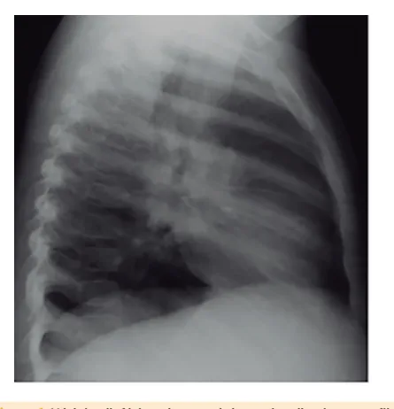
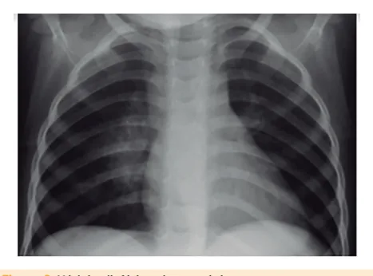
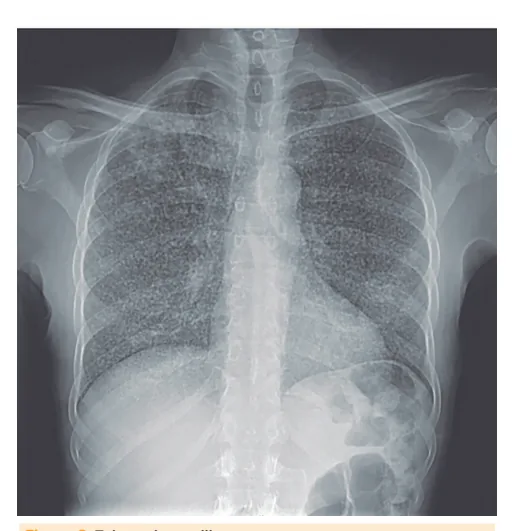

# Tuberculose

<!-- page:1 -->

Tuberculose (PED) Transmissão

- Respiratória por paciente com Tuberculose (TB) pulmonar ou laríngea (bacilífero).

Etiologia

- COMPLEXO Mycobacterium tuberculosis.

Quadro clínico T

- Tosse crônica;

- Tríade: perda de peso + tosse crônica + inapetência / Febre Origem Indeterminada (FOI).

- Apresentações clínicas: T pulmonar x extrapulmonares Ganglionar, Pleural , Óssea/Articular, SNC.

- Criança = Paucibacilar (Marcador epidemiológico)

- não transmite.

Diagnóstico

- Identificação do agente etiológico + clínica e T imagem + Epidemiologia;

- Identificação do M. tuberculosis: Teste rápido molecular; baciloscopia direta; cultura (escarro, lavado gástrico ou lavado bronco-alveolar);

- Identificação resposta imune ao M. tuberculosis:

PPD, IGRA;

- Sistema de escore de pontos (contato com adulto com TB, Quadro clínico, Quadro radiológico, PPD,

Estado Nutricional);

## INTRODUÇÃO

## CONCEITO

- A tuberculose (TB) pode ser causada por qualquer uma das sete espécies que integram o complexo M. tuberculosis, M. bovis, M. africanum, M. canetti,

Mycobacterium tuberculosis: M. microti, M. pinnipedi e M. caprae.

- TRANSMISSÃO

- O M. tuberculosis é transmitido por via aérea;

- Pessoa com TB pulmonar ou laríngea elimina bacilos no ambiente onde outro indivíduo se contamina por aerossóis oriundos da tosse, fala ou espirro;

- Estima-se que cerca de 10% dos infectados adoecem;

- Há ainda casos de TB congênita;

- Pode haver reinfecção em caso de nova exposição.

## POPULAÇÃO DE MAIOR RISCO

- Pessoas vivendo em situação de rua: chance aumentada em 56x;

- Pessoas vivendo com o HIV: 28x mais chance de D desenvolver TB doença;

- Indígenas: 3x mais chance de desenvolver TB doença; | ≥ 40 pontos: iniciar o tratamento; 30-35 pontos: indicativo de TB → tratamento a critério médico; < 25 pontos: prosseguir com investigação na criança.

Tratamento

- < 10 anos: 2 meses Rifampicina (R) + Isoniazida (I) +

Pirazinamida (P) + 4 meses RI;

- > 10 anos: associar Etambutol (E): 2 RIPE + 4 RI.

Tratamento em situações especiais

- Neurotuberculose e TB osteoarticular: 2 RIP

(E) + 10 RI;

- Tratamento encurtado para TB pulmonar não grave em crianças 3 meses a 16 anos + peso ≥ 4 kg: 2 RIP

(E) + 2 RI. Tratamento infecção latente por tuberculose (ILTB)

- RN: não fazer BCG, realizar rifampicina por 4 meses;

- < 10 anos e entre 4-25 kg: Rifampicina + Isoniazida por 3 meses (90 doses);

- > 2 anos: Rifapentina + Isoniazida por 3 meses (12 doses/semana);

- < 4 kg: exclusivo Rifampicina por meses (120 doses);

- Alternativo (ausência dos demais): Isoniazida por

6 a 9 meses (180-270 doses).

- Controle da TB no BR é prioritário → importância epidemiológica.

Sempre que diagnosticar TB, solicitar o teste diagnóstico de HIV.

## NA PEDIATRIA

- TB primária, como nos imunossuprimidos, será uma forma grave de baixo poder de transmissibilidade; Quando doentes, são paucibacilares e transmitem menos a doença.

- Qualquer que seja a manifestação clínica da tuberculose, é importante investigar adultos sintomáticos (potenciais casos índices de alta infectividade - multibacilar);

- TB na criança é um marcador epidemiológico de transmissão.

## QUADRO CLÍNICO

## DEFINIÇÃO DE SINTOMÁTICO RESPIRATÓRIO

- De acordo com o manual de tuberculose do Ministério da Saúde – 2019: pessoa que apresenta tosse por 3 semanas ou mais, deve ser investigada para tuberculose.

---

<!-- page:2 -->

QUADRO CLÍNICO NA PEDIATRIA | Baciloscopia direta; Tríade | Cultura em escarro, lavado gástrico ou lavado

- Perda de peso; bronco-alveolar;

- Tosse crônica; | Resposta imune após contato com patógeno

- Inapetência; (PPD, IGRA).

- Febre de origem indeterminada (FOI) pode fazer parte

- Quadro clínico e radiológico;

do quadro; | Diferenciar entre exposição e desenvolvimento

- Quanto menor a criança, maior o risco de doença da doença.

disseminada (principalmente se <1 ano).

- Epidemiologia.

## APRESENTAÇÕES CLÍNICAS IMAGENS RADIOLÓGICAS

Doença pulmonar

- É essencial realizar imagem radiológica em PA + perfill;

- Assemelha-se ao adulto.

- Na figura 1, é possível verificar densidade atrás e

Doença Extra-Pulmonar abaixo da carina, área onde tais estruturas fisiológicas

- Ganglionar Periférica: forma mais frequente em não são comumente encontradas. Além disso, alguns crianças, sendo 50% dos casos representados por fluidos nas fissuras horizontal e transversal indicam adenopatias extratorácicas (cervical e supraclavicular); alguma resposta inflamatória (não indicativa de TB). O

- TB óssea: mais em crianças que em adultos; Mal de anel circular denso ao redor do hilo (Chamado de sinal

Pott - espondilite tuberculosa; donut) é indicativo do envolvimento de linfonodos

- TB pleural: representa 3% dos casos de tuberculose; peri-hilares.

- TB meningoencefálica: febre, sinais focais, irritação meníngea e aumento da pressão intracraniana (estado mental gravemente alterado).

## DIAGNÓSTICO

## CONCEITOS BÁSICOS

- PPD - reação de hipersensibilidade do tipo IV de É injetado o antígeno e verificam-se as condições imunológicas prévias; Positivo quando ≥ 5mm; Negativo se < 5mm; Falsos Positivos: infecção por outras micobactérias; vacinados ou revacinados com BCG após o primeiro ano de vida (reação mais intensa e mais duradoura).

Gell e Coombs:

- IGRA - dosagem de interferon gama liberado na resposta imune;

- ADA (Adenosina deaminase) – enzima intracelular Figura 1: Nódulos linfáticos intratorácicos, visualizado no perfil.

presente no linfócito ativado pela presença da micobactéria;

- Na Figura 2 , é possível visualizar nódulos linfáticos que

- Baciloscopia (pBAAR) – necessários fazem parte do complexo de Ghon e do sítio principal

~10.000 bacilos/mL; da doença, entretanto, são de difícil visualização.

- Teste rápido molecular (TRM) - necessários Complexo de Ghon = foco de infecção (nódulo

~100 bacilos /mL; calcificado associado a nódulo linfático).

- Cultura = identificação a partir de ~10 bacilos/mL: Demora para ficar pronto ~ 40 dias (não esperar resultado para iniciar o tratamento); Método de cultura é o Lowenstein-Jensen; Maior sensibilidade e especificidade.

- Identificação do patógeno (pBAAR, TRM/Gene Escarro; Lavado Gástrico, Lavado Bronco-Alveolar; Líquido Pleural (ADA), Líquido Articular, Líquor.

Xpert®, Cultura):

## OS 3 PILARES PARA A IDENTIFICAÇÃO

## DA TUBERCULOSE

- Identificação do patógeno ou da resposta Imune; Teste rápido molecular – Genexpert®; Figura 2: Nódulos linfáticos intratorácicos.

---

<!-- page:3 -->

## TRATAMENTO

- Na Figura 3 é possível visualizar micronódulos típicos da TB miliar (disseminada).

## CRIANÇAS < 10 ANOS – 3 DROGAS

- 2 MESES = RIFAMPICINA + ISONIAZIDA +

PIRAZINAMIDA (RIP);

- C

- N

- - T

Figura 3: Tuberculose miliar. P

- FERRAMENTA DIAGNÓSTICA:

## SISTEMA DE ESCORE

- Contato com adulto com TB; Próximo e nos últimos 2 anos = 10 pontos; Nenhum contato ou esporádico = 0 pontos.

- Quadro clínico; O Febre ou sintomas por 2 semanas ou mais = 1 Assintomático ou sintoma < 2 semanas = 5 pontos; Sintomas que melhoram com ATB ou sozinhos = 3

15 pontos; 2 -10 pontos.

- Quadro Radiológico; 4 Alteração RX por 2 semanas ou mais = 15 pontos; Alteração RX com < 2 semanas = 5 pontos; 5 RX normal = - 5 pontos. O

- Estado nutricional; 1 Desnutrição grave (<P10) = 5 pontos; Peso ≥ P10 = 0 pontos. 2

- PPD; ≥ 10mm = 10 pontos; 5-9 mm= 5 pontos; <5 mm = 0 pontos.

COMO AVALIAR O ESCORE?

- ≥ 40 pontos: diagnóstico muito provável, sendo recomendado iniciar o tratamento da TB;

- 30-35 pontos: diagnóstico possível, então, indicativo de tuberculose, orientando-se que o tratamento seja iniciado a critério médico;

- < 25 pontos: diagnóstico pouco provável, devendo-se prosseguir com a investigação na criança.

- PIRAZINAMIDA (RIP);

- 4 MESES = RIFAMPICINA + ISONIAZIDA (RI);

- Etambutol pode causar neurite óptica (primeiro sintoma pode ser a alteração na percepção das cores).

## CRIANÇAS > 10 ANOS – 4 DROGAS

- 2 MESES = RIFAMPICINA + ISONIAZIDA + PIRAZINAMIDA

+ ETAMBUTOL (RIPE);

- 4 MESES = RIFAMPICINA + ISONIAZIDA (RI).

## NEUROTUBERCULOSE E

## TUBERCULOSE OSTEOARTICULAR

- 2 MESES = RIFAMPICINA + ISONIAZIDA + PIRAZINAMIDA

+ ETAMBUTOL (a depender da idade) – (RIPE);

- 10 MESES = RIFAMPICINA + ISONIAZIDA – (RI);

- Para neurotuberculose indica-se, também, o uso de corticoide por 4-8 semanas.

## TRATAMENTO ENCURTADO

## PARA TUBERCULOSE

- Em 2024, o Ministério da Saúde, liberou o uso de tratamento encurtado, ou seja, com duração de pulmonar não grave, em crianças de 3 meses a 16 anos, com peso maior ou igual a 4 kg;

4 meses, ao invés de 6 meses, para tuberculose

- É obrigatório que essas crianças sejam paucibacilares.

Os critérios clínicos para realização desse tratamento são

1. Sintomas leves, sem indicação e internação;

2. TB pulmonar com acometimento em

linfonodos periféricos;

3. TB intratorácica sem sinais de obstrução de

vias aéreas;

4. TB não cavitária e restrita a um lobo pulmonar e sem

padrão miliar;

5. TB pleural não complicada.

Os critérios para considerar paucibacilar são

1. TRM não detectado ou detectado traços ou low

ou very low;

2. Baciloscopia negativa;

- Dado crucial desse tratamento encurtado: reavaliação frequente da criança ou adolescente com essa proposta de tratamento; Em caso de persistência de sintomas ou mudança clínica, considerar estender o tratamento para 6 meses.

## TUBERCULOSE LATENTE (ILTB)

- Se não há doença ativa, pode haver TB latente;

- Maior risco de adoecimento nos primeiros 2 anos após a primo-infecção, mas o período de latência pode se estender por anos a décadas;

- Tratamento de ILTB reduz risco de adoecimento por TB ativa (60-90%).

---

<!-- page:4 -->

## DIAGNÓSTICO DE TUBERCULOSE LATENTE

Crianças < 10 anos contato com TB ativa Crianças < 10 contato com TB ativa Sem sintomas de TB: Com sintomas de TB:

realizar RX Investigar TB ativa RX sem RX alterado TB ativa TB excluida alteração Prosseguir Realizar PT Notificar e Prosseguir investigação ou IGRA tratar TB Invertigação PT < 5mm ou IGRA PT ≥ 5mm ou IGRA negativo/ não positivo/ reagente reagente Repetir PT ou IGRA Notificar e tratar ILTB em 8 semanas PT sem conversão ou Conversão da PT ou IGRA negativo/não IGRA inderteminada/ reagente positivo/ reagente Não tratar ILTB orientar Notificar e tratar sinais e sintomas de TB ILTB Figura 4: Fluxograma infecção latente tuberculose menor de 10 anos.

Crianças > 10 anos contato com TB ativa Adolescentes > 10 anos e adultos Sem sintomas de TB: Com sintomas de TB:

realizar PT Investigar TB ativa PT < 5mm PT ≥ 5mm TB ativa TB excluida Repetir PT em Notificar e Prosseguir Realizar RX 8 semanas tratar TB Invertigação PT sem Conversão conversão da PT Não tratar ILTB e orientar sinais e Realizar RX sintomas de TB RX sem alterações RX alterado Notificar e Prosseguir tratar ILTB Investigação Figura 5: Fluxograma infecção latente tuberculose maior de 10 anos.

---

<!-- page:5 -->

TB LATENTE E HIV: QUANDO TRATAR?

- Ao término dos 4 meses, suspender rifampicina e

- Radiografia normal e CD4+ ≤ 350 céls/mm³, realizar BCG SEM realizar PPD.

independentemente PPD ou IGRA/CD4 desconhecido;

- Esquema alternativo com Isoniazida:

- Radiografia normal e CD4+ > 350 com PPD ou | Não realizar BCG, iniciar quimioprofilaxia com

IGRA positivos; Isoniazida por 3 meses; IGRA positivos;

- Radiografia normal e contato institucional ou intradomiciliar com TB pulmonar ou laríngea, independente da PPD ou IGRA;

- Radiografia normal e registro de PPD ou IGRA positivos sem tratamento na ocasião; N

- Radiografia com cicatriz de TB sem tratamento anterior, independentemente de PPD e excluída

TB doença.

- TRATAMENTO ILTB (ATUALIZAÇÃO MS 2024)

- < 10 anos entre 4-25kg que não conseguem deglutir:

Rifampicina + Isoniazida por 3 meses ou 90 doses;

- > 2 anos com capacidade de deglutir: Rifapentina +

Isoniazida por 3 meses ou 12 doses/semanais;

- Esquema exclusivo para < 4 kg: Rifampicina suspensão por 4 meses ou 120 doses;

- Usar apenas quando os demais esquemas não estiverem disponíveis ou Esquema preferencial para m

PVHIV: Isoniazida por 6 meses (180 doses) ou 9 meses A (270 doses). i

## MANEJO NO RN EXPOSTO

(MS 2024) A i m

## PARA RN COABITANTES DE CASO

## ÍNDICE BACILÍFERO

- Não administrar BCG/afastar TB congênita; P

- Iniciar quimioprofilaxia primária com Rifampicina 2 por 4 meses; Isoniazida por 3 meses; Ao término, realizar PPD - se < 5mm, suspender medicamento e fazer BCG; se ≥ 5mm, manter isoniazida por mais 3 meses e não realizar BCG.

## NOS CASOS DE TB MATERNA

- Sempre manter a amamentação - mãe com máscara cirúrgica nos primeiros 14 dias de tratamento;

- Exceção: suspender amamentação de forma transitória apenas nos quadros de mastite por tuberculose; Manter ordenha e desprezar leite.

Notifica-se apenas os casos confirmados de TB (laboratorial ou clínico).

## REFERÊNCIAS

Figura 1: Nódulos linfáticos intratorácicos, visualizados no perfil. Adaptado de: GIE, R. A.; MARAIS, B. J.; et al. Nódulos linfáticos intratorácicos. In: MARAIS, B. J.; et al. Tuberculosis: diagnosis and management. 2014.

Figura 2: Nódulos linfáticos intratorácicos. Adaptado de: GIE, R. A.; MARAIS, B. J.; et al. Nódulos linfáticos intratorácicos. In: MARAIS, B. J.; et al. Tuberculosis: diagnosis and management. 2014.

Figura 3: Tuberculose miliar. PELAYO, J.; RUDDIMAN, K. Tuberculosis miliar: diagnosis and treatment.

2020.
