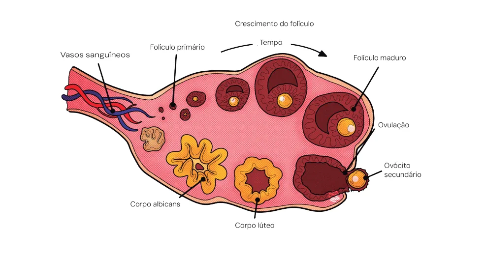
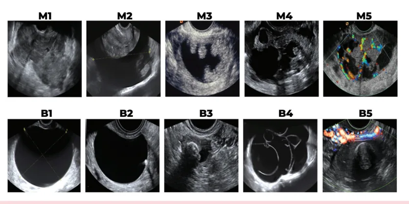
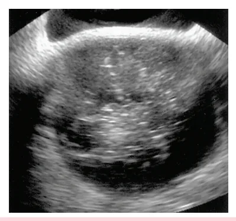
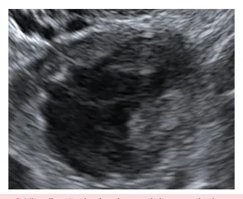

# Tumores Anexiais

<!-- page:1 -->

Tumores anexiais Oncoginecologia CRITÉRIOS DE IOTA PARA TUMORES ANEXIAIS C Critérios de Malignidade:

- M1: Tumor sólido com paredes irregulares;

- M2: Ascite;

- M3: ≥4 projeções papilares;

- M4: Multilocular sólido, com contornos irregulares e ≥100mm;

- M5: Alta captação ao doppler (índice de cor 4).

## TIPOS DE TUMORES ANEXIAIS L LINHAGENS CELULARES DO OVÁRIO

- Epiteliais;

- Estromais;

- Germinativos. C

- Todas as lesões e tumorações no ovário podem ser decorrentes de qualquer uma das três linhagens, podendo ser benignas, borderlines ou malignas. C

- Benigno: não provocam metástases;

- Borderline: proliferação epitelial atípica (maior que nos tumores benignos), mas sem destruição estromal invasiva (presente nos tumores malignos); E

- Maligno de baixo ou alto grau.

- Verificar Figura 1

- Figura 1: Crescimento folicular. Critérios de Benignidade

- B1: Cisto unilocular

- B2: Componente sólido <7mm em seu maior diâmetro;

- B3: Sombra acústica posterior;

- B4: Cisto multilocular com paredes lisas e < 100mm;

- B5: Ausência de captação de fluxo ao doppler

(índice de cor 1). LESÕES FUNCIONAIS

- Lesões funcionais são outras alterações anexiais possíveis de serem encontradas e confundidas com tumores, porém NÃO são tumores:

Cistos Foliculares

- Folículo estimulado que não se rompeu; Normalmente desaparecem espontaneamente em 4-8 semanas;

- Cistos simples entre 3 a 8 cm.

Cisto de corpo lúteo / cisto hemorrágico

- Hemorragia para a cavidade folicular e/ou rotura, pode simular torção ovariana (dor) ou gestação ectópica, conduta conservadora, se houver estabilidade hemodinâmica.

Endometriomas

- Tumorações formadas pelo implante de células endometriais em locais atípicos. Causam dor pélvica, dispareunia e dismenorreia.

- Verificar Tabela 1 na próxima página

---

<!-- page:2 -->

Tabela 1: Tumores Ovarianos por Origem Celular e Comportamento Biológico. Epitelial Estromal Germinativo

- Cistoadenoma seroso

- Tecomas - Teratoma;

Benignos - Cistoadenoma mucinoso Benignos - Cistoadenoma mucinoso

- Cistoadenoma endometrioide

Borderline –––––––

- Adenocarcinomas serosos,

- Mucinosos e endometrioides;

Maligno - Células claras;

- Células transicionais (Brenner);

- Carcinossarcomas.

## RISCO DE CÂNCER

## COMO SABER SE É CÂNCER?

- Características nos exames de imagem, dados clínicos, marcadores tumorais;

- IOTA (International Ovarian Tumor Analysis): termos para descrever e classificar as massas anexiais.

Atenção: Não biopsiar um ovário para determinar malignidade.

## CRITÉRIOS

A: Descrição ultrassonográfica detalhada,

- Presença de septos ou projeção sólida, paredes em suspensão), vascularização (ausente, pouca, moderada, muita).

(regulares ou irregulares), conteúdo (anecoico, ecos B: Classificação com base na presença de septos e áreas sólidas

- Uniloculares, multiloculares, presença de componente sólido, tumores sólidos.

C: Conclusão.

- Direcionamento para o seguimento:

expectante x cirurgia Figura 2: Achados ultrassonográficos para classificação dos tumo - Fibromas - Tumor de saco vitelínico.

––––––– Gonadoblastoma

- Coriocarcinoma - Disgerminoma

- Coriocarcinoma - Tumor de saco vitelínico;

(baixo grau) - Tumor de seio endodérmico. Tabela 2: Risco de malignidade para cada característica presente em uma massa anexial.

Risco de , Classificação IOTA malignidade Unilocular 1,3% Multilocular 10,3% Unilocular com projeção sólida 37,1% Multilocular com projeção sólida 43,0% Sólido 65,3% Não classificáveis 0% IOTA – REGRAS SIMPLES Critérios de Malignidade:

- M1: Tumor sólido com paredes irregulares;

- M2: Ascite;

- M3: ≥4 projeções papilares;

- M4: Multilocular sólido, com contornos irregulares e ≥100mm;

- M5: Alta captação ao doppler (índice de cor 4).

Critérios de Benignidade

- B1: Cisto unilocular

- B2: Componente sólido <7mm em seu maior diâmetro;

- B3: Sombra acústica posterior;

- B4: Cisto multilocular com paredes lisas e < 100mm;

- B5: Ausência de captação de fluxo ao doppler (índice de cor 1).

- Verificar Figura 2 ores anexiais quanto ao seu comportamento biológico.

---

<!-- page:3 -->

## GGIINNEECCOOLLOOGGIIAA EE OOBBSSTTEETTRRÍÍCCIIAA || EEXXTTEENNSSIIVVOO MMEEDDCCOOFF

## VAMOS SIMPLIFICAR!

- Ovários que não funcionam (pós-menopausa) não devem ter lesão/cisto funcional.

- Suspeitar de malignidade se: CA 125 aumentado: menopausa em qualquer valor CA 125 aumentado: menopausa em qualquer valor ou menacme >200. Marcador inespecífico, podendo estar aumentado, inclusive lesões benignas Histórico familiar / pessoal de câncer Outros sintomas: emagrecimento, outros achados no exame de imagem (ex. ascite, carcinomatose ou lesões em outros órgãos).

## EXAMES DE IMAGEM

## LESÕES FUNCIONAIS

Cisto Simples: T

- Unilocular, > 3cm, paredes regulares, conteúdo anecoico;

- <3 cm = folículo.

- Repetindo o exame em 2 meses, ele terá desaparecido

Figura 3: Cisto simples Cisto hemorrágico:

- Unilocular e de aspecto heterogêneo linear.

- - Figura 4: Visualização de cisto hemorrágico através da ultrassonografia.

Endometrioma E

- Cápsula espessa, conteúdo isoecoico, pontilhado fino Í em vidro fosco e pode ter debris finos. O

- Figura 5: Visualização de endometrioma através da ultrassonografia.

Teratoma

- Áreas hiperecogênicas, sombra acústica posterior e calcificações;

- Mais comum: teratoma maduro (benigno, linhagem germinativa).

Figura 6: Visualização de teratoma em exame de ultrassonografia.

## CONDUTA

## LESÃO ANEXIAL

Abordagem no Pronto Socorro:

- Excluir gestação (BHCG – gravidez ectópica?);

- Avaliar componente infeccioso/ inflamatório Leucocitose; Doença inflamatória pélvica (abscesso tubo-ovariano).

- Avaliar se há indicação de abordagem cirúrgica de urgência: Sinais de peritonite, choque hemorrágico: cisto hemorrágico roto? Dor aguda: torção anexial?

- Avaliar risco de malignidade.

## LESÃO BENIGNA (TERATOMA

ENDOMETRIOMA, CISTO HEMORRÁGICO ÍNTEGRO) Operar se:

- Cistos sintomáticos;

- Tumores císticos em pré-púberes;

---

<!-- page:4 -->

## REFERÊNCIAS

- Progressão de cistos simples em seguimento por 2 ou 3 meses;

- Tumores maiores que 5 cm e Figura 2: Achados ultrassonográficos para classificação dos persistentes (controverso); tumores anexiais quanto ao seu comportamento biológico

- Tumores assintomáticos maiores que 10 cm;

- Tumores assintomáticos maiores que 10 cm;

- Achados suspeitos de malignidade – IOTA;

- Tumores associados a Ca 125 alterado. O CA 125 está aumentado em 80% dos tumores epiteliais; Pode estar aumentado por outros motivos: Mais sensível e específico na pós-menopausa; Nunca deve ser avaliado isoladamente.

menstruação, endometriose, câncer de pulmão e mama; Atenção: A dosagem de câncer 125 NÃO faz diagnóstico de neoplasia de ovário! IOTA Group. IOTA Simple Rules and SRrisk Calculator - Diagnose Ovarian Cancer.Disponível em <https://www.iotagroup.org/research/iota−models− software/iota−simple−rules−and−srrisk−calculator−diagnose−ovarian− cancer> Acessado em 20/11/2023.

Figura 3: Exemplo de cisto simples visualizado através da ultrassonografia. Radswiki T, Bell D, Morgan M, et al. Ovarian follicular cyst. Reference article, Radiopaedia.org (Accessed on 20 Nov 2023) https://doi.org/10.53347/rID13410 Figura 4: Visualização de cisto hemorrágico através da ultrassonografia.

Acervo pessoal do autor. Figura 5: Visualização de endometrioma através da ultrassonografia. Acervo pessoal do autor.

Figura 6: Visualização de teratoma em exame de ultrassonografia. Acervo pessoal do autor.
