# Úlceras Genitais

<!-- page:1 -->

## Resumo Rápido

**Úlceras genitais infecciosas**

- **Cancro mole**: múltiplas lesões, incubação de 2-5 dias, dolorosas, bordas irregulares, profundas e adenopatia presente;
- **Sífilis (cancro duro)**: úlcera única, incubação de 21-30 dias, indolor, borda lisa, base dura e adenopatia presente;
- **Linfogranuloma venéreo**: lesão única (pode não ser percebida), incubação de 1-2 semanas, indolor, bordas regulares, fundo superficial e limpo, adenopatia presente;
- **Herpes simples**: múltiplas vesículas agrupadas, incubação de 7 dias, dolorosa, bordas regulares, fundo com exulcerações e adenopatia presente;
- **Donovanose**: múltiplas lesões (em espelho), incubação de 3 dias a 6 meses, indolor, bordas irregulares, fundo limpo e friável, adenopatia ausente.

**Úlceras genitais não infecciosas**

- **Úlcera de Lipschutz**:
  - Crianças e adolescentes;
  - Após quadro viral (síndrome *flu-like*) e/ou bacteriano sistêmico (vias aéreas superiores);
  - Tratamento: sintomáticos; cicatrização espontânea em 4 a 6 semanas.
- **Doença de Behçet**:
  - Distúrbio inflamatório autoimune;
  - Adultos jovens (20 a 35 anos);
  - Úlceras aftosas dolorosas;
  - Úlceras genitais dolorosas, > 1 cm, com cicatrizes;
  - Tratamento: medidas de suporte, analgesia e higiene, corticoide tópico ultrapotente, corticoide VO (prednisona 0,5 a 1 mg/kg). Outras drogas: colchicina VO 0,5 mg 8/8h.

## Considerações Gerais

### Definição

- Úlcera genital é definida como uma lesão caracterizada por uma perda da solução de continuidade no trato genital inferior, sendo acompanhada de processo inflamatório, com ou sem dor associada.

**Úlceras infecciosas**

- Relacionadas a ISTs;
- Não relacionadas a ISTs: em geral, são causadas por reações imunológicas desencadeadas por antígenos virais ou bacterianos à distância.

**Úlceras não infecciosas**

- Dermatoses bolhosas, não bolhosas;
- Autoimunes: doença de Crohn;
- Farmacodermias;
- Traumáticas;
- Neoplasias;
- Hidradenite supurativa.

Em um cenário com visualização de úlceras genitais, sempre deve ser considerada a possibilidade de ISTs, em virtude de representarem mais da metade dos casos.

*Figura 1: Camadas da pele.*

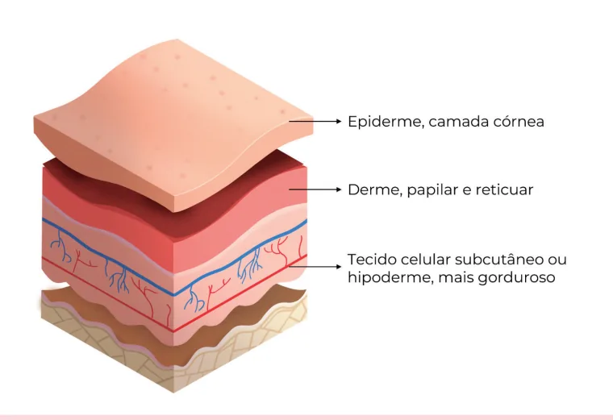

---

<!-- page:2 -->

## Lesões Dermatológicas

**Erosão**

- Manifesta-se pela perda parcial ou total da epiderme;
- Logo, a derme se mantém intacta.

**Fissura**

- Dá-se pela perda linear e fina da epiderme, usualmente superficial;
- Contudo, pode ser profunda, com capacidade para formar uma úlcera linear.

**Escoriação**

- É uma solução de continuidade do epitélio, secundária a coçadura ou atrito, usualmente superficial.

**Crosta**

- Exsudato ressecado de origem serosa, hemática ou purulenta.

**Úlcera**

- É a perda de toda a espessura epitelial (epiderme, derme e eventualmente hipoderme);
- Em geral, é secundária à destruição, necrose ou inflamação.

## Úlceras Infecciosas

### Herpes Genital

- Agente etiológico: HSV tipos 1 e 2; família *Herpesviridae*; é um vírus de DNA;
  - Também fazem parte desta família: CMV (citomegalovírus); vírus da varicela-zóster; vírus Epstein-Barr; vírus do herpes humano.
- Predomínio:
  - Tipo 1: lesões periorais;
  - Tipo 2: lesões genitais.

**Transmissão**

- Contágio: contato íntimo com o vírus, a partir da superfície mucosa ou de lesão infectante;
- Período de incubação: 3-30 dias;
- Replicação do HSV local em células da epiderme e derme = necrose e ulceração;
- Migração para gânglios nervosos sensitivos = latência.
  - HSV 2 = raízes dorsossacrais;
  - HSV 1 = nervo trigêmeo.

**Quadro clínico**

- Primoinfecção: sintomas sistêmicos (febre);
- Edema, ardor, prurido;
- Pápulas eritematosas, vesículas;
- Úlceras e crostas;
- Adenopatia inguinal dolorosa, bilateral.
- Verificar Figura 2.

**Diagnóstico**

- Clínico;
- Laboratorial: PCR do material da lesão; cultura da secreção (raramente utilizada; não demonstra boa sensibilidade); citologia (célula de Tzanck — apresenta baixa sensibilidade).
- Verificar Figura 3.

*Figura 2: Lesões herpéticas em região genital.*

*Figura 3: Célula de Tzanck.*

> ⚠️ Tabela reconstruída a partir de OCR — confira contra a fonte original.

**Tabela 1: Tratamento da herpes genital**

| Situação | Esquema |
|---|---|
| Primoinfecção | Aciclovir 400 mg, VO, de 8/8h, por 7-10 dias OU 200 mg, VO, 5x/dia, por 7-10 dias |
| Recorrência | Aciclovir 400 mg, VO, de 8/8h, por 5 dias OU 800 mg, VO, de 12/12h, por 5 dias |
| Supressão | Aciclovir 400 mg, VO, de 12/12h, por até 6 meses; o esquema pode se estender por até 2 anos |

**Situações especiais**

**Gestantes**

- Na presença de lesões ativas no momento do parto, em quadro de primoinfecção no 3º trimestre ou com intervalo menor que 6 semanas entre as lesões e o momento do parto → cesárea;

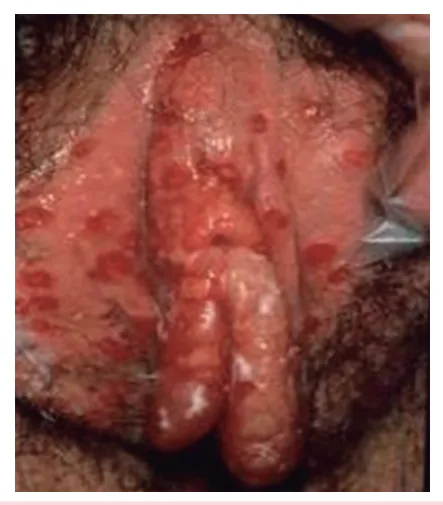

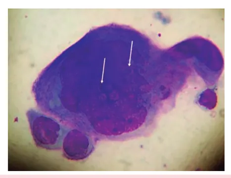

---

<!-- page:3 -->

- Se parto vaginal inevitável ou bolsa rota por período prolongado: aciclovir EV (mãe e considerar uso no recém-nascido);
- Infecção primária ou recorrente: tratamento com aciclovir (mesmo regime);
- Supressão: esquema — 400 mg, 3x/dia, a partir de 36 semanas até o início do trabalho de parto;
  - Quando? Indicada para todas as gestantes que apresentaram qualquer tipo de episódio de herpes genital, em qualquer momento da gestação. Esse esquema reduz tanto a eliminação genital de HSV quanto episódios recorrentes no momento do trabalho de parto, diminuindo, assim, a indicação de cesarianas.

**Imunossuprimidos**

- Aciclovir 5-10 mg/kg de peso, IV, de 8/8h (5 a 7 dias) ou até resolução clínica; usuários crônicos de corticoide, usuários de imunomoduladores, transplantados de órgãos sólidos, PVHIV.

**Outras medidas**

- Tratamento local: compressas com solução fisiológica ou degermante em solução aquosa, para higienização das lesões;
- Analgésicos orais;
- Não há associação entre herpes genital e câncer.

### Sífilis

- Agente etiológico: *Treponema pallidum*;
- Manifesta-se a partir do surgimento do cancro duro: úlcera única, indolor, com bordos endurecidos, não purulenta (fundo limpo);
- Tende a desaparecer nos 30 dias iniciais.
- Verificar Figuras 4 e 5.

*Figura 4: História natural da sífilis — adenopatia, cancro duro, sorologias positivas e lesões secundárias ao longo do tempo (0d, 30d, 90d, 6m, 12m).*

*Figura 5: Cancro duro.*

> ⚠️ Tabela reconstruída a partir de OCR — confira contra a fonte original.

**Tabela 2: Formas de manifestação da sífilis (estágios)**

| Estágio | Manifestações clínicas |
|---|---|
| Sífilis primária | Cancro duro (úlcera genital) e linfonodos regionais |
| Sífilis secundária | Lesões cutaneomucosas (roséola, placas mucosas, condiloma plano, alopecia em clareira, madarose), rouquidão, linfadenopatia generalizada |

**Sífilis recente**

- Abrange todas as manifestações que ocorrem dentro dos primeiros 12 meses, a partir do momento do contágio.
- Verificar Tabela 2.

**Condiloma plano**

- Manifestação da sífilis secundária;
- Nas dobras de mucosas, especialmente na área anogenital;
- Lesões úmidas e vegetantes;
- São frequentemente confundidas com as verrugas anogenitais causadas pelo HPV.
- Verificar Figura 6 na próxima página.

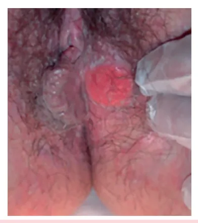

---

<!-- page:4 -->

### Cancro Mole

- Também denominado cancroide;
- Agente etiológico: *Haemophilus ducreyi* — cocobacilo.

*Figura 6: Condiloma plano.*

**Diagnóstico (sífilis)**

- Pesquisa do *T. pallidum*: técnica com material corado; campo escuro;
- Sorologia treponêmica: FTA-Abs, teste rápido;
- Sorologia não treponêmica: VDRL e RPR;
- VDRL ≥ 1/8.

**OBS.**: bactérias espiraladas não são visualizadas pela coloração de Gram.

**OBS.**: para gestantes, em caso de alergia a penicilinas, procede-se com dessensibilização.

**ATENÇÃO**: para gestantes, espera-se uma queda da titulação da sorologia não treponêmica, de 2 diluições, em até 3 meses (ex.: 1:64 → 1:16), ou 4 diluições em 6 meses (ex.: 1:64 → 1:4).

**Cancro mole**

- Agente etiológico: *Haemophilus ducreyi* — cocobacilo gram-negativo;
- Período de incubação: 2-5 dias (até 2 semanas).

*Figura 7: Cancro mole.*

**Quadro clínico**

- Lesões dolorosas e múltiplas;
- Bordos irregulares e eritematosos;
- Demonstra "fundo sujo": exsudato necrótico e fétido;
- **Bubão**: adenopatia unilateral, supurativa, orifício único.

*Figura 8: Lesões sugestivas de cancro mole.*

**Diagnóstico**

- Avaliação clínica;
- Exame bacterioscópico (Gram): aspecto enfileirado de bacilos gram-negativos;
- PCR.

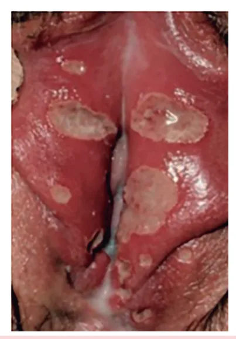

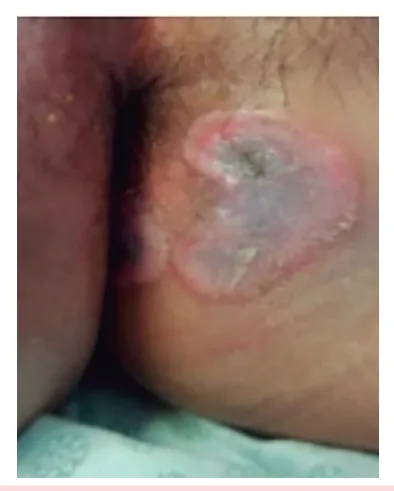

---

<!-- page:5 -->

**Tratamento**

- Ministério da Saúde:
  - Esquema de 1ª opção: azitromicina, 1 g, via oral, dose única;
  - Alternativa: ceftriaxona 250 mg, IM, dose única OU ciprofloxacino 500 mg, VO, de 12/12h, por 3 dias.
- **OBS.**: o uso de azitromicina e ceftriaxona é aprovado em gestantes. Contudo, o uso de ciprofloxacino deve ser evitado em gestantes.

**ATENÇÃO**: o tratamento sistêmico deve ser acompanhado de medidas locais de higiene. O tratamento das parcerias sexuais é recomendado, mesmo quando essas forem assintomáticas.

Adenopatia unilateral, fístula em múltiplos orifícios → "bico de regador".

## Linfogranuloma Venéreo

- Outras nomenclaturas: doença de Nicolas-Favre; doença de Frei; linfadenopatia venérea.

**Agente etiológico**

- *Chlamydia trachomatis*;
- Sorotipos: L1, L2 e L3;
- Período de incubação: 3-30 dias.

**Quadro clínico**

- Fase primária: vesícula ou pápula que evolui para úlcera indolor (colo do útero, vulva, vagina);
- Fase secundária: acometimento ganglionar (2 a 6 semanas após a resolução da lesão inicial).

*Figura 9: Linfogranuloma venéreo.*

*Figura 10: Acometimento ganglionar no linfogranuloma venéreo.*

**Diagnóstico**

- Avaliação clínica;
- Exames laboratoriais: PCR do aspirado linfonodal; cultura; imunofluorescência direta.

**ATENÇÃO!** O linfogranuloma venéreo é uma IST crônica. De tal modo, pode evoluir com sequelas, como estenose retal e elefantíase genital.

**Tratamento**

- Ministério da Saúde: doxiciclina 100 mg, VO, de 12/12h, por 21 dias OU azitromicina 1 g, VO, 1x/semana, por 3 semanas (é o esquema preferencial para gestantes).
- Outras considerações: as parcerias sexuais devem ser tratadas:
  - Sintomáticas: igual ao caso índice;
  - Assintomáticas: azitromicina 1 g, VO, em dose única, ou doxiciclina 100 mg, VO, de 12/12h, por 7 dias.

**OBS.**: os bubões que se tornarem flutuantes não devem ser incisados cirurgicamente, pelo risco de formação de fístulas. A conduta ideal é a aspiração do conteúdo com agulha grossa.

## Donovanose

- Infecção sexualmente transmissível (IST) crônica;
- Agente etiológico: *Klebsiella granulomatis*;
- Cocobacilo gram-negativo;
- Incubação: 3 dias a 6 meses;
- Também chamada de granuloma inguinal ou úlcera serpiginosa.

*Figura 11: Lesão sugestiva de Donovanose.*

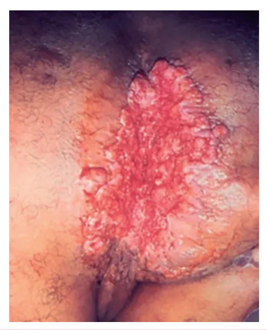

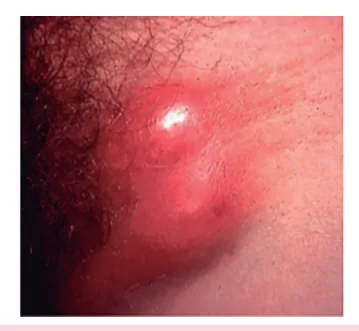

---

<!-- page:6 -->

## Úlceras Genitais Não Infecciosas

### Donovanose (continuação)

**Quadro clínico**

- Úlceras de bordas planas ou hipertróficas, bem delimitadas, friáveis, indolores;
- Evolução progressiva para lesão vegetante;
- Lesões múltiplas "em espelho";
- Pseudobubões.

**Diagnóstico**

- Citologia;
- Biópsia;
- PCR.

*Figura 12: Corpúsculo de Donovan.*

**Tratamento (Ministério da Saúde)**

- Preferencial: azitromicina, 1 g, VO, 1x/semana, por 3 semanas, ou até a cicatrização das lesões;
- Alternativa: doxiciclina 100 mg, VO, de 12/12h, por pelo menos 21 dias ou até o desaparecimento completo das lesões; OU ciprofloxacino 500 mg, 1 comprimido e meio, VO, de 12/12h, por pelo menos 21 dias, ou até a cicatrização das lesões; OU sulfametoxazol-trimetoprima (400/80 mg), 2 comprimidos, VO, de 12/12h, por, no mínimo, 21 dias ou até a cicatrização das lesões.
- **OBS.**: em virtude da baixa infectividade, não é necessário tratar as parcerias sexuais.

**Outras recomendações de tratamento**

- Não havendo resposta nos primeiros dias do tratamento com ciprofloxacino: adicionar um aminoglicosídeo, como a gentamicina (1 mg/kg/dia, EV, 3x/dia, por pelo menos 3 semanas, ou até a cicatrização das lesões);
- Para pessoas vivendo com HIV: seguir os mesmos esquemas terapêuticos.

**Critério de cura**

- Desaparecimento da lesão;
- As sequelas da destruição tecidual ou obstrução linfática podem exigir correção cirúrgica.

### Úlcera de Lipschutz

- Decorre de uma vasculite local.

**Quem é mais suscetível?**

- Crianças e adolescentes — imunocompetentes e sexualmente inativas;
- Nos indivíduos sexualmente ativos, deve-se excluir IST concomitante.

**Quando?**

- Após instalação de quadro viral (síndrome *flu-like*) e/ou bacteriano sistêmico (principalmente em quadros com acometimento de vias aéreas superiores).

**Como?**

- Decorre de manifestações reativas dos processos infecciosos extravulvares;
- Instalação abrupta;
- Manifesta-se através de úlceras genitais intensamente dolorosas, associadas a febre e linfadenopatia;
- Podem ser observadas crostas necróticas sob a lesão.

*Figura 13: Úlcera de Lipschutz.*

**Tratamento**

- Sintomáticos;
- A lesão demonstra cicatrização espontânea em cerca de 4-6 semanas.

## Doença de Behçet

- Caracteriza-se por um distúrbio inflamatório autoimune;
- Acomete adultos jovens, entre 20-35 anos;
- Apresenta predisposição para pequenos vasos sanguíneos;
- Biópsia: vasculite, infiltrado por neutrófilos e linfócitos T e B;
- Úlceras aftosas dolorosas;
- Úlceras genitais dolorosas, > 1 cm, com cicatrizes.

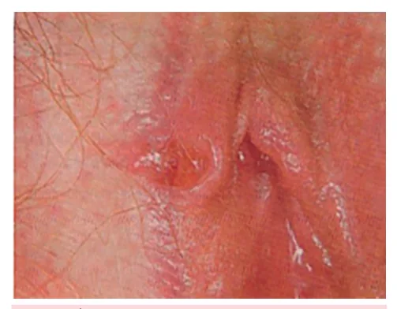

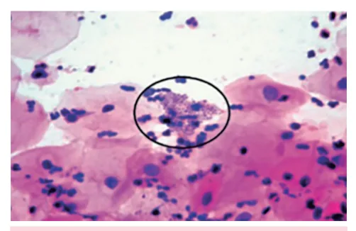

---

<!-- page:7 -->

*Figura 14: Úlceras orais e genitais causadas pela doença de Behçet.*

## Doença de Crohn

- Doença inflamatória crônica transmural e segmentar;
- Faixa etária — distribuição bimodal: 1º pico: 20 a 30 anos; 2º pico: 60 a 80 anos;
- Acomete todo o trato gastrointestinal (boca ao ânus);
- Acometimento vulvar e perineal é pouco frequente;
- Diagnóstico: biópsia!
- Tratamento: gastroenterologia.

*Figura 15: Úlcera em facada.*

## Referências

Figura 2: Lesões herpéticas em região genital. PARRA-SÁNCHEZ, Manuel. Genital ulcers caused by herpes simplex virus. 2019. Molecular Diagnostics Department, Vircell Microbiologists, Parque Tecnológico de la Salud, Granada, Spain. DOI 10.1016/j.eimce.2019.01.001.

Figura 3: Célula de Tzanck. DURDU, M.; BABA, M.; SEÇKİN, D. The value of Tzanck smear test in diagnosis of erosive, vesicular, bullous, and pustular skin lesions. Journal of the American Academy of Dermatology, v. 59, n. 6, p. 958–964, 2008. DOI: 10.1016/j.jaad.2008.07.059.

Figura 5: Cancro duro. EMJ. Título do artigo. 2021. DOI: 10.33590/emj/20-00221. Disponível em: https://doi.org/10.33590/emj/20-00221.

Figura 6: Condiloma plano. DE SICA, A. C. A. R. et al. Secondary syphilis of the vulva: the great imitator. American Journal of Obstetrics and Gynecology, v. XX, n. XX, p. XX, nov. 2022. DOI: https://doi.org/10.1016/j.ajog.2022.10.042.

Figura 7: Cancro mole. STAMFORD SKIN CENTRE. Úlcera genital – cancroide. Stamford Skin Centre, [s.d.]. Disponível em: https://www.stamfordskin.com/.

Figura 8: Lesões sugestivas de cancro mole. BEST PRACTICE. Sífilis – resumo | BMJ Best Practice. BMJ Publishing Group, [s.d.]. Disponível em: https://bestpractice.bmj.com/.

Figura 9: Linfogranuloma venéreo. STEWART, D. B. The Gynecological Lesions of Lymphogranuloma Venereum and Granuloma Inguinale. Medical Clinics of North America, v. 48, n. 3, p. 773–786, 1964. DOI: 10.1016/s0025-7125(16)33458-7.

Figura 10: Acometimento ganglionar no linfogranuloma venéreo. HUBPAGES. Linfogranuloma Venéreo: Relevância para a Saúde, Apresentações Clínicas, Diagnóstico e Tratamento. Disponível em: https://www.hubpages.com.

Figura 11: Lesão sugestiva de Donovanose. WOMEN'S HEALTH SECTION. Saúde da Mulher: [Benign Vulvar Skin Disorders: part 2]. Disponível em: http://www.womenshealthsection.com/content/gyn/gyn038.php3.

Figura 12: Corpúsculo de Donovan. WOMEN'S HEALTH SECTION. Saúde da Mulher: [Benign Vulvar Skin Disorders: part 2]. Disponível em: http://www.womenshealthsection.com/content/gyn/gyn038.php3.

Figura 13: Úlcera de Lipschutz. WOMEN'S HEALTH SECTION. Saúde da Mulher: [Benign Vulvar Skin Disorders: part 2]. Disponível em: http://www.womenshealthsection.com/content/gyn/gyn038.php3.

Figura 14: Úlceras orais e genitais causadas pela doença de Behçet. WOMEN'S HEALTH SECTION. Saúde da Mulher: [Benign Vulvar Skin Disorders: part 2]. Disponível em: http://www.womenshealthsection.com/content/gyn/gyn038.php3.

Figura 15: Úlcera em facada. WOMEN'S HEALTH SECTION. Saúde da Mulher: [Benign Vulvar Skin Disorders: part 2]. Disponível em: http://www.womenshealthsection.com/content/gyn/gyn038.php3.

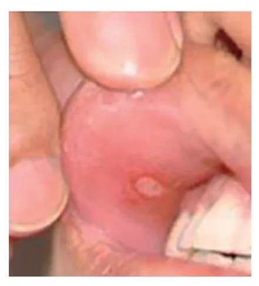

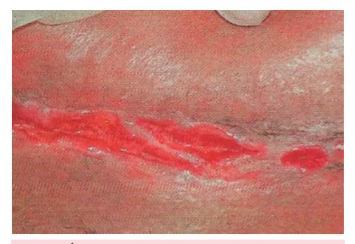
