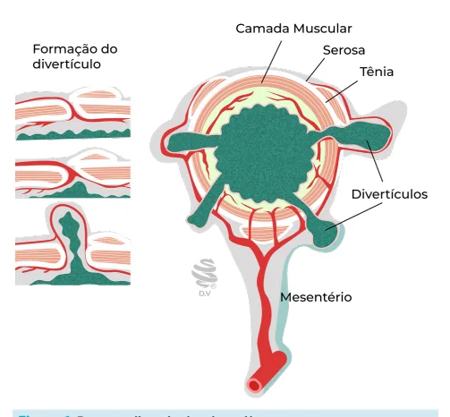

# Urgências Endoscópicas HDB

<!-- page:1 -->

Endoscopia; Hemorragia digestiva

- HDB maciça: trata como HDA (monitorização, estabilização, EDA, arteriografia, cirurgia)

- HDB não maciça: EDA!! Se negativa, preparo de cólon e colonoscopia em 24h

## EPIDEMIOLOGIA

## CONSIDERAÇÕES GERAIS

- 80%-93% dos casos cessam espontaneamente;

- Demonstra baixa mortalidade: aproximadamente 3%;

- Indicadores de gravidade; Instabilidade hemodinâmica; Uso de anticoagulantes; Necessidade de transfusão; Ressangramento no intervalo de 24 horas.

## ETIOLOGIA

- De acordo com idade. Doença diverticular – 30%-65% Colite isquêmica e doença orificial – 5%-20% Angiodisplasia – mais frequente em jovens; Pós-polipectomia; Neoplasia/DII.

## CLÍNICA

Manifestações Clínicas

- Exteriorização (enterorragia, hematoquezia); Enterorragia: sangramento com características diarreicas, de modo explosivo, precedido de cólicas, de coloração vermelho-vivo em geral; Hematoquezia: sangramento associado/ entremeado às fezes, seja de coloração vermelhovivo ou com algum coágulo residual.

Exames laboratoriais

- Anemia hipocrômica/microcítica.

História

- Comorbidades;

- Colonoscopia recente; uso de medicações (AINEs).

## MANEJO INICIAL

- Dá-se da mesma forma como a HDA: acesso venoso, monitorização, estabilidade;

- Exame físico: toque retal!!!

- Anuscopia – útil para diagnóstico diferencial com doenças orificiais.

## ABORDAGEM INICIAL

Endoscopia digestiva alta;

- Primeiro exame;

- Útil para descartar sangramento de origem alta;

- 10%-15% das hematoquezias têm origem alta; | COLONO positiva? Trata segundo etiologia COLONO negativa? Cintilo, arterio, angioTC TUDO NEGATIVO? Investiga como HDM

(enteroscopia é terapêutica) Colonoscopia;

- A grande vantagem é que a colonoscopia pode ser diagnóstica e terapêutica;

- Necessita de estabilidade hemodinâmica;

- Preparo de cólon é necessário; De preferência com manitol e PEG; Lembre-se do efeito catártico do sangue;

- A sedação pode piorar a estabilidade;

- Viabiliza tatuagem para posterior abordagem cirúrgica;

- Não precisa de sangramento ativo: basta coágulos e coto vascular visível;

- Caso não seja visualizado o foco de sangramento: Repetir o exame em 24-48 horas; Caso haja ressangramento, outra opção é fazer angioTC ou cintilografia.

- Contraindicações: Suspeita de perfuração; Instabilidade hemodinâmica; Colite grave – risco de perfuração ou de translocação bacteriana.

Outras medidas

- Transfusão antes do exame endoscópico se: RNI > 2,5; Plaquetas < 50.000/mm³;

, | Hb < 5 g/dL.

- Sonda nasogástrica para descartar sangramento alto

(discutível e pouco utilizado);

## ALTERNATIVAS DIAGNÓSTICAS

Cintilografia com 99Tc

- Sangramento não identificado na colonoscopia;

- Identifica sangramento do fluxo > 0,1 mL/min; No entanto, exige sangramento ativo.

- Não é preciso quanto ao sítio do sangramento indica apenas a topografia do abdome que está sendo afetada;

- Pode ser repetido! (ao longo de 24 horas).

ANGIOTC;

- Identifica sangramentos de 0,3 – 0,5 mL/min;

- Exige estabilidade hemodinâmica

- É um exame mais disponível;

- Avalia o abdome como um todo;

- Deve ser feito com uso de contraste;

- Não é terapêutica.

---

<!-- page:2 -->

## ARTERIOGRAFIA LESÕES VASCULARES

- Indicado em pacientes com instabilidade hemodinâmica; DIEULAFOY:

- Identifica sangramento com fluxo entre

- PODE ACONTECER EM QUALQUER LUGAR DO TRATO

0,5 – 1,0 mL/min; DIGESTIVO (HDA; HDB); 0,5 – 1,0 mL/min;

- Exige sangramento ativo;

- Pode ser terapêutica, com auxílio da embolização! Atenção para a possibilidade de isquemia!

## DOENÇA DIVERTICULAR DOS

## CÓLONS

- É a principal causa em adulto, de HDB;

- A maioria dos casos apresenta cessação espontânea do sangramento (> 70% dos casos);

- O sangramento é arterial!

- O divertículo ocorre no local onde o vaso arterial penetra na camada muscular da parede. Em tais A áreas de fragilidade, há uma área de protrusão, com a consequente formação dos divertículos do cólon.

- C

- Figura 1: Doença diverticular dos cólons.

- Cólon esquerdo: Local com maiores taxas de ocorrência de doença diverticular e mais diverticulite;

- Cólon direito: sangra mais!

- Após cada episódio de sangramento, o risco de sangramento aumenta. I

- Tratamento: necessita de preparo para a colonoscopia; Clipe: vaso sangrando; Ligadura elástica é viável (gastroscópio); Injeção de adrenalina – atenção para a possibilidade de necrose e perfuração; Métodos térmicos; Q Tatuar o local de sangramento para posterior abordagem cirúrgica, caso seja necessário.

- DIGESTIVO (HDA; HDB);

- NORMALIDADE: vasos vão se afilando ao passar pela parede do trato digestivo, de fora para dentro,

- Alguns vasos de forma anômala não se afilam ao passar pela muscular, alcançando a mucosa com um calibre de até 3mm e percorre a mucosa tortuosamente.

- PATOLOGICAMENTE O VASO É NORMAL (não é uma causa aneurismática)

- Previamente assintomático, não necessita injúria da mucosa!

- Tratamento: em geral terapia térmica; também pode ser usado clipe ou ligadura elástica.

## ANGIECTASIAS

- Malformações vasculares degenerativas;

- Demonstra relação com: Idade; DRC; Algumas síndromes genéticas (Síndrome de Heyde,

Osler-Weber- Rendu).

- São mais comuns no cólon proximal (ceco e cólon ascendente) e delgado.

## CLASSIFICAÇÃO: PARA ANGIECTASIAS E

## TELANGIECTASIAS (YANO YAMAMOTO)

- Venoso: tratamento com métodos térmicos (argônio); 1a: eritema pontilhado (sangramento < 1 mm), com ou sem babação; 1b: sangramento com alguns milímetros, com ou sem babação.

- Arterial: tratamento com métodos mecânicos (clipe); 2a: lesões pontilhadas (< 1 mm) com sangramento pulsátil; 2b: protrusão pulsátil, sem dilatação venosa ao redor.

- Misto: clipe, combinar métodos; 3: protrusão pulsátil, com dilatação venosa ao redor.

- Tipo 4: outras lesões não classificadas em nenhuma das categorias listadas acima.

## COLOPATIA ISQUÊMICA

Informações Importantes

- É mais prevalente em idosos, com alguma comorbidade cardiovascular;

- Algum fator precipita a descompensação; Diarreia; Sangramento (em outro sítio).

Quadro clínico

- É crônico;

- Será comentado durante as aulas de cirurgia vascular!

---

<!-- page:3 -->

## OUTRAS COMORBIDADES

Diagnóstico

- A colonoscopia tem função mais diagnóstica do que terapêutica; NEOPLASIA

- A lesão demonstra local bem delimitado;

- A colonoscopia é fundamental para o diagnóstico;

- Edema e, eventualmente, ulceração;

- Tratamento clínico ou endoscópico?

- Pontos críticos de vascularização → Griffith e Sudeck; | Nos casos de tumores friáveis, não há nada Griffith: ocorre no ângulo esplênico, na separação endoscópico a se fazer.

entre a vascularização da artéria mesentérica

- Realizar biópsia ou não? SIM! superior e inferior; Sudeck: ocorre no sigmóide, na separação entre DOENÇA INFLAMATÓRIA INTESTINAL os territórios da artéria mesentérica inferior e da

- Retocolite ulcerativa e doença de Crohn;

artéria retal superior.

- O tratamento principal é controlar a doença de base;

- A DII é um diagnóstico diferencial.

- Tratamento endoscópico;

Tratamento | Focal ou difuso? Em caso de doença difusa, não

- Compensação clínica: choque, hipotensão, existem muitas opções a partir da colonoscopia.

causas cardiovasculares (?);

- Antibioticoterapia de amplo espectro; DOENÇAS ORIFICIAIS Atenção à translocação bacteriana pela

- Doença hemorroidária pode vir a ocasionar fragilidade mucosa. HDB maciça;

- Manejar a causa-base: Revascularização (arteriografia

- Varizes de reto não se caracterizam como com angioplastia? cirurgia?). doença hemorroidária;

- Diagnóstico

## RETITE ACTÍNICA

| Toque retal; | Anuscopia;

- ATENÇÃO À HISTÓRIA PRÉVIA DE RADIOTERAPIA!!! | Colonoscopia: Entrada com retrovisão; Não é o

- Ocorre em homens e mulheres (próstata, colo exame padrão-ouro.

de útero).

- Tratamento endoscópico: ligadura elástica

- Endoarterite → isquemia → neovascularização (eficaz e seguro).

- Exige preparo adequado, o método de escolha é o argônio; SANGRAMENTO PÓS-POLIPECTOMIA

- Métodos alternativos:

- Polipectomia de rotina; Enema de sucralfato;

- Opções: clipe metálico, método térmico, injeção. Hemospray; Clipe (?); Formol.

- Anemia ou sangramento recorrente? Indicação de tratamento com argônio.
