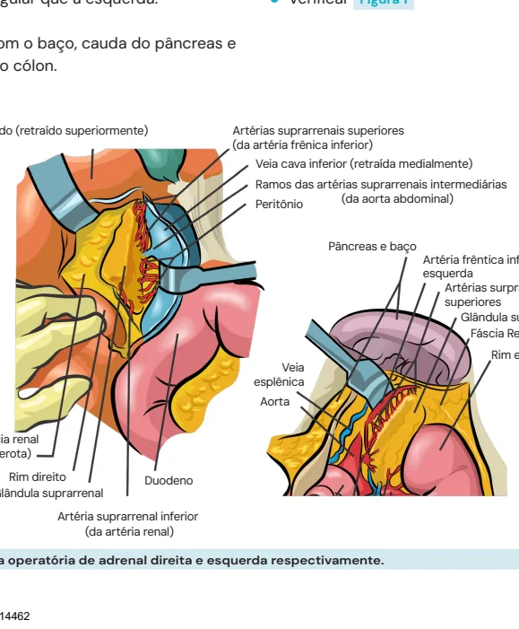
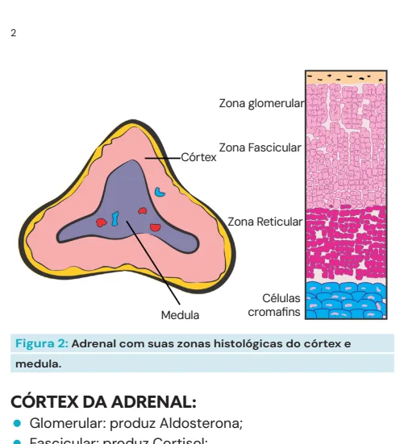
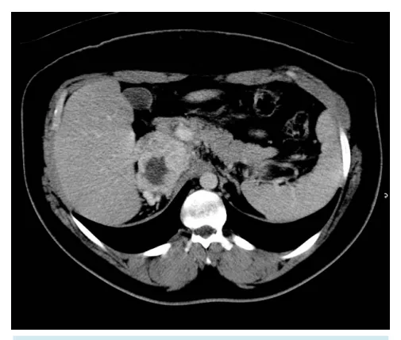
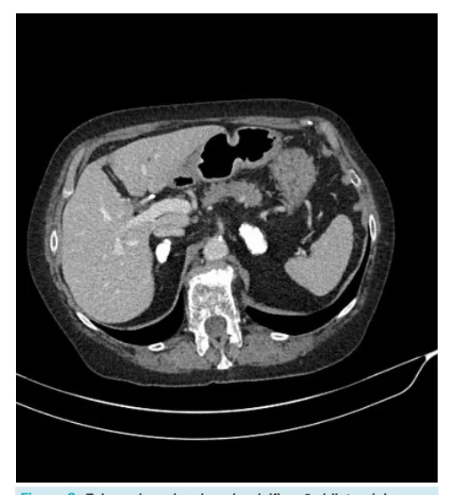
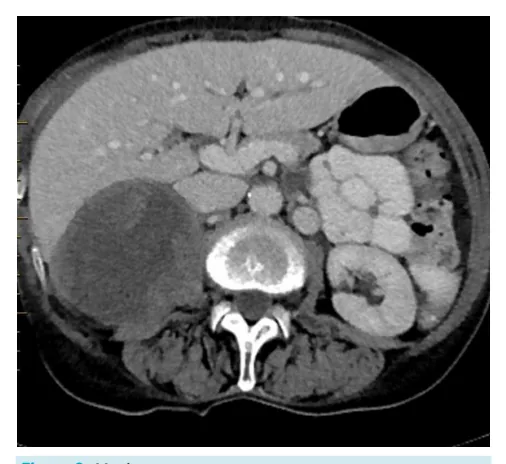
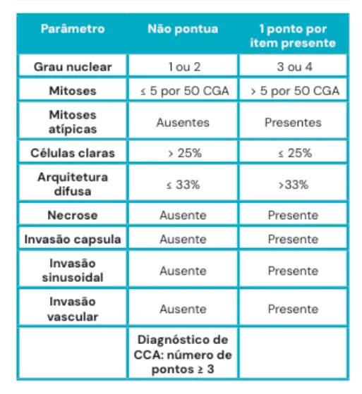

# Uro-oncologia Adrenal

<!-- page:1 -->

Uro-oncologia Lembre das ca Definição fasciculad Nódulos de Adre Epidemiologia 2-5% s Sintomas secund Sintomas e sinais Ex. complementares TC Diagnóstico Fe Metástase, TB adr Diferenciais Tratamento A Carcinoma de Seguimento

## PECULIARIDADES DA ANATOMIA

DAS ADRENAIS:

- Adrenal direita: Relação próxima com órgãos vitais: fígado, duodeno e veia cava; Mais baixa que a esquerda; Formato mais triangular que a esquerda.

- Adrenal esquerda: Relação próxima com o baço, cauda do pâncreas e flexura esplênica do cólon.

Fígado (retraído superiormente) Ar (d Fáscia renal (Gerota) Rim direito Duodeno Glândula suprarrenal Artéria suprarrenal inferior (da artéria renal)

Figura 1: Exposição intra operatória de adrenal direita e esque amadas da adrenal e produção: Glomerulosa (Mineralo) , da (glico), reticulada (Andrógenos) e medula (NOR)

enal: 5% da população, desses, 10-15% são funcionantes e são malignos. Prevalência aumenta com a idade.

dários a produção de hormônios adrenais: HAS secundária, hipercortisolismo, hiperandrogenismo. com Sinais do mal: > 4 cm, irregular, > 10UH Cortisol - supressão com dexa Aldosterona - Aldo/APR > 20 eo – metanefrinas urinárias ou plasmáticas renal, Carcinoma Adrenocortical, Adenomas Funcionantes e não funcionantes Adrenalectomia se > 4 cm ou funcionante e adrenal se Weiss > ou = 3. Mitotano pode ser usado.

Preferência a cirurgia aberta.

## VASCULARIZAÇÃO

- Tanto adrenal direita quanto esquerda apresentam veia única: Direita: drenagem para a veia cava; Esquerda: drenagem para a veia renal esquerda.

- Irrigação arterial: Segmentos das artérias frênica, aorta e renal.

- Verificar Figura 1 rtérias suprarrenais superiores da artéria frênica inferior)

Veia cava inferior (retraída medialmente) Ramos das artérias suprarrenais intermediárias (da aorta abdominal)

Peritônio Pâncreas e baço Artéria frêntica inferior esquerda Artérias surprarrenais superiores Glândula suprarrenal Fáscia Renal (gerota)

Rim esquerdo Veia esplênica Aorta erda respectivamente.

---

<!-- page:2 -->

## SINAIS E SINTOMAS

Zona glomerular Tabela 2: Hormônios produzidos pelo córtex da adrenal e seus Zona Fascicular respectivos sintomas em caso de tumores funcionantes.

Córtex Córtex Zona Reticular Células Medula cromafins Figura 2: Adrenal com suas zonas histológicas do córtex e medula.

## CÓRTEX DA ADRENAL

- Glomerular: produz Aldosterona;

- Fascicular: produz Cortisol;

- Reticular: produz Testosterona.

Tabela 1: Zonas histológicas da adrenal e respectivas produções hormonais

## MEDULA (NO RECHEIO)

- Células cromafins, produtoras de

Catecolaminas (NORadrenalina).

## EPIDEMIOLOGIA - NÓDULOS

- Maior incidência com a idade, com média de 5% na população geral;

- 10-15% são funcionantes;

- 2-5% são malignos.

Figura 3: Incidência de nódulos adrenais encontrados na TC por faixa etária. EXAMES COMPLEMENTARES

## TC COM CONTRASTE É O PRINCIPAL EXAME

Figura 4: Nódulo homogêneo com bordas regulares: padrão benigno. Figura 5:: Massa na adrenal direita, irregular, limites imprecisos, centro necrótico, heterogêneo: padrão maligno.

- Ao avaliar o exame de imagem, observar: Tamanho → lesão > 4 cm sugestivo de malignidade; Bordas → irregularidade sugere malignidade; Densidade → > 10 unidades Hounsfield, indica irrigação anômala; Washout → se lento, também sugere hipervascularização, caraterística sugestiva de malignidade.

---

<!-- page:3 -->

Tabela 3:: Diferenciação radiográfica de nódulos benignos e malignos na tomografia

## DIAGNÓSTICO

CORTISOL:

- Teste de supressão de cortisol com dexametasona;

- Paciente ingere 1 mg de Dexa às 23h e Coleta cortisol às 08h: Resultado normal: cortisol suprimido.

## ALDOSTERONA

- Hipocalemia;

- Sugestivo de aldosteronoma: relação Aldosterona /

Atividade Plasmática de Renina > 20;

- Testes confirmatórios: Sobrecarga oral de Na; Supressão com fludrocortisona.

## FEOCROMOCITOMA

- Produz noradrenalina e adrenalina;

- 10% bilateral, 10% extra-adrenal, 10% maligno;

- Preparo pré-op com alfa-bloqueador: Betabloqueador pode ser associado, se necessário, após 3-5 dias.

- Aferir Catecolaminas séricas e metanefrinas urinárias;

- MIBG (exame de cintilografia).

DIAGNÓSTICOS DIFERENCIAIS: Figura 6:: Metástase Figura 7: Cisto de Adrenal: possibilidade de ação compressiva traduz necessidade de intervenção.

Figura 8:: Tuberculose de adrenal: calcificação bilateral das adrenais é mais sugestivo.

## TRATAMENTO

- Adrenalectomia: VLP sempre que possível; Indicações: funcionantes; > 4 cm; outros sinais de malignidade. Caso contrário = Acompanhar

- Seguimento: Se carcinoma de adrenal: aplicar Escore de Weiss:

≥ 3 pontos indica carcinoma.

---

<!-- page:4 -->

ESCORE DE WEISS REFERÊNCIAS Tabela 4: Escore de Weiss Figura 1, 2 e 3: Ilustrações Acervo Medcof. Figura 4: Adrenal com nódulo.

Fonte:https://www.researchgate.net/figure/33-year-old-man-withadrenaladenoma-A-Transverse-unenhanced-CT-image-shows_fig2_44590897 Figura 5: Massa na adrenal direita.

Fonte: https://radiopaedia.org/articles/adrenal-adenoma?lang=us Figura 6: Metástase. Fonte: https://radiopaedia.org/articles/adrenal-metastasis-1 Figura 7: Cisto de Adrenal.

Fonte: https://radiopaedia.org/articles/adrenal-cyst?lang=us Figura 8: Tuberculose de adrenal. Fonte: https://radiopaedia.org/articles/adrenal-tuberculosis?lang=uS

