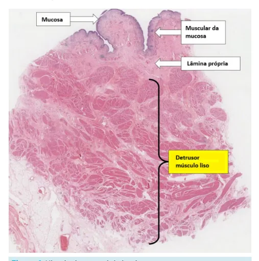
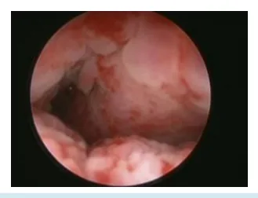
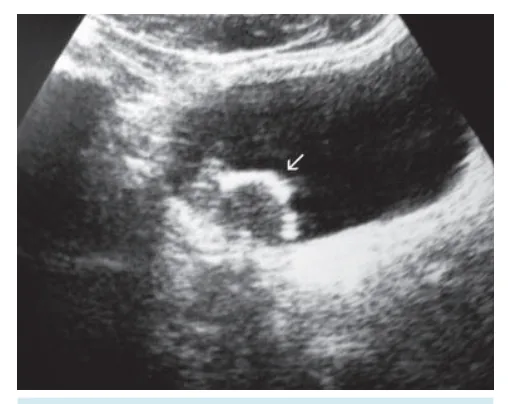
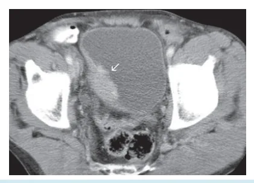
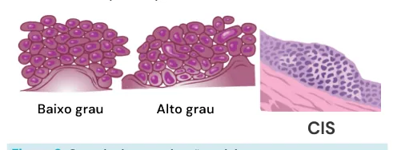
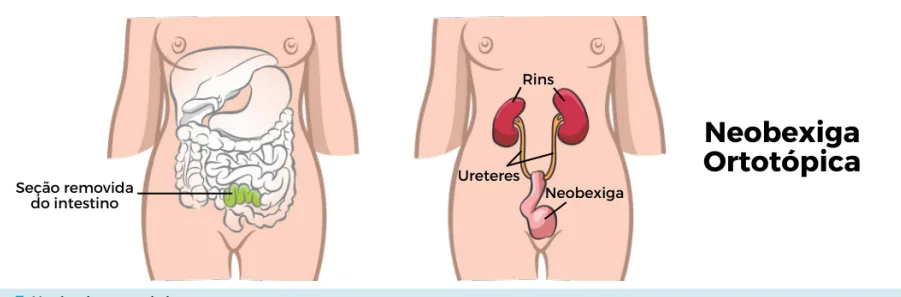
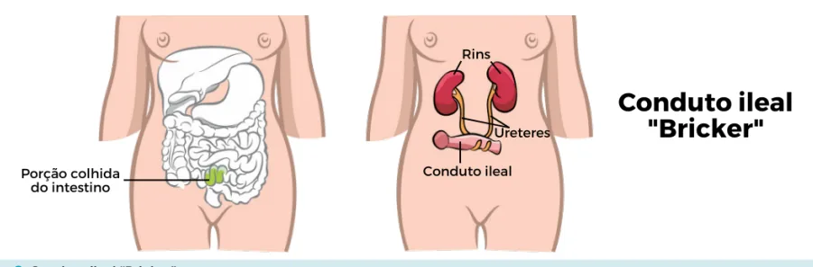

# Uro-oncologia Bexiga

<!-- page:1 -->

Uro-oncologia Neoplasia

## Definição

d Epidemiologia Tabagismo, Sintomas e sinais Hematúria Ex complementares US Importante defini Diagnóstico fundamental com representaç T2 Lembrar Indicações de Re-RTU: T1, G3 o Risco Baixo: Tumor < 3cm, sem carc Risco intermediári Alto risco: Car Tratamento Múltiplas lesõ Invasivo de Muscular ( Cistectomia Radical com r Pode fazer Cistoscopias regula Seguimento risc

- Urotélio: Origem da grande maioria das neoplasias malignas de bexiga; É uma camada fina de epitélio pseudoestratificado que recobre toda a via coletora, indo desde a bexiga até a pelve renal, formando todo o ureter; Logo abaixo do epitélio, tem o tecido conectivo da bexiga e a camada muscular.

Figura 1: Histologia normal da bexiga. do Urotélio, epitélio transicional desde pelve até bexiga exposição a aminas, radioterapia a (Macro = UroTC + cistoscopia)

SG, UROTC (padrão ouro) ir se é músculo invasivo ou não. A RTU é ção da muscular. Isso muda totalmente o tratamento.

2 = cistectomia radical! ou >3 cm ou muscular não encontrada (exceto TaG1) res solitários ,Ta (papilíferos) , Baixo grau, cinoma in Situ - Seguimento sem BCG io: nem alto, nem baixo risco - BCG 1 ano rcinoma in situ, Alto grau, T1/TaG2G3, ões >3cm , Variantes - BCG 3 anos (T2), disseminado ou agressivo localmente:

reconstrução (Neobexiga ortotópica ou Bricker). r neoadjuvância em bom status. ares, lembrar de BCG em moderado e alto co no tumor não invasivo.

- A invasão de tumores até o nível da camada muscular tratamento do doente;

(T2) traz repercussão tanto prognóstica como para o Figura 2: Câncer de bexiga - visão cistoscópica.

- Imagens bem típicas, quando se faz uma cistoscopia no paciente. Visualiza-se uma lesão papilífera típica de tumor urotelial, localizada bem próxima do meato ureteral direito, sugestiva de um tumor superficial (conclusão apenas após a ressecção e análise histopatológica);

Figura 3: Câncer de bexiga - visão cistoscópica.

---

<!-- page:2 -->

- Lesão com aspecto mais infiltrativo, com um diâmetro

- Cistoscopia:

longitudinal mais extenso, parecendo ser uma lesão | Visualizar a bexiga procurando lesões. mais endurecida, não tem aspecto piriforme típico, Urotomografia (UROTC):

sugere tumor de músculo invasivo;

- Exame de imagem padrão-ouro;

- Tumores de bexiga:

- TC com contraste intravenoso que possui três fases:

- Tumores de bexiga: 80% são superficiais; 20% são músculo-invasivo.

## EPIDEMIOLOGIA

- Fatores de risco:

- Tabagismo (principal fator de risco);

- Radioterapia pélvica: Pacientes que já fizeram algum tratamento para um outro tumor primário; Por exemplo: tumor de colo de útero com radioterapia ou braquiterapia na pelve, pode aumentar risco para neoplasia urotelial.

- Exposição às aminas aromáticas: Principalmente exposições ocupacionais com corantes, petroquímicas e borracha.

- Esquistossomose: Com a variante da região do Egito - não é típico desse platelminto no Brasil.

## SINAIS E SINTOMAS

- Hematúria:

- Sinal de alerta para tumor de bexiga para pacientes com fatores de risco;

- Definição: S >3 hemácias por campo de aumento.

- Outras causas urológicas podem também se apresentar com hematúria;

- Exemplos: Mulher em idade fértil com infecção do trato urinário; Ureterolitíase; Procedimentos endourológicos;

- O objetivo principal para esse sintoma é E excluir neoplasia.

- Hematúria macroscópica: 13% dos pacientes vão ter diagnóstico neoplásico; Podemos investigar com: citologia oncótica, cistoscopia e uroTC ou uroRM; além disso, excluir causas ginecológicas.

- Hematúria microscópica: 3% dos pacientes vão ter diagnóstico neoplásico; Tem que se atentar a dismorfismo eritrocitário, que pode indicar doenças glomerulares e a investigação toda será conduzida por um nefrologista; Não se faz citologia oncótica.

Investigação da hematúria:

- Anamnese e exame físico completos; Tentar achar fatores de risco para neoplasias e para diagnósticos diferenciais; Excluir causas de sangramentos ginecológicos.

Exames:

- Citologia oncótica: Tem sensibilidade capaz de detectar a presença de um tumor urotelial. - TC com contraste intravenoso que possui três fases: Fase arterial; Fase venosa; Fase excretora.

- Para pacientes com alergia ao contraste, a alternativa é a ressonância.

- Hematúria microscópica (estratificação e conduta);

Tabela 1: Classificação de risco. Baixo Intermediário Alto não fumante < 30 m.a > 30 m.a < 10 hem < 25 hem > 25 hem H < 40a H < 60a H > 60a M < 50a M < 60a M > 60a

- Risco baixo: repete análise de urina em 6 meses e considera USG + cistoscopia neste período caso o sintoma caso esteja incomodando/piorando para o paciente;

- Risco intermediário: USG + cistoscopia;

- Risco alto: UroTC + cistoscopia (investigação semelhante à hematúria macroscópica);

- Não se faz citologia oncótica.

Sintomas de LUTS:

- Disúria persistente;

- Polaciúria;

- Ureterohidronefrose: Ocorre quando o tumor está obstruindo as vias urinárias - no tumor de bexiga pode ocorrer obstrução do meato ureteral; Piora prognóstico.

Exames complementares

- USG: Exame auxiliar, pode ajudar; Pode exibir algumas vegetações;.

Figura 4: USG - CA bexiga.

---

<!-- page:3 -->

- UroTC:

- Re-RTU - indicações Padrão-ouro. | Tumor > 3 cm; Na imagem abaixo, observa-se uma fase | T1;

contrastada com o espessamento da | G3; bexiga, correspondente a uma vegetação de | Camada muscular não representada na bexiga, correspondente a uma vegetação de tumor urotelial.

Figura 5: TC - CA bexiga. DIAGNÓSTICO

- Confirmado com o anatomopatológico;

- Via: ressecção transuretral de bexiga (RTUb). Entra na bexiga com um ressectoscópio, com a alça de ressecção se usa a energia monopolar para ressecar a lesão no subeptelial: Ressecção ideal é ir além do subeptelial, ressecando parte da camada muscular, caracterizando a ressecção completa. Assim é possível avaliar se é ou não um tumor músculo invasivo; Analisar a bexiga como um todo (cistoscopia armada), buscar outras lesões, pois é tumor comumente multicêntrico.

Estadiamento:

- T bem detalhado: Ta: tumor que fica somente no urotélio, não é invasivo; T1: invade o tecido subepitelial; T2: tem a invasão da camada muscular; T3: pode chegar até os limites da bexiga; T4: invade estruturas adjacentes; Tis (ou CIS - carcinoma in situ): lesões com ampla extensão longitudinal, porém pouco profunda;

considerado de alto risco.

- Grau de desorganização celular: Baixo grau (G1): tem desorganização; Alto grau (G3): a desorganização é muito maior, com núcleos mais heterogêneos; CIS: tem progressão mais longitudinal e em extensão do que em profundidade, mas confere um alto risco para o paciente.

Figura 6: Grau de desorganização celular. | Camada muscular não representada na primeira ressecção:

- Tem que ser feito duas a seis semanas após a RTU prévia, para analisar se há tumor residual e avaliar se há invasão da camada muscular da bexiga;

- Realiza uma nova ressecção transuretral (RTU) no local da RTU prévia.

Tabela 2: Classificação de risco: Baixo risco Moderado risco Alto risco Tumores Carcinoma in situ solitários Não preenche Alto grau Ta (papilíferos)

critérios para T1/TaG2G3 Baixo grau baixo risco nem Múltiplas lesões < 3 cm para alto risco > 3 cm Sem carcinoma Variantes in situ CONDUTA LOGO APÓS A RESSECÇÃO:

Baixo risco:

- Dose única quimioterapia intravesical não obrigatória;

- Cistoscopia ambulatorial ou cirúrgica para analisar reincidência da lesão: Intervalo: inicialmente a cada 3 meses, a seguir anual e por fim a cada 5 anos.

Moderado risco:

- BCG por um ano;

- Cistoscopia ambulatorial ou cirúrgica para analisar alguma reincidência da lesão: Inicialmente a cada três meses; Depois a cada seis meses; Depois a cada um ano.

Alto risco: ;

- BCG por até três anos;

- Cistoscopia ambulatorial ou cirúrgica para analisar alguma reincidência da lesão: Inicialmente a cada três meses por dois anos: Alta taxa de recidiva. Depois a cada seis meses.

Muito alto risco:

- Tumores T1G3 e CIS + um fator de risco:

- Fatores de risco: > 70 anos; > 3 cm.

m | > 3 lesões;

- Mesmo que não seja um tumor muito invasivo, pode se discutir a cistectomia direta.

## TRATAMENTO

Cistectomia radical: Abordagem aberta x robótica:

- Nenhum estudo comprovou um benefício oncológico ainda de nenhuma das duas abordagens;

- Linfadenectomia pélvica estendida;

- No homem: cistoprostatectomia;

---

<!-- page:4 -->

- Na mulher: exenteração pélvica anterior. implantando os dois ureteres no fundo dessa alça.

- Casos que levam à cistectomia radical: A urina fica drenando para uma bolsinha na pele.

- Músculo invasivo (T2):

- Verificar Figura 8 Deve-se avaliar antes da cistectomia a realização

## DIAGNÓSTICOS DIFERENCIAIS

de quimioterapia neoadjuvante a partir de boa função renal.

- Superficial (Ta): CA urotelial alto: Muito alto risco;

- Se levantou-se essa suspeita no exame de imagem, G3 recidivante; sempre começar investigação com uma cistoscopia; Variantes histológicas. | Pode ter um tumor sincrônico na via urinária alta e

Reconstrução da via urinária do paciente: na bexiga; No caso do homem que retira a bexiga e a próstata,

- Depois da cistoscopia, progride para uretroscopia tem que se realizar a derivação urinária dos dois com biópsia;

ureteres livres.

- Se não tiver dúvida, pode fazer a biópsia incisional.

Neobexiga ortotópica:

- Nefroureterectomia com linfadenectomia e ressecção

- Confecção de uma nova bexiga a partir de um de cuff vesical (porção periureteral distal):

segmento de intestino delgado, no mesmo lugar da | Casos de câncer urotelial alto com acometimento bexiga original, onde se implantam os dois ureteres; da pelve renal;

- Requer uma condição social e clínica (função renal | Retira-se o rim com todo o ureter e um segmento preservada) para o paciente cuidar da reconstrução; da bexiga;

- Sendo uma derivação ortotópica e continente:

## SEGUIMENTO

| Em teoria apresenta algum grau de continência; | Não pode ser indicada em alguns pacientes, sobretudo por disfunção renal, uma vez que a

- Continuar com exames de cistoscopia regulares:

neobexiga é formada por um tecido de delgado que | Lesões de caráter recidivante: não é incomum para absorve parte da urina produzida. o paciente que está livre da doença por algum

- Verificar Figura 7 tempo, tem reincidência de novos tumores;

Conduto ileal “Bricker”: | Geralmente o urotélio foi exposto a alta carga

- É um método incontinente: tabágica durante toda a vida e está exposto aos Com um conduto ileal, faz-se uma ressecção de mesmos danos celulares, por isso há risco de um segmento do íleo. Retira do trânsito e fica recidiva de novas lesões.

como uma alça fechada e uma ostomia na pele, Figura 7: Neobexiga ortotópica Figura 8: Conduto ileal “Bricker”

---

<!-- page:5 -->

## REFERÊNCIAS

Figura 4: USG - CA bexiga Neoplasms of the bladder. Radiology Key, [s.d.]. Disponível em: https:// radiologykey.com/neoplasms-of-the-bladder/. Acesso em: 4 jun. 2025.

Figura 1: Histologia normal da bexiga Imagem retirada do site. Yong Loo Lin School of Medicine - National University of Singapore (NUS).

Bladder – Normal Histology. Disponível em: https://medicine.nus.edu.sg/ Figura 5: Bladder – Normal Histology. Disponível em: https://medicine.nus.edu.sg/ pathweb/normal-histology/bladder/. Acesso em: 4 jun. 2025. (Imagem adaptada).

Figura 2: Câncer de bexiga - visão cistoscópica MEEKS, Joshua J.; VANDERWEELE, David; FENTON, Sarah E. Câncer de bexiga. BMJ Best Practice, 2025. Disponível em: https://bestpractice.bmj.

com/topics/pt-br/980. Acesso em: 4 jun. 2025. Imagem retirada do site. Figura 3: Câncer de bexiga - visão cistoscópica ESPAÑA es el país europeo con mayor incidencia de cáncer de vejiga en varones. Somos Pacientes, 2012. Disponível em: https://www.

somospacientes.com/noticias/al-dia/de-interes/espana-es-el-paiseuropeo-con-mayor-incidencia-de-cancer-de-vejiga-en-varones/.

Acesso em: 4 jun. 2025. Imagem retirada do site. Figura 5: TC - CA bexiga Neoplasms of the bladder. Radiology Key, [s.d.]. Disponível em: https:// radiologykey.com/neoplasms-of-the-bladder/. Acesso em: 4 jun. 2025.

Imagem retirada do site. Figura 6: Grau de desorganização celular. BLADDER CANCER ADVOCACY NETWORK (BCAN). Bladder cancer types, stages and grades. 2025. Disponível em: https://bcan.org/facing-bladdercancer/bladder-cancer-types-stages-grades/. Acesso em: 4 jun. 2025.

Imagem adaptada do site.
