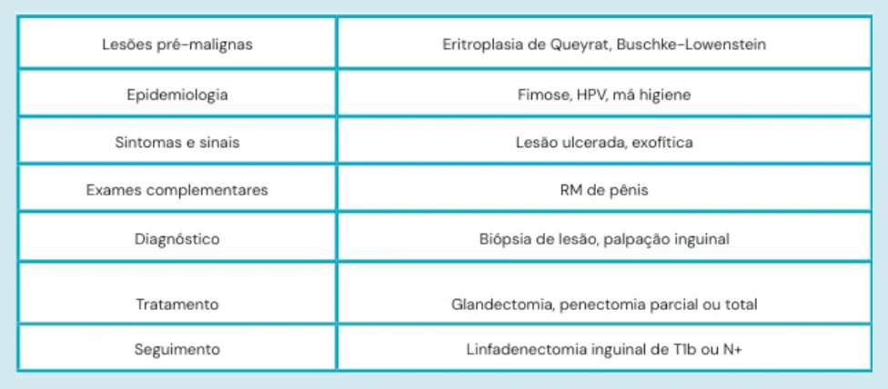
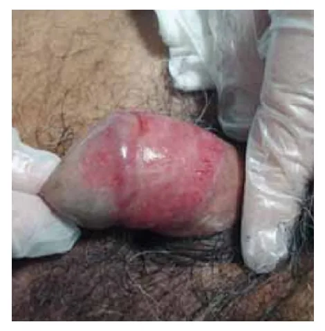
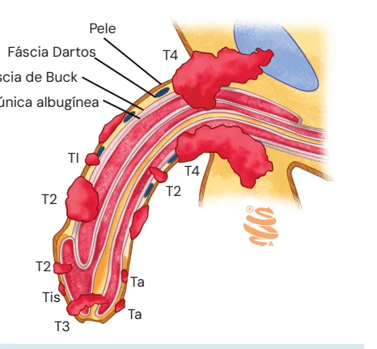

# Uro-oncologia: Pênis

<!-- page:1 -->

## Uro-oncologia: Pênis

## Considerações Iniciais

### Dentre as Lesões Penianas

- 95% – carcinomas espinocelulares (CEC);
- 5% – melanoma, linfoma, sarcoma.

### O CEC de Pênis Advém de Lesões Específicas (Pré-malignas)

**Eritroplasia de Queyrat**

É um carcinoma in situ que forma placas avermelhadas, planas, de textura aveludada, que recobrem regiões penianas grandes.

*Figura 1: Eritroplasia de Queyrat.*

**Lesão de Buschke-Löwenstein**: conhecido como condiloma acuminado gigante.

*Figura 2: Lesão de Buschke-Löwenstein.*

**Doença de Bowen**
- Lesões eritematosas circunscritas;
- É um carcinoma in situ.

*Figura 3: Doença de Bowen.*

---

<!-- page:2 -->

## Epidemiologia

- Rara em países desenvolvidos;
- Brasil → corresponde a 2% do total de neoplasias em homens;
- Pico de idade: 6ª década.

### Fatores de Risco

- **Fimose** → a circuncisão neonatal é fator protetor;
- **HPV** → em especial, os subtipos 16 e 18; representa até 40% dos casos;
- **Má higiene**: especialmente em região de maior vulnerabilidade social; Nordeste – 10% de incidência de CA de pênis;
- Infecção por HIV;
- Tabagismo;
- Zoofilia.

## Manifestações Clínicas e Diagnósticos

### Sinais e Sintomas

- Lesões exofíticas, ulceradas;
- 50% acometem a glande, prepúcio; existem relatos de casos com acometimento de haste e escroto.

### Disseminação: Via Linfática — Principal

- Atenção ao exame dos linfonodos inguinais;
- Grande morbidade!

### Diagnóstico

- **Anatomopatológico** → biópsia da margem da lesão!
- **Indicações**: lesões típicas; úlceras ou lesão com período de cicatrização > 3 semanas.

## Estadiamento

**T** → é melhor avaliado com auxílio da ressonância magnética, pela avaliação de corpo cavernoso, uretra:
- **Ta** – não invade a submucosa;
- **T1** – invade o tecido subepitelial: T1a → baixo grau (G1) e sem invasão angiolinfática; T1b → alto grau (G3) ou invasão angiolinfática;
- **T2** – invade o tecido esponjoso;
- **T3** – invade o corpo cavernoso;
- **T4** – invade estruturas adjacentes.

*Verificar Figura 4.*

**N** → avaliado pelo exame físico e exames de imagem:
- A palpação positiva denota N+;
- A presença de linfonodomegalia pélvica classifica a lesão como M1.

## Tratamento

É definido mediante o estadiamento e a estratificação de risco.

### Tumor Ta ou Carcinoma In Situ → Doença Superficial Não Invasiva

- Agentes quimioablativos podem ser utilizados – com postectomia: Imiquimode ou 5-Fluorouracil, em associação;
- Laser convencional ou de CO2;
- É necessária uma nova biópsia após o tratamento.

### Doença Invasiva

- O princípio do tratamento é dado pela escolha do ponto de vista oncológico. Isto é, somente em tempo posterior é aventada a possibilidade de preservação do órgão;
- **Margem de segurança** → pelo menos, 3 – 5 mm: atentar para a importância do processo de congelação, para garantia das margens livres;
- Radio/braquiterapia – alternativa;
- No caso de invasão de corpos → proceder com amputação ou corporectomia distal.

> Em tumores T4 → é realizada a amputação + uretrostomia perineal.

### Modalidades de Tratamento

- **Glandectomia**:
  1. Tumor restrito à glande, sem invasão de tecidos adjacentes;
  2. Com a rotação do retalho de pele, é possível recobrir a falha.
- **Penectomia parcial**:
  1. Realizada na presença de algum grau de invasão no tecido adjacente;
  2. A reconstrução torna-se mais complexa. A manipulação da uretra não é infrequente.
- **Penectomia total ou amputação**:
  1. Realizada em tumores invasivos.

*Figura 4: Estadiamento T do câncer de Pênis (pele, fáscia Dartos, fáscia de Buck, túnica albugínea; Ta, Tis, T1, T2, T3, T4).*

---

<!-- page:3 -->

## Complemento ao Tratamento pelo Estadiamento

**N0** – ausência de linfonodomegalia ou palpação negativa:
- **T1a** → conduta expectante;
- **T1b** → linfadenectomia inguinal bilateral.

**N1 ou N2** → linfadenectomia inguinal bilateral.

**Na ressecção**:
- 2 ou + linfonodos inguinais positivos ou extensão extracapsular → linfadenectomia pélvica ipsilateral.

## Seguimento

- **N2/N3** → quimioterapia adjuvante;
- **N3** → quimioterapia neoadjuvante.

## Linfadenectomia Inguinal

**Limites da região de dissecção:**
- Lateral: músculo sartório;
- Medial: músculo adutor longo;
- Cranial: ligamento inguinal.

É retirado o coxim gorduroso que recobre a veia e a artéria femoral, juntamente com todos os linfonodos da região.

Pode ser realizada pela técnica modificada – para evitar evolução com linfedemas mais importantes.

**Complicações:**
- Linfedema;
- Linfocele;
- Necrose de pele – se abordagem aberta;
- Infecções – se abordagem aberta.

## Referências

Figura 1: Eritroplasia de Queyrat. Fonte: Revista da SPDV 69(3) 2011; Rita Guedes, Inês Leite, Paulo Araújo, David Tente, Armando Baptista, Natividade Rocha; Queyrat e Co.

Figura 2: Lesão de Buschke-Löwenstein. Fonte: Pineda-Murillo, J., Lugo-García, J.A., Martínez-Carrillo, G. et al. Buschke Löwenstein tumor of the penis. Afr J Urol 25, 9 (2019). https://doi.org/10.1186/s12301-019-0011-4

Figura 3: Doença de Bowen. Fonte: Iophoto associates/science photo library.

Figura 4: Estadiamento T do câncer de Pênis. Fonte: Acervo Medcof.
