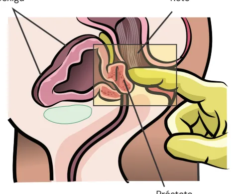
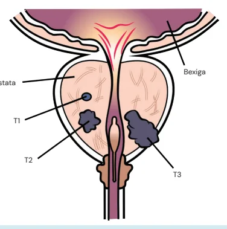
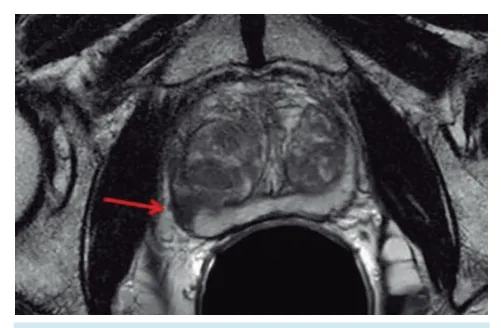
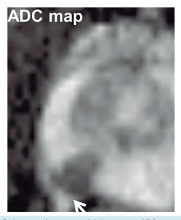
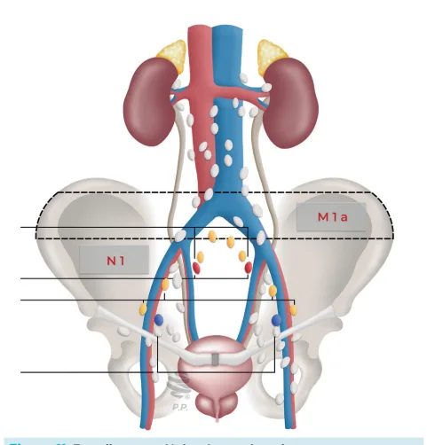
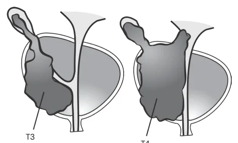
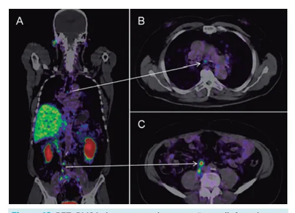

# Uro-oncologia Próstata

<!-- page:1 -->

Uro-oncologia RASTREAMENTO EAU (European Association of Urology):

- A partir dos 50 anos;

- Expectativa de vida > 15 anos.

AUA (American Urological Association):

- A partir dos 55 anos;

- Expectativa de vida > 10 a 15 anos;

SBU (Sociedade Brasileira de Urologia):

- A partir dos 50 anos;

- Expectativa de vida > 10 anos;

Todas as sociedades:

- Negros ou história familiar positiva: iniciar aos rastreamento de câncer de próstata.

45 anos. Ministério da Saúde e INCA: não indicam DIAGNÓSTICO

- Método: biópsia de próstata;

- Classificação de risco conforme escores de Gleason e ISUP (International Society of

Urological Pathology);

- Gleason: padrão mais frequente (3 a 5) + 2º padrão mais frequente na anatomia patológica (3 a 5);

## EPIDEMIOLOGIA

- Em 2020, apenas no Brasil, foram 65840 novos casos, segundo o INCA, sendo o câncer mais incidente em homens. Em 2019, foi o 2º em mortalidade por câncer em homens;

- É tipicamente uma neoplasia de evolução lenta;

- É estimado que 1 em cada 8 homens terá câncer de próstata em algum ponto da vida.

## FATORES DE RISCO

- História familiar: risco relativo de 5.08 quando existem mais de 2 familiares de primeiro grau afetados;

- Etnia: é mais comum em homens pretos;

- Idade;

- Prostatite de repetição;

- Presença de mutações genéticas BRCA 2 (em até 5% dos casos); ISUP 1 = Gleason ≤ 6; ISUP 2 = Gleason 3 + 4 = 7; ISUP 3 = Gleason 4 + 3 = 7; ISUP 4 = Gleason 4 + 4 = 8; ISUP 5 = Gleason 9 ou 10.

OBS: Alguns fatores que são comumente pensados como fator de risco, como tabagismo, uso de testosterona ou masturbação, na realidade não são fatores de risco. No caso de reposição de testosterona, deve-se avaliar antes se o paciente já tem ou teve câncer de próstata. Não aumenta a incidência, mas não deve ser utilizada indiscriminadamente e sem avaliar risco x benefício quando o câncer já está instalado. - ISUP: conforme o escore de Gleason TRATAMENTO Estratificação de risco:

- Baixo risco: até T2a, ISUP 1 e PSA < 10 (os três critérios presentes);

- Risco intermediário ou alto: acima de T2a, ou ISUP

2+, ou PSA ≥ 10 (qualquer critério presente). Método de tratamento:

- Localizado Sobrevida > 10-15 anos: Baixo risco: vigilância ativa, prostatectomia ou radioterapia; Risco intermediário ou alto: prostatectomia radical ou radioterapia + bloqueio hormonal; Sobrevida < 10-15 anos: Watchful waiting.

- Metastático: castração química ou farmacológica.

## RASTREAMENTO

- O rastreamento é pensado para pacientes assintomáticos, saudáveis;

- Relembrando: Zona periférica da próstata: cerca de 75% dos cânceres de próstata estão nessa região; Zona de transição: maioria dos nódulos de hiperplasia prostática benigna (HPB).

- Verificar Figura 1 na próxima página

- Rastreamento: toque retal + PSA;

- Antígeno Prostático Específico (PSA): não é específico para câncer.

- Valor de corte é o PSA > 2,5, podendo variar com guidelines, e com idade. Pacientes mais velhos, acima de 65 anos, pode-se considerar o corte em 4;

- Pode haver câncer com PSA normal, sendo importante a realização do toque retal para melhorar a sensibilidade (maior porcentagem de câncer em zona periférica), mesmo que o toque sem alterações também não exclua a possibilidade de câncer de próstata;

- O valor de PSA pode estar elevado em casos de hiperplasia prostática benigna, prostatite, toque retal, sondagem vesical de demora (SVD) ou ejaculação. E o inibidor de 5 -redutase (ex: finasterida) e obesidade.

PSA pode estar baixo em pacientes que fazem uso de O PSA por si só pode trazer algum valor, mas pode-se α utilizar de alguns refinamentos:

---

<!-- page:2 -->

Zona Periférica Posterior Anterior Direita Figura 1: Zonas da próstata de McNeal Bexiga Reto

- Próstata

Figura 2: Toque retal para avaliação da próstata Densidade de PSA:

- PSA (ng/ml) / volume prostático (cc) > 0,15 aumenta suspeição de câncer de próstata.

- Relação:

- PSA livre/ PSA total: <15%: muito baixo, aumenta suspeita de câncer; Entre 15 e 25%: duvidosa; > 25%: maior chance de ser HPB.

Velocidade de aumento:

- Aumento de PSA maior do que 0,75 ng/mL ao ano é sugestivo de malignidade, especialmente estando entre 4 e 10 ng/mL. Se quadro metastático, com PSA já bastante elevado, o aumento pode ser exponencial;

- Estudos mostraram que o rastreamento não altera mortalidade, inclusive o US Task Force não indica o rastreamento com toque retal;

- É importante saber quais pacientes têm benefício do rastreamento,o qual pode ser oferecido a indivíduos assintomáticos, discutido-se os riscos e benefícios de forma individualizada, e ressaltando que o diagnóstico Zona Central não significa necessariamente tratamento;

Zona de Transição Zona Anterior

- Existem diferenças nos guidelines quanto ao rastreamento: Iniciar aos 45 anos: negros e HF (em todos os guidelines); Iniciar aos 50 anos: expectativa de vida > 15 anos, de acordo com a European Association of Iniciar aos 55, e interromper aos 69 anos, apenas se expectativa de vida de 10 a 15 anos, de acordo com a American Urological Association (AUA); Iniciar aos 50, e interromper aos 75 anos, apenas se expectativa de vida maior que 10 anos, de acordo com a Sociedade Brasileira de Urologia (SBU); Ministério da Saúde e INCA: não indicam rastreamento de câncer de próstata.

Urology (EAU);

## DIAGNÓSTICO

Toque retal - importante para iniciar o estadiamento local:

- Normal: T1;

- Nódulo: T2;

- Endurecida: T3;

- Pétrea: T4.

Bexiga Próstata T1 T2 T3 Figura 3: Estadiamento T de câncer de próstata

---

<!-- page:3 -->

Ressonância Magnética

- PI-RADS:

- Multiparamétrica: importante também no | 1: muito baixa probabilidade de câncer significante;

estadiamento local. Deve ser realizada antes | 2: baixa probabilidade de câncer significante; da biópsia: | 3: risco indeterminado de câncer significante;

- Em fase T2: melhor análise da anatomia - | 4: risco moderado de câncer significante;

- Em fase T2: melhor análise da anatomia ve-se hipossinal;

Figura 4: Nódulo em região prostática periférica direita

- Difusão: avaliação funcional - há restrição da difusão;

- Brilha em DWI (ponderação por difusão);

- Aparece preto em ADC (coeficiente de difusão aparente).

Figura 5: Restrição de difusão em nódulo prostático à direita posterior sugestivo de neoplasia. Figura 6: Aspecto do mesmo nódulo no mapa ADC. | 4: risco moderado de câncer significante;

| 5: alta probabilidade de câncer significante. Biópsia de próstata

- Sistemática (randômica): retirada de diversos fragmentos aleatoriamente;

- Guiada (cognitiva ou fusão): se PI-RADS ≥ 3;

Figura 7: Biópsia transretal de próstata. Figura 8: Biópsia transperineal de próstata

- Transretal x Transperineal: Transperineal tem menos risco de infecção.

- Escore de Gleason: grau de desorganização das glândulas.

1 2 3 4 5 Figura 9: Escore histológico de Gleason

---

<!-- page:4 -->

| Padrão mais frequente (1 a 5) + 2º padrão mais C. tumor identificado em biópsia (por elevação de PSA).

frequente (1 a 5); T2: tumor palpável confinado à próstata; | A partir do padrão de Gleason 3, é considerado A. nódulo tumoral envolve até metade de um adenocarcinoma de próstata. lobo prostático;

- International Society of Urological Pathology (ISUP): B. nódulo tumoral envolve mais da metade de um

- International Society of Urological Pathology (ISUP): ISUP 1: Gleason ≤ 6; ISUP 2: Gleason 3+4; T ISUP 3: Gleason 4+3; A ISUP 4: Gleason 4+4; B ISUP 5: Gleason 9 e 10. T

estratificação de risco:

## ESTADIAMENTO

ESTADIAMENTO LOCAL: Bexiga Cápsula T1 Uretra T2 T3 T4 Figura 10: Estadiamento T do câncer de próstata T1: não é percebido ao toque retal;

A. achado incidental de tumor em até 5% de tecido ressecado ( quando ressecção para tratamento de HPB);

B. achado incidental de tumor em mais de 5% de tecido ressecado; Tabela 1: Classificação de risco: BAIXO ESTÁDIO Até T2a ISUP 1 PSA < 10 OBS.: baixo – necessita ter os 3 critérios; intermediário e alt B. nódulo tumoral envolve mais da metade de um lobo prostático;

C. nódulo tumoral envolve os dois lobos prostáticos. T3: Extensão extra prostática, extracapsular; A. sem invasão das vesículas seminais;

B. com invasão das vesículas seminais. T4: invade estruturas adjacentes (reto e bexiga).

- Verificar Tabela 1

Intermediário pode ser dividido em:

- Favorável: ISUP 1 ou 2; com < 50% de fragmentos acometidos por tumor;

- Desfavorável: 2 ou 3 critérios para intermediário; ISUP

3; > 50% de fragmentos acometidos por tumor.

## LINFONODOS (N)

- A principal disseminação linfática do tumor de próstata é para os linfonodos ilíacos (cadeias ilíacas externa e interna). Caso na linfadenectomia algum linfonodo dessa região venha positivo, é classificado como N1.

- Linfonodos acometidos acima da bifurcação das ilíacas são considerados metástase à distância (M1).

Figura 11: Estadiamento N do câncer de próstata INTERMEDIÁRIO ALTO T2c ou T2b acima 2 ou 3 4 ou mais 10 a 20 > 20 to – qualquer um dos critérios.

---

<!-- page:5 -->

## METÁSTASE (M)

Sobrevida maior que 10 a 15 anos:

- Risco baixo:

- M1a: linfonodos acometidos acima das ilíacas comuns; | Vigilância ativa: intenção curativa, com protocolo

- Se qualquer metástase à distância → M1b; pré- definido, em que se faz seguimento com PSA,

- Exames: RM e biópsia, objetivando minimizar sequelas. É um

- Exames: Intermediário favorável ou menor: apenas ressonância magnética (RM); Se alto risco (ou no intermediário desfavorável, é opcional): cintilografia óssea; PET-PSMA: para pacientes de alto risco ou com recidiva bioquímica.

Figura 12: PET-PMSA demonstrando captação em linfonodos abdominais e torácico (metástase)

## TRATAMENTO

Ca de Próstata Localizado Metastático Sobrevida >10-15 anos? Sim Não Risco Watchful Waiting Baixo Intermediário ou alto Vigilância Ativa Prostatectomia Prostatectomia Radioterapia + Radioterapia Bloqueio Hormonal Figura 13: Fluxograma de tratamento do câncer de próstata

## TUMOR LOCALIZADO

Sobrevida menor que 10 a 15 anos:

- Watchful Waiting: sem expectativa curativa. Consiste em paliação, com uma abordagem personalizada, objetivando aliviar os sintomas e melhorar a qualidade de vida do paciente, em qualquer estádio clínico. RM e biópsia, objetivando minimizar sequelas. É um tumor que provavelmente não vai matar o paciente; Prostatectomia; Radioterapia.

- Intermediário ou alto (ambos têm desfecho oncológico semelhante): Prostatectomia; Radioterapia + bloqueio hormonal.

Prostatectomia:

- Radical: com pseudocápsula;

- Acessos: aberta, videolaparoscópica ou robótica;

- Vantagens: Melhor estadiamento, pois permite a retirada completa da peça cirúrgica com margens conhecidas; Zera PSA, facilitando seguimento; Evita bloqueio hormonal.

- Desvantagens: Risco cirúrgico e anestésico; Maior custo imediato; Toxicidade imediata.

Radioterapia:

- Irradiar loja prostática e pelve;

- Sempre com bloqueio hormonal associado;

- Não zera PSA: atinge nadir em 1 a 2 anos após fim do tratamento.

- Vantagens: Adia riscos da cirurgia; Preservação precoce de continência e potência, mas, a longo prazo, se iguala.

- Desvantagens: Estadiamento inferior; Dificulta seguimento com PSA; Resgate cirúrgico mais difícil por lesões actínicas locais; Lesões actínicas; Disfunção erétil (mais tardiamente comparado à cirurgia); Piorar sintomas de urgência urinária por irradiar bexiga.

## METASTÁTICO

- Castração: Orquiectomia bilateral simples via escrotal; Farmacológica (alternativa à orquiectomia): Efeitos colaterais: disfunção erétil, perda de massa óssea e aumento de risco cardiovascular.

agonistas ou antagonistas de GnRH;

- Quimioterapia se não responsivo à hormonioterapia

(droga mais comum: docetaxel);

- Drogas-alvo.

---

<!-- page:6 -->

## SEGUIMENTO REFERÊNCIA

Re-Estadiamento Figura 1: Zonas da próstata de McNeal OISETH, Stanley; JONES, Lindsay; MAZA, Evelin. Zonas da próstata de McNeal. 2022. Imagem adaptada de: LECTURIO. Hiperplasia benigna Sobrevida >10-15 anos? d h Sim Não p Localizado Metastático Watchful i c Waiting d Cirurgia ou Castração Radioterapia de Terapia resgate Sistêmica o Figura 14: Fluxograma seguimento câncer de próstata a PROSTATECTOMIA:

- PSA fica zerado após procedimento; M

- PSA > 0,2 → Recidiva bioquímica. o a

RADIOTERAPIA:

- Nadir de PSA 1 a 2 anos após; G

- PSA 02 pontos acima do valor considerado o nadir → d d

Recidiva bioquímica. A EM CASO DE RECIDIVA: I

- Re-estadiamento: RM, CO, PET-PSMA: o d

- Sobrevida menor que 10 a 15 anos: watchful waiting; s

- Sobrevida maior que 10 a 15 anos: Localizado: cirurgia ou radioterapia de resgate: S Se tratamento anterior cirúrgico: radioterapia i de resgate; H Se radioterapia com tratamento primário: Metastático: castração ou terapia sistêmica. P s w c McNeal. 2022. Imagem adaptada de: LECTURIO. Hiperplasia benigna da próstata. Disponível em: https://www.lecturio.com/pt/concepts/ hiperplasia-benigna-da-prostata/. Acesso em: 3 jun. 2025.

( resgate cirúrgico. Figura 4: Nódulo em região prostática periférica direita IMAGING TECHNOLOGY NEWS (ITN). Nódulo em região prostática periférica direita. 2015. Imagem adaptada de: Novel imaging technique improves prostate cancer detection. Disponível em: https://www.itnonline.

com/content/novel-imaging-technique-improves-prostate-cancerdetection. Acesso em: 3 jun. 2025. Figura 5: Restrição de difusão em nódulo prostático à direita posteriorsugestivo de neoplasia MAURER, Martin H.; HEVERHAGEN, Johannes T. Diffusion weighted imaging of the prostate—principles, application, and advances. Translational Andrology and Urology, v. 6, n. 3, p. 490–498, 2017. Imagem extraída do artigo.

Figura 6: Aspecto do mesmo nódulo no mapa ADC MAURER, Martin H.; HEVERHAGEN, Johannes T. Diffusion weighted imaging of the prostate—principles, application, and advances. Translational Andrology and Urology, v. 6, n. 3, p. 490–498, 2017. Imagem extraída do artigo.

Figura 7: Biópsia de próstata: dá o diagnóstico definitivo do tumor GONÇALVES, Lessandro Curcio. Biópsia de próstata: dá o diagnóstico definitivo do tumor. [S. d.]. Imagem adaptada de: Disponível em: https:// drlessandrocurcio.com.br/doencas-urologicas/cancer-de-prostata/.

Acesso em: 3 jun. 2025. Figura 8: Biópsia guiada (cognitiva ou fusão) Imagem adaptada de: BACARIN, João Vitor. Um olhar revolucionário sobre o diagnóstico do câncer de próstata. 2023. Disponível em: https://www.

diarioinduscom.com.br/Noticias/829915/um_olhar_revolucionario_ sobre_o_diagnostico_do_cancer_de_prostata. Acesso em: 3 jun. 2025.

Figura 9: Escore histológico de Gleason SAWAYA, Melissa; MENEGAUX, Florence; BERTI, Mélanie. Role of infections in the occurrence of prostate cancer: a case control study in France (EPICAP). 2021. Imagem adaptada de: Dissertação (Mestrado) – École des Hautes Études en Santé Publique, 2021.

Figura 12: PET-PMSE demonstrando captação em linfonodos abdominais e torácico (metástase) PHILLIPS, Carmen. PSMA PET-CT accurately detects prostate cancer spread, trial shows. 2020. Imagem adaptada de: Disponível em: https:// www.cancer.gov/news-events/cancer-currents-blog/2020/prostatecancer-psma-pet-ct-metastasis. Acesso em: 3 jun. 2025.
